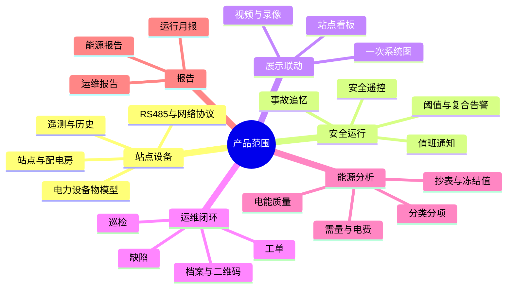

# PRD-00：EasyAIoT 电力运维云平台产品总纲

> PRD ID：POWER-PRD-000  
> 版本：1.2.0  
> 状态：In Review  
> 优先级：P0  
> 产品负责人：待指定  
> 基线：[《平台功能计划》1.4.0](../../架构设计/平台功能计划.md)、[《EasyAIoT 项目开发宪法》1.4.0](../../开发规范/EasyAIoT项目开发宪法.md)

## 1. 产品背景

传统配电房管理依赖人工巡视、分散仪表和事后处置，常见问题包括设备状态不可实时掌握、告警送达不可靠、事故证据不完整、巡检缺陷无法闭环、能耗与电费缺少分析依据。

EasyAIoT 已有设备接入、物模型、时序数据、告警、视频、远程控制、可视化和移动端基础。本产品在既有底座上构建电力行业能力，形成“监测—告警—处置—运维—分析”的闭环。

## 2. 产品愿景

让一个值班人员能够远程掌握多个站点的设备、环境、视频、告警、运维和能源情况，并在安全控制边界内完成事件处置和经营分析。

## 3. 目标客户

- 工业园区、制造企业和数据中心。
- 商业综合体、医院、学校和公共建筑。
- 电力运维服务商及其客户。
- 具有高低压配电房的多站点集团企业。

## 4. 用户角色

| 角色 | 核心诉求 |
|---|---|
| 企业负责人 | 运行安全、能源成本、服务质量和多站点总览 |
| 电气主管 | 设备状态、风险、遥控审批、事故分析 |
| 值班人员 | 实时告警、确认、通知、快速定位和处置 |
| 运维班组长 | 巡检计划、派工、SLA、质量和人员负荷 |
| 运维工程师 | 移动巡检、缺陷上报、工单执行、档案查询 |
| 能源管理员 | 抄表、分类分项、需量、电费和电能质量 |
| 客户/审计人员 | 报告、记录、证据和审计追溯 |
| 平台管理员 | 租户、权限、站点、配置、渠道和系统健康 |
| 实施工程师 | 站点建模、设备接入、点表导入、配置发布和现场验收 |

## 5. 产品范围

## 6. 产品目标与指标

| 目标 | 建议指标 |
|---|---|
| 数据可用 | 关键测点月度有效数据率不低于 99% |
| 告警及时 | 平台接收遥测至告警创建 P95 不超过 5 秒 |
| 通知可信 | 平台成功提交至已配置渠道的通知成功率不低于 99%；外部渠道送达率单独展示，不得混算 |
| 处置闭环 | 进入人工处置的告警、缺陷和工单 100% 可追踪责任人、状态迁移和最终结果 |
| 巡检数字化 | MVP 计划任务完成率不低于 95%，及时率单独统计并按站点目标考核 |
| 抄表可信 | MVP 自动抄表有效完成率不低于 99%，冻结值可复核、修正留痕、账期可重算 |
| 工单履约 | MVP 有 SLA 的工单按时完成率不低于 95%，暂停与批准免责时段单独披露 |
| 安全遥控 | 所有关键遥控均通过授权、复核、联锁和审计 |
| 多档部署 | 电力运维仅支持 standard/full；full 是 standard 的严格能力超集 |

以上为 MVP 产品验收基线。统计分母、排除项、窗口和站点目标必须在对应 Spec 中冻结；不得通过删除失败记录或扩大排除项达标。成熟期目标由真实站点连续运行数据和变更评审确定，不在 PRD 中无依据承诺。

## 7. 核心业务旅程

### 7.1 无人值守

1. 边缘节点采集设备与环境数据。
2. 平台展示实时状态并保存历史。
3. 规则命中后创建告警并通知值班人员。
4. 告警关联视频、事故前后数据和操作记录。
5. 值班人员确认并决定远程处置或派发工单。
6. 设备恢复后关闭事件并沉淀报告。

### 7.2 计划运维

1. 班组长配置巡检标准和计划。
2. 系统按周期生成任务并通知人员。
3. 工程师扫码、检查、拍照并提交。
4. 异常项形成缺陷，必要时转工单。
5. 工单派发、执行、验收、评价并归档。

### 7.3 能源管理

1. 平台定时采集表计读数。
2. 校验异常并执行补抄、复核和冻结。
3. 按组织、区域、回路和能源类型聚合。
4. 计算同比环比、需量、尖峰平谷和费用。
5. 形成报告、异常提示和优化依据。

## 8. 全局业务规则

- 所有业务数据必须按租户隔离，并受站点数据权限控制。
- 设备、站点、回路、测点和计量点必须具有稳定唯一编码。
- 原始遥测不得因人工修正而覆盖；修正值与原因必须单独留痕。
- 告警恢复与告警关闭是两个不同动作。
- 安全遥控不得因通知或审批服务故障自动跳过复核。
- APP 离线数据必须使用幂等标识同步，成功前不得丢弃。
- 人员定位仅在明确授权和工作时段内采集，并遵循保留周期。
- 报告中的指标必须可追溯到来源数据和计算口径。
- 所有事件时间以带时区的 ISO 8601 时间交换并以 UTC 持久化；界面按站点时区展示。日、月、账期和值班周期边界按站点时区计算，夏令时歧义必须保留原始偏移。
- 遥测、倍率、费用和聚合计算使用十进制定点语义，不得使用二进制浮点作为结算事实。金额内部至少保留 4 位小数，展示/结算按币种规则舍入并保存舍入前值、规则版本和结果。
- 跨域对象只通过稳定业务 ID 关联；钻取链接传递资源类型、资源 ID 和可选时间上下文，目标服务重新执行租户、站点和资源权限校验，不继承来源页面的授权结论。
- 计划任务共用平台调度、幂等、重试和可观测性基础设施，但抄表、巡检、报告等领域分别拥有任务定义、执行记录和状态事实，不共享或复制业务状态表。

### 8.1 共享术语与口径

| 概念 | 统一口径 |
|---|---|
| 数据质量码 | 采用 SPEC-004 的 `GOOD`、`STALE`、`TIMEOUT`、`COMM_ERROR`、`DECODE_ERROR`、`OUT_OF_RANGE`、`CLOCK_SKEW`、`BACKFILLED`、`MANUAL_CORRECTION`、`UNKNOWN`；业务计算必须声明接受集合 |
| 数据完整率 | 固定周期数据为“唯一有效采样槽数 / 应采集槽数 × 100%”；应采集数按版本化计划和批准停运分段，通信故障不得从分母扣除 |
| 告警等级 | 固定为信息、一般、重要、紧急四级；火灾、人身和重大设备风险映射为紧急并通过告警类型区分，不新增平行等级体系 |
| 缺陷等级 | 固定为一般、严重、危急三级；响应与升级时限由站点策略版本配置，危急缺陷默认触发立即通知和抢修评估 |
| 采集换算 | `normalizedValue = decodedRaw × scale + offset`，用于协议解码和单位归一，不表达 CT/PT 业务倍率 |
| 计量倍率 | `calculatedValue = normalizedValue × currentRatio × voltageRatio × unitFactor`；直连且已输出一次侧值的表计必须显式标记，禁止重复乘算 |
| 冻结值与修正 | 冻结值是账期时点的版本化业务事实；修正创建新版本并引用原版本，原始遥测与旧冻结值不可覆盖 |

## 9. 部署档位

| 能力 | mini | standard | full |
|---|---|---|---|
| 边缘采集、缓存、补传 | 不支持 | 必须 | 必须 |
| 实时监控与告警 | 不支持 | 必须 | 必须 |
| 视频联动 | 不支持 | 基础 | 完整事故证据 |
| 站点看板与一次图 | 不支持 | WEB 基础查看 | 大屏编辑 + FUXA SCADA |
| 安全遥控 | 不支持 | 可选；启用即执行完整安全门禁 | 完整安全门禁 + 集中治理 |
| 运维闭环 | 不支持 | 基础巡检、缺陷、工单 | 完整 SLA、轨迹、评价和绩效 |
| 能源聚合与报告 | 不支持 | 抄表、冻结、基础统计和预置报表 | standard 全部 + 高级能源与经营报表 |
| 高级电费与电能质量 | 不支持 | 不提供 | 必须 |
| 多站点经营分析 | 不支持 | 不提供 | 必须 |

三个档位复用同一代码主线；mini 通过 capability manifest 关闭全部电力能力，full 仅启用 standard 之上的高级模块和配额，不重复开发共享功能。

档位能力编码、依赖、配额和不可用原因遵循 [ADR-011](../../架构决策/电力运维云平台/ADR-011-Capability-Manifest规范.md)。服务端必须执行能力门禁；菜单隐藏只负责交互，不构成授权。

## 10. 非目标

首期不建设：

- 电力交易、售电结算或电网调度主站。
- 替代继电保护装置的保护逻辑。
- 完整 ERP、财务会计或仓储系统。
- 无安全联锁的自动高压操作。
- 基于未经验证 AI 结论的自动分合闸。

## 11. 发布里程碑

| 里程碑 | 依赖 | 参考工期 | 产品结果 |
|---|---|---:|---|
| M1 | 设备样本、现场网络和采集硬件 | 6～8 周 | 真实站点数据连续进入平台并可查看历史 |
| M2 | M1、统一告警和通知/视频联调 | 6～8 周 | 告警、通知、视频证据和处置形成闭环 |
| M3 | M2、现场联锁条件和安全评审 | 4～6 周 | 安全遥控具备申请、复核、联锁、回执和审计 |
| M4 | M2、APP 与档案模型 | 8～10 周 | 扫码巡检、缺陷和工单完成闭环 |
| M5 | M1、倍率/冻结值样本和人工对账基线 | 8～10 周 | 自动抄表、分类分项和基础能源报告可用 |
| M6 | M5、电价和电能质量样本 | 8～12 周 | 需量、电费、电能质量和综合月报可用 |

## 12. 总体验收

- 一个真实配电房完成设备、环境、视频和人员配置。
- 连续运行 7 天并形成可量化的数据质量报告。
- 从异常产生到通知、确认、恢复、关闭的链路可演示。
- 从扫码巡检到缺陷、工单、验收、评价的链路可演示。
- 从表计原始读数到冻结值、聚合和报告的结果可人工复算。
- 权限越权、租户串读和遥控绕审均被服务端拒绝并记录。
- 自动校验证明 `Capabilities(standard) ⊂ Capabilities(full)`，且 mini 无电力菜单、API 成功响应、后台任务或 collector 工作负载。

## 13. SDD 下游交付

本 PRD 批准后，需要为各领域 PRD 建立 Feature Spec。每份 Spec 必须给出唯一需求 ID、Given/When/Then 验收场景、状态机、权限矩阵、错误处理、兼容策略和非功能预算，并至少包含：

- 数据字典、精度、有效期、版本和事实来源。
- HTTP/WebSocket/API 契约以及版本化事件契约；跨域调用不得共享数据库。
- standard/full capability 编码、依赖、配额、降级与 mini 关闭验证。
- 幂等键、重试/死信/补偿、外部依赖超时和可观测指标。
- 权限拒绝、租户隔离、重复提交、并发冲突、升级兼容和回滚验收。
- 需求到设计、代码、测试和验收证据的追踪关系；实现细节在 Technical Design 冻结。
