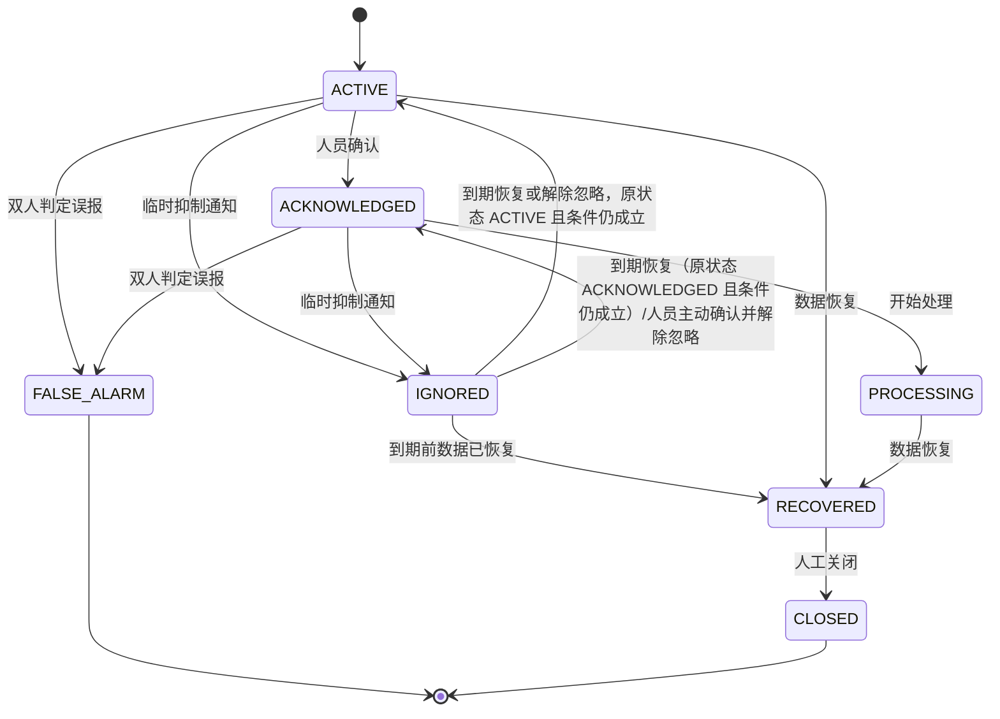
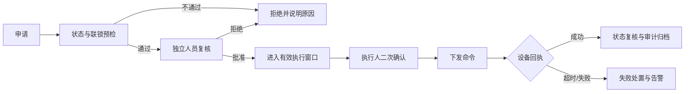

# PRD-02：监控告警与安全控制

> PRD ID：POWER-PRD-002  
> 版本：1.2.2
> 状态：Approved / Baselined（M2-M3）  
> 基线日期：2026-08-24  
> 优先级：P0  
> 目标里程碑：M2-M3  
> 基线：[《平台功能计划》1.5.0](../../架构设计/平台功能计划.md)、[《EasyAIoT 项目开发宪法》1.6.0](../../开发规范/EasyAIoT项目开发宪法.md)

## 1. 目标

使值班人员能够及时发现、确认和处置高低压设备、变压器、直流屏、环境与电气火灾风险，并确保远程分合闸等关键操作经过强制安全流程。

## 2. 建设分类

| 分类 | 内容 |
|---|---|
| 直接复用 | 单属性阈值、告警记录、健康评分、物模型服务调用、操作日志 |
| 修改增强 | 持续时间、迟滞、恢复值、复合规则、值班通知、告警状态 |
| 新增 | 事故追忆、告警升级、维护模式、操作票、双人复核和联锁 |

## 3. 角色与用户故事

- 作为值班人员，我希望关键告警持续通知直到有人确认。
- 作为电气主管，我希望同一故障不会产生大量重复告警。
- 作为事故调查人员，我希望看到告警前后遥测、视频和操作时间线。
- 作为遥控申请人，我希望明确知道申请处于哪个审批和执行阶段。
- 作为遥控审核人，我希望看到设备状态、联锁条件和风险提示后再批准。

## 4. 告警需求

### 4.1 规则

- 支持大于、小于、区间、变化率、状态组合和多测点复合条件。
- 支持持续时间、迟滞、恢复阈值、重复抑制和规则有效时段。
- 支持信息、一般、重要、紧急等级。
- 支持按设备模板下发默认规则并允许设备级覆盖。
- 规则变更必须版本化，不影响既有告警的历史解释。
- 复合规则首期仅允许受控的 AND/OR 条件组和白名单运算符，不允许任意脚本；条件数、嵌套深度、时间窗和执行预算必须在 SPEC-005 中设置硬上限并在发布前校验。

### 4.2 生命周期

- 告警恢复不自动删除告警。
- 重复命中聚合到同一活动告警，并更新次数和最后发生时间。
- `ESCALATED` 不是互斥的主生命周期状态，而是可与 `ACTIVE`、`ACKNOWLEDGED`、`PROCESSING` 并存的版本化升级级别和追加式升级事件；升级不得阻断确认、处理、恢复或关闭。
- 维护模式下规则继续评估，告警主记录继续创建或更新并标记维护上下文，只抑制配置范围内的通知，不删除采集、规则或告警记录。维护模式结束后，仅对仍满足触发条件且尚未闭合的告警，按当前有效升级策略和通知有效窗口重新评估；不得补发失去处置价值的过期通知，不得因此创建重复告警周期。
- `IGNORED` 只允许临时抑制通知，必须记录原处置状态、原因、操作者和截止时间；期间仍持续评估规则和记录事件。到期时条件仍成立则按 `ignoredFromStatus` 恢复原处置状态并按升级策略决定是否重新通知；人员也可以在原状态为 `ACTIVE` 或 `ACKNOWLEDGED` 的忽略窗口内主动确认并解除忽略，此时目标状态固定为 `ACKNOWLEDGED`；已恢复则进入 `RECOVERED`。`FALSE_ALARM` 是不可逆终态并要求独立复核，均不得删除原始告警和证据。
- `PROCESSING` 不允许直接人工关闭；必须先由来源恢复进入 `RECOVERED`，再执行授权关闭。恢复不等同于业务关闭。
- 紧急等级告警禁止进入 `IGNORED`，M2 不提供配置放开；如需改变必须另行安全 ADR。
- 设备、视频和 AI 告警统一映射到同一告警主记录和状态机，迁移遵循 ADR-010，不新增第三套告警事实表。
- 告警与缺陷、工单通过稳定业务 ID 关联，但保持独立状态机，不互相自动关闭；跨域联动遵循 PRD-04 §6.1。

### 4.3 通知与值班

- 支持站点值班表、班组、人员和替班。
- 支持 APP、站内信、短信、电话、企业微信等可配置渠道。
- 通知记录发送、送达、失败、重试和确认状态。
- 关键告警未确认时按时间和角色逐级升级。
- 渠道故障不能阻止告警本身创建。
- 通知请求在持久化后异步发送；可重试故障按渠道策略退避，恢复后仅在通知有效窗口内补发，过期请求标记未送达并触发备用渠道/升级，不向人员补发失去处置价值的陈旧通知。

### 4.4 事故追忆

- 告警详情展示统一事件时间线。
- 关联告警前后可配置时间窗内的遥测数据。
- 关联现场图片、抓拍、录像、人员确认和设备操作。
- 支持导出不可修改的事故报告及证据校验信息。
- 事故追忆窗口受 `TelemetryStore` 查询与证据保留配额约束；超出在线查询范围时采用异步生成，失败不得影响原告警创建和处置。

## 5. 安全遥控

### 5.1 范围

适用于高低压开关、刀闸、电容柜投切、风机和其他高风险控制。普通低风险控制可配置简化流程，但仍须授权与审计。

### 5.2 流程

### 5.3 强制规则

- 申请人与审核人不得为同一人。
- 服务端校验权限、站点范围、设备在线状态和联锁条件。
- 批准具有有效期，过期必须重新申请。
- 批准默认有效 5 分钟、配置上限 15 分钟，且只允许执行一次；任何目标动作、设备、联锁条件或操作票变化均使批准失效，过期申请保留审计但不得恢复为可执行。
- 页面二次确认必须显示设备、动作、当前状态和影响。
- 命令具有唯一 ID，禁止重复执行。
- 超时不得自动重发非幂等动作。
- 必须保存申请、审核、执行、回执和最终状态。
- 现场可配置硬禁用，平台不得绕过。
- `iot-device` 是申请、审批、联锁、命令执行、回执和审计的唯一责任模块；WEB、APP、SCADA、能源和运维模块只能通过 `/device/control/**` 发起带业务关联 ID 的请求。

### 5.4 低风险控制边界

- 高低压分合闸、刀闸、电容柜投切及其他经安全评审识别为高风险的操作，不得豁免操作票、独立复核、联锁、二次确认、回执和审计。
- 只有经安全评审列入版本化白名单的低风险辅助控制，才允许使用简化流程；站点普通管理员不得临时改变风险分类或绕过既定流程。
- 简化流程仍不得省略授权、服务端状态与范围校验、命令幂等、超时、设备回执和完整审计。是否允许豁免独立复核必须由批准的风险分类策略明确，并在 SPEC-007 中给出权限、变更审批和验收场景。

## 6. 权限与职责分离

- 告警查看、确认、开始处理、关闭、临时忽略、误报判定、误报复核、规则维护、维护模式和值班表维护分别授权；具体权限编码由 SPEC-005/006 冻结。
- `FALSE_ALARM` 的判定人与复核人必须为不同人员，服务端强制校验，不得由前端隐藏按钮代替。
- 遥控申请/执行使用 `device:control:switch`，独立审批使用 `device:control:approve`；安全策略、现场硬禁用和风险分类配置使用独立管理权限，具体编码由 SPEC-007 冻结。
- 遥控申请人与审批人必须分离；高风险工单关联的控制操作仍须重新执行遥控权限、站点数据范围、设备状态和联锁校验。
- 所有权限在服务端按租户、站点和设备数据范围执行；拒绝结果必须使用稳定错误码并记录脱敏审计。

## 7. 验收标准

- 可配置温度持续 60 秒超限并在恢复值以下自动恢复。
- 同一故障持续 10 分钟只形成一个活动告警并累计次数。
- 紧急告警在无人确认时按值班策略升级。
- 告警详情可查看前后遥测、通知、确认、操作和视频证据。
- 无权限、同人复核、联锁失败、设备离线和批准过期均禁止遥控。
- 命令超时时不自动重复分合闸，并产生明确失败记录。
- 所有遥控记录可按用户、站点、设备和时间审计查询。
- 现场硬禁用开启时，即使申请、审批和设备在线状态均满足，执行仍被服务端拒绝并记录原因。
- 维护模式下越限仍生成唯一告警周期并标记维护上下文；退出维护模式后不补发过期通知、不生成重复告警。

## 8. 非功能要求

- 告警创建 P95 目标不超过 5 秒，具体随采样周期校准。
- 告警消费者必须幂等，支持积压和死信监控。
- 安全遥控审计日志不得由普通业务用户删除。
- 本域仅支持 standard/full；mini 不部署电力告警规则、通知、遥控、菜单、API、消费者或初始化数据。
- standard/full 共用同一告警与遥控实现、API、状态机、事件和测试；full 只通过 capability 增加高级能力，不降低或复制安全门禁。
- standard 若未满足完整遥控依赖，必须整体关闭遥控 capability，不得提供低安全版本。

### 8.1 standard/full 能力矩阵

| 能力 | standard | full |
|---|---|---|
| 告警核心 `power.alarm.core` | 阈值、持续时间、迟滞、恢复、确认、处理、关闭、四级告警、值班通知和基础升级 | 与 standard 使用同一实现和契约 |
| 告警高级 `power.alarm.advanced` | 不启用；复合规则、告警抑制、维护模式和跨站策略入口必须关闭 | 复合规则、告警抑制、维护模式、跨站升级和集中策略治理 |
| 安全遥控 `power.control.safe` | 可选启用；启用即执行完整权限、操作票、独立复核、联锁、超时、回执和审计 | 与 standard 使用同一安全核心实现 |
| 遥控高级 `power.control.advanced` | 不启用 | 集中审批、跨站操作票治理和控制策略统管 |
| 事故证据 | 基础告警时间线、遥测关联和已授权的抓拍/录像引用 | standard 全部能力 + 完整事故证据冻结、异步报告和跨站追忆 |

能力编码、依赖、配额和不可用原因以 ADR-011 manifest 为唯一事实源；关闭 capability 不得中断既有活动告警的评估、恢复、升级和审计。

## 9. 下游 Spec

- SPEC-005 复合告警规则与状态机。
- SPEC-006 值班通知与告警升级。
- SPEC-007 安全遥控与操作票。
- SPEC-008 事故追忆与视频证据。

## 10. 基线记录

2026-08-24：依据《PRD-02 专项评审报告》1.0.0 完成 M-1～M-4 整改，补齐紧急告警不可忽略、权限与职责分离、维护模式数据口径及 standard/full 能力矩阵；同时收敛低风险控制边界，并将 `ESCALATED` 明确为正交升级属性/事件。产品决策已确认进入 M2-M3 正式设计，PRD-02 1.2.1 转为 Approved / Baselined。

2026-08-24（评审处置修订）：采纳 SDD 评审报告 H-01/H-02 的风险意见及 M-02/M-03/M-04 的合同要求，新增严格单次忽略代次、抑制决策领域事件和规则发布唯一性约束；澄清 `IGNORED → ACKNOWLEDGED` 同时覆盖到期原状态恢复与人员主动确认解除忽略，并删除与统一状态机冲突的 `PROCESSING → CLOSED`。具体表达式、资源预算、接口、Schema、迁移和测试合同由 SPEC-005～008 与 Technical Design 评审冻结，未经冻结不得编码。
