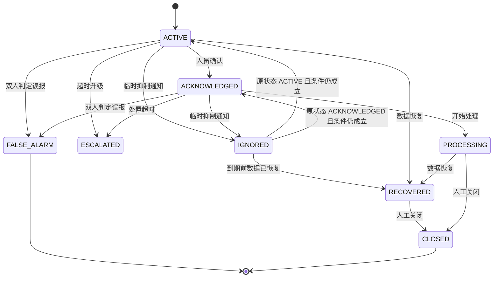
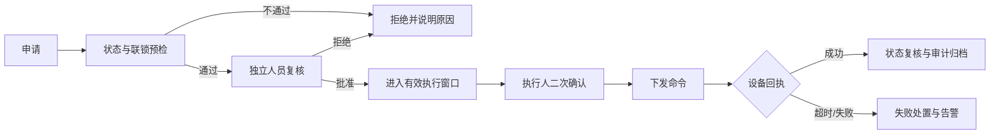

# PRD-02：监控告警与安全控制

> PRD ID：POWER-PRD-002  
> 版本：1.2.0  
> 状态：In Review  
> 优先级：P0  
> 目标里程碑：M2-M3  
> 基线：[《平台功能计划》1.4.0](../../架构设计/平台功能计划.md)、[《EasyAIoT 项目开发宪法》1.4.0](../../开发规范/EasyAIoT项目开发宪法.md)

## 1. 目标

使值班人员能够及时发现、确认和处置高低压设备、变压器、直流屏、环境与电气火灾风险，并确保远程分合闸等关键操作经过强制安全流程。

## 2. 建设分类

| 分类 | 内容 |
|---|---|
| 直接复用 | 单属性阈值、告警记录、健康评分、物模型服务调用、操作日志 |
| 修改增强 | 持续时间、迟滞、恢复值、复合规则、值班通知、告警状态 |
| 新增 | 事故追忆、告警升级、维护模式、操作票、双人复核和联锁 |

## 3. 角色与用户故事

- 作为值班人员，我希望关键告警持续通知直到有人确认。
- 作为电气主管，我希望同一故障不会产生大量重复告警。
- 作为事故调查人员，我希望看到告警前后遥测、视频和操作时间线。
- 作为遥控申请人，我希望明确知道申请处于哪个审批和执行阶段。
- 作为遥控审核人，我希望看到设备状态、联锁条件和风险提示后再批准。

## 4. 告警需求

### 4.1 规则

- 支持大于、小于、区间、变化率、状态组合和多测点复合条件。
- 支持持续时间、迟滞、恢复阈值、重复抑制和规则有效时段。
- 支持信息、一般、重要、紧急等级。
- 支持按设备模板下发默认规则并允许设备级覆盖。
- 规则变更必须版本化，不影响既有告警的历史解释。
- 复合规则首期仅允许受控的 AND/OR 条件组和白名单运算符，不允许任意脚本；条件数、嵌套深度、时间窗和执行预算必须在 SPEC-005 中设置硬上限并在发布前校验。

### 4.2 生命周期

- 告警恢复不自动删除告警。
- 重复命中聚合到同一活动告警，并更新次数和最后发生时间。
- 维护模式只抑制指定通知，不删除采集和规则记录。
- `IGNORED` 只允许临时抑制通知，必须记录原处置状态、原因、操作者和截止时间；期间仍持续评估规则和记录事件。到期时条件仍成立则恢复原处置状态并按升级策略决定是否重新通知，已恢复则进入 `RECOVERED`。`FALSE_ALARM` 是不可逆终态并要求独立复核，均不得删除原始告警和证据。
- 设备、视频和 AI 告警统一映射到同一告警主记录和状态机，迁移遵循 ADR-010，不新增第三套告警事实表。

### 4.3 通知与值班

- 支持站点值班表、班组、人员和替班。
- 支持 APP、站内信、短信、电话、企业微信等可配置渠道。
- 通知记录发送、送达、失败、重试和确认状态。
- 关键告警未确认时按时间和角色逐级升级。
- 渠道故障不能阻止告警本身创建。
- 通知请求在持久化后异步发送；可重试故障按渠道策略退避，恢复后仅在通知有效窗口内补发，过期请求标记未送达并触发备用渠道/升级，不向人员补发失去处置价值的陈旧通知。

### 4.4 事故追忆

- 告警详情展示统一事件时间线。
- 关联告警前后可配置时间窗内的遥测数据。
- 关联现场图片、抓拍、录像、人员确认和设备操作。
- 支持导出不可修改的事故报告及证据校验信息。
- 事故追忆窗口受 `TelemetryStore` 查询与证据保留配额约束；超出在线查询范围时采用异步生成，失败不得影响原告警创建和处置。

## 5. 安全遥控

### 5.1 范围

适用于高低压开关、刀闸、电容柜投切、风机和其他高风险控制。普通低风险控制可配置简化流程，但仍须授权与审计。

### 5.2 流程

### 5.3 强制规则

- 申请人与审核人不得为同一人。
- 服务端校验权限、站点范围、设备在线状态和联锁条件。
- 批准具有有效期，过期必须重新申请。
- 批准默认有效 5 分钟、配置上限 15 分钟，且只允许执行一次；任何目标动作、设备、联锁条件或操作票变化均使批准失效，过期申请保留审计但不得恢复为可执行。
- 页面二次确认必须显示设备、动作、当前状态和影响。
- 命令具有唯一 ID，禁止重复执行。
- 超时不得自动重发非幂等动作。
- 必须保存申请、审核、执行、回执和最终状态。
- 现场可配置硬禁用，平台不得绕过。
- `iot-device` 是申请、审批、联锁、命令执行、回执和审计的唯一责任模块；WEB、APP、SCADA、能源和运维模块只能通过 `/device/control/**` 发起带业务关联 ID 的请求。

## 6. 验收标准

- 可配置温度持续 60 秒超限并在恢复值以下自动恢复。
- 同一故障持续 10 分钟只形成一个活动告警并累计次数。
- 紧急告警在无人确认时按值班策略升级。
- 告警详情可查看前后遥测、通知、确认、操作和视频证据。
- 无权限、同人复核、联锁失败、设备离线和批准过期均禁止遥控。
- 命令超时时不自动重复分合闸，并产生明确失败记录。
- 所有遥控记录可按用户、站点、设备和时间审计查询。

## 7. 非功能要求

- 告警创建 P95 目标不超过 5 秒，具体随采样周期校准。
- 告警消费者必须幂等，支持积压和死信监控。
- 安全遥控审计日志不得由普通业务用户删除。
- 本域仅支持 standard/full；mini 不部署电力告警规则、通知或遥控能力。
- standard/full 共用同一告警与遥控实现；full 只增加跨站治理、事故证据和集中审批能力，不降低或复制安全门禁。
- standard 若未满足完整遥控依赖，必须整体关闭遥控 capability，不得提供简化安全版本。

## 8. 下游 Spec

- SPEC-005 复合告警规则与状态机。
- SPEC-006 值班通知与告警升级。
- SPEC-007 安全遥控与操作票。
- SPEC-008 事故追忆与视频证据。
