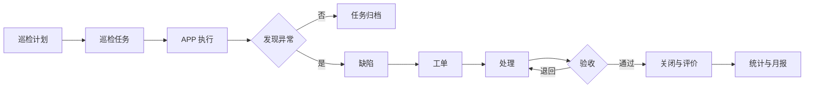

# PRD-04：设备档案与运维闭环

> PRD ID：POWER-PRD-004  
> 版本：1.2.0  
> 状态：In Review  
> 优先级：P1  
> 目标里程碑：M4  
> 基线：[《平台功能计划》1.4.0](../../架构设计/平台功能计划.md)、[《EasyAIoT 项目开发宪法》1.4.0](../../开发规范/EasyAIoT项目开发宪法.md)

## 1. 目标

建立设备电子档案、二维码、巡检、缺陷和工单的完整闭环，使每次运维活动可计划、可执行、可追踪、可评价。

## 2. 建设方式

| 分类 | 内容 |
|---|---|
| 直接复用 | 设备台账、用户角色、文件服务、消息服务、APP 框架 |
| 修改增强 | 设备档案字段、附件分类、移动端入口 |
| 新增 | `iot-maintenance`、二维码、巡检、缺陷、工单、轨迹和统计 |

## 3. 设备档案

- 档案关联现有设备 ID，不重复建设设备主数据。
- 包含厂家、型号、序列号、投运日期、质保期、供应商和联系人。
- 附件支持图纸、说明书、试验报告、合格证、维保记录和其他分类。
- 附件支持版本、上传人、有效期和权限。
- 质保到期、试验到期和维护到期支持提醒。
- 设备二维码可打印、吊销和重新生成。
- 扫码后先鉴权，再展示该用户有权查看的设备信息。

## 4. 巡检管理

### 4.1 标准与计划

- 巡检模板包含设备类型、检查项、步骤、方法、合格标准、必填证据和异常等级。
- 计划支持日、周、月、Cron 或一次性周期。
- 支持站点、路线、设备范围、班组、人员和完成时限。
- 计划变更不修改已经生成的历史任务。

### 4.2 移动执行

- 支持扫码确认设备。
- 支持数值、单选、多选、文本、照片、视频、语音和签名结果。
- 支持弱网离线执行和联网同步。
- 可要求 GPS、站点围栏或蓝牙等到场证据；具体方式由站点配置。
- 异常检查项可一键创建缺陷。
- 每次离线动作使用客户端生成且重试不变的幂等 ID；服务端按任务版本校验并返回逐项结果。服务端状态已前进时不得由离线旧数据覆盖，冲突进入人工处理并保留两侧内容；附件在业务记录确认后独立续传，未确认成功前不得清理本地副本。具体协议、分片和重试预算在 SPEC-011 冻结。

## 5. 缺陷管理

- 缺陷来源包括巡检、告警、人工上报和工单发现。
- 包含设备、现象、等级、风险、图片、发现人和发生时间。
- 支持确认、定级、分派、整改、验收、驳回和关闭。
- 重大缺陷可自动创建抢修工单并通知负责人。
- 缺陷关闭后保留全过程和关联工单。
- 缺陷等级固定为一般、严重、危急；站点策略为各等级配置响应、整改、验收和升级时限。危急缺陷默认立即通知并进入抢修评估，降级必须说明原因并审计。

## 6. 工单管理

- 类型包括抢修、检修、试验、保养和其他。
- 支持草稿、审批、派单、接单、到场、处理中、暂停、转派、待验收、完成和取消。
- 支持 SLA、优先级、预计时间和超期升级。
- 记录人员、工时、材料、步骤、结果、证据和安全措施。
- 验收不通过可退回处理，所有往返必须留痕。
- 完成后支持客户或主管评价。

### 6.1 跨域关联规则

- 告警、缺陷和工单通过稳定 ID 建立可追溯关联，但各自保持独立状态机和责任人。
- 告警恢复或关闭不得自动关闭缺陷/工单；只追加关联事件并提示责任人复核。
- 工单完成不得自动关闭告警；可提交处置结果，由具备告警关闭权限的人员依据设备状态和证据关闭。
- 缺陷只有在所有阻断性的关联工单完成或经批准取消后才可关闭；关闭缺陷不改写原巡检结果。

## 7. 人员位置

- 定位必须由用户明确授权。
- 只在工作任务和配置时段采集。
- 用户可查看当前采集状态。
- 管理者只能查看有组织权限人员的任务相关位置。
- 历史轨迹按配置周期自动删除。
- 不授权定位时按业务策略限制签到能力，但不得隐蔽采集。
- 首选到场证据不可用时，可按站点策略降级到授权的备用证据或人工签到；记录失败原因、使用方式和可信度等级。高风险任务是否允许降级由策略预先确定，执行人员不得临时绕过。

## 8. 核心闭环

## 9. 权限

- 档案查看、档案维护、巡检配置、巡检执行、缺陷定级、工单派发和验收分别授权。
- 工程师不得验收自己负责的高风险工单，除非配置明确允许且审计记录原因。
- 附件下载使用临时授权地址。

## 10. 验收标准

- 扫码后在权限范围内打开正确设备档案。
- APP 离线完成巡检后可恢复同步，重复点击不生成重复记录。
- 异常巡检项可创建缺陷，并保留来源关系。
- 缺陷可生成工单并完成派单、处理、验收和关闭。
- 超期巡检、缺陷和工单均可通知并统计。
- 未授权人员无法查看其他站点档案、工单或人员轨迹。
- 轨迹过保留期后自动清理，审计记录仍保留必要摘要。

## 11. 非功能要求

- APP 离线数据加密保存，成功同步后清理。
- 图片、视频等大附件支持压缩和失败重传。
- 所有状态迁移必须由服务端校验。
- 工单历史采用追加式记录，不覆盖原动作。

## 12. 部署档位

| 能力 | standard | full |
|---|---|---|
| 档案与二维码 | 设备档案、附件、到期提醒、二维码鉴权 | standard 全部 + 跨站档案治理与集中模板 |
| 巡检 | 基础模板、计划、任务、扫码执行和异常转缺陷 | standard 全部 + 完整离线作业、轨迹、签名和多媒体证据 |
| 缺陷与工单 | 缺陷登记、定级、派工、接单、处理、完成/取消和基础时限提醒；不含暂停、转派、独立验收、评价、备件和绩效 | standard 全部 + SLA、暂停、转派、独立验收、评价、备件和绩效 |

- mini 不部署 `iot-maintenance` 电力能力、移动端电力入口或相关任务。
- standard/full 共用设备主数据、状态机、API、事件和 APP 页面；full 仅通过 capability 启用扩展流程和配额，不复制基础工单实现。
- 定位、审计、权限和离线数据安全要求不得因 standard 档位而降低。

## 13. 下游 Spec

- SPEC-010 设备档案与二维码。
- SPEC-011 巡检计划与移动执行。
- SPEC-012 缺陷与工单闭环。
- 人员定位隐私与轨迹 Spec。
