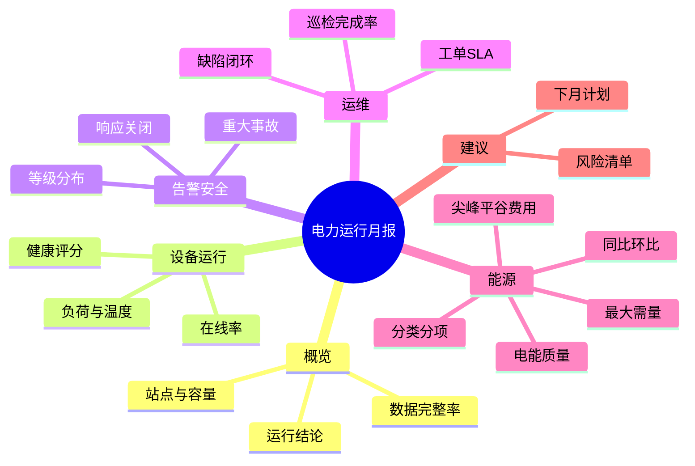

# PRD-06：报表与经营分析

> PRD ID：POWER-PRD-006  
> 版本：1.2.0  
> 状态：In Review  
> 优先级：P2  
> 目标里程碑：M5-M6  
> 基线：[《平台功能计划》1.4.0](../../架构设计/平台功能计划.md)、[《EasyAIoT 项目开发宪法》1.4.0](../../开发规范/EasyAIoT项目开发宪法.md)

## 1. 目标

将设备运行、告警、运维和能源数据组合成可追溯、可定时生成、可审批归档的报告，服务于管理决策和客户交付。

## 2. 建设方式

| 分类 | 内容 |
|---|---|
| 直接复用 | Excel 能力、图表、文件服务、MinIO、消息通知 |
| 修改增强 | 历史查询、站点聚合、导出任务 |
| 新增 | 报告模板、指标口径、生成任务、审批归档和订阅发送 |

## 3. 报告类型

- 站点运行日报、周报和月报。
- 告警与事故分析报告。
- 巡检、缺陷、工单和 SLA 报告。
- 能耗、需量、电费和电能质量报告。
- 多站点能效排行和运维质量对标。
- 设备专项分析报告。

事故分析报告至少包含事件时间线、告警状态变化、通知/确认、处置动作、关联遥测完整率和媒体证据索引。设备专项报告至少包含统计范围、运行/离线、关键测点趋势、告警、检修记录、健康结论及数据不足声明；具体指标由版本化模板选择。

## 4. 月度报告内容

## 5. 功能需求

### 5.1 模板

- 支持系统模板和租户自定义模板。
- 模板选择章节、指标、图表、排序和说明文本。
- 指标引用统一口径，不允许模板自行编写不可审计 SQL。
- 模板保存版本，历史报告使用原模板版本。

### 5.2 生成

- 支持手动和按计划生成。
- 大报告采用异步任务，显示进度和失败原因。
- 生成时冻结统计范围、数据版本、计算口径和模板版本。
- 数据完整率不足时显示警告，不静默输出确定性结论。
- “冻结”采用不可变生成清单而非复制全部原始数据：清单保存查询范围、站点时区、源数据水位/冻结值版本、指标口径版本、模板版本和输入摘要。同一幂等键只生成一个草稿；源数据修正后必须创建新修订版，历史已发布结果不重算。

### 5.3 审批、归档与发送

- 支持草稿、待审批、已批准、已发布和已作废状态。
- 审批人可退回并填写意见。
- 已发布报告不可直接覆盖，只能创建修订版。
- 修订版通过 `revisionOf` 关联首次发布版本并使用连续修订号；必须记录修订原因、受影响章节/指标和前后差异摘要，原版保持可查且明确标记已被哪个版本替代。
- 报告及附件归档到 MinIO，并记录校验信息。
- 支持按角色、客户和订阅策略发送通知或下载入口。

### 5.4 钻取与追溯

- 报告指标可回到对应明细页面或数据查询条件。
- 展示统计周期、时区、单位、数据完整率和口径版本。
- 修正原始业务数据后，可重算并生成新修订版。
- 钻取使用稳定资源 deep link 和冻结的查询上下文；目标页面重新执行权限校验。目标功能未启用、数据已过保留期或用户无权访问时，报告仍可查看，但钻取明确返回原因且不得泄露数据。

## 6. 用户故事

- 作为企业负责人，我希望每月自动收到多站点运行与能源摘要。
- 作为运维服务商，我希望给不同客户生成品牌化报告。
- 作为审计人员，我希望追溯报告数字的来源和计算口径。
- 作为电气主管，我希望从重大告警直接打开事故追忆详情。

## 7. 验收标准

- 可使用模板生成包含运行、告警、运维和能源章节的月报。
- 报告数字与来源页面在相同条件下结果一致。
- 数据缺失时报告明确标记完整率和受影响指标。
- 审批退回、重新生成、修订和作废过程完整留痕。
- 已发布历史报告不会因模板或实时数据变化而改变。
- 用户只能生成和下载有数据权限站点的报告。

## 8. 非功能要求

- 报告任务支持失败重试，但同一请求不产生重复发布版本。
- 文件下载使用临时授权。
- 报告生成资源限流，避免影响实时监控和告警。
- PDF/Excel 版式必须经过自动结构检查和视觉抽检。
- 自动门禁至少检查文件可打开、页数/工作表、必需章节、字体嵌入或替代、表格截断、图表占位、页码、空白异常和数据摘要一致性；发布模板首次上线和重大版式变更必须 100% 视觉抽检，稳定模板按版本化抽检策略执行。

## 9. 部署档位

| 能力 | standard | full |
|---|---|---|
| 报表内容 | 预置运行、告警、用量报表 | standard 全部 + 综合月报、SLA、电费、电能质量和多站点经营分析 |
| 生成方式 | 手工触发与导出 | standard 全部 + 定时生成、审批归档和订阅发送 |
| 模板能力 | 系统预置模板 | standard 全部 + 租户自定义模板与品牌化报告 |

- mini 不部署电力报告模板、生成任务或入口。
- standard/full 共用指标口径、追溯、文件、任务和权限实现；full 只启用高级模板、调度与跨站分析 capability。
- 综合报告首期作为能源与运维域的组合应用，不单独复制业务事实或建设通用 BI 服务。

## 10. 非目标

- 首期不建设通用 BI 自助建模平台。
- 首期不允许用户执行任意数据库查询。
- 报告建议不自动触发高风险设备控制。

## 11. 下游 Spec

- SPEC-018 综合月报。
- 指标口径与追溯 Spec。
- 报告模板、审批和版本 Spec。
- 报告异步生成与资源隔离 Spec。
