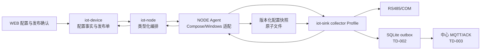

# TD-001：collector Profile 与 NODE 部署契约

> TD ID：POWER-TD-001  
> 版本：1.0.29
> 状态：In Review  
> 日期：2026-08-04  
> 上游需求：[PRD-01 1.2.0](../../产品需求/电力运维云平台/PRD-01-站点设备与数据采集.md)  
> 规格：[SPEC-003 1.4.0](../../规格/电力运维云平台/SPEC-003-RS485-Modbus-RTU采集产品化.md)  
> 架构决策：[ADR-001](../../架构决策/电力运维云平台/ADR-001-RTU-Poller运行位置.md)、[ADR-007](../../架构决策/电力运维云平台/ADR-007-collector打包与NODE管理契约.md)、[ADR-011](../../架构决策/电力运维云平台/ADR-011-Capability-Manifest规范.md)  
> 目标模块：`iot-device`、`iot-node`、`iot-sink`、`NODE`、`.scripts/docker`
> 评审处置：[TD-001 技术设计评审报告](../../开发规范/TD-001评审报告.md)（2026-07-31）

## 1. 目标与范围

本设计把仓库已有 `IotModbusRtuPollingProtocol` 产品化为站点 `iot-sink collector`，由 NODE 以类型化、可恢复、可审计的工作负载契约管理。完成后，配置从 DEVICE 发布到站点，collector 原子应用指定版本，在 Linux 串口或批准的 Windows COM 环境轮询，并持续回报版本与健康状态。

本 TD 冻结：

- collector 进程边界、Spring Profile、依赖裁剪和配置来源。
- DEVICE、`iot-node`、NODE Agent、collector 的职责与接口。
- 类型化 workload/config schema、发布状态机、幂等与回滚。
- 串口枚举、独占、容器/Windows 适配、安全与健康契约。
- 资源压测方法、实现任务、测试与发布门禁。

不在本 TD 冻结：SQLite outbox 表结构和 ACK（TD-002/003）、电力对象/二维码表结构（TD-004）、模板 Schema（TD-005）、WEB 页面视觉细节。中心 inbox 清理由 TD-003 按 ADR-006 的 inbox repository 生命周期负责，时序事实清理由 `TelemetryLifecycleManager` 负责；不得因此向普通 `TelemetryStore` 增加任意删除能力。

## 2. 代码基线与差距

| 现有证据 | 可复用能力 | 必须修改的差距 |
|---|---|---|
| `IotModbusRtuPollingProtocol` | RTU 读写、串口级进程内互斥 | 当前逐点读取属于性能与总线容量缺口，不影响基础读写正确性，由第 9.2 节合并读取覆盖；直接依赖 `DeviceDO/DeviceMapper` 则是站点独立运行的功能阻断项 |
| `AbstractIndustrialPollingProtocol` | 扫描调度、设备并发、上/下行入口 | `needReply=false`、无版本快照、无降频状态机、失败只改设备离线 |
| `IndustrialDeviceConfig` | 串口、站号、点位等基础字段 | `scale/offset` 仍为 `Double`，缺少发布版本、十进制定点、轮询组和独立超时字段 |
| `ModbusSerialPortLocks` | 同一 JVM 内端口互斥 | 不能防止两个容器/主机进程争抢同一串口 |
| `IotGatewayConfiguration` | 按属性启用 RTU Bean | 尚无 `collector` Profile 和依赖白名单 |
| `iot-sink` Dockerfile | 可运行现有 jar | 默认 `-Xms512m -Xmx512m` 与 384 MiB 初始候选冲突；未按 collector 非 root/只读裁剪 |
| `NodeCommandServiceImpl`、NODE `workload_manager.py` | 控制面可调用 Agent 启停进程 | 接受任意 `command/env/workDir`；不是 Compose 白名单适配；运行清单只在内存，Agent 重启后丢失 |
| `node_workload_binding`、心跳 workloads | 基础绑定和状态上报 | 只有 running/stopped、PID，缺少期望/观察版本、镜像摘要、健康 facet 和错误审计 |

结论：复用协议实现，不复用当前“任意命令启动”和“collector 直连中心数据库”的运行形态。

## 3. 目标拓扑与职责



| 组件 | 权威职责 | 禁止事项 |
|---|---|---|
| `iot-device` | 点表配置、静态校验、差异确认、发布单、期望版本、应用结果 | 不直接启动进程，不保存主机命令 |
| `iot-node` | 节点准入、工作负载期望/观察状态、串口预占、调用 Agent | 不解释 Modbus 点表，不生成任意 shell |
| NODE Agent | 校验白名单 spec、生成 Compose/固定 Windows 命令、原子写快照、恢复工作负载 | 不接受调用方传入 command、任意 env、任意卷或特权模式 |
| collector | 校验并应用快照、持有串口、轮询、健康/版本回报、写 outbox | `collector` Profile 不直连中心业务数据库，不复制 EDGE 协议栈 |

## 4. 持久模型

### 4.1 `iot-device`：`iot_collector_config_release`

| 字段 | 类型/约束 | 说明 |
|---|---|---|
| `id` | bigint PK | 发布单 ID |
| `tenant_id/site_id` | bigint，非空 | 内部关系主键与租户边界 |
| `site_code` | varchar，非空 | 创建发布单时固化的不可变业务编码；用于审计和对外查询 |
| `workload_id/node_id` | varchar/bigint，非空 | 目标 collector 与节点 |
| `config_version` | bigint，租户+workload 唯一 | 单调递增版本 |
| `schema_version` | varchar，非空 | 快照 schema，首版 `1.0` |
| `canonicalization_version` | varchar，非空 | 首版 `jcs-rfc8785-v1`，决定 canonical/hash 规则 |
| `payload_canonical` | text，非空 | 写库前生成并实际下发的 UTF-8 canonical JSON 文本 |
| `payload` | jsonb，非空 | 由同一 canonical 文本解析，用于数据库字段查询；不是哈希输入 |
| `payload_sha256` | char(64)，非空 | `UTF-8(payload_canonical)` 的 SHA-256 |
| `canonical_length_bytes` | bigint，非空 | canonical UTF-8 字节长度，辅助传输完整性校验 |
| `status` | varchar，非空 | `DRAFT/VALIDATED/PUBLISHED/APPLIED/FAILED/APPLY_TIMEOUT/ROLLED_BACK` |
| `base_version` | bigint，可空 | 差异和乐观锁基线 |
| `published_by/at` | bigint/timestamp | 发布审计 |
| `applied_version/applied_at` | bigint/timestamp | 运行端观察值 |
| `error_code/error_detail` | varchar/text | 结构化失败原因；detail 脱敏 |
| `row_version` | bigint，非空 | 乐观锁 |

发布快照不可原地修改。canonical 文本必须在应用层按 `canonicalizationVersion` 生成一次；写库、计算哈希、下发 Agent 和本地落盘均复用同一字节序列，禁止读取 `jsonb` 后重新序列化并比较哈希。写入事务必须校验 `payload_canonical` 可解析、与 `payload` 语义相同、字节长度和 SHA-256 一致。回滚创建一个新的发布版本，其内容复制自历史已应用版本，并记录 `rollbackFromVersion`，不得把版本号倒退。

DDL 资产（1.0.7 登记）：`assets/td005-migration/V003__iot_collector_coordination.sql`——本表 + §6.2 引用标记表 + 协调审计表；已于 2026-08-10 经 ADR-013 runner 受控落入本地目标集成实例，执行与验证证据见项目续作入口的 V003/V004/V005 窗口记录。

数据库以 bigint 保存内部主键；管理 API 中 `tenantId/siteId/nodeId/deviceId` 均按十进制字符串序列化，避免 JavaScript 超过 `2^53-1` 后丢失精度，同时返回 `siteCode`、`deviceIdentification` 等稳定业务标识。API/快照组装层负责 bigint 与十进制字符串的无损转换，collector 不解析为 Java `long` 以外的业务含义。发布历史按 `(tenant_id, site_id, config_version desc)` 和 `(tenant_id, site_code, config_version desc)` 建索引。

### 4.2 `iot-node`：扩展 `node_workload_binding`

增加 `desired_spec_version`、`desired_spec_hash`、`observed_spec_version`、`observed_spec_hash`、`image_digest`、`lifecycle_status`、`health_facets jsonb`、`serial_bindings jsonb`、`last_error_code`、`last_error_detail`、`last_seen_at`、`state_version`。唯一约束保持 `(workload_type, workload_id)`，串口预占另以 `(node_id, canonical_host_path)` 唯一约束阻止两个活动 workload 绑定同一端口。

`health_facets` 固定为 schema `collector-health/1.0`，不得写入自由结构：

```json
{
  "schemaVersion": "1.0",
  "canonicalizationVersion": "jcs-rfc8785-v1",
  "overall": "DEGRADED",
  "observedAt": "2026-07-31T09:01:02+08:00",
  "facets": {
    "process": {"status": "HEALTHY", "reasonCode": "OK", "since": "2026-07-31T09:00:00+08:00"},
    "config": {"status": "HEALTHY", "reasonCode": "CONFIG_APPLIED", "since": "2026-07-31T09:00:30+08:00"},
    "serial": {"status": "HEALTHY", "reasonCode": "PORT_OPEN", "since": "2026-07-31T09:00:31+08:00"},
    "center": {"status": "DEGRADED", "reasonCode": "CENTER_OFFLINE_BUFFERING", "since": "2026-07-31T09:01:00+08:00"}
  }
}
```

`overall/status` 只允许 `HEALTHY/DEGRADED/FAILED`，四个 facet 必须齐全；`reasonCode` 使用版本化枚举，`since/observedAt` 为带偏移 RFC 3339 时间。新增字段只能向后兼容，未知字段由旧消费者忽略，未知状态必须按 FAILED 保守处理。

数据库保存控制面事实；Agent 本地保存可恢复的运行状态，二者通过期望/观察版本对账，不使用跨主机事务。

## 5. 类型化 Workload 契约

`workloadType` 固定为 `iot-sink-collector`。控制面只发送下列 schema；NODE 不再为该类型接受通用 `command/workDir/logDir/gpuIds/env`。

```json
{
  "specVersion": "1.0",
  "workloadType": "iot-sink-collector",
  "workloadId": "collector-site-1001-a",
  "nodeId": "21",
  "image": {
    "repository": "registry.example/easyaiot/iot-sink-biz",
    "digest": "sha256:<64-hex>"
  },
  "springProfile": "collector",
  "config": {
    "version": 6,
    "sha256": "<64-hex>",
    "targetPath": "/var/lib/easyaiot/config/active.json"
  },
  "resources": {
    "cpuCores": "1.0",
    "memoryBytes": 402653184
  },
  "serialDevices": [{
    "hostPath": "/dev/serial/by-id/usb-vendor-device",
    "containerPath": "/dev/easyaiot/rs485-0",
    "hardwareFingerprint": "usb:vid:pid:serial",
    "readOnly": false
  }],
  "volumes": [{
    "name": "outbox",
    "hostPath": "/var/lib/easyaiot/collector/collector-site-1001-a/outbox",
    "containerPath": "/var/lib/easyaiot/outbox",
    "mode": "rw"
  }],
  "brokerRef": "secret://node/21/collector/site-1001",
  "updatePolicy": {
    "dispatchAckTimeoutSeconds": 10,
    "configApplyTimeoutSeconds": 60,
    "healthWindowSeconds": 60,
    "autoRollback": true
  }
}
```

约束：

- `repository` 必须在安装时配置的镜像白名单；生产只接受 digest，不接受可漂移 tag。
- `hostPath` 必须解析后位于 collector 专用根目录或串口设备白名单；拒绝 `..`、符号链接逃逸、`/`、Docker socket 和任意主机目录。
- 禁止 privileged、host network、额外 capability 和调用方自定义 entrypoint。
- `brokerRef` 由 Agent 的节点密钥存储解析为权限 `0600` 的临时 secret 文件；不得写入 payload、命令行、普通环境变量或日志。
- `memoryBytes=384 MiB` 只用于首轮压测候选，不是生产默认值；生产 manifest 在第 13 节门禁通过后冻结。
- WorkloadSpec Schema 的 64 CPU/64 GiB 只用于传输层反滥用上限，不是档位配额；provider 必须显式注入安装侧 capability 配额，无配额时 fail-closed。
- `config.targetPath` 是固定容器路径，不是宿主机输入；宿主机配置根只能由 Agent 本地安装配置决定。outbox hostPath 必须按 workloadId 精确绑定，不能只校验位于某个宽泛父目录。
- 当前 Dockerfile 的 `-Xms512m -Xmx512m` 与 384 MiB 候选 limit 明确冲突；第 18 节任务 5 必须先完成 JVM/limit 一致性改造，否则不得使用该候选 spec 启动测试或生产容器。
- `dispatchAckTimeoutSeconds=10`、`configApplyTimeoutSeconds=60`、`healthWindowSeconds=60` 均为首轮候选。冷启动压测必须分别统计 Agent 接单、配置应用和镜像健康窗口，按 P99 与安全余量冻结，不能用一个 60 秒超时覆盖三个阶段。

## 6. Collector 配置快照

快照使用 UTF-8 canonical JSON，按 `schemaVersion + workloadId + configVersion` 标识，默认值全部显式固化：

```json
{
  "schemaVersion": "1.0",
  "workloadId": "collector-site-1001-a",
  "tenantId": "100",
  "siteId": "1001",
  "siteCode": "plant-a",
  "configVersion": 6,
  "generatedAt": "2026-07-31T09:00:00+08:00",
  "serialBuses": [{
    "busId": "bus-a",
    "serialPort": "/dev/easyaiot/rs485-0",
    "baudRate": 9600,
    "dataBits": 8,
    "stopBits": "1",
    "parity": "NONE",
    "transmitDelayMs": 0,
    "rs485Mode": true,
    "devices": [{
      "deviceId": "20001",
      "deviceIdentification": "METER-01",
      "unitId": 1,
      "pollIntervalMs": 5000,
      "requestTimeoutMs": 1000,
      "maxRetries": 2,
      "points": [{
        "propertyCode": "active-power",
        "function": "HOLDING_REGISTER",
        "address": 0,
        "quantity": 2,
        "dataType": "FLOAT32",
        "byteOrder": "BIG_ENDIAN",
        "wordOrder": "BIG_ENDIAN",
        "scale": "1",
        "offset": "0",
        "dataPriority": "METERING_TOTAL",
        "writable": false,
        "pollGroup": "normal"
      }]
    }]
  }]
}
```

应用顺序：schema/哈希校验 → capability/规模校验 → 串口路径与指纹校验 → 点表/冲突/总线负载校验 → 构建候选调度图 → 原子切换运行配置。任一步失败均保留上一 `APPLIED` 版本。active 文件通过同目录临时文件、`fsync`、原子 rename 写入；历史至少保留最近两个已应用版本。

### 6.1 Schema 类型规则

WorkloadSpec 与 ConfigSnapshot 必须以仓库内 JSON Schema 作为唯一机器校验基线，所有 object 默认 `additionalProperties=false`：

| 字段类别 | JSON 类型与约束 |
|---|---|
| schema/config 版本、内部 ID | 版本为受限字符串；`tenantId/siteId/deviceId` 为仅含十进制数字的字符串，禁止科学计数法和符号 |
| `siteCode/deviceIdentification/propertyCode/workloadId` | 非空字符串，长度和正则引用 SPEC-001/现有兼容规则 |
| `baudRate/dataBits/quantity/unitId` | `integer`；schema 给出协议允许的 minimum/maximum |
| `transmitDelayMs/pollIntervalMs/requestTimeoutMs/maxRetries/healthWindowSeconds` | 非负 `integer`；毫秒/秒单位写入字段名，禁止 JSON 小数 |
| `scale/offset` | 十进制字符串，pattern `^[+-]?(0|[1-9]\\d*)(\\.\\d+)?$`；禁止指数、NaN、Infinity 和 `-0` |
| `cpuCores` | 正十进制字符串；由 Agent 映射到受控资源参数 |
| `memoryBytes/configVersion` | 非负 `integer` 且不超过 schema 声明上限；前端不得经浮点运算改写 |
| 枚举/布尔 | schema 明确 enum 或 `boolean`，禁止用 `0/1` 和自由文本替代 |

`dataPriority` 必须使用 SPEC-004 五级枚举 `SAFETY/ALARM/METERING_TOTAL/CONTROL_FEEDBACK/NORMAL_TELEMETRY`，并在发布快照中按点位固化；collector 生成历史 envelope 时读取该快照值，中心不得按当前模板重新推断。

canonicalization 使用版本化 JCS 等价规则：UTF-8、对象键序、无无意义空白；十进制业务值因采用字符串而不参与 JSON number 规范化。schema 文件、canonicalizationVersion 和测试 fixture 必须同提交变更。

### 6.2 电力物模型事件驱动的快照再生（ADR-014 消费者落地，1.0.5 新增）

ADR-014 冻结的消费者 `iot-device-power-model-release` 即本节协调器：iot-device-biz 内
`PowerModelEventHandlerRegistry` 注册四个 V1 事件处理器，Envelope/Inbox/编排器契约以
ADR-014 1.3.6 为准（已实现并有合同测试）；本节只定义业务处理语义，**未经本节评审不得接线实现**。

| 事件 | 处理语义 |
|---|---|
| `POWER_MODEL_TEMPLATE_PUBLISHED_V1` | 模板版本发布本身**不触发**快照再生（绑定未变）。校验 `data.templateCode/templateVersion` 存在后写协调审计（noop-with-audit）成功；字段缺失按 final 进 DLQ |
| `POWER_MODEL_TEMPLATE_LIFECYCLE_CHANGED_V1` | 生命周期变更（DEPRECATED/RETIRED）只更新引用标记：引用该版本的活跃绑定所属 workload 的后续人工发布须在确认页提示；**不自动改写任何快照**（PRD-01 §4.2：已绑定设备不被未确认升级自动改变） |
| `POWER_PRODUCT_MODEL_BINDING_APPLIED_V1` | 绑定应用事务先完成点表再生、四项策略显式确认与静态校验，并以同一 `sourceEventId` 写入 `VALIDATED` 发布单和 Outbox；消费者解析影响面后只精确推进该候选单至 PUBLISHED 并更新 desired 投影。不得复制上一版点表代替候选单 |
| `POWER_PRODUCT_MODEL_BINDING_ROLLED_BACK_V1` | 回滚事务同样先生成新的 `VALIDATED` 候选单；消费者按 `toBindingRevision + sourceEventId` 精确推进。`configVersion` 仍单调递增并记录 `rollbackFromVersion`，版本号不倒退 |

MUST：

- 影响面解析顺序固定：product → 活动未软删 device → site → 活动 collector workload binding；解析结果为空集是合法结果，写协调审计后按成功结束（不产生发布单）。
- 处理器自身幂等：候选身份固定为 `(tenantId, workloadId, sourceEventId)`；语义核对同时要求 `productId/templateCode/templateVersion/bindingRevision` 一致。若 workload 当前 desired 已是目标修订则幂等成功；若事件找不到唯一 VALIDATED 候选或身份不一致，以 `COLLECTOR_CONFIG_SOURCE_FACT_MISSING` / 冲突稳定码终态失败，禁止按最新记录猜测。
- `appliedBy/rolledBackBy` 是发布确认审计来源，必须是正 bigint 十进制字符串并传入 `published_by`。绑定应用/回滚已完成同一差异确认，消费者不得另造系统用户；事件 Schema 中 ID 均按字符串解析，回滚事件不携带 `templateCode/templateVersion`，由目标 `bindingRevision` 的候选身份解析。
- 失败分流：瞬态错误（数据库瞬断、发布管线锁冲突）抛 `PowerModelEventProcessingException(retryable=true)` 走 1s→16s 退避；业务终态（字段缺失、引用不存在、校验冲突）按 final 进 DLQ。任何路径不得静默吞错。
- 事务边界：处理器只写发布单与协调审计（单事务提交），不产生新的 Outbox 事件；`markProcessed` 由消费编排器在处理器成功后执行（ADR-014 已落地契约）。
- 处理器注册表在本节评审通过并完成实现任务前保持为空——空表下事件按「缺失处理器 → DLQ」处置（有持久证据，非静默丢弃）。

### 6.3 发布侧快照合同与事实来源门禁（1.0.8）

机器基线已落在 `iot-device-api/src/main/resources/schema/collector/v1/collector-config-snapshot-v1.json`；
发布侧 `CollectorConfigSnapshotContract` 对同一字段集合执行 fail-closed 校验并一次生成
canonical UTF-8、64 位小写 SHA-256 与字节长度。生产快照必须至少有一条串口总线，object
拒绝额外字段，内部 ID 使用十进制字符串，`scale/offset` 使用非指数十进制字符串；点位必须显式
携带 `dataPriority/pollGroup`，设备必须显式携带 `requestTimeoutMs/maxRetries`。不得从当前 poller
默认值、模板当前值或数据库 `jsonb` 重序列化结果补齐发布事实。

2026-08-10 对本地目标集成实例 `iot-device20` 的只读画像确认：现有 `device` 表没有
`site_id/site_code`，`device_location` 也只含行政位置；`device.extension.protocolConfig` 的现有 RTU
样例缺少 `requestTimeoutMs/maxRetries/dataPriority/pollGroup`。`collector_workload_binding_projection`
虽含站点与产品，但“同产品全部设备属于该站点”不是成立的不变量，同一产品可跨站点，禁止据此拼装
快照。因此第四个 `CollectorConfigReleasePort` 的 JDBC Bean 继续不装配，四端口条件注册表保持空回退；
缺失事实使用稳定码 `COLLECTOR_CONFIG_SOURCE_FACT_MISSING` 按业务终态失败，绝不生成空总线或伪默认
发布单。`device→site` 不新建第二套模型，必须实现并复用 TD-004 已冻结的
`power_device_assignment → power_site` 当前主关系及 `PowerCollectorObjectSnapshot` 内部查询契约，
再与 workload 投影按同租户/同站点闭合。新增字段/表须提供带中文 COMMENT 的迁移、回滚和非空真实库合同。

1.0.12 进展：`PowerObjectQueryApi`、响应 DTO、tenant-safe JDBC Mapper/Service/provider 已落地；
READY/NOT_BOUND/INACTIVE、服务端 objectRevision、跨租户拒绝与目标 PG 回滚合同共 8 项 PASS，fixture
残留 0。

1.0.13 冻结四项策略事实：`requestTimeoutMs/maxRetries` 属于发布单内设备级策略，
`dataPriority/pollGroup` 属于发布单内点位级策略；首次发布或绑定变更必须由 validate/导入事务显式提供并
生成 `VALIDATED` canonical 快照，落库后该快照就是唯一不可变、版本化、可审计事实。策略变更必须生成
更高 `configVersion`，不得修改旧单；`device.extension` 仅可作为 UI 草稿输入，不是权威事实；事件再生
不得继承或猜测旧策略来补齐一个缺失候选。现表尚不能用事件精确关联候选，故形成未接 runner 的
`V007__collector_release_derivation_identity.sql` / `U006` 评审候选，补
`product_id/template_code/template_version/binding_revision/source_event_id/source_reason_code` 及不可变保护。
处理器已对齐 V1 Schema 的十进制字符串 ID、回滚无模板字段事实，并透传 `sourceEventId/confirmedBy`。
V007 已通过专项评审并接入 runner，但未经独立窗口批准前不得执行。1.0.14 已实现
`JdbcCollectorConfigReleasePort`：精确锁定同事件 VALIDATED 候选，复核 canonical/hash/长度与站点事实，
在单事务内 CAS 推进发布单和 workload 投影；缺失/漂移均 fail-closed。Bean 由
`easyaiot.power-model.collector-release-port-enabled=true` 显式门禁，默认不装配；V007 未落库前禁止开启。
schema-only 目标镜像静态门禁 1/1 + PG 合同 1/1 PASS、fixture 残留 0、invalid index=0，临时库已删除。

1.0.15 目标窗口：owner 以 `USER-APPROVAL-20260810-V007` 独立授权后，runner 自动仓库外备份并
仅执行 V007；history/hash、六列六约束、不可变函数、MIG-009、invalid index 与业务计数全部 PASS。
目标 PG 事务合同 + 静态门禁 2/2、事件合同 13/13 PASS，fixture 回滚后五类表均为 0。
数据库门禁已关闭，但仓库未配置 `collector-release-port-enabled=true`，第四端口继续不装配；
1.0.16 已实现 `POST /api/v1/products/{productIdentification}/model-binding:apply`：服务端权限、
capability、租户有效性和 `Idempotency-Key` 四重 fail-closed，按产品行锁与 workload advisory lock
分配单调 `bindingRevision/configVersion`，同事务写产品绑定、领域审计、Outbox 和同事件
`VALIDATED` canonical 候选，事务内不调用 NODE。幂等 key 仅保存服务端 HMAC-SHA-256；同 key 同请求
重放原结果、异请求稳定拒绝。目标 PostgreSQL 成功/重放/冲突与最终插入强制失败整体回滚合同 2/2 PASS，
专用租户八类 fixture 均为 0。第四端口仍默认不装配；启用前还需完成候选→事件消费→发布单/投影推进
端到端合同和显式配置评审。

1.0.17 端到端接线前事实核对发现首发闭环冲突：上述入口只提交 `VALIDATED + Outbox`，而现有
`BindingImpactHandler` 先从 `collector_workload_binding_projection` 解析 ACTIVE workload；首次发布尚无
投影，因此事件会被合法空集分支误记为 `IMPACT_EMPTY`，候选不会进入第四端口。这正是 ADR-015 否决
方案 D 时登记的 CRITICAL 首发死循环。为避免幂等 secret 配置后误开放，Controller 新增独立
`easyaiot.power-model.binding-apply-api-enabled=true` 门禁且默认关闭。ADR-015 对“人工首次发布同事务
upsert 投影”与 TD-001 1.0.16 的“异步消费者推进候选”须先形成评审通过的单一写序；在此之前禁止启用
绑定写 API 和第四端口，不得把 `IMPACT_EMPTY` 当成端到端 PASS。本次未执行 DDL、未调用 NODE。

1.0.18 按 ADR-015 Accepted 路径关闭首发死循环：人工绑定 apply 事务在插入不可变候选后立即以 CAS
推进为 `PUBLISHED`，并在同事务插入 revision=1 ACTIVE workload 投影；既有投影则在身份一致、产品无
未覆盖 ACTIVE workload 的前提下单调推进，部分发布稳定拒绝。Outbox 消费解析到该投影后由
`desiredMatches` 幂等跳过再生，仅落协调审计和 PROCESSED Inbox。目标 `iot-device20` 真实 PG 合同覆盖
首发、重复投递、同 workload 不同事件 revision/configVersion 1→2、强制投影 CAS 失败保存点回滚和最终
零残留；连同 API 默认关闭静态门禁共 4/4 PASS，业务计数保持 4/4/17。两项开关仍默认关闭；开启前仍须
完成显式配置评审。本次未执行 DDL、未调用 NODE。

1.0.19 完成启用配置专项评审但不执行启用。新增启动期 `PowerModelActivationGuard`，冻结四项事实：
绑定 API、第四端口、事件总开关和幂等 HMAC secret。默认全部关闭；任一链路激活必须处于
standard/full 且 capability `power.device.model` 已启用；事件总开关要求第四端口已装配；绑定 API 要求
事件链与第四端口同时开启且 secret 不少于 32 UTF-8 字节。合法灰度顺序为“第四端口 → 事件链 → 写 API”，
反向回滚顺序为“写 API → 待 Outbox 排空 → 事件链 → 第四端口”。application、Compose 和 env.example
均显式暴露安全默认值，Compose `config --quiet` PASS，启动组合与静态部署合同 8/8 PASS。专项结论为
`CONDITIONALLY_APPROVED / NOT_ACTIVATED`：实际开启仍需 owner 独立批准、运行密钥注入、Kafka/消费者健康
和零积压灰度证据；本轮未修改运行环境、未执行 DDL、未调用 NODE。

## 7. API 与 Agent 契约

### 7.1 平台管理 API

| 方法 | 路径 | 权限/幂等语义 |
|---|---|---|
| `GET` | `/admin-api/node/collector/serial-ports?nodeId=` | 查看节点且具采集配置权限；只读枚举 |
| `POST` | `/admin-api/device/collector-config/validate` | 生成校验报告，不发布 |
| `POST` | `/admin-api/device/collector-config/{id}/publish` | 发布权限+差异确认；`rowVersion` 乐观锁 |
| `POST` | `/admin-api/device/collector-config/{id}/rollback` | 创建新发布版本；`requestId` 幂等 |
| `GET` | `/admin-api/device/collector-config/{id}/status` | 返回期望/应用版本、状态、健康和错误 |

### 7.2 `iot-node` 到 NODE Agent

| 方法 | Agent 路径 | 请求 |
|---|---|---|
| `GET` | `/serial/ports` | 无 body；返回候选端口、指纹、权限和占用者 |
| `POST` | `/workload/collector/deploy` | 类型化 WorkloadSpec；相同 spec hash 幂等成功 |
| `PUT` | `/workload/collector/config` | `workloadId/configVersion/payload/sha256`；只接受更高版本；回滚也必须使用新生成的更高发布版本 |
| `POST` | `/workload/collector/rollback` | 目标必须是本地已验证快照；操作带 requestId |
| `POST` | `/workload/collector/stop` | 先排空、释放串口，再停实例；重复停止成功 |
| `GET` | `/workload/collector/{id}` | 返回 lifecycle、版本、镜像、facet、串口和最近错误 |

相同 `configVersion + sha256` 重放返回幂等成功；低于当前 desired/observed 版本返回 `CONFIG_VERSION_STALE`，相同版本但 hash 不同返回 `CONFIG_VERSION_CONFLICT`，均不得改写本地快照。所有 Agent API 继续使用节点 token，并增加时间戳、nonce、body SHA-256 的 HMAC 请求签名和五分钟防重放窗口。心跳携带 `agentEpochMs`，控制面计算并保存 `clockSkewMs`：偏差超过 60 秒进入 DEGRADED 并告警，超过五分钟拒绝变更请求。平台只报告偏差，不远程修改系统时间；生产节点必须使用 NTP/chrony 或 Windows Time。内部错误返回稳定 `errorCode`；异常堆栈不直接返回调用方。

## 8. 发布与工作负载状态机

### 8.1 配置发布

```text
DRAFT → VALIDATED → PUBLISHED → APPLIED
          │              ├────→ FAILED
          │              └────→ APPLY_TIMEOUT
          └────→ DRAFT
```

- `VALIDATED` 后必须由有发布权限的用户确认差异；服务端不得自动发布。
- 发布接口先创建 PUBLISHED，再由 `iot-node` 派发。Agent 只有在校验请求并持久保存 desired version/hash 后才返回接单 ACK；超过 `dispatchAckTimeoutSeconds` 未收到 ACK，发布进入 FAILED，错误码 `AGENT_DISPATCH_TIMEOUT`，旧 collector 不停。`configApplyTimeoutSeconds` 从 `agentAcceptedAt` 起算，超过后才进入 APPLY_TIMEOUT。二者不得共用计时起点。
- 迟到回报仅在 `workloadId + configVersion + payloadHash` 全部匹配当前期望时更新状态；旧回报只入审计。
- collector 回报 APPLIED 前必须已经完成本地快照持久化、串口获取和至少一次健康探测；遥测首次成功不是应用完成的必要条件。

### 8.2 工作负载生命周期

```text
REQUESTED → PULLING → STARTING → HEALTHY
     │          │          └────→ FAILED
     │          └───────────────→ FAILED
HEALTHY → UPDATING → HEALTHY | ROLLED_BACK | FAILED
HEALTHY/FAILED → STOPPING → STOPPED
```

每次转换使用 `stateVersion` 比较交换并写审计事件。更新顺序固定为：标记维护窗口 → 停止旧实例 → 确认串口释放 → 启动候选 → 健康窗口 → 成功或自动回滚。不得对同一串口蓝绿并行。

## 9. collector Profile 与代码改造

### 9.1 Spring Profile

新增 `application-collector.yaml`，只启用：RTU Poller、版本化配置客户端、SQLite outbox 端口、上行 MQTT/ACK 客户端、Actuator/指标和结构化日志。必须禁用 HTTP/TCP/OPC UA 服务端、VIDEO/AI 后处理、Kafka 消费、TDengine 投影、MinIO、Milvus和无关定时任务。

现有 Poller 没有直接调用 Kafka producer，但会调用 `IotDeviceMessageService.sendDeviceMessage`，其后续路径受 message bus 实现影响。第 18 节任务 6 必须替换 Poller 到该服务的整条直发路径并增加架构测试：`collector` Profile 中不得装配 Kafka producer/consumer，采集结果只能进入 `TelemetryOutboxPort`。

构建仍使用 `iot-sink-biz.jar`；镜像新增 collector runtime target 或受控启动参数，不复制 Maven 模块。容器使用非 root 用户、只读根文件系统、专用 tmpfs，唯一可写持久目录为 outbox、状态和日志卷。

### 9.2 解耦点

将 `AbstractIndustrialPollingProtocol` 的直接依赖拆为端口：

```java
interface PollingConfigProvider {
    CollectorConfigSnapshot current();
    Optional<CollectorConfigSnapshot> candidate(long version);
}

interface PollingStatusReporter {
    void reportConfigApplied(ConfigApplyResult result);
    void reportHealth(CollectorHealth health);
}

interface TelemetryOutboxPort {
    AppendBatchResult appendBatch(
        List<TelemetryEnvelope> envelopes,
        Duration enqueueTimeout
    );
}
```

`appendBatch` 以一次轮询结果为本地原子批次：只有 SQLite 事务持久提交后才返回；重复 `messageId` 返回 `DUPLICATE`，新写入返回 `STORED`。有界提交队列超时或存储不可用必须抛出稳定的 `OutboxBackpressureException` / `OutboxUnavailableException`，Poller 不得把失败解释成采集成功。该等待只覆盖本地排队和提交，不得等待 MQTT 或应用 ACK；详细状态与恢复语义由 TD-002 冻结。

- 普通中心形态可以保留数据库 `PollingConfigProvider` 适配器作为受控例外；`collector` Profile 只能装配本地版本快照适配器。
- Poller 只消费领域配置 DTO，不再持有 `DeviceDO/DeviceMapper`；协议读写类仍为唯一实现。
- `scale/offset` 改为字符串输入和 `BigDecimal` 定点运算；兼容旧 `Double` 只允许在读取旧配置的适配层转换，发布快照禁止二进制浮点。
- 调度按 bus 串行、bus 间有界并行；实现连续寄存器合并、慢从站隔离和 `2x/5x/10x` 降频探测，参数来自版本快照。
- 采集结果必须先写 `TelemetryOutboxPort`，不得直接 `messageService.sendDeviceMessage`；具体持久队列由 TD-002 冻结。

## 10. NODE Agent 适配与恢复

- 新增 `CollectorWorkloadAdapter`，只从 WorkloadSpec 生成仓库内固定 Compose 模板；通用 `/workload/deploy` 对 `iot-sink-collector` 返回 `UNSUPPORTED_GENERIC_DEPLOY`。
- Agent 在专用根目录保存 `workload-state.json`，使用文件锁、临时文件、`fsync`、原子 rename；记录 spec hash、镜像 digest、配置版本、Compose project、卷和端口绑定，不保存密钥明文。
- 容器使用标签 `easyaiot.workload.type/id/spec-hash/config-version`。Agent 启动时以“本地状态 + 容器标签”对账：一致则接管；容器缺失则标记 FAILED；未知同标签容器标记 `ORPHANED/QUARANTINED`，禁止接管、更新和新实例争抢其串口，但不自动停止或删除。运维人员核对镜像摘要、spec hash 和审计后，才能显式接管或停止。
- Linux 只映射 WorkloadSpec 列出的规范串口路径。Windows 只允许固定 `java ... -jar app.jar --spring.profiles.active=collector` 模板，路径由安装根目录解析，不接受远程命令片段。JVM 参数来自安装包内签名且版本化的 `collector-runtime-policy`，由冻结后的 capability 资源档映射，Agent 只能选择策略 ID，不能拼接远程 JVM 参数；策略变更必须重新压测并升级签名基线。
- 停止或更新必须等待 collector 排空、关闭串口，并用 Agent 侧探测确认端口可获取；超时进入 FAILED，不启动竞争实例。

## 11. 串口枚举与独占

枚举响应字段：`portName`、`canonicalPath`、`platform`、`available`、`permission`、`occupiedBy`、`vendorId`、`productId`、`serialNumber`、`description`、`hardwareFingerprint`、`observedAt`。

- Linux 优先返回 `/dev/serial/by-id/*` 稳定路径，并关联 `/dev/ttyUSB*`、`/dev/ttyACM*`；只探测配置白名单，不 chmod、不自动打开长期占用。
- Windows 枚举 COM 与 PNP/USB 硬件 ID；发布绑定硬件指纹，COM 序号变化时拒绝静默改绑。
- 控制面预占唯一约束防止平台内冲突；Agent 本地 reservation 防止离线重复指令；collector 实际打开串口是最终校验。三层任一冲突均拒绝应用。
- 手工路径必须先通过白名单和目标节点探测。热插拔后保留配置并将 `serial` facet 置 FAILED，不自动绑定其他设备。
- 运行中唯一必需端口消失时总体状态为 FAILED，但不触发进程重启或配置回滚；collector 在原进程内按 `5s → 15s → 30s → 60s` 探测，之后每 5 分钟一次，并持续告警。只有相同硬件指纹恢复才自动回到 HEALTHY。若端口失败发生在候选配置应用阶段，则候选应用失败并保留上一 APPLIED 版本。

## 12. 健康、观测与错误码

### 12.1 健康聚合

| facet | HEALTHY | DEGRADED | FAILED |
|---|---|---|---|
| `process` | 进程/容器存活 | 重启次数接近阈值 | 进程退出或健康端点不可达 |
| `config` | desired=applied 且 hash 一致 | 旧版本仍运行、候选应用失败/超时 | 无可用已应用版本 |
| `serial` | 必需端口存在且可持有 | 部分非必需设备降频 | 必需端口缺失、无权限或被占用 |
| `center` | MQTT+应用 ACK 可用 | 中心离线但 outbox 可写 | outbox 不可写或可靠性能力不兼容 |

总体状态优先级为 FAILED > DEGRADED > HEALTHY。`center=DEGRADED` 不触发重启；`process=FAILED` 才允许按有界策略重启。每次心跳返回 facet、原因码、`since`、desired/applied config、镜像摘要、串口绑定和 outbox 摘要。

### 12.2 首批稳定错误码

`INVALID_SPEC`、`IMAGE_NOT_ALLOWLISTED`、`IMAGE_DIGEST_MISMATCH`、`IMAGE_SIGNATURE_INVALID`、`CONFIG_HASH_MISMATCH`、`CONFIG_SCHEMA_UNSUPPORTED`、`CONFIG_VERSION_STALE`、`CONFIG_VERSION_CONFLICT`、`CAPABILITY_DENIED`、`SERIAL_NOT_FOUND`、`SERIAL_PERMISSION_DENIED`、`SERIAL_OCCUPIED`、`BUS_LOAD_EXCEEDED`、`AGENT_DISPATCH_TIMEOUT`、`START_TIMEOUT`、`HEALTH_CHECK_FAILED`、`WORKLOAD_NOT_FOUND`、`ROLLBACK_FAILED`、`UNSUPPORTED_GENERIC_DEPLOY`。

指标至少包含配置应用耗时/结果、进程 RSS/JVM 内存/GC、串口请求/成功/超时/CRC、降频从站数、轮询周期达标率、配置版本、重启/回滚次数。日志携带 `tenantId/siteId/workloadId/configVersion/busId/deviceIdentification`，不得记录 broker secret。

## 13. 资源与容量冻结方案

384 MiB/1 CPU 仅是第一轮候选。由于当前 Dockerfile本身使用 `Xms/Xmx=512m`，实现前必须改为容器感知的百分比堆策略或经压测冻结的显式值，且 `Xms` 不得等于容器 limit。

压测矩阵：

| 维度 | standard 最低覆盖 | full 最低覆盖 |
|---|---|---|
| 串口 | 0 路冷启动 smoke test，及 1、2、4 路采集 | standard 全部 + capability 候选上限 |
| 点位/周期 | 按 ADR-006 计算至准入边界 | 至 full 候选边界 |
| 网络 | 正常、30 分钟断网、24 小时断网后补传 | 同左 |
| 配置 | 冷启动、无差异重放、失败保持旧版、连续升级/回滚 | 同左 |
| 故障 | 慢从站、CRC、端口拔插、磁盘 80/95%、中心 ACK 不兼容 | 同左 |

必须采集 JVM heap/metaspace/native/thread、RSS、SQLite page/WAL cache、GC pause、CPU、文件描述符、outbox 增长和轮询延迟。冻结条件：连续 7 天无 OOM/不可恢复死锁；P99 GC pause、轮询达标率和 CPU 符合验收阈值；峰值 RSS 与 limit 保留不少于 20% 安全余量；24 小时断网后可在不阻塞采集的情况下补传。未通过时上调资源或收紧 capability 配额，不能修改代码形成 standard/full 分叉。

0 路只用于验证镜像、Profile、健康端点和等待配置状态：`process=HEALTHY`、`config=DEGRADED/WAITING_CONFIG`。生产发布快照的 `serialBuses` 不得为空，0 路状态不能回报 APPLIED。

## 14. 安全与权限

- `power.device.collector` 仅在 standard/full manifest 启用；mini 的安装、API 和菜单均返回能力不可用。
- 配置查看、编辑、校验、发布、回滚、串口枚举分别校验租户、站点数据权限和操作权限；发布/回滚记录操作者、差异、requestId、来源 IP 和结果。
- Agent token、broker secret 和镜像仓库凭据使用独立 secret，最小权限、可轮换；日志和健康响应只返回引用或末尾摘要。broker secret 轮换时，Agent 写入新的 `0600` 版本文件并原子切换引用，通过本地受控管理通道通知 collector 重建 MQTT 连接；新凭据连接成功前保留旧凭据，失败则回退。过程允许短暂重连但不得重启 JVM，采集数据继续进入 outbox。
- 配置 payload 不含命令、脚本和任意路径。厂家点表文本不能影响 Compose、文件名、日志模板或命令行。
- CI 使用固定版本 Trivy 生成 CycloneDX SBOM并扫描镜像/依赖，HIGH/CRITICAL 未获批准豁免则阻断；通过后使用 Cosign 对镜像 digest 签名。`iot-node` 在派发前校验摘要与签名元数据，NODE Agent 在拉取后、启动前使用安装时固定的公钥或受信身份再次验证；两侧任一失败均返回 `IMAGE_SIGNATURE_INVALID`。SBOM、扫描报告、签名引用、工具版本和镜像摘要与发布单共同审计。

## 15. 失败、回滚和缺口

| 失败点 | 行为 |
|---|---|
| 静态校验失败 | 保持 DRAFT/VALIDATED 前状态，不调用 NODE |
| Agent 不可达/未接单 | 发布单 FAILED/`AGENT_DISPATCH_TIMEOUT`，旧 collector 不停；只有 Agent 已接单后应用超时才使用 APPLY_TIMEOUT |
| 镜像拉取/签名失败 | workload FAILED，保留旧镜像和配置 |
| 候选配置失败 | config FAILED，继续上一 APPLIED 版本 |
| 更新后健康失败 | 自动恢复最近验证镜像+配置，状态 ROLLED_BACK |
| 串口无法释放 | 停止更新，FAILED 并人工介入，不启动第二实例 |
| Agent 重启 | 从状态文件+容器标签恢复，向控制面对账 |

collector 发布不得自动创建或批准停运。发布请求 MAY 携带 `maintenanceWindowId`，`iot-device` 必须校验该窗口已由独立维护审批流程批准，且租户、站点、设备/测点范围与 `[start,end)` 覆盖本次更新；校验通过后在发布单固化窗口 ID、审批版本和范围快照，并向数据质量域登记关联。没有有效批准窗口仍可按权限发布，但更新期间计划槽正常计入应采集数。

只有关联的已批准窗口与测点启用时段交集中的计划槽，才按 SPEC-004 从“应采集数”扣除；该时段实际收到的样本继续保存，但不同时作为缺失或再次扣减分子。超出批准窗口、启动失败、回滚和通信故障形成的缺失写 `stage=COLLECTOR_DOWNTIME` 并计入完整率。窗口被撤销或缩短时，数据质量聚合按审批版本重算并保留旧结果版本。任何回滚都保留 outbox 卷和原 messageId。

## 16. SPEC-003 追踪矩阵

| 需求 | 设计落点 | 验证方式 |
|---|---|---|
| RTU-001、RTU-002、RTU-007、RTU-016 | 第 4、6～8、15 节 | 版本、重复/乱序回报、失败保持旧版和回滚合同测试 |
| RTU-003 | 第 8、10、11 节 | 控制面预占、Agent reservation、实际端口三层冲突测试 |
| RTU-004、RTU-018 | 第 6、9 节 | schema 拒绝缺失 `propertyCode` 和浮点 `scale/offset` |
| RTU-005 | 第 9 节结果端口；信封/质量码由 TD-003 冻结 | 单点解码失败不生成 0，进入质量遥测合同测试 |
| RTU-006 | 第 6、9、14 节；高风险流程由 SPEC-007 后续冻结 | writable、类型、值域、权限拒绝和无串口写入测试 |
| RTU-008 | 第 12 节 | 串口/设备指标、错误码和健康 facet 合同测试 |
| RTU-009、RTU-010 | 第 3、5、9、10、14 节 | 最小设备映射；同镜像在 standard/full 运行；mini 拒绝 |
| RTU-011 | 第 7、11 节 | Linux PTY、USB 指纹、Windows COM 与热插拔测试 |
| RTU-012、RTU-017 | 第 6、9 节 | 120 寄存器上限、宽度/字序/功能码/厂家边界参数化测试 |
| RTU-013 | 第 6、9、12 节 | `2x/5x/10x` 降频、5 分钟上限、成功恢复测试 |
| RTU-014 | 第 6、8 节 | 最坏总线占用超限时拒绝并返回主要冲突请求 |
| RTU-015 | 第 6、9 节 | `decodedRaw × scale + offset` 定点计算；不应用 CT/PT 倍率 |

任何 RTU 需求变更必须同步更新本矩阵、对应 schema/合同测试和 SPEC-003 版本；不能只改实现任务。

## 17. 测试资产基线

两套资产最后共同变更提交：`d29e0dbdcbd20b18feb84bfdb3e46031eed2c81e`（2026-07-18）。模拟器协议版本定义为 `easyaiot-modbus-rtu-simulator/1`：Modbus RTU、CRC16、unitId 1，holding register 与 coil 基础读写；后续协议行为变化必须提升版本。

关键文件 Git blob：

| 文件 | Git blob |
|---|---|
| `.scripts/modbus-rtu-virtual-serial/00_virtual_rtu_slave.py` | `b6b2d58565f7cc1c6708122874c7de6e190e91ec` |
| `.scripts/modbus-rtu-virtual-serial/01_self_test.py` | `3ef527dc519a2847bada6b527eb1a30348c1a85f` |
| `.scripts/modbus-rtu-virtual-serial/start.sh` | `f74a19231f94a9b8feb9c2affb15a8f84a1b3e12` |
| `.scripts/modbus-rtu-demo/01_uplink_read.py` | `8d8ce15c32ab76ec0fff0dc33bd5bc597d501e45` |
| `.scripts/modbus-rtu-demo/02_downlink_write.py` | `3e828c003fa79f508edf01c659df30dd15ec1940` |
| `.scripts/modbus-rtu-demo/03_platform_set_properties.py` | `890a7b37a09b5d3c72e7031c4e00d799085a63f0` |

验收覆盖 SPEC-003 场景 A～I，并增加：Agent 重启接管、恶意路径/command 拒绝、相同 spec 幂等重放、低版本/同版本异 hash 拒绝、配置乱序回报、镜像摘要/签名不符、Windows COM 序号漂移、mini capability 拒绝、standard 镜像在 full 原样运行、0 串口等待配置、已批准/未批准/超窗维护窗口完整率、broker secret 轮换且 JVM 不重启。

## 18. 实现任务与顺序

| 顺序 | 任务 | 模块 | 完成证据 |
|---:|---|---|---|
| 1 | 数据库迁移、发布单和 workload 观察字段 | `iot-device`、`iot-node` | migration + repository/service tests |
| 2 | WorkloadSpec/ConfigSnapshot schema、canonical hash 和 DTO | `iot-device-api`、`iot-node-api`、`iot-sink-api` | schema fixtures + contract tests |
| 3 | 类型化 collector Agent API、Compose 模板、路径/镜像白名单、Trivy/Cosign 验证 | `NODE` | 安全负例 + Linux 集成测试 + SBOM/签名证据 |
| 4 | Agent 状态文件、容器标签恢复和状态对账 | `NODE`、`iot-node` | Agent kill/restart 验收 |
| 5 | `collector` Profile、非 root 镜像、JVM/limit 一致性和依赖裁剪 | `iot-sink` | context report + 容器启动/OOM 参数校验 |
| 6 | `PollingConfigProvider/StatusReporter/TelemetryOutboxPort` 解耦并清除消息总线直发 | `iot-sink` | 原 Poller 合同测试；collector 无 Kafka Bean 且只写 outbox |
| 7 | 配置校验、发布、应用、超时、回滚状态机 | `iot-device`、`iot-node`、`NODE`、`iot-sink` | 乱序/重复/失败测试 |
| 8 | Linux/Windows 串口枚举、预占和释放确认 | `NODE`、`iot-node` | PTY + COM 测试记录 |
| 9 | 健康 facet、指标、结构化日志和 UI 状态 API | 全链路 | dashboard/告警与 API 合同测试 |
| 10 | 联合容量压测并冻结 manifest 配额 | `.scripts/docker`、测试环境 | 原始报告、配置、镜像 digest |

TD-002 可以在任务 2 的卷与接口契约评审后并行设计，但持久队列代码不得在 TD-002 冻结前合入。
- T-18：§6.2 协调器实现——V003～V007 已受控落入本地目标集成实例；四个 JDBC 端口、ConfigSnapshot、PowerObjectQueryApi 与首次 VALIDATED 候选创建事务已实现并通过目标 PostgreSQL 原子合同。第四端口仍默认关闭；下一门禁是候选→Outbox 消费→发布单/投影推进端到端合同和显式配置评审。

## 19. 评审与完成门禁

TD-001 转为 `Approved / Frozen` 前必须关闭：

1. 评审确认 collector 无中心数据库依赖，且没有复制 RTU 协议实现。
2. 类型化 WorkloadSpec、ConfigSnapshot schema、状态机、错误码和权限通过后端/NODE/实施联合评审。
3. 确认通用 `/workload/deploy` 不能为 collector 执行任意命令或挂载任意路径。
4. 提供 Linux PTY 端到端记录；Windows 若作为 M1 发布目标，必须补 COM 联调记录，否则在 capability 中关闭 Windows collector。
5. 完成第 13 节首轮资源压测，冻结 standard/full 生产 request/limit、串口/点位/周期配额；未完成不得形成销售承诺。
6. TD-002/003 对 `TelemetryOutboxPort`、卷路径和健康摘要无冲突。

### 19.1 OPEN-03 本地接口与安全审查记录（2026-08-16）

本记录依据《EasyAIoT 项目开发宪法》1.6.0、《平台功能计划》1.5.0、TD-001 v1.0.19、TD-001 评审报告和 M1-LC-02A 任务单形成。只覆盖当前 Windows 工作区可复核的接口/安全设计与确定性合同测试；不改变本 TD 的状态，不授权 LC02A-1～4，也不把本地结果解释为 Linux PTY、现场、Windows 发布资格或资源/稳定性证据。

| 门禁 | 本地审查结论 | 证据与未闭合项 |
|---:|---|---|
| 1 | OPEN | 文档要求 collector 不依赖中心库且复用单一 RTU 实现；当前 `iot-sink` 的 `ModbusRtuProtocolConfiguration` 仍注入 `DeviceMapper`/`IotDeviceMessageService`/`IotMessageBus`，`application-collector.yaml` 仍启用 `modbus-rtu`，尚无 `PollingConfigProvider` 本地快照替换证据。不得据 `CollectorTelemetryWriter` 测试通过关闭本门禁。 |
| 2 | PARTIAL / OPEN | v1 `CollectorConfigSnapshotContract` 的 canonical/hash、非空总线、策略事实和拒绝默认补齐已有 5/5；但仓库尚无 ConfigSnapshot 1.1 schema、服务端注入 `productIdentification`、类型化 WorkloadSpec 机器合同、release 详情/observed CAS API 或 LC02A-1～4 的联合状态机实现/合同。 |
| 3 | OPEN | NODE 当前通用 `/workload/deploy`/`WorkloadManager` 仍从请求接收任意 `command`、`workDir`、`logDir`、`gpuIds`、`env`/`files`；collector 专用类型化拒绝 `UNSUPPORTED_GENERIC_DEPLOY`、镜像/路径 allowlist 和固定 Compose/Windows 模板尚未落地。 |
| 4 | OPEN（本次不执行） | Linux PTY/端到端串口记录、以及若以 Windows 为 M1 目标所需 COM 记录未在本次授权范围；Windows collector capability 继续关闭。 |
| 5 | OPEN（本次不执行） | §13 首轮资源压测、standard/full request/limit、串口/点位/周期配额、7 天稳定性和 24 小时断网补传均未执行/冻结。 |
| 6 | PARTIAL / OPEN | TD-002 已引用相同 `TelemetryOutboxPort`、`/var/lib/easyaiot/outbox` 卷根和 `center` 健康映射，TD-003 也引用 TD-001/TD-002；本地 collector writer/路由测试未发现接口形状冲突，但本次未进行完整跨 TD 联合冻结或运行 E2E，不能以此替代正式门禁。 |

本地确定性测试记录（无凭据值）：

```text
python -m pytest NODE/tests -q --basetemp .codex-tmp\pytest
  3 passed, 1 skipped（Flask 集成用例因当前环境未安装 Flask；未冒充通过）

mvn -f DEVICE/pom.xml test -pl iot-common/iot-common-security -Dtest=InternalServiceAuthContractTest -DfailIfNoTests=false -Dmaven.test.skip=false
  BUILD SUCCESS；3 tests, 0 failures, 0 errors, 0 skipped

mvn -f DEVICE/pom.xml test -pl iot-node/iot-node-biz -Dtest=NodeAgentSigningKeyProviderTest -DfailIfNoTests=false -Dmaven.test.skip=false
  BUILD SUCCESS；2 tests, 0 failures, 0 errors, 0 skipped

mvn -f DEVICE/pom.xml test -pl iot-device/iot-device-biz -Dtest=CollectorConfigSnapshotContractTest -DfailIfNoTests=false -Dmaven.test.skip=false
  BUILD SUCCESS；5 tests, 0 failures, 0 errors, 0 skipped

mvn -f DEVICE/pom.xml test -pl iot-sink/iot-sink-biz -Dtest=CollectorTelemetryConfigurationTest,CollectorTelemetryWriterTest,PollingResultMapperTest -DfailIfNoTests=false -Dmaven.test.skip=false
  BUILD SUCCESS；5 tests, 0 failures, 0 errors, 0 skipped
```

上述结果仅证明 LC02A-0 安全基线和现有 v1/collector outbox 边界的本地可复核部分；ConfigSnapshot 1.1、Agent 配置状态机、collector 本地 Provider、iot-node 派发对账及组合 E2E 仍由 LC02A-1～4 逐包实现和复核。TD-001 继续保持 `In Review`，OPEN-03 不关闭。

### 19.2 Sol 收敛决定（2026-08-16）

Sol 已独立复核 Luna Max 的测试记录、机器合同、NODE 通用部署入口、collector 当前装配依赖以及 TD-002/003 交叉引用，接受其事实证据；正式决定为 **`NOT_CONVERGED`**，OPEN-03 继续 `OPEN`。

- 门禁 1 为 `OPEN`：collector 仍通过 `DeviceMapper`、`IotDeviceMessageService`、`IotMessageBus` 接入中心侧依赖，尚未形成仅依赖本地快照的 `PollingConfigProvider` 运行边界。
- 门禁 2 为 `PARTIAL / OPEN`：现有 ConfigSnapshot v1 合同测试通过，但 1.1、类型化 WorkloadSpec、release/observed CAS、乱序与回滚状态机尚无完整机器合同和实现证据。
- 门禁 3 为 `OPEN`：NODE 通用 `/workload/deploy` 仍可接收任意命令、路径、环境变量和文件，尚未形成 collector fail-closed、固定模板及 allowlist 边界。
- 门禁 4、5 按决策所有者要求不执行，继续 `OPEN-RUNTIME`；不得以本地测试替代 Linux PTY、资源/稳定性压测或 Windows 发布资格。
- 门禁 6 为 `PARTIAL / OPEN`：当前未发现 TD-002/003 文档形状冲突，但尚无正式联合冻结和组合 E2E 证据。

因此本 TD 不转为 `Approved / Frozen`，不授权启动 LC02A-1～4。后续只能先为门禁 1～3、6 补齐边界清晰的实现/测试任务单；门禁 4、5 等待人工明确要求并提供相应环境。

### 19.3 OPEN03-01 本地实现验收（2026-08-17）

Sol 已按 [M1-TD001-OPEN03 本地收敛实现任务单](./M1-TD001-OPEN03-本地收敛实现任务单.md) 验收 ConfigSnapshot 1.1 子包：历史 v1 golden bytes/hash 不变；新发布由服务端注入 `productIdentification` 并以同一 artifact 固化 schema/canonical/hash/长度；客户端伪造产品身份和未知字段 fail-closed。自动证据为 Snapshot 10/10、源字段安全 2/2、真实 PostgreSQL 3/3（Skipped=0）及 33 模块 compile PASS。

本记录只关闭门禁 2 的 ConfigSnapshot 1.1 子缺口。WorkloadSpec、release/observed CAS、NODE/collector 状态机、派发对账和组合 E2E 仍未完成，因此门禁 2 继续 `PARTIAL / OPEN`，TD 状态继续 `In Review`，OPEN-03 不关闭。运行期门禁 4、5 未执行。

### 19.4 OPEN03-02 本地实现验收（2026-08-17）

WorkloadSpec 1.0 的 JSON Schema、类型化 DTO、provider validator 和 golden fixture 已落地。Sol 首次复核否决“请求可选宿主机配置路径”和“无配置默认资源配额”，修正后合同固定容器配置路径、精确绑定 workload outbox、显式注入 capability 配额，并对 command/env/files、镜像漂移、恶意路径、跨 workload、mini 和超界资源 fail-closed。Sol 独立证据为 12/12 PASS、22 模块 reactor SUCCESS、Schema/字段一致性和 `git diff --check` PASS。

门禁 2 的 WorkloadSpec 机器合同子缺口关闭，但 release/observed CAS、NODE/collector 状态机、派发对账与组合 E2E 仍未完成；门禁 2 继续 `PARTIAL / OPEN`，TD 状态继续 `In Review`。运行期门禁 4、5 未执行。

### 19.5 OPEN03-03 本地实现验收（2026-08-17）

iot-device 已实现 ADR-018 HMAC 保护的 pending/detail/observed 内部发布单接口。pending/detail 只读取仍为 `PUBLISHED` 且与 `ACTIVE` workload 投影完全匹配的发布单；detail 原样返回 canonical/hash/长度。observed 仅在 release/tenant/node/workload/version/hash 全匹配时以行锁事务和 `row_version` CAS 推进；`AGENT_ACCEPTED` 不伪装终态，`APPLIED/FAILED`、同终态幂等、错配和相反终态晚到语义已固化，Agent 不能自报 `APPLY_TIMEOUT`。

Sol 首次复核发现 ADR-018 静态 allowlist 无法匹配 `{releaseId}` 真实路径，修正后通用 allowlist 只支持一个安全命名单段模板，不能跨路径、吞 query 或额外段；POST raw body hash、服务身份、token-only、错 hash、未知 JSON 字段和路由越界均 fail-closed。配置登记三条 route，启用环境门禁默认关闭且不含凭据。独立证据为 Collector 8/8（真实 PostgreSQL 2/2、Skipped=0）、ADR-018 4/4、33 模块 SUCCESS、八类 fixture=0 和 `git diff --check` PASS。

本包关闭门禁 2 的 release/observed CAS 子缺口。NODE/collector 状态机、iot-node 派发和组合 E2E 尚未完成，门禁 2 继续 `PARTIAL / OPEN`；门禁 3 仍等待 OPEN03-04，TD 状态继续 `In Review`。运行期门禁 4、5 未执行。

### 19.6 OPEN03-04 本地实现验收（2026-08-17）

NODE 已落地 collector 专用部署安全边界：通用 `/workload/deploy` 对 collector 在通用必填校验和任何副作用前返回 `UNSUPPORTED_GENERIC_DEPLOY`；专用 `/workload/collector/deploy` 复用 ADR-018 HMAC/body hash/持久 nonce，只接受与 Java 资源逐字节一致的 WorkloadSpec 1.0。安装侧 profile、精确 `repository@digest`、collector/state root、串口 allowlist 和 CPU/内存上限全部显式注入，缺失即 fail-closed；mini 和 Windows 默认关闭。

Linux 计划固定 Compose/argv、不可变且不接受远端 command/env/files/path/JVM/project/restart；project/container 仅由 workload identity 派生，同 workload 跨 spec 稳定，串口进入 `devices`，restart 为 `on-failure:5`。`brokerRef` 不再静默丢弃，只在不可序列化的内部计划字段中交给本地 resolver；响应、可序列化计划、argv、普通 env 和日志不含 ref/secret。resolver 或安全 lease 缺失时在 subprocess 前拒绝，lease 只进入固定 Compose secret source，失败释放、成功按 project 保留；当前未配置真实 resolver 时不会伪启动无 broker 凭据实例。

Sol 首次复核否决了“丢弃 brokerRef”和“project 包含 spec hash”两个错误语义，修正后独立执行冻结测试和 NODE 全量均为 26/26 PASS、Skipped=0；Schema SHA-256 双副本同为 `013C597D80436C93901ED53D36B277C5385558DA42C28EF4ED3073CDB008D883`，`compileall`、`git diff --check`、临时目录清理通过，`workload_manager.py` 未改。未启动 Docker/Windows、未执行 Linux PTY、资源/稳定性或现场验证。

门禁 3 的本地专用 fail-closed/固定模板/allowlist 子缺口已完成，但依据本地收敛任务单 §13，须等 OPEN03-08 组合合同与联合冻结后再统一标记 `CLOSED-LOCAL`。门禁 2 继续 `PARTIAL / OPEN`，下一授权为 OPEN03-05 NODE 配置状态机；TD 继续 `In Review`，门禁 4、5 继续 `OPEN-RUNTIME`。

### 19.7 OPEN03-05 本地实现验收与 OPEN03-06 契约修正（2026-08-17）

NODE 配置 API 与状态机已落地：HMAC 路由在业务解析前完成鉴权，闭合 envelope 对 canonical bytes、Schema 1.1、JCS、hash、长度、workload 和版本执行 fail-closed 校验；PUT 只原子写 `desired.json`，不得伪造 active/APPLIED。部署与状态统一使用 `${COLLECTOR_STATE_ROOT}/{workloadIdentity}/config`；desired/active/history 保存原 canonical bytes，observed 保存闭合摘要，同版本异 hash、损坏状态、符号链接和权限漂移拒绝。POSIX 目录/文件模式合同为 `02770/0660`。

Sol 独立执行 OPEN03-05 冻结集为 56/56 PASS、Skipped=0；ConfigSnapshot 1.1 Schema 长度 3853、SHA-256 `52FCC23AE0DF65BE19C902E604611A4078ABF9E89B13EF91E5DC05D088C7A28A`，`compileall`、`git diff --check` 和临时目录清理通过。未启动 Docker/collector、未连接真实串口，未执行 Linux PTY、资源/稳定性、Windows 或现场验证。

解锁 OPEN03-06 前，Sol 发现原 Compose 把配置目录挂为 `:ro`，但 collector 又被要求提交 active/observed/history，且 Java 容器无法调用 NODE Python 内部原语。修正后的机器合同只把精确单 workload 配置目录改为 `rw`，不扩大到 state root；Agent 独占 desired，collector 独占 active/observed/history，双方使用共同 record lock，collector 按 history→active 持久化→内存图→observed 顺序提交。容器真实 UID/GID、Linux 跨语言锁和 owner/GID 继续属于运行期资格 OPEN，不得由 Windows 本地测试替代。

门禁 2 的 NODE 配置接收/状态机子缺口关闭，但 collector Provider、iot-node 派发和组合 E2E 仍未完成，因此门禁 2 继续 `PARTIAL / OPEN`；当前唯一授权为 OPEN03-06。门禁 3 等待 OPEN03-08 联合标记，门禁 4、5 继续 `OPEN-RUNTIME`。

### 19.8 OPEN03-06 本地实现验收（2026-08-17）

collector 已实现精确单 workload `rw` 配置卷、正式文件分权和共同 record-lock 合同；本地 Provider 按 history→active 持久化→内存图→observed 的固定顺序提交并覆盖失败回滚/重启恢复。RTU I/O 只保留一份无中心依赖引擎，center 通过 bridge adapter 保持原行为。应用入口把 center 全包扫描与 collector 白名单图分离；collector 以生产同款 profile CLI 在 bootstrap 前关闭 Nacos并按 profile 固化非 Web 运行，只导入本地 Provider/runtime 与 SQLite outbox。真实 Spring 上下文证明首次无配置为 `WAITING_CONFIG`，且不存在中心 DB/service/controller/message bus、Redis、Nacos/Feign Bean。

Sol 独立冻结证据为 Java `27/27`、NODE `37/37`、Skipped=0，三份 Schema 长度 `3853` 且 SHA-256 同为 `52FCC23AE0DF65BE19C902E604611A4078ABF9E89B13EF91E5DC05D088C7A28A`，`compileall`、`git diff --check` 和临时清理通过。门禁 1 的本地 Provider/Profile 子缺口和门禁 2 的 collector 应用子缺口关闭；门禁 2 仍缺 OPEN03-07 iot-node 派发/对账和 OPEN03-08 组合 E2E，继续 `PARTIAL / OPEN`。当前唯一授权切换为 OPEN03-07；Linux owner/GID、真实跨语言锁、directory-fsync、资源/稳定性、Windows 与现场继续 `OPEN-RUNTIME`。

### 19.9 OPEN03-07 本地实现验收（2026-08-17）

iot-node 已实现 typed `CollectorConfigReleaseInternalApi` 拉取/回报、ComputeNode 权威地址校验、固定 HMAC PUT/GET、Agent observed 对账和有界指数退避。canonical 只在单次调用栈短暂存在，不落库/退避/日志；Agent 响应禁重定向并在完整缓冲前限制为 `1 MiB + 1 byte`。401/403/404/409/5xx、timeout、迟到/乱序/异 hash 与 FAILED allowlist 均有确定性测试，iot-node 不产生 `APPLY_TIMEOUT`。生产 job 继续默认关闭，开启时才条件装配 typed Feign/Mapper/signer/service/scheduled job。

Sol 首轮否决反射适配、未装配 job 和事后响应限长；修正后正式 Maven 冻结矩阵 `45/45 PASS`、Failures=0、Errors=0、Skipped=0，独立 reactor compile 与 `git diff --check` 通过。门禁 2 的派发/对账子缺口关闭，只剩 OPEN03-08 组合 E2E，故继续 `PARTIAL / OPEN`；当前由 Sol 细化 OPEN03-08，Luna 未获实现授权。门禁 4、5 及 Linux/资源/Windows/现场资格继续 `OPEN-RUNTIME`。

### 19.2.8 OPEN03-08 v2 联合冻结（2026-08-17）

Sol 已将最后一个本地包冻结为共享 ConfigSnapshot 1.1 golden fixture、loopback 实际 NODE Flask Agent、真实 iot-node 派发/Agent client、真实 collector 本地 Provider 和文件持久 fake release 服务的串行跨进程编排。成功链必须闭合 `PUBLISHED → desired → APPLIED → release APPLIED`；失败候选必须只产生稳定 FAILED、保留上一 active/内存图且不生成候选 history。Java 模块不得增加跨 `*-biz` 依赖。

同包还冻结 `TelemetryOutboxPort` 与 TD-003 `TelemetryStore` 的接口隔离、SQLite 返回前 durable commit/稳定异常、config/outbox host root 相等或嵌套 fail-closed，以及只含 `process/config/serial/center` 四 facet 的健康聚合。OPEN03-08 v2 已授权 GPT-5.6 Luna（max reasoning）实现与测试；完成后仍须 Sol 独立复核，复核前门禁 1、2、3、6 保持原状态，门禁 4、5 与 Linux/资源/Windows/现场资格继续 `OPEN-RUNTIME`。

### 19.2.9 OPEN03-08 首轮合同冲突（2026-08-17）

实现首轮确认 TD-003 §13 的 `TelemetryStore.appendBatch(List<TelemetrySample>)` 与当前 `TelemetryStorePort.writeSample(InboxEnvelope)` 并非同一合同；两个 Store adapter 和 projector 也实际使用逐条接口。该差异不能用“方法名不同所以隔离”解释，因为门禁 6 要求三份 TD 无冲突，且 LC-01 未授权修改 Store 合同。Sol 已停止 Luna，OPEN03-08 转 `BLOCKED-CONTRACT`；上游对齐方案重新冻结前，门禁 1、2、3、6 不关闭，门禁 4、5 继续 `OPEN-RUNTIME`。

### 19.2.10 OPEN03-08A 前置迁移冻结（2026-08-17）

经用户授权，Sol 选择保留 TD-003 批量逐条结果设计，并在本地收敛任务单 §25 冻结 OPEN03-08A。迁移只扩展 `iot-sink-api` Store 类型与批量主方法，把 PostgreSQL/TDengine adapter 和 projector 切换到同序逐条结果；旧单条方法保留一个兼容周期。禁止修改 DDL、Inbox/ACK/Topic、查询或生产开关。OPEN03-08A 已授权 Luna Max，OPEN03-08 暂停；08A 未经 Sol 验收不得关闭门禁 6 或恢复组合 E2E。

### 19.2.11 OPEN03-08A 验收与 OPEN03-08 恢复（2026-08-17）

OPEN03-08A 及凭据日志安全收尾 S1 已由 Sol 验收。真实 PostgreSQL+本地 TDengine 完整冻结矩阵 `34/34 PASS`、Skipped=0，PostgreSQL 测试租户残留 0；S1 日志合同 `2/2 PASS`，真实 TDengine 相关 `7/7 PASS`，凭据/header/wire 输出扫描 0 命中。OPEN03-08 v2 恢复 Luna Max 实现授权；门禁 1、2、3、6 在组合 E2E 验收前仍保持当前状态，运行期门禁继续 OPEN。

### 19.2.12 OPEN03-08 最终验收与本地门禁结论（2026-08-20）

OPEN03-08 组合成功/失败链、跨 TD 接口隔离、SQLite durability、路径隔离和四 facet 健康聚合已由 Sol 验收。完整证据为 iot-sink `36/36`、iot-node `32/32`、iot-device `8/8`（真实 PostgreSQL `2/2`）、common-security `4/4`、NODE `58/58`，全部 0 failure/error/skipped；当前 HEAD 再跑 iot-sink、iot-node、NODE 合计 `126/126`。2026-08-20 Docker daemon 未运行，当前 JDBC 重跑中的 2 个集成用例明确为环境不可用；相关代码自 2026-08-19 真实 PG 通过后未变化，故沿用该次真实证据，不把本次环境错误冒充通过。

门禁 1、2、3、6 现统一为 `CLOSED-LOCAL`。门禁 4、5 以及 Linux PTY/owner/GID/directory-fsync、真实串口、资源与 7 天稳定性、Windows 发布资格和现场验证继续 `OPEN-RUNTIME`。因此本 TD 仍为 `In Review`，不得解释为生产资格完成；但 LC02A 的本地版本配置应用链前置已满足，可转 `Implemented / Verified-Local` 并进入 M1-LC-02 冻结执行。

评审报告 T01-01～20 的设计语义已在 1.0.1 处理，1.0.2 与 TD-002 对齐 `TelemetryOutboxPort`，1.0.3 与 TD-003 对齐快照中的 `canonicalizationVersion/siteCode/dataPriority`，1.0.4 将示例 `propertyCode` 对齐 SPEC-001/TD-005 的 ASCII 小写连字符规则，1.0.5 新增 §6.2 事件驱动快照再生语义，1.0.6 登记 T-18 批次 1 落地，1.0.7 登记 V003 持久化资产，1.0.8 登记 ConfigSnapshot 机器合同，1.0.9～1.0.15 完成 V006/V007、对象查询和第四端口闭环，1.0.16 完成首次候选创建原子事务，1.0.17 识别并隔离 ADR-015 首发死循环，1.0.18 完成人工首发与真实 PG 端到端合同，1.0.19 冻结启动组合和灰度顺序，1.0.20～1.0.29 完成 OPEN03 本地实现与联合验收。当前 OPEN 只保留实际启用窗口、Linux/串口/文件系统运行资格、资源与稳定性数值、Windows 发布资格和现场证据；TD 状态保持 In Review。
