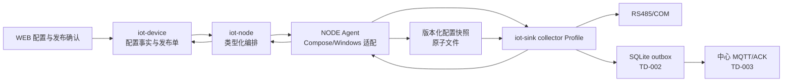

# TD-001：collector Profile 与 NODE 部署契约

> TD ID：POWER-TD-001  
> 版本：1.0.3  
> 状态：In Review  
> 日期：2026-07-31  
> 上游需求：[PRD-01 1.2.0](../../产品需求/电力运维云平台/PRD-01-站点设备与数据采集.md)  
> 规格：[SPEC-003 1.4.0](../../规格/电力运维云平台/SPEC-003-RS485-Modbus-RTU采集产品化.md)  
> 架构决策：[ADR-001](../../架构决策/电力运维云平台/ADR-001-RTU-Poller运行位置.md)、[ADR-007](../../架构决策/电力运维云平台/ADR-007-collector打包与NODE管理契约.md)、[ADR-011](../../架构决策/电力运维云平台/ADR-011-Capability-Manifest规范.md)  
> 目标模块：`iot-device`、`iot-node`、`iot-sink`、`NODE`、`.scripts/docker`
> 评审处置：[TD-001 技术设计评审报告](../../开发规范/TD-001评审报告.md)（2026-07-31）

## 1. 目标与范围

本设计把仓库已有 `IotModbusRtuPollingProtocol` 产品化为站点 `iot-sink collector`，由 NODE 以类型化、可恢复、可审计的工作负载契约管理。完成后，配置从 DEVICE 发布到站点，collector 原子应用指定版本，在 Linux 串口或批准的 Windows COM 环境轮询，并持续回报版本与健康状态。

本 TD 冻结：

- collector 进程边界、Spring Profile、依赖裁剪和配置来源。
- DEVICE、`iot-node`、NODE Agent、collector 的职责与接口。
- 类型化 workload/config schema、发布状态机、幂等与回滚。
- 串口枚举、独占、容器/Windows 适配、安全与健康契约。
- 资源压测方法、实现任务、测试与发布门禁。

不在本 TD 冻结：SQLite outbox 表结构和 ACK（TD-002/003）、电力对象/二维码表结构（TD-004）、模板 Schema（TD-005）、WEB 页面视觉细节。中心 inbox 清理由 TD-003 按 ADR-006 的 inbox repository 生命周期负责，时序事实清理由 `TelemetryLifecycleManager` 负责；不得因此向普通 `TelemetryStore` 增加任意删除能力。

## 2. 代码基线与差距

| 现有证据 | 可复用能力 | 必须修改的差距 |
|---|---|---|
| `IotModbusRtuPollingProtocol` | RTU 读写、串口级进程内互斥 | 当前逐点读取属于性能与总线容量缺口，不影响基础读写正确性，由第 9.2 节合并读取覆盖；直接依赖 `DeviceDO/DeviceMapper` 则是站点独立运行的功能阻断项 |
| `AbstractIndustrialPollingProtocol` | 扫描调度、设备并发、上/下行入口 | `needReply=false`、无版本快照、无降频状态机、失败只改设备离线 |
| `IndustrialDeviceConfig` | 串口、站号、点位等基础字段 | `scale/offset` 仍为 `Double`，缺少发布版本、十进制定点、轮询组和独立超时字段 |
| `ModbusSerialPortLocks` | 同一 JVM 内端口互斥 | 不能防止两个容器/主机进程争抢同一串口 |
| `IotGatewayConfiguration` | 按属性启用 RTU Bean | 尚无 `collector` Profile 和依赖白名单 |
| `iot-sink` Dockerfile | 可运行现有 jar | 默认 `-Xms512m -Xmx512m` 与 384 MiB 初始候选冲突；未按 collector 非 root/只读裁剪 |
| `NodeCommandServiceImpl`、NODE `workload_manager.py` | 控制面可调用 Agent 启停进程 | 接受任意 `command/env/workDir`；不是 Compose 白名单适配；运行清单只在内存，Agent 重启后丢失 |
| `node_workload_binding`、心跳 workloads | 基础绑定和状态上报 | 只有 running/stopped、PID，缺少期望/观察版本、镜像摘要、健康 facet 和错误审计 |

结论：复用协议实现，不复用当前“任意命令启动”和“collector 直连中心数据库”的运行形态。

## 3. 目标拓扑与职责



| 组件 | 权威职责 | 禁止事项 |
|---|---|---|
| `iot-device` | 点表配置、静态校验、差异确认、发布单、期望版本、应用结果 | 不直接启动进程，不保存主机命令 |
| `iot-node` | 节点准入、工作负载期望/观察状态、串口预占、调用 Agent | 不解释 Modbus 点表，不生成任意 shell |
| NODE Agent | 校验白名单 spec、生成 Compose/固定 Windows 命令、原子写快照、恢复工作负载 | 不接受调用方传入 command、任意 env、任意卷或特权模式 |
| collector | 校验并应用快照、持有串口、轮询、健康/版本回报、写 outbox | `collector` Profile 不直连中心业务数据库，不复制 EDGE 协议栈 |

## 4. 持久模型

### 4.1 `iot-device`：`iot_collector_config_release`

| 字段 | 类型/约束 | 说明 |
|---|---|---|
| `id` | bigint PK | 发布单 ID |
| `tenant_id/site_id` | bigint，非空 | 内部关系主键与租户边界 |
| `site_code` | varchar，非空 | 创建发布单时固化的不可变业务编码；用于审计和对外查询 |
| `workload_id/node_id` | varchar/bigint，非空 | 目标 collector 与节点 |
| `config_version` | bigint，租户+workload 唯一 | 单调递增版本 |
| `schema_version` | varchar，非空 | 快照 schema，首版 `1.0` |
| `canonicalization_version` | varchar，非空 | 首版 `jcs-rfc8785-v1`，决定 canonical/hash 规则 |
| `payload_canonical` | text，非空 | 写库前生成并实际下发的 UTF-8 canonical JSON 文本 |
| `payload` | jsonb，非空 | 由同一 canonical 文本解析，用于数据库字段查询；不是哈希输入 |
| `payload_sha256` | char(64)，非空 | `UTF-8(payload_canonical)` 的 SHA-256 |
| `canonical_length_bytes` | bigint，非空 | canonical UTF-8 字节长度，辅助传输完整性校验 |
| `status` | varchar，非空 | `DRAFT/VALIDATED/PUBLISHED/APPLIED/FAILED/APPLY_TIMEOUT/ROLLED_BACK` |
| `base_version` | bigint，可空 | 差异和乐观锁基线 |
| `published_by/at` | bigint/timestamp | 发布审计 |
| `applied_version/applied_at` | bigint/timestamp | 运行端观察值 |
| `error_code/error_detail` | varchar/text | 结构化失败原因；detail 脱敏 |
| `row_version` | bigint，非空 | 乐观锁 |

发布快照不可原地修改。canonical 文本必须在应用层按 `canonicalizationVersion` 生成一次；写库、计算哈希、下发 Agent 和本地落盘均复用同一字节序列，禁止读取 `jsonb` 后重新序列化并比较哈希。写入事务必须校验 `payload_canonical` 可解析、与 `payload` 语义相同、字节长度和 SHA-256 一致。回滚创建一个新的发布版本，其内容复制自历史已应用版本，并记录 `rollbackFromVersion`，不得把版本号倒退。

数据库以 bigint 保存内部主键；管理 API 中 `tenantId/siteId/nodeId/deviceId` 均按十进制字符串序列化，避免 JavaScript 超过 `2^53-1` 后丢失精度，同时返回 `siteCode`、`deviceIdentification` 等稳定业务标识。API/快照组装层负责 bigint 与十进制字符串的无损转换，collector 不解析为 Java `long` 以外的业务含义。发布历史按 `(tenant_id, site_id, config_version desc)` 和 `(tenant_id, site_code, config_version desc)` 建索引。

### 4.2 `iot-node`：扩展 `node_workload_binding`

增加 `desired_spec_version`、`desired_spec_hash`、`observed_spec_version`、`observed_spec_hash`、`image_digest`、`lifecycle_status`、`health_facets jsonb`、`serial_bindings jsonb`、`last_error_code`、`last_error_detail`、`last_seen_at`、`state_version`。唯一约束保持 `(workload_type, workload_id)`，串口预占另以 `(node_id, canonical_host_path)` 唯一约束阻止两个活动 workload 绑定同一端口。

`health_facets` 固定为 schema `collector-health/1.0`，不得写入自由结构：

```json
{
  "schemaVersion": "1.0",
  "canonicalizationVersion": "jcs-rfc8785-v1",
  "overall": "DEGRADED",
  "observedAt": "2026-07-31T09:01:02+08:00",
  "facets": {
    "process": {"status": "HEALTHY", "reasonCode": "OK", "since": "2026-07-31T09:00:00+08:00"},
    "config": {"status": "HEALTHY", "reasonCode": "CONFIG_APPLIED", "since": "2026-07-31T09:00:30+08:00"},
    "serial": {"status": "HEALTHY", "reasonCode": "PORT_OPEN", "since": "2026-07-31T09:00:31+08:00"},
    "center": {"status": "DEGRADED", "reasonCode": "CENTER_OFFLINE_BUFFERING", "since": "2026-07-31T09:01:00+08:00"}
  }
}
```

`overall/status` 只允许 `HEALTHY/DEGRADED/FAILED`，四个 facet 必须齐全；`reasonCode` 使用版本化枚举，`since/observedAt` 为带偏移 RFC 3339 时间。新增字段只能向后兼容，未知字段由旧消费者忽略，未知状态必须按 FAILED 保守处理。

数据库保存控制面事实；Agent 本地保存可恢复的运行状态，二者通过期望/观察版本对账，不使用跨主机事务。

## 5. 类型化 Workload 契约

`workloadType` 固定为 `iot-sink-collector`。控制面只发送下列 schema；NODE 不再为该类型接受通用 `command/workDir/logDir/gpuIds/env`。

```json
{
  "specVersion": "1.0",
  "workloadType": "iot-sink-collector",
  "workloadId": "collector-site-1001-a",
  "nodeId": 21,
  "image": {
    "repository": "registry.example/easyaiot/iot-sink-biz",
    "digest": "sha256:<64-hex>"
  },
  "springProfile": "collector",
  "config": {
    "version": 6,
    "sha256": "<64-hex>",
    "targetPath": "/var/lib/easyaiot/collector/config/active.json"
  },
  "resources": {
    "cpuCores": "1.0",
    "memoryBytes": 402653184
  },
  "serialDevices": [{
    "hostPath": "/dev/serial/by-id/usb-vendor-device",
    "containerPath": "/dev/easyaiot/rs485-0",
    "hardwareFingerprint": "usb:vid:pid:serial",
    "readOnly": false
  }],
  "volumes": [{
    "name": "outbox",
    "hostPath": "/var/lib/easyaiot/collector/collector-site-1001-a/outbox",
    "containerPath": "/var/lib/easyaiot/outbox",
    "mode": "rw"
  }],
  "brokerRef": "secret://node/21/collector/site-1001",
  "updatePolicy": {
    "dispatchAckTimeoutSeconds": 10,
    "configApplyTimeoutSeconds": 60,
    "healthWindowSeconds": 60,
    "autoRollback": true
  }
}
```

约束：

- `repository` 必须在安装时配置的镜像白名单；生产只接受 digest，不接受可漂移 tag。
- `hostPath` 必须解析后位于 collector 专用根目录或串口设备白名单；拒绝 `..`、符号链接逃逸、`/`、Docker socket 和任意主机目录。
- 禁止 privileged、host network、额外 capability 和调用方自定义 entrypoint。
- `brokerRef` 由 Agent 的节点密钥存储解析为权限 `0600` 的临时 secret 文件；不得写入 payload、命令行、普通环境变量或日志。
- `memoryBytes=384 MiB` 只用于首轮压测候选，不是生产默认值；生产 manifest 在第 13 节门禁通过后冻结。
- 当前 Dockerfile 的 `-Xms512m -Xmx512m` 与 384 MiB 候选 limit 明确冲突；第 18 节任务 5 必须先完成 JVM/limit 一致性改造，否则不得使用该候选 spec 启动测试或生产容器。
- `dispatchAckTimeoutSeconds=10`、`configApplyTimeoutSeconds=60`、`healthWindowSeconds=60` 均为首轮候选。冷启动压测必须分别统计 Agent 接单、配置应用和镜像健康窗口，按 P99 与安全余量冻结，不能用一个 60 秒超时覆盖三个阶段。

## 6. Collector 配置快照

快照使用 UTF-8 canonical JSON，按 `schemaVersion + workloadId + configVersion` 标识，默认值全部显式固化：

```json
{
  "schemaVersion": "1.0",
  "workloadId": "collector-site-1001-a",
  "tenantId": "100",
  "siteId": "1001",
  "siteCode": "plant-a",
  "configVersion": 6,
  "generatedAt": "2026-07-31T09:00:00+08:00",
  "serialBuses": [{
    "busId": "bus-a",
    "serialPort": "/dev/easyaiot/rs485-0",
    "baudRate": 9600,
    "dataBits": 8,
    "stopBits": "1",
    "parity": "NONE",
    "transmitDelayMs": 0,
    "rs485Mode": true,
    "devices": [{
      "deviceId": "20001",
      "deviceIdentification": "METER-01",
      "unitId": 1,
      "pollIntervalMs": 5000,
      "requestTimeoutMs": 1000,
      "maxRetries": 2,
      "points": [{
        "propertyCode": "activePower",
        "function": "HOLDING_REGISTER",
        "address": 0,
        "quantity": 2,
        "dataType": "FLOAT32",
        "byteOrder": "BIG_ENDIAN",
        "wordOrder": "BIG_ENDIAN",
        "scale": "1",
        "offset": "0",
        "dataPriority": "METERING_TOTAL",
        "writable": false,
        "pollGroup": "normal"
      }]
    }]
  }]
}
```

应用顺序：schema/哈希校验 → capability/规模校验 → 串口路径与指纹校验 → 点表/冲突/总线负载校验 → 构建候选调度图 → 原子切换运行配置。任一步失败均保留上一 `APPLIED` 版本。active 文件通过同目录临时文件、`fsync`、原子 rename 写入；历史至少保留最近两个已应用版本。

### 6.1 Schema 类型规则

WorkloadSpec 与 ConfigSnapshot 必须以仓库内 JSON Schema 作为唯一机器校验基线，所有 object 默认 `additionalProperties=false`：

| 字段类别 | JSON 类型与约束 |
|---|---|
| schema/config 版本、内部 ID | 版本为受限字符串；`tenantId/siteId/deviceId` 为仅含十进制数字的字符串，禁止科学计数法和符号 |
| `siteCode/deviceIdentification/propertyCode/workloadId` | 非空字符串，长度和正则引用 SPEC-001/现有兼容规则 |
| `baudRate/dataBits/quantity/unitId` | `integer`；schema 给出协议允许的 minimum/maximum |
| `transmitDelayMs/pollIntervalMs/requestTimeoutMs/maxRetries/healthWindowSeconds` | 非负 `integer`；毫秒/秒单位写入字段名，禁止 JSON 小数 |
| `scale/offset` | 十进制字符串，pattern `^[+-]?(0|[1-9]\\d*)(\\.\\d+)?$`；禁止指数、NaN、Infinity 和 `-0` |
| `cpuCores` | 正十进制字符串；由 Agent 映射到受控资源参数 |
| `memoryBytes/configVersion` | 非负 `integer` 且不超过 schema 声明上限；前端不得经浮点运算改写 |
| 枚举/布尔 | schema 明确 enum 或 `boolean`，禁止用 `0/1` 和自由文本替代 |

`dataPriority` 必须使用 SPEC-004 五级枚举 `SAFETY/ALARM/METERING_TOTAL/CONTROL_FEEDBACK/NORMAL_TELEMETRY`，并在发布快照中按点位固化；collector 生成历史 envelope 时读取该快照值，中心不得按当前模板重新推断。

canonicalization 使用版本化 JCS 等价规则：UTF-8、对象键序、无无意义空白；十进制业务值因采用字符串而不参与 JSON number 规范化。schema 文件、canonicalizationVersion 和测试 fixture 必须同提交变更。

## 7. API 与 Agent 契约

### 7.1 平台管理 API

| 方法 | 路径 | 权限/幂等语义 |
|---|---|---|
| `GET` | `/admin-api/node/collector/serial-ports?nodeId=` | 查看节点且具采集配置权限；只读枚举 |
| `POST` | `/admin-api/device/collector-config/validate` | 生成校验报告，不发布 |
| `POST` | `/admin-api/device/collector-config/{id}/publish` | 发布权限+差异确认；`rowVersion` 乐观锁 |
| `POST` | `/admin-api/device/collector-config/{id}/rollback` | 创建新发布版本；`requestId` 幂等 |
| `GET` | `/admin-api/device/collector-config/{id}/status` | 返回期望/应用版本、状态、健康和错误 |

### 7.2 `iot-node` 到 NODE Agent

| 方法 | Agent 路径 | 请求 |
|---|---|---|
| `GET` | `/serial/ports` | 无 body；返回候选端口、指纹、权限和占用者 |
| `POST` | `/workload/collector/deploy` | 类型化 WorkloadSpec；相同 spec hash 幂等成功 |
| `PUT` | `/workload/collector/config` | `workloadId/configVersion/payload/sha256`；只接受更高版本；回滚也必须使用新生成的更高发布版本 |
| `POST` | `/workload/collector/rollback` | 目标必须是本地已验证快照；操作带 requestId |
| `POST` | `/workload/collector/stop` | 先排空、释放串口，再停实例；重复停止成功 |
| `GET` | `/workload/collector/{id}` | 返回 lifecycle、版本、镜像、facet、串口和最近错误 |

相同 `configVersion + sha256` 重放返回幂等成功；低于当前 desired/observed 版本返回 `CONFIG_VERSION_STALE`，相同版本但 hash 不同返回 `CONFIG_VERSION_CONFLICT`，均不得改写本地快照。所有 Agent API 继续使用节点 token，并增加时间戳、nonce、body SHA-256 的 HMAC 请求签名和五分钟防重放窗口。心跳携带 `agentEpochMs`，控制面计算并保存 `clockSkewMs`：偏差超过 60 秒进入 DEGRADED 并告警，超过五分钟拒绝变更请求。平台只报告偏差，不远程修改系统时间；生产节点必须使用 NTP/chrony 或 Windows Time。内部错误返回稳定 `errorCode`；异常堆栈不直接返回调用方。

## 8. 发布与工作负载状态机

### 8.1 配置发布

```text
DRAFT → VALIDATED → PUBLISHED → APPLIED
          │              ├────→ FAILED
          │              └────→ APPLY_TIMEOUT
          └────→ DRAFT
```

- `VALIDATED` 后必须由有发布权限的用户确认差异；服务端不得自动发布。
- 发布接口先创建 PUBLISHED，再由 `iot-node` 派发。Agent 只有在校验请求并持久保存 desired version/hash 后才返回接单 ACK；超过 `dispatchAckTimeoutSeconds` 未收到 ACK，发布进入 FAILED，错误码 `AGENT_DISPATCH_TIMEOUT`，旧 collector 不停。`configApplyTimeoutSeconds` 从 `agentAcceptedAt` 起算，超过后才进入 APPLY_TIMEOUT。二者不得共用计时起点。
- 迟到回报仅在 `workloadId + configVersion + payloadHash` 全部匹配当前期望时更新状态；旧回报只入审计。
- collector 回报 APPLIED 前必须已经完成本地快照持久化、串口获取和至少一次健康探测；遥测首次成功不是应用完成的必要条件。

### 8.2 工作负载生命周期

```text
REQUESTED → PULLING → STARTING → HEALTHY
     │          │          └────→ FAILED
     │          └───────────────→ FAILED
HEALTHY → UPDATING → HEALTHY | ROLLED_BACK | FAILED
HEALTHY/FAILED → STOPPING → STOPPED
```

每次转换使用 `stateVersion` 比较交换并写审计事件。更新顺序固定为：标记维护窗口 → 停止旧实例 → 确认串口释放 → 启动候选 → 健康窗口 → 成功或自动回滚。不得对同一串口蓝绿并行。

## 9. collector Profile 与代码改造

### 9.1 Spring Profile

新增 `application-collector.yaml`，只启用：RTU Poller、版本化配置客户端、SQLite outbox 端口、上行 MQTT/ACK 客户端、Actuator/指标和结构化日志。必须禁用 HTTP/TCP/OPC UA 服务端、VIDEO/AI 后处理、Kafka 消费、TDengine 投影、MinIO、Milvus和无关定时任务。

现有 Poller 没有直接调用 Kafka producer，但会调用 `IotDeviceMessageService.sendDeviceMessage`，其后续路径受 message bus 实现影响。第 18 节任务 6 必须替换 Poller 到该服务的整条直发路径并增加架构测试：`collector` Profile 中不得装配 Kafka producer/consumer，采集结果只能进入 `TelemetryOutboxPort`。

构建仍使用 `iot-sink-biz.jar`；镜像新增 collector runtime target 或受控启动参数，不复制 Maven 模块。容器使用非 root 用户、只读根文件系统、专用 tmpfs，唯一可写持久目录为 outbox、状态和日志卷。

### 9.2 解耦点

将 `AbstractIndustrialPollingProtocol` 的直接依赖拆为端口：

```java
interface PollingConfigProvider {
    CollectorConfigSnapshot current();
    Optional<CollectorConfigSnapshot> candidate(long version);
}

interface PollingStatusReporter {
    void reportConfigApplied(ConfigApplyResult result);
    void reportHealth(CollectorHealth health);
}

interface TelemetryOutboxPort {
    AppendBatchResult appendBatch(
        List<TelemetryEnvelope> envelopes,
        Duration enqueueTimeout
    );
}
```

`appendBatch` 以一次轮询结果为本地原子批次：只有 SQLite 事务持久提交后才返回；重复 `messageId` 返回 `DUPLICATE`，新写入返回 `STORED`。有界提交队列超时或存储不可用必须抛出稳定的 `OutboxBackpressureException` / `OutboxUnavailableException`，Poller 不得把失败解释成采集成功。该等待只覆盖本地排队和提交，不得等待 MQTT 或应用 ACK；详细状态与恢复语义由 TD-002 冻结。

- 普通中心形态可以保留数据库 `PollingConfigProvider` 适配器作为受控例外；`collector` Profile 只能装配本地版本快照适配器。
- Poller 只消费领域配置 DTO，不再持有 `DeviceDO/DeviceMapper`；协议读写类仍为唯一实现。
- `scale/offset` 改为字符串输入和 `BigDecimal` 定点运算；兼容旧 `Double` 只允许在读取旧配置的适配层转换，发布快照禁止二进制浮点。
- 调度按 bus 串行、bus 间有界并行；实现连续寄存器合并、慢从站隔离和 `2x/5x/10x` 降频探测，参数来自版本快照。
- 采集结果必须先写 `TelemetryOutboxPort`，不得直接 `messageService.sendDeviceMessage`；具体持久队列由 TD-002 冻结。

## 10. NODE Agent 适配与恢复

- 新增 `CollectorWorkloadAdapter`，只从 WorkloadSpec 生成仓库内固定 Compose 模板；通用 `/workload/deploy` 对 `iot-sink-collector` 返回 `UNSUPPORTED_GENERIC_DEPLOY`。
- Agent 在专用根目录保存 `workload-state.json`，使用文件锁、临时文件、`fsync`、原子 rename；记录 spec hash、镜像 digest、配置版本、Compose project、卷和端口绑定，不保存密钥明文。
- 容器使用标签 `easyaiot.workload.type/id/spec-hash/config-version`。Agent 启动时以“本地状态 + 容器标签”对账：一致则接管；容器缺失则标记 FAILED；未知同标签容器标记 `ORPHANED/QUARANTINED`，禁止接管、更新和新实例争抢其串口，但不自动停止或删除。运维人员核对镜像摘要、spec hash 和审计后，才能显式接管或停止。
- Linux 只映射 WorkloadSpec 列出的规范串口路径。Windows 只允许固定 `java ... -jar app.jar --spring.profiles.active=collector` 模板，路径由安装根目录解析，不接受远程命令片段。JVM 参数来自安装包内签名且版本化的 `collector-runtime-policy`，由冻结后的 capability 资源档映射，Agent 只能选择策略 ID，不能拼接远程 JVM 参数；策略变更必须重新压测并升级签名基线。
- 停止或更新必须等待 collector 排空、关闭串口，并用 Agent 侧探测确认端口可获取；超时进入 FAILED，不启动竞争实例。

## 11. 串口枚举与独占

枚举响应字段：`portName`、`canonicalPath`、`platform`、`available`、`permission`、`occupiedBy`、`vendorId`、`productId`、`serialNumber`、`description`、`hardwareFingerprint`、`observedAt`。

- Linux 优先返回 `/dev/serial/by-id/*` 稳定路径，并关联 `/dev/ttyUSB*`、`/dev/ttyACM*`；只探测配置白名单，不 chmod、不自动打开长期占用。
- Windows 枚举 COM 与 PNP/USB 硬件 ID；发布绑定硬件指纹，COM 序号变化时拒绝静默改绑。
- 控制面预占唯一约束防止平台内冲突；Agent 本地 reservation 防止离线重复指令；collector 实际打开串口是最终校验。三层任一冲突均拒绝应用。
- 手工路径必须先通过白名单和目标节点探测。热插拔后保留配置并将 `serial` facet 置 FAILED，不自动绑定其他设备。
- 运行中唯一必需端口消失时总体状态为 FAILED，但不触发进程重启或配置回滚；collector 在原进程内按 `5s → 15s → 30s → 60s` 探测，之后每 5 分钟一次，并持续告警。只有相同硬件指纹恢复才自动回到 HEALTHY。若端口失败发生在候选配置应用阶段，则候选应用失败并保留上一 APPLIED 版本。

## 12. 健康、观测与错误码

### 12.1 健康聚合

| facet | HEALTHY | DEGRADED | FAILED |
|---|---|---|---|
| `process` | 进程/容器存活 | 重启次数接近阈值 | 进程退出或健康端点不可达 |
| `config` | desired=applied 且 hash 一致 | 旧版本仍运行、候选应用失败/超时 | 无可用已应用版本 |
| `serial` | 必需端口存在且可持有 | 部分非必需设备降频 | 必需端口缺失、无权限或被占用 |
| `center` | MQTT+应用 ACK 可用 | 中心离线但 outbox 可写 | outbox 不可写或可靠性能力不兼容 |

总体状态优先级为 FAILED > DEGRADED > HEALTHY。`center=DEGRADED` 不触发重启；`process=FAILED` 才允许按有界策略重启。每次心跳返回 facet、原因码、`since`、desired/applied config、镜像摘要、串口绑定和 outbox 摘要。

### 12.2 首批稳定错误码

`INVALID_SPEC`、`IMAGE_NOT_ALLOWLISTED`、`IMAGE_DIGEST_MISMATCH`、`IMAGE_SIGNATURE_INVALID`、`CONFIG_HASH_MISMATCH`、`CONFIG_SCHEMA_UNSUPPORTED`、`CONFIG_VERSION_STALE`、`CONFIG_VERSION_CONFLICT`、`CAPABILITY_DENIED`、`SERIAL_NOT_FOUND`、`SERIAL_PERMISSION_DENIED`、`SERIAL_OCCUPIED`、`BUS_LOAD_EXCEEDED`、`AGENT_DISPATCH_TIMEOUT`、`START_TIMEOUT`、`HEALTH_CHECK_FAILED`、`WORKLOAD_NOT_FOUND`、`ROLLBACK_FAILED`、`UNSUPPORTED_GENERIC_DEPLOY`。

指标至少包含配置应用耗时/结果、进程 RSS/JVM 内存/GC、串口请求/成功/超时/CRC、降频从站数、轮询周期达标率、配置版本、重启/回滚次数。日志携带 `tenantId/siteId/workloadId/configVersion/busId/deviceIdentification`，不得记录 broker secret。

## 13. 资源与容量冻结方案

384 MiB/1 CPU 仅是第一轮候选。由于当前 Dockerfile本身使用 `Xms/Xmx=512m`，实现前必须改为容器感知的百分比堆策略或经压测冻结的显式值，且 `Xms` 不得等于容器 limit。

压测矩阵：

| 维度 | standard 最低覆盖 | full 最低覆盖 |
|---|---|---|
| 串口 | 0 路冷启动 smoke test，及 1、2、4 路采集 | standard 全部 + capability 候选上限 |
| 点位/周期 | 按 ADR-006 计算至准入边界 | 至 full 候选边界 |
| 网络 | 正常、30 分钟断网、24 小时断网后补传 | 同左 |
| 配置 | 冷启动、无差异重放、失败保持旧版、连续升级/回滚 | 同左 |
| 故障 | 慢从站、CRC、端口拔插、磁盘 80/95%、中心 ACK 不兼容 | 同左 |

必须采集 JVM heap/metaspace/native/thread、RSS、SQLite page/WAL cache、GC pause、CPU、文件描述符、outbox 增长和轮询延迟。冻结条件：连续 7 天无 OOM/不可恢复死锁；P99 GC pause、轮询达标率和 CPU 符合验收阈值；峰值 RSS 与 limit 保留不少于 20% 安全余量；24 小时断网后可在不阻塞采集的情况下补传。未通过时上调资源或收紧 capability 配额，不能修改代码形成 standard/full 分叉。

0 路只用于验证镜像、Profile、健康端点和等待配置状态：`process=HEALTHY`、`config=DEGRADED/WAITING_CONFIG`。生产发布快照的 `serialBuses` 不得为空，0 路状态不能回报 APPLIED。

## 14. 安全与权限

- `power.device.collector` 仅在 standard/full manifest 启用；mini 的安装、API 和菜单均返回能力不可用。
- 配置查看、编辑、校验、发布、回滚、串口枚举分别校验租户、站点数据权限和操作权限；发布/回滚记录操作者、差异、requestId、来源 IP 和结果。
- Agent token、broker secret 和镜像仓库凭据使用独立 secret，最小权限、可轮换；日志和健康响应只返回引用或末尾摘要。broker secret 轮换时，Agent 写入新的 `0600` 版本文件并原子切换引用，通过本地受控管理通道通知 collector 重建 MQTT 连接；新凭据连接成功前保留旧凭据，失败则回退。过程允许短暂重连但不得重启 JVM，采集数据继续进入 outbox。
- 配置 payload 不含命令、脚本和任意路径。厂家点表文本不能影响 Compose、文件名、日志模板或命令行。
- CI 使用固定版本 Trivy 生成 CycloneDX SBOM并扫描镜像/依赖，HIGH/CRITICAL 未获批准豁免则阻断；通过后使用 Cosign 对镜像 digest 签名。`iot-node` 在派发前校验摘要与签名元数据，NODE Agent 在拉取后、启动前使用安装时固定的公钥或受信身份再次验证；两侧任一失败均返回 `IMAGE_SIGNATURE_INVALID`。SBOM、扫描报告、签名引用、工具版本和镜像摘要与发布单共同审计。

## 15. 失败、回滚和缺口

| 失败点 | 行为 |
|---|---|
| 静态校验失败 | 保持 DRAFT/VALIDATED 前状态，不调用 NODE |
| Agent 不可达/未接单 | 发布单 FAILED/`AGENT_DISPATCH_TIMEOUT`，旧 collector 不停；只有 Agent 已接单后应用超时才使用 APPLY_TIMEOUT |
| 镜像拉取/签名失败 | workload FAILED，保留旧镜像和配置 |
| 候选配置失败 | config FAILED，继续上一 APPLIED 版本 |
| 更新后健康失败 | 自动恢复最近验证镜像+配置，状态 ROLLED_BACK |
| 串口无法释放 | 停止更新，FAILED 并人工介入，不启动第二实例 |
| Agent 重启 | 从状态文件+容器标签恢复，向控制面对账 |

collector 发布不得自动创建或批准停运。发布请求 MAY 携带 `maintenanceWindowId`，`iot-device` 必须校验该窗口已由独立维护审批流程批准，且租户、站点、设备/测点范围与 `[start,end)` 覆盖本次更新；校验通过后在发布单固化窗口 ID、审批版本和范围快照，并向数据质量域登记关联。没有有效批准窗口仍可按权限发布，但更新期间计划槽正常计入应采集数。

只有关联的已批准窗口与测点启用时段交集中的计划槽，才按 SPEC-004 从“应采集数”扣除；该时段实际收到的样本继续保存，但不同时作为缺失或再次扣减分子。超出批准窗口、启动失败、回滚和通信故障形成的缺失写 `stage=COLLECTOR_DOWNTIME` 并计入完整率。窗口被撤销或缩短时，数据质量聚合按审批版本重算并保留旧结果版本。任何回滚都保留 outbox 卷和原 messageId。

## 16. SPEC-003 追踪矩阵

| 需求 | 设计落点 | 验证方式 |
|---|---|---|
| RTU-001、RTU-002、RTU-007、RTU-016 | 第 4、6～8、15 节 | 版本、重复/乱序回报、失败保持旧版和回滚合同测试 |
| RTU-003 | 第 8、10、11 节 | 控制面预占、Agent reservation、实际端口三层冲突测试 |
| RTU-004、RTU-018 | 第 6、9 节 | schema 拒绝缺失 `propertyCode` 和浮点 `scale/offset` |
| RTU-005 | 第 9 节结果端口；信封/质量码由 TD-003 冻结 | 单点解码失败不生成 0，进入质量遥测合同测试 |
| RTU-006 | 第 6、9、14 节；高风险流程由 SPEC-007 后续冻结 | writable、类型、值域、权限拒绝和无串口写入测试 |
| RTU-008 | 第 12 节 | 串口/设备指标、错误码和健康 facet 合同测试 |
| RTU-009、RTU-010 | 第 3、5、9、10、14 节 | 最小设备映射；同镜像在 standard/full 运行；mini 拒绝 |
| RTU-011 | 第 7、11 节 | Linux PTY、USB 指纹、Windows COM 与热插拔测试 |
| RTU-012、RTU-017 | 第 6、9 节 | 120 寄存器上限、宽度/字序/功能码/厂家边界参数化测试 |
| RTU-013 | 第 6、9、12 节 | `2x/5x/10x` 降频、5 分钟上限、成功恢复测试 |
| RTU-014 | 第 6、8 节 | 最坏总线占用超限时拒绝并返回主要冲突请求 |
| RTU-015 | 第 6、9 节 | `decodedRaw × scale + offset` 定点计算；不应用 CT/PT 倍率 |

任何 RTU 需求变更必须同步更新本矩阵、对应 schema/合同测试和 SPEC-003 版本；不能只改实现任务。

## 17. 测试资产基线

两套资产最后共同变更提交：`d29e0dbdcbd20b18feb84bfdb3e46031eed2c81e`（2026-07-18）。模拟器协议版本定义为 `easyaiot-modbus-rtu-simulator/1`：Modbus RTU、CRC16、unitId 1，holding register 与 coil 基础读写；后续协议行为变化必须提升版本。

关键文件 Git blob：

| 文件 | Git blob |
|---|---|
| `.scripts/modbus-rtu-virtual-serial/00_virtual_rtu_slave.py` | `b6b2d58565f7cc1c6708122874c7de6e190e91ec` |
| `.scripts/modbus-rtu-virtual-serial/01_self_test.py` | `3ef527dc519a2847bada6b527eb1a30348c1a85f` |
| `.scripts/modbus-rtu-virtual-serial/start.sh` | `f74a19231f94a9b8feb9c2affb15a8f84a1b3e12` |
| `.scripts/modbus-rtu-demo/01_uplink_read.py` | `8d8ce15c32ab76ec0fff0dc33bd5bc597d501e45` |
| `.scripts/modbus-rtu-demo/02_downlink_write.py` | `3e828c003fa79f508edf01c659df30dd15ec1940` |
| `.scripts/modbus-rtu-demo/03_platform_set_properties.py` | `890a7b37a09b5d3c72e7031c4e00d799085a63f0` |

验收覆盖 SPEC-003 场景 A～I，并增加：Agent 重启接管、恶意路径/command 拒绝、相同 spec 幂等重放、低版本/同版本异 hash 拒绝、配置乱序回报、镜像摘要/签名不符、Windows COM 序号漂移、mini capability 拒绝、standard 镜像在 full 原样运行、0 串口等待配置、已批准/未批准/超窗维护窗口完整率、broker secret 轮换且 JVM 不重启。

## 18. 实现任务与顺序

| 顺序 | 任务 | 模块 | 完成证据 |
|---:|---|---|---|
| 1 | 数据库迁移、发布单和 workload 观察字段 | `iot-device`、`iot-node` | migration + repository/service tests |
| 2 | WorkloadSpec/ConfigSnapshot schema、canonical hash 和 DTO | `iot-device-api`、`iot-node-api`、`iot-sink-api` | schema fixtures + contract tests |
| 3 | 类型化 collector Agent API、Compose 模板、路径/镜像白名单、Trivy/Cosign 验证 | `NODE` | 安全负例 + Linux 集成测试 + SBOM/签名证据 |
| 4 | Agent 状态文件、容器标签恢复和状态对账 | `NODE`、`iot-node` | Agent kill/restart 验收 |
| 5 | `collector` Profile、非 root 镜像、JVM/limit 一致性和依赖裁剪 | `iot-sink` | context report + 容器启动/OOM 参数校验 |
| 6 | `PollingConfigProvider/StatusReporter/TelemetryOutboxPort` 解耦并清除消息总线直发 | `iot-sink` | 原 Poller 合同测试；collector 无 Kafka Bean 且只写 outbox |
| 7 | 配置校验、发布、应用、超时、回滚状态机 | `iot-device`、`iot-node`、`NODE`、`iot-sink` | 乱序/重复/失败测试 |
| 8 | Linux/Windows 串口枚举、预占和释放确认 | `NODE`、`iot-node` | PTY + COM 测试记录 |
| 9 | 健康 facet、指标、结构化日志和 UI 状态 API | 全链路 | dashboard/告警与 API 合同测试 |
| 10 | 联合容量压测并冻结 manifest 配额 | `.scripts/docker`、测试环境 | 原始报告、配置、镜像 digest |

TD-002 可以在任务 2 的卷与接口契约评审后并行设计，但持久队列代码不得在 TD-002 冻结前合入。

## 19. 评审与完成门禁

TD-001 转为 `Approved / Frozen` 前必须关闭：

1. 评审确认 collector 无中心数据库依赖，且没有复制 RTU 协议实现。
2. 类型化 WorkloadSpec、ConfigSnapshot schema、状态机、错误码和权限通过后端/NODE/实施联合评审。
3. 确认通用 `/workload/deploy` 不能为 collector 执行任意命令或挂载任意路径。
4. 提供 Linux PTY 端到端记录；Windows 若作为 M1 发布目标，必须补 COM 联调记录，否则在 capability 中关闭 Windows collector。
5. 完成第 13 节首轮资源压测，冻结 standard/full 生产 request/limit、串口/点位/周期配额；未完成不得形成销售承诺。
6. TD-002/003 对 `TelemetryOutboxPort`、卷路径和健康摘要无冲突。

当前无未决架构选型。评审报告 T01-01～20 的设计语义已在 1.0.1 处理，1.0.2 与 TD-002 对齐 `TelemetryOutboxPort`，1.0.3 与 TD-003 对齐快照中的 `canonicalizationVersion/siteCode/dataPriority`；未冻结项仍为需要实测证据的资源数值、超时数值和 Windows 发布资格。TD 状态保持 In Review，完成本节门禁后才能转为 Approved / Frozen。
