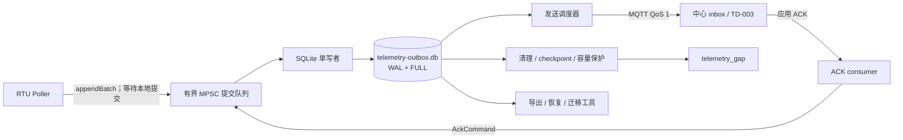
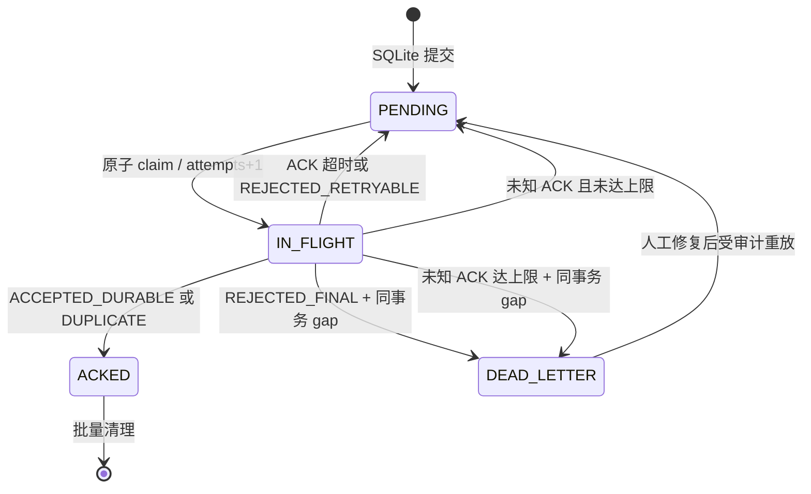

# TD-002：SQLite Outbox、容量、并发、恢复与迁移

> 文档状态：In Review  
> 版本：1.0.2  
> 日期：2026-07-31  
> 适用版本：standard / full；mini 不安装本能力  
> 上游：[SPEC-004 遥测质量与断点补传](../../规格/电力运维云平台/SPEC-004-遥测质量与断点补传.md)、[ADR-002 边缘持久队列](../../架构决策/电力运维云平台/ADR-002-边缘持久队列.md)、[ADR-003 遥测 ACK](../../架构决策/电力运维云平台/ADR-003-遥测ACK机制.md)、[TD-001 collector 与 NODE 部署契约](./TD-001-collector与NODE部署契约.md)
> 评审处置：[TD-002 技术设计评审报告](../../开发规范/TD-002评审报告.md)（2026-07-31）

## 1. 结论

standard 与 full 共用同一套 outbox 实现、Schema、状态机、迁移工具和测试；只通过 Capability Manifest 注入容量与规模参数，禁止形成两套代码。M1 使用 SQLite WAL 持久化每个遥测 envelope，采集线程只向单写者的有界队列提交本地事务；发送、ACK、清理和恢复都复用同一个状态机。

数据只有在 SQLite 事务提交后才可视为“已采集并可补传”。MQTT QoS 1 只证明 Broker 收到消息，只有中心应用 ACK 的 `ACCEPTED_DURABLE` 或 `DUPLICATE` 才允许转为 `ACKED`。任何容量淘汰、最终拒绝或不可恢复损坏都必须留下 `EDGE_DELIVERY` 缺口事实或显式失败，禁止静默丢弃。

## 2. 范围与非目标

本 TD 冻结：

- 本地 envelope 字节契约、SQLite Schema、PRAGMA 与版本迁移；
- 单写者并发、批量提交、本地背压及发送租约；
- `PENDING / IN_FLIGHT / ACKED / DEAD_LETTER` 状态机；
- standard 2 GiB、full 4 GiB 的容量预算与 80%/95% 保护；
- checkpoint、清理、崩溃恢复、损坏处置、导出和节点迁移；
- 与 TD-001 `TelemetryOutboxPort`、健康 facet 和持久卷的契约。

不在本 TD 冻结：中心 inbox、ACK 服务、稳定错误码和 TDengine 投影细节（TD-003）；采集寄存器解释与调度（TD-001）；完整率聚合、维护窗口和中心投影缺口计算。TD-002 只产生 `stage=EDGE_DELIVERY` 的缺口，不得产生或折算 `CENTER_PROJECTION` 缺口。

## 3. 现状差距

| 现状 | 风险 | M1 处理 |
|---|---|---|
| `iot-sink` 尚无 SQLite JDBC 依赖 | 无法形成断网可恢复队列 | 在 collector Profile 引入受版本锁定的 Xerial SQLite JDBC |
| Poller 经 `IotDeviceMessageService` 进入现有消息总线路径 | 本地持久提交与网络发送耦合 | 替换为 TD-001 `TelemetryOutboxPort` |
| `IotDeviceMessage` 缺少 SPEC-004 envelope 字段 | 无法跨层幂等、排序和追踪 | 新建独立 `TelemetryEnvelopeV1`，不复用旧 DTO |
| `generateMessageId()` 使用无格式约束的简单 UUID | 格式和排序语义不明确 | 新数据使用 RFC 4122 UUID v4；兼容既有 32/36 字符 UUID，ID 不承载时间顺序 |
| `PropertyDownstreamReportAckListener` 及 handler 仍服务旧 `IotDeviceMessage` 通道，未更新 outbox | QoS 1 后没有新的应用级持久确认闭环 | 不删除旧 listener；TD-003 新增 Envelope V1 ACK 适配器并转为类型化 `AckCommand`，collector Profile 禁止把旧 listener 当作可靠 ACK |
| 没有统一容量、恢复和迁移工具 | 磁盘满或迁移时可能静默丢失 | 本 TD 规定保护状态机与离线工具 |

## 4. 组件与数据流



collector 内只有 SQLite writer 可以执行写 SQL。Poller、发送器、ACK consumer、维护任务都提交命令，不得各自建立可写连接竞争 WAL 锁。只读指标连接必须设置 `query_only=ON`，不得持有长事务。

## 5. 文件、进程与卷边界

TD-001 冻结的持久卷根目录为 `/var/lib/easyaiot/outbox`：

| 路径 | 用途 |
|---|---|
| `telemetry-outbox.db`、`-wal`、`-shm` | 主库及 WAL 文件 |
| `collector-outbox.lock` | 单实例 OS 排他锁；文件中的 PID、启动 epoch、workloadId 仅用于诊断 |
| `export/` | 受控导出包；不参与实时发送 |
| `recovery/` | 人工恢复的只读快照、清单和报告 |

目录属 collector 非 root 用户，Linux 权限为目录 `0700`、文件 `0600`。启动必须通过 Java `FileChannel.tryLock()` 获取 OS 级排他锁（Linux 映射 `fcntl`，Windows 映射系统文件锁）；进程退出或句柄关闭后由 OS 释放。锁文件内容绝不作为所有权判据，PID 重用或残留文本不能形成 stale lock 误判；同卷第二实例获取锁失败时返回 `OUTBOX_ALREADY_OWNED` 并退出，禁止双写。网络文件系统若不能提供已验证的排他锁语义则拒绝部署。配置、secret 和数据库不得放在同一可替换层；容器升级、镜像回滚和 JVM 重启必须保留该卷。

Windows 资格保留相同逻辑目录结构。安装脚本必须创建专用服务账号并自动设置 ACL，移除普通用户和继承的宽泛写权限；启动时校验 ACL，不满足则 `OUTBOX_PERMISSION_INVALID` 失败，禁止把手工配置作为生产前提。生产环境必须由宿主机卷加密（Linux LUKS/dm-crypt、Windows BitLocker 或等价能力）提供静态加密；M1 不引入第二套 SQLCipher Schema。若部署要求应用层数据库加密，必须另立 ADR 并重新验证驱动、备份和恢复兼容性。

## 6. Envelope V1

每条测点样本一个 envelope，落库与发送复用同一份 UTF-8 canonical JSON 字节，不从列值重新拼装消息。V1 必填字段遵循 SPEC-004：

`schemaVersion`、`canonicalizationVersion`、`messageId`、`requestId`、`tenantId`、`siteCode`、`deviceIdentification`、`propertyCode`、`valueEncoding`、`quality`、`dataPriority`、`collectedAt`、`sentAt`、`sequence`、`source`、`configVersion`。`value` 对有效值必填；无效采集可按 SPEC-004 省略，但质量与诊断必填。M1 固定 `schemaVersion=1.0`、`canonicalizationVersion=jcs-rfc8785-v1`；`requestId` 为该 envelope 的稳定 UUID，重试不得刷新，ACK 必须同时回显 messageId 和 requestId。`dataPriority` 取版本化点位绑定结果并使用 SPEC-004 五级枚举，中心不得根据当前模板重新推断历史优先级。

约束：

- 新 `messageId` 使用小写 RFC 4122 UUID v4（36 字符），在采集结果提交前生成；读取和导入兼容既有 32 字符无连字符 UUID。它是不可解释的幂等键，不得用于排序。
- `tenantId` 和业务十进制值在 JSON 中使用十进制字符串，禁止科学计数法；M1 `valueEncoding` 只允许 `decimal-string`。无效采集省略 `value` 时仍保留 `valueEncoding=decimal-string`，表示该测点一旦存在有效值时的交换编码，诊断含义由 `quality` 和诊断字段表达，不新增伪数值或 `NONE` 编码。
- `sequence`、`configVersion` 按冻结 envelope 使用非负 JSON 整数，并限制在 `0..9007199254740991`，避免 JCS/JavaScript 消费者发生整数精度分歧。
- 电力 envelope 的 `siteCode` 必须为非空合法站点编码，并与 DEVICE 中已发布的设备站点关系一致。未绑定站点的历史设备可以继续使用非电力功能，但 TD-001 配置发布必须拒绝其启用 collector；禁止使用空字符串、`unassigned` 或占位站点绕过权限与路由。
- `collectedAt`、`sentAt` 使用带偏移 RFC 3339；`sentAt` 在首次本地持久提交前取 collector 提交时间并保持不变，表示进入可靠发送链路的时间。库存列另存 UTC epoch millis 仅供索引，不替代原字节。
- `quality` 只允许 SPEC-004 冻结枚举；补传时在生成 envelope 时确定 `BACKFILLED`，不得发送前原地改写历史载荷。
- canonicalizationVersion `jcs-rfc8785-v1` 使用 RFC 8785 JCS：UTF-8 无 BOM、对象键按 JCS 排序、无非必要空白、字符串转义和 JSON number 序列化遵循 JCS；不额外执行 Unicode 规范化。生产者仅 canonicalize 一次，数据库、hash、MQTT 和 JSONL 导出复用同一字节。未知 canonicalizationVersion 必须拒绝，Schema fixture 必须覆盖字段乱序、转义、非 ASCII、边界整数和缺省 `value`。`content_sha256` 对实际发送字节计算，用于导出和损坏检测。
- 单 envelope 默认上限 64 KiB；超限返回 `ENVELOPE_TOO_LARGE`，采集批次不提交并暴露错误，不得截断业务字段。

本地提交、MQTT 首发和重试始终复用完全相同的 canonical payload 与 hash；重试不得刷新 `sentAt`。实际每次尝试时间只记录在 outbox 元数据和指标中，不写入 envelope。

## 7. SQLite Schema V1

所有时间索引列均为 UTC epoch millis；业务时间仍以 envelope 原值为准。DDL 由版本化 migration 创建，运行时禁止 ORM 自动改表。

```sql
CREATE TABLE outbox_meta (
  meta_key TEXT PRIMARY KEY,
  meta_value TEXT NOT NULL,
  updated_at_ms INTEGER NOT NULL
) STRICT;

CREATE TABLE telemetry_outbox (
  id INTEGER PRIMARY KEY AUTOINCREMENT,
  message_id TEXT NOT NULL UNIQUE,
  request_id TEXT NOT NULL,
  schema_version TEXT NOT NULL,
  canonicalization_version TEXT NOT NULL,
  tenant_id TEXT NOT NULL,
  site_code TEXT NOT NULL,
  device_identification TEXT NOT NULL,
  property_code TEXT NOT NULL,
  sequence_no INTEGER NOT NULL CHECK (sequence_no >= 0),
  collected_at_ms INTEGER NOT NULL,
  data_priority TEXT NOT NULL CHECK (data_priority IN
    ('SAFETY','ALARM','METERING_TOTAL','CONTROL_FEEDBACK','NORMAL_TELEMETRY')),
  priority_rank INTEGER NOT NULL CHECK (priority_rank BETWEEN 1 AND 5),
  delivery_class TEXT NOT NULL DEFAULT 'REALTIME'
    CHECK (delivery_class IN ('REALTIME','BACKFILL')),
  envelope BLOB NOT NULL,
  content_sha256 TEXT NOT NULL,
  envelope_size INTEGER NOT NULL CHECK (envelope_size > 0),
  status TEXT NOT NULL CHECK (status IN
    ('PENDING','IN_FLIGHT','ACKED','DEAD_LETTER')),
  attempts INTEGER NOT NULL DEFAULT 0,
  unknown_ack_count INTEGER NOT NULL DEFAULT 0,
  next_retry_at_ms INTEGER,
  in_flight_at_ms INTEGER,
  ack_deadline_at_ms INTEGER,
  acked_at_ms INTEGER,
  created_at_ms INTEGER NOT NULL,
  updated_at_ms INTEGER NOT NULL,
  last_error_code TEXT,
  last_error_detail TEXT,
  config_version INTEGER NOT NULL CHECK (config_version >= 0)
) STRICT;

CREATE INDEX idx_outbox_dispatch
  ON telemetry_outbox(status, delivery_class, priority_rank,
                      next_retry_at_ms, created_at_ms, id);
CREATE INDEX idx_outbox_inflight
  ON telemetry_outbox(status, ack_deadline_at_ms);
CREATE INDEX idx_outbox_cleanup
  ON telemetry_outbox(status, acked_at_ms, id);
CREATE INDEX idx_outbox_sequence
  ON telemetry_outbox(tenant_id, device_identification,
                      property_code, sequence_no);

CREATE TABLE telemetry_gap (
  gap_id TEXT PRIMARY KEY,
  dedup_key TEXT NOT NULL UNIQUE,
  stage TEXT NOT NULL CHECK (stage = 'EDGE_DELIVERY'),
  reason_code TEXT NOT NULL,
  tenant_id TEXT NOT NULL,
  site_code TEXT NOT NULL,
  device_identification TEXT NOT NULL,
  property_code TEXT NOT NULL,
  message_id TEXT,
  sequence_start INTEGER,
  sequence_end INTEGER,
  collected_start_ms INTEGER,
  collected_end_ms INTEGER,
  sample_count INTEGER NOT NULL CHECK (sample_count > 0),
  data_priority TEXT NOT NULL,
  config_version INTEGER NOT NULL CHECK (config_version >= 0),
  details_json TEXT NOT NULL,
  created_at_ms INTEGER NOT NULL,
  reported_at_ms INTEGER,
  resolved_at_ms INTEGER,
  resolution_code TEXT
) STRICT;

CREATE INDEX idx_gap_report
  ON telemetry_gap(reported_at_ms, created_at_ms);
```

`priority_rank` 固定为 SAFETY=1、ALARM=2、METERING_TOTAL=3、CONTROL_FEEDBACK=4、NORMAL_TELEMETRY=5。应用层必须同时校验文本与 rank，迁移不得改变历史优先级。

`idx_outbox_dispatch` 的 `created_at_ms, id` 分别提供 FIFO 业务顺序和同毫秒稳定 tie-break，不能假定 rowid 会自动满足显式排序。该六列索引先作为候选保留；冻结前必须用实际 `SELECT + ORDER BY + LIMIT` 执行 `EXPLAIN QUERY PLAN` 和规模压测。只有证明精简索引不产生临时排序且降低写放大后才可修改。

`last_error_detail` 是脱敏后的错误摘要，不保存异常堆栈，最大 512 个 UTF-8 字节。超限时按完整 UTF-8 code point 保留前 480 字节，追加 `[truncated sha256=<原摘要哈希前16位>]`；完整堆栈只写受控结构化日志并以 correlationId 关联。

`dedup_key` 为版本化 canonical tuple 的 SHA-256 小写十六进制：单消息缺口使用 `v1\0tenantId\0EDGE_DELIVERY\0messageId\0reasonCode`；容量范围使用 `v1\0tenantId\0EDGE_DELIVERY\0deviceIdentification\0propertyCode\0sequenceStart\0sequenceEnd\0reasonCode\0configVersion`。字段以 UTF-8 编码并用 NUL 分隔，缺失字段编码为空串；写入前必须同时核对 tuple 字段，hash 相同但 tuple 不同按 collision 阻断。

运行时 SQLite 必须支持 STRICT table（最低 SQLite 3.37），JDBC 驱动和其原生库必须在依赖锁、SBOM 与镜像签名中固定；启动时校验实际 SQLite 版本和 compile options，不满足则拒绝写入。

## 8. 初始化、PRAGMA 与连接规则

首次建库按以下顺序执行：获取文件锁 → 检查卷剩余空间 → 创建临时库 → 设置 `page_size=4096`、`auto_vacuum=INCREMENTAL` → 创建 Schema → `user_version=1` → `quick_check` → fsync → 原子切换。

每个可写连接必须验证：

```sql
PRAGMA journal_mode=WAL;
PRAGMA synchronous=FULL;
PRAGMA foreign_keys=ON;
PRAGMA busy_timeout=5000;
PRAGMA wal_autocheckpoint=0;
PRAGMA trusted_schema=OFF;
```

不得把 `synchronous` 降为 NORMAL/OFF。writer 使用唯一长生命周期连接，但每个命令事务必须短小；禁止跨网络调用持有事务。只读指标使用最多两个短连接，`query_only=ON`，查询超时 2 秒。

## 9. 本地提交与并发

`TelemetryOutboxPort` 契约：

```java
interface TelemetryOutboxPort {
    AppendBatchResult appendBatch(
        List<TelemetryEnvelope> envelopes,
        Duration enqueueTimeout
    );
}
```

- 一次轮询产生的 envelope 列表为一个 SQLite 原子事务；全部 `STORED/DUPLICATE` 才返回成功，不能提交半批。
- `messageId` 重复且 `content_sha256` 相同返回 `DUPLICATE`；同 ID 不同哈希返回 `MESSAGE_ID_COLLISION` 并回滚全批。
- 默认有界命令队列上限为 4096 个命令且估算载荷不超过 16 MiB，任一到达即背压；数值为首轮候选，必须由 TD-001 资源压测冻结。
- Poller 默认最多等待 2 秒入队和本地提交；超时抛 `OutboxBackpressureException`。超时结果可能处于“尚未提交”或“已提交但响应未返回”的不确定状态，调用方必须保留原 messageId 重试，禁止重新生成 ID。重试返回 `STORED` 或同 hash 的 `DUPLICATE` 都视为该批本地持久化成功，不再把计划槽标成数据丢失；`DUPLICATE` 记录 `outbox_append_ambiguous_resolved_total`。原超时仍记录背压指标并使 outbox 至少 DEGRADED，只有在重试窗口内仍无法收敛时才形成采集链路告警。writer 不可用、只读、损坏或空间不足抛 `OutboxUnavailableException`。
- writer 的首轮候选聚合上限为 500 个 envelope、4 MiB canonical payload 或等待 10 ms，任一达到即提交；这些值必须由 TD-001 资源压测冻结，防止 500×64 KiB 的极端事务。只允许合并同类 `appendBatch` 命令，ACK、claim、gap、清理和维护命令各自使用独立事务，不与采集批次共事务。合并的每个逻辑批次先独立校验并以 SAVEPOINT 隔离，单批 collision 不能回滚其他批次；所有成功响应只能在外层 COMMIT 返回后完成。
- ACK、claim、超时回收、清理和 gap 命令与采集共享 writer；调度使用控制命令保留槽，采集流量不得饿死 ACK 和容量保护。

Poller 等待的是本地 durable commit，不等待 MQTT PUBACK 或应用 ACK。上层遇到本地失败必须把相应计划槽计为采集链路异常并告警，不能调用旧消息总线绕过 outbox。

## 10. 状态机与 ACK



发送器通过 writer 原子 claim：选择到期 `PENDING`，更新 `IN_FLIGHT / in_flight_at_ms / ack_deadline_at_ms / attempts`，事务提交后才发布。默认租约 5 分钟，冻结约束为 `TD-003 ACK 等待超时 ≤ outbox IN_FLIGHT 租约`；若 TD-003 需要更长 ACK 超时，必须先上调租约并完成崩溃/迟到 ACK 测试。指数退避采用 full jitter，基础 1 秒、最大 30 分钟。

ACK consumer 只解析并校验后提交类型化 `AckCommand(messageId, resultCode, errorCode, observedAt)`：

| ACK 结果 | 本地动作 |
|---|---|
| `ACCEPTED_DURABLE` | 幂等转 `ACKED` |
| `DUPLICATE` | 幂等转 `ACKED` |
| `REJECTED_RETRYABLE` | 转 `PENDING`，设置退避，不删除 |
| `REJECTED_FINAL` | 同事务写 gap 并转 `DEAD_LETTER` |
| 未知/不兼容 | 按 messageId 记录并退避；该消息连续 12 次后同事务进入死信 |

已知 retryable、网络失败和 ACK timeout 不设置总次数上限，持续退避直到恢复或容量保护介入；中心不可用数小时不能因固定次数耗尽而丢数据。长期断网时继续采集并按第 12 节提前告警、保留高优先级和生成淘汰 gap，这是 ADR-002 的预期降级；不得通过限制 SAFETY/ALARM 入库或启动第二队列规避容量上限。

未知 ACK 的 `unknown_ack_count` 严格按 `messageId` 独立累计：只有针对该消息、通过签名/Topic/request 关联校验但 `status/code/schemaVersion` 不兼容的 ACK 才加一；其他消息不能影响它，合法 ACK 将计数清零。默认 12 次是首轮候选，用于在兼容性故障持续重现时停止无限重发，须由 TD-003 合同测试冻结。全局未知 ACK 比率只用于将 center 健康降级和触发协议兼容告警，绝不能把其他消息推进死信。

迟到 ACK 对 `PENDING/IN_FLIGHT` 均可转 `ACKED`；对 `ACKED` 幂等成功；对 `DEAD_LETTER` 只记录审计并告警，禁止自动删除 gap。无法识别的 messageId 只计指标，不能新建本地记录。经审批把 DEAD_LETTER 重放为 PENDING 后，如最终收到可删除 ACK，writer 同事务把关联 gap 标记 `resolved_at_ms/resolution_code=REPLAY_ACCEPTED`；缺口事实保留，不做物理删除。

转死信必须在一个事务内先 `INSERT telemetry_gap` 再 `UPDATE telemetry_outbox`。任一步失败整体回滚，消息保持原状态并退避，同时发出关键本地指标和日志。

## 11. 调度、实时流与补传

发送批次先按 priority rank，再在 REALTIME 与 BACKFILL 间加权轮询。默认权重为 4:1，每连续四批实时数据至少调度一批补传；若某类为空，另一类使用全部配额。BACKFILL 最长等待超过 5 分钟时提升一档调度权重，但不改变业务 `data_priority`。

同一 `tenantId + deviceIdentification + propertyCode` 按 `sequence` 升序选择；跨设备不承诺全局顺序。中心仍必须按 messageId 幂等并容忍重复、迟到和跨设备乱序。发送批量大小、并发和 MQTT topic 由 TD-003 冻结，不能改变本地状态语义。

## 12. 容量模型与保护状态机

容量统计覆盖数据库、WAL、SHM、临时恢复文件和未完成导出。`envelope_size` 仅用于估算，实际保护以卷已用字节、SQLite page_count/freelist 和文件系统剩余空间的最保守值为准。

| Profile | 数据预算 | 告警 | 保护 | 额外文件系统保留 |
|---|---:|---:|---:|---:|
| standard | 2 GiB | 80% | 95% | max(256 MiB, 卷容量 10%) |
| full | 4 GiB | 80% | 95% | max(512 MiB, 卷容量 10%) |

额外保留不计入数据预算，用于 WAL、gap 事务、checkpoint 和恢复；安装器发现卷不能满足“数据预算 + 保留”时拒绝启用 collector。容量上限来自 Capability Manifest，应用不得根据版本分支复制代码。

状态：

| 状态 | 进入条件 | 行为 |
|---|---|---|
| NORMAL | <80% 且空间健康 | 正常采集、发送与清理 |
| WARNING | ≥80% | 告警，提升发送/ACKED 清理频率，报告预计可用时长 |
| PROTECTING | ≥95% 或预计 30 分钟内耗尽 | 先清 ACKED、checkpoint；再按优先级淘汰最低价值数据 |
| EXHAUSTED | 保留空间被侵占、事务返回 FULL/IOERR | 停止接受新采集批次，critical 告警，不绕过 outbox |

保护淘汰顺序固定为 `NORMAL_TELEMETRY → CONTROL_FEEDBACK → METERING_TOTAL → ALARM → SAFETY`，同优先级先处理最旧数据。自动淘汰候选只允许到期 `PENDING`；过期 `IN_FLIGHT` 必须先按租约恢复为 PENDING，尚在租约内的 IN_FLIGHT、DEAD_LETTER 和 SAFETY 不参与自动淘汰。每个连续范围先在同一事务写入合并后的 `EDGE_DELIVERY/CAPACITY_EVICTION` gap，再删除对应 outbox 行；gap 写失败则不得删除。若 DEAD_LETTER 或不可淘汰数据持续占满物理卷，则进入 EXHAUSTED 并暂停采集，由人工扩容、修复重放或审批导出清理。

不得为节省空间删除未 ACK 的高优先级数据，也不得覆盖最旧行形成环形队列。预计可用时长同时计算最近 5 分钟、15 分钟的入库净增长 EWMA 和最近 1 分钟瞬时净增长，取三者最大正值作为保守速率；净增长均不为正时报告“稳定”，样本不足时报告 unknown。任一速率预测 30 分钟内耗尽即进入 PROTECTING；1 分钟速率预测 10 分钟内耗尽时直接 critical 告警，避免突发设备上线被长窗口平滑。

## 13. 清理、checkpoint 与空间回收

- `ACKED` 每 10 秒或累计 1000 条触发清理，任一满足即执行；单批最多 1000 条。
- 每 30 秒执行 `wal_checkpoint(PASSIVE)`；WAL 超过 64 MiB 或进入 WARNING 时缩短到 10 秒。`TRUNCATE` 只在无在途写、维护窗口内执行。
- 每累计删除 10000 行、`PENDING + IN_FLIGHT + DEAD_LETTER` 实际字节低于 Profile 数据预算的 20%，且 `freelist_count/page_count ≥ 10%` 时执行受限 `incremental_vacuum`；禁止每行 vacuum。10000 行、20% 和 10% 均为首轮候选，按磁盘写放大和提交 P99 压测冻结。
- 完整 `VACUUM` 只允许离线维护工具在预检双倍临时空间、导出校验通过且 collector 停止后执行。
- DEAD_LETTER 不自动清理。其字节占数据预算达到 10% 时告警、25% 时 critical；最老年龄达到 7/30/90 天分别提醒、升级到负责人、进入专项处置。90 天不是自动删除期限，超期后必须形成“修复重放、扩容迁移或审批清理”决定；人工导出并确认 gap 已上报后才能按审批单清理，保留审计清单和哈希。

## 14. 启动与崩溃恢复

启动流程：

1. 获取单实例锁并校验目录权限、卷预算和宿主加密能力；
2. 读取 `user_version`，拒绝比当前程序更新的 Schema；
3. 让 SQLite 自动回放 WAL，执行 `quick_check` 与元数据校验；
4. 校验未清理 envelope 的 SHA-256 抽样；升级或异常恢复后全量校验；
5. 保留未过期 `IN_FLIGHT` 等待迟到 ACK，到期后原子恢复为 `PENDING`；
6. 先启动 writer 和 ACK consumer，再启动发送器，最后允许 Poller 采集。

崩溃点验收必须覆盖：入队前、BEGIN 后、COMMIT 前后、claim 提交前后、MQTT publish 前后、ACK 到达前后、gap 插入与死信更新之间、清理与 checkpoint 之间。任一点 kill -9/掉电后只允许“未提交批次整体不存在”或“已提交批次全部存在”，不允许半批。

`quick_check` 失败、hash 不符或 SQLite 返回 CORRUPT/NOTADB 时：立即停止采集和发送、保留原库只读、复制带哈希的取证快照到 recovery、健康置 `outbox=FAILED/OUTBOX_CORRUPT`。禁止自动删除并重建空库，也禁止启用 JSONL 第二队列掩盖故障。恢复工具只能在停机和备份后运行；恢复出的新库必须全量 quick_check/hash 校验并生成差异与 gap 报告，人工批准后原子替换。

## 15. Schema 升级与回滚

- migration 使用单调 `PRAGMA user_version`，脚本随镜像签名发布，启动前校验哈希。
- 升级前对数据库做 SQLite online backup 快照并校验；需要表重建的 migration 在单事务中复制、核对行数/hash、切换。
- 程序只自动执行向前兼容 migration，不自动降级。新程序必须至少能读取前一版本 Schema。
- 回滚镜像前先运行兼容性预检；若旧程序不能读取新 Schema，则用受支持的逆向迁移或恢复升级前快照，同时生成包含升级后新增记录和状态变化（包括 ACKED）的 rollback-delta JSONL，再按第 16 节规则合并，禁止直接覆盖。
- 任何升级失败保持旧库和旧 collector 可恢复，不得删除原卷。

## 16. 导出、导入与节点迁移

导出包包含 `manifest.json`、`envelopes.jsonl`、`gaps.jsonl`、Schema 版本、行数、每文件 SHA-256 和整体签名。JSONL 中保留原 canonical envelope 的 Base64 或原始 JSON 字节等价表示，不重新格式化；默认导出 `PENDING/IN_FLIGHT/DEAD_LETTER`，ACKED 仅在审计或 rollback-delta 模式导出。

导入先按 `messageId + content_sha256` 校验：messageId 相同但 hash 不同立即阻断并报告 collision；两者相同再合并状态，不能简单跳过。安全优先级为 `ACKED > DEAD_LETTER > PENDING`，导入的 `IN_FLIGHT` 先规范化为 `PENDING/BACKFILL`；ACKED 不得被旧状态降级，DEAD_LETTER 不得被普通 PENDING 自动重发。合并取 `attempts/unknown_ack_count` 最大值、`created_at_ms` 最小值和最新状态对应的错误/ACK 时间，并输出逐状态计数和差异清单。rollback-delta 必须覆盖升级开始后的 ACKED 变化，防止恢复旧快照后重复保留已经中心确认的数据。

在线导出只能使用 SQLite online backup/snapshot 取得一致只读视图，不在 writer 事务中遍历全表；同一 workload 最多一个导出任务，默认磁盘读取限速 20 MiB/s、CPU/IO nice 降级，并持续校验额外文件系统保留。迁移可在停采后提升限速，但不得侵占第 12 节保留空间；参数须按节点磁盘压测调整。导出失败删除未完成临时包，不影响源库。

节点迁移顺序：

1. 控制面冻结旧 workload 配置发布并停止 Poller；
2. 等待 writer 队列清空，记录最后 configVersion/sequence，执行 checkpoint；
3. 生成并校验导出包，旧实例保持停止；优先把源卷重新挂载为文件系统只读，环境不支持时则停止所有持有进程、保留 OS 排他锁并通过 ACL 去除写权限，禁止用 `journal_mode=OFF` 冒充只读；
4. 新节点校验 Capability、磁盘、Schema、签名后导入；
5. 新实例先发送 backlog 并回报健康，对账行数、hash、gap 和最后 sequence；
6. 控制面切换 workload ownership 后才允许新 Poller 采集；观察期结束前保留旧卷，不删除。

任何步骤失败都回到旧节点继续运行或保持双端停止，绝不允许两端同时采集同一 bus。导出成功不等于可删除源数据。

## 17. 健康、指标和审计

TD-002 的 outbox 状态是 TD-001 `center` facet 的子状态，不新增第五个并列 facet：

| 状态 | 条件 |
|---|---|
| HEALTHY | NORMAL、writer 可写、最近提交成功、ACK/发送任务运行 |
| DEGRADED | WARNING/PROTECTING、ACK 延迟、checkpoint 异常但仍可提交 |
| FAILED | EXHAUSTED、CORRUPT、只读、writer 退出、单实例锁冲突 |

聚合规则固定如下：outbox FAILED → `center=FAILED`；outbox DEGRADED 或 MQTT/应用 ACK 不可用但 outbox 可写 → `center=DEGRADED`；只有 outbox HEALTHY 且 MQTT、应用 ACK 均可用时 `center=HEALTHY`。TD-001 再对 `process/config/serial/center` 按 `FAILED > DEGRADED > HEALTHY` 汇总工作负载总体状态。因此 outbox FAILED 即使 process HEALTHY，总体仍为 FAILED，但只有 `process=FAILED` 才触发进程重启；存储故障必须人工恢复或扩容，禁止重启循环。

指标至少包括：各状态/优先级/实时补传行数与字节、提交吞吐/延迟/批量、命令队列深度/字节/背压、oldest pending age、in-flight/ACK 延迟/超时、重试/未知 ACK/死信、gap 数、容量使用率/预计剩余时长、WAL 大小/checkpoint 耗时与结果、quick_check/hash 错误、导入导出行数。标签禁止包含 messageId、deviceIdentification 等高基数字段。

人工重放、死信清理、导出、导入、恢复、Schema 迁移和容量参数变更必须记录操作者、审批单、workloadId、前后版本、行数、hash、结果和时间。日志不得输出完整 envelope、凭据或用户可识别数据。

## 18. 测试与准入

| 类别 | 必测场景 | 通过标准 |
|---|---|---|
| 原子性 | 多测点批次、重复 ID、hash collision、commit 前后掉电 | 无半批；重复幂等；collision 阻断 |
| 状态机 | QoS 重复、迟到/重复/乱序 ACK、所有 ACK code | 仅 durable/duplicate 可清；非法转换为 0 |
| 断网 | 30 分钟、24 小时、恢复后实时+补传 | 采集不等网络 ACK；无静默丢失；补传不饿死 |
| 容量 | 80%、95%、100%、WAL 暴涨、文件系统 ENOSPC | 状态和告警正确；淘汰必有同事务 gap |
| 并发 | 最大 bus/测点/周期、ACK 与清理并发 | 单 writer；无死锁；P99 本地提交满足压测门槛 |
| 恢复 | kill -9、掉电、WAL 恢复、损坏页、hash 错误 | 已提交可恢复；损坏不自动重建 |
| 升级 | 使用测试专用模拟 V2（新增可选列、表重建和故意失败 migration）演练 v1→v2；实际 V2 发布时再次执行真实迁移演练 | 行数/hash 对账，失败可恢复；模拟演练不等同于批准未来 V2 Schema |
| 迁移 | standard/full 双向规模、导入中断、ID 冲突 | 单 owner；幂等续传；源卷保留 |
| 安全 | 权限、ACL、卷加密、恶意导入包、路径穿越 | 未授权不可读写；签名/hash/路径校验阻断 |

生产冻结证据必须包含测试环境、硬件/文件系统、SQLite/驱动/JDK 版本、负载模型、原始指标与失败日志。TD-001 的 7 天稳定性和 4 小时断网补传压测必须使用本 TD 实现，不可用内存桩替代。

## 19. SPEC-004 追踪矩阵

| 需求 | TD-002 落点 | 验证 |
|---|---|---|
| DQ-001 | 第 6、7 节，唯一 messageId、采集时间和质量码 | Envelope Schema fixture |
| DQ-002 | 第 9 节本地幂等；中心幂等由 TD-003 负责 | 重复写入/重复发送联合测试 |
| DQ-003 | 第 6 节保留质量码和原值；采集解释由 TD-001 负责 | 无效值不得变为 0 的 fixture |
| DQ-004 | 第 7、12 节，SQLite 持久队列和容量上限 | 掉电与容量阶梯测试 |
| DQ-005 | 第 6、11 节，补传复用原时间、序号、ID 和 payload | 断网补传字节/hash 对比 |
| DQ-006 | 第 10、13 节，仅 durable/duplicate ACK 后可清理 | Broker/应用故障注入 |
| DQ-007 | 第 11 节，实时与补传加权调度 | 饥饿与延迟压测 |
| DQ-008 | 完整率聚合由 TD-003/数据质量设计负责 | 聚合公式与明细测试 |
| DQ-009 | 第 10、12 节，丢弃必须同事务形成 gap 并告警 | gap 写失败回滚 |
| DQ-010 | 第 6、7 节保留 configVersion；策略发布由 TD-001 负责 | 版本切换/历史载荷不变测试 |
| DQ-011 | 完整率与计划槽由 TD-003/数据质量设计负责 | 公式与分母明细测试 |
| DQ-012 | 第 7、12 节，版本化 dataPriority 控制保留顺序 | 五级容量保护测试 |
| DQ-013 | 第 6、7 节，RFC 3339 原偏移字节与 UTC 索引并存 | 跨时区/夏令时 fixture |
| DQ-014 | 第 6 节，十进制值以字符串保存和发送 | 高精度累计量往返测试 |
| DQ-015 | 中心历史查询配额由 TD-003/查询设计负责 | 查询/导出限额测试 |
| DQ-016 | 第 6、7 节，tenantId 字符串和非空 siteCode | 租户/站点关系合同测试 |
| DQ-017 | 第 4、9 节，单 writer 和有界提交队列 | 并发、背压和架构测试 |
| DQ-018 | 中心乱序窗口与重算由 TD-003 负责 | 迟到/乱序投影测试 |
| DQ-019 | 中心封账与重开版本由数据质量设计负责 | 不可变结果版本测试 |
| DQ-020 | 第 10 节，稳定 ACK 分类且未知错误不删除 | 未知/不兼容 ACK 测试 |

## 20. 实现拆分与顺序

1. 在 `iot-sink` 增加 collector 专用 SQLite 依赖、Schema migration、文件锁和配置校验；建立架构测试，普通服务不得误装配本地 outbox。
2. 实现 `TelemetryEnvelopeV1` canonical codec、UUID、hash、质量/优先级校验和 fixture。
3. 实现单 writer、命令队列、`appendBatch`、幂等和本地提交故障模型；接入 TD-001 Poller。
4. 实现 claim、租约回收、退避、实时/补传调度以及 TD-003 使用的 `AckCommand` 端口。
5. 实现 ACKED 清理、checkpoint、incremental vacuum、容量状态机和同事务 gap。
6. 实现健康 facet、指标、审计、离线 inspect/export/import/recover/migrate CLI。
7. 与 TD-003 做端到端 QoS1 + ACK 合同测试，再执行 TD-001 资源、断网和稳定性压测。

## 21. 评审冻结门禁

TD-002 只有同时满足以下条件才可标记 `Approved / Frozen`：

1. TD-001 与本 TD 的 `TelemetryOutboxPort`、卷路径、健康 facet 完全一致；
2. Schema、状态转换、ACK code 映射、容量淘汰与 gap 事务通过评审；
3. TD-003 明确接受 Envelope V1、不可变 `sentAt`、messageId 兼容范围和 `AckCommand`；
4. SQLite JDBC/JDK/文件系统组合有可复现测试，`FULL + WAL` 掉电行为有证据；
5. standard/full 仅容量参数不同，代码、Schema 和镜像无版本分叉；
6. 容量保留、SAFETY 不自动淘汰、损坏不自动重建和单 owner 迁移通过运维评审；
7. DQ-001～DQ-020 均有责任 TD 和自动化/演练入口，不存在无人负责项。

门禁未通过前，本文件保持 In Review；可以实现测试桩和验证原型，但不得把候选容量、队列或性能参数宣称为生产冻结值。
