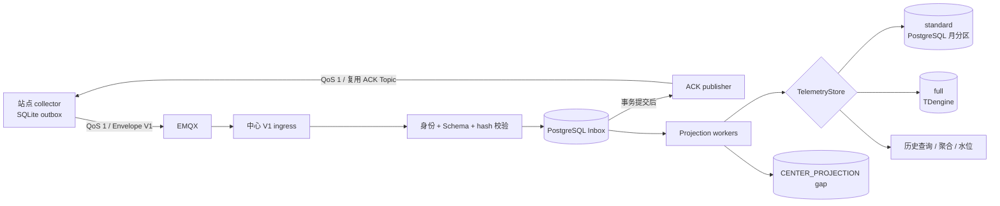
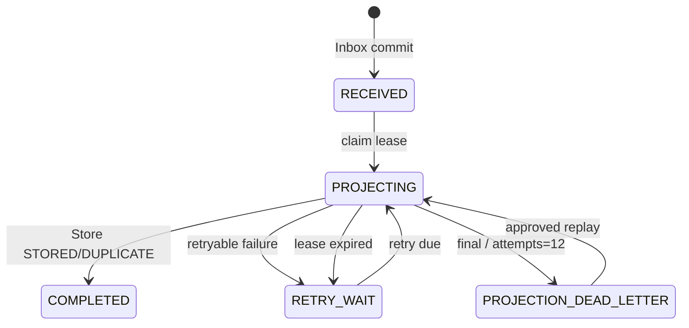

# TD-003：遥测 Envelope、中心 Inbox、应用 ACK 与时序投影

> 文档状态：In Review  
> 版本：1.0.3
> 日期：2026-07-31  
> 适用版本：standard / full；mini 不启用电力遥测可靠链路  
> 上游：[SPEC-004 1.4.0](../../规格/电力运维云平台/SPEC-004-遥测质量与断点补传.md)、[ADR-003 遥测 ACK](../../架构决策/电力运维云平台/ADR-003-遥测ACK机制.md)、[ADR-006 分档时序存储](../../架构决策/电力运维云平台/ADR-006-mini-standard时序存储方案.md)、[TD-001 1.0.3](./TD-001-collector与NODE部署契约.md)、[TD-002 1.0.2](./TD-002-SQLite-Outbox与恢复迁移.md)
> 评审处置：[TD-003 技术设计评审报告](../../开发规范/TD-003评审报告.md)（2026-07-31）

## 1. 结论

中心 `iot-sink` 使用 PostgreSQL 可靠 Inbox 接收 collector 的 Envelope V1。每条 MQTT 消息先完成身份、Schema 和字段校验，再以 `(tenant_id, message_id)` 幂等提交 Inbox；只有事务提交后才能发送 `ACCEPTED_DURABLE`，相同 hash 的重复消息返回 `DUPLICATE`。MQTT QoS 1 PUBACK 不能触发边缘删除。

Inbox 通过租约状态机异步投影到统一 `TelemetryStore`：standard 使用 PostgreSQL 月分区表，full 使用 TDengine。两档共用 Envelope、Topic、Inbox、ACK、投影状态机、查询 API 和合同测试，只替换存储适配器与 Capability 配额，禁止重复开发业务链路。

ACK 的含义固定为“中心已经可靠保存原始 envelope，进程重启后仍可恢复”，不代表时序查询、告警、影子或聚合已经更新。投影失败保留完整 Inbox 载荷并重试；达到上限进入 `PROJECTION_DEAD_LETTER`，不能撤销已发送的 durable ACK。

## 2. 范围与非目标

本 TD 冻结：

- Envelope V1、现有属性上报 Topic、QoS、ACK payload、等待超时与错误分类；
- PostgreSQL Inbox Schema、幂等事务、ACK 补发与生命周期；
- 投影租约、重试、死信、补偿及 `CENTER_PROJECTION` 缺口；
- `TelemetryStore` 公共接口和 standard/full 适配器语义；
- 历史查询水位、数据完整状态和 SPEC-004 完整率事实模型；
- legacy 与 `telemetryAckV1` 能力协商。

不在本 TD 冻结：SQLite outbox 内部实现（TD-002）、RTU Poller 和配置发布（TD-001）、WEB 页面布局、告警业务规则内容、物模型模板字段定义（TD-005）。本 TD 只定义投影产生统一事实和质量元数据的可靠边界，不复制设备、站点或物模型主数据。

## 3. 现有实现差距

| 现状 | 风险 | M1 处理 |
|---|---|---|
| 已有 `PROPERTY_UPSTREAM_REPORT` 与 `PROPERTY_DOWNSTREAM_REPORT_ACK` Topic | 可以复用，但 ACK 尚不可靠 | 保持 Topic 不变，增加 V1 codec、Inbox consumer 和 ACK publisher |
| `PropertyDownstreamReportAckListener` 只有 TODO | collector 无法关闭 outbox 状态机 | collector Profile 装配 V1 ACK adapter，旧 listener 保留 legacy 职责 |
| `DeviceDataStorageService` 捕获并吞掉 TDengine/Redis 异常 | 上游可能把失败误判为成功 | V1 路径不调用该服务；改由返回逐条结果的 `TelemetryStoreProjector` |
| 当前 `IotDeviceMessage` 缺少质量、站点、序号和规范时间 | 无法满足 SPEC-004 | V1 使用独立 `TelemetryEnvelopeV1`，不修改旧 DTO 语义 |
| standard Profile 仅把 TDengine 数据源设为 lazy | 没有 PostgreSQL 时序适配器 | 新增 PostgreSQL 分区适配器，standard 禁止 TDengine 例外配置 |
| 没有 Inbox、投影租约、死信和水位 | ACK、恢复和查询状态不可证明 | 新增本 TD 数据模型和管理任务 |

## 4. 组件与事务边界



Inbox 提交与 MQTT ACK 发布不使用跨系统事务。after-commit 立即发布 ACK；若进程在提交后、发布前崩溃，collector 使用原 messageId 重发，中心返回 DUPLICATE。中心另有 ACK reconciliation 扫描器补发未成功 ACK，避免只能依赖边缘重试。

投影不得与 Inbox 接收共事务。PostgreSQL 时序后端可在投影事务内原子写样本和完成标记；TDengine 属于跨库写，必须依赖确定性样本键、租约和重试达到逻辑幂等。

## 5. 模块与部署职责

| 模块/Profile | 职责 | 禁止事项 |
|---|---|---|
| 中心 `iot-sink` | V1 ingress、Inbox、ACK、projector、查询水位、Store adapter 选择 | 不把旧 `DeviceDataStorageService` 结果当 Inbox ACK |
| `iot-sink-api` | Envelope/ACK Schema、`TelemetryStore`、查询与结果 DTO | 不暴露 JDBC、TDengine 表名或 profile 判断 |
| `iot-device` | 设备/站点/测点关系、配置版本与权限事实 | 不直接写时序后端，不复制 Inbox |
| collector `iot-sink` Profile | SQLite outbox、发送、ACK adapter | 不连接中心 PostgreSQL/TDengine，不加载中心 projector |
| standard Store adapter | PostgreSQL 分区写入、查询和生命周期 | 不加载 TDengine 客户端作为隐藏后端 |
| full Store adapter | TDengine 写入、查询和生命周期 | 不自动无限降级写入 PostgreSQL |

中心 Inbox 表归 `iot-sink` 所有，使用 PostgreSQL 独立 schema `iot_sink` 和最小权限账号。若当前部署暂时复用 `iot-device` 数据库实例，也不得使用 `iot-device` Mapper 越权操作这些表；后续拆库不改变 API 或 Topic。

## 6. Envelope V1 线上契约

线上 payload 是 TD-002 已持久化的 canonical JSON 原字节，最大 64 KiB、UTF-8、无 BOM，不能由发送器重新序列化：

```json
{
  "schemaVersion": "1.0",
  "canonicalizationVersion": "jcs-rfc8785-v1",
  "messageId": "2ca80f25-4b6c-443f-a114-1b3df0a8cdf9",
  "requestId": "a9afddc7-02ee-4df3-905b-ec3e4107f25d",
  "tenantId": "1001",
  "siteCode": "plant-a",
  "deviceIdentification": "meter-01",
  "propertyCode": "active-energy-import",
  "value": "12345.67",
  "valueEncoding": "decimal-string",
  "quality": "GOOD",
  "dataPriority": "METERING_TOTAL",
  "collectedAt": "2026-07-30T10:30:00.123+08:00",
  "sentAt": "2026-07-30T10:30:00.456+08:00",
  "sequence": 182731,
  "source": "modbus-rtu",
  "configVersion": 5
}
```

M1 规则：

- `schemaVersion=1.0`、`canonicalizationVersion=jcs-rfc8785-v1`；未知主版本最终拒绝，未知兼容可选字段忽略并保留原 payload。
- 新 messageId/requestId 使用 canonical UUID；兼容期 messageId 也接受 32 位小写无连字符 UUID，requestId 仍必须 canonical。中心保留原 wire messageId 供 ACK 回显，并把 32/36 位形式解析为同一内部 UUID 幂等键；不得改写原 payload 或 hash。messageId 是业务幂等键，requestId 是稳定 ACK 关联键，重试均不变化。
- tenantId 必须是十进制字符串；siteCode 非空；Topic 中设备身份、MQTT 认证上下文、payload 租户/站点/设备必须一致。
- `valueEncoding` M1 只接受 `decimal-string`。有效质量必须有规范十进制 value；无效质量可省略 value，禁止补 0。
- sequence/configVersion 为 `0..9007199254740991` 的整数；collectedAt/sentAt 必须带偏移并可归一为 UTC。
- 中心重新执行 JCS 后的规范字节必须与 MQTT 实际 payload 逐字节一致，否则视为非 canonical；随后对实际字节计算 SHA-256 并存入 Inbox，用于重复内容比较。不把 hash 放进被自身哈希的 Envelope，也不对字符串额外 Unicode 规范化。

## 7. MQTT Topic、QoS 与会话

复用已有 Topic，不创建电力专用平行 Topic：

| 方向 | Topic | QoS | retain |
|---|---|---:|---|
| collector → center | `/iot/{productIdentification}/{deviceIdentification}/property/upstream/report` | 1 | false |
| center → collector | `/iot/{productIdentification}/{deviceIdentification}/property/downstream/report/ack` | 1 | false |

中心使用共享订阅组保证同一发布只由一个 ingress 实例处理；QoS 1 重投由 Inbox 幂等吸收。collector 使用稳定 clientId 和持久会话，ACL 仅允许发布已授权设备的 report Topic、订阅对应 ACK Topic。禁止订阅跨租户通配 Topic。

Topic product/device 只是路由输入，不是授权事实。ingress 必须根据 MQTT client principal 得到 tenant/site/device allowlist，再与 DEVICE 的已发布 collector 配置快照和 payload 交叉校验。设备移站、测点停用或模板升级后到达的 backlog 必须按 envelope `configVersion` 对应的历史快照验证，不能只看当前主数据误拒绝历史有效样本。配置快照尚未同步到 ingress 时返回可重试，明确不存在或签名无效才最终拒绝。Topic、认证 scope 或版本化快照中任一身份不一致均最终拒绝并审计。

### 7.1 历史配置快照查询契约

唯一事实源是 TD-001 `iot-device.iot_collector_config_release` 的 PUBLISHED/APPLIED 不可变记录。`iot-sink` 不对每条遥测同步 RPC，而是在自身 PostgreSQL 保存只读验证副本：

```sql
CREATE TABLE iot_sink.collector_config_snapshot_replica (
  tenant_id VARCHAR(32) NOT NULL,
  workload_id VARCHAR(128) NOT NULL,
  config_version BIGINT NOT NULL,
  site_code VARCHAR(64) NOT NULL,
  schema_version VARCHAR(16) NOT NULL,
  canonicalization_version VARCHAR(32) NOT NULL,
  payload_canonical BYTEA NOT NULL,
  payload_sha256 CHAR(64) NOT NULL,
  release_status VARCHAR(16) NOT NULL,
  published_at TIMESTAMPTZ NOT NULL,
  applied_at TIMESTAMPTZ NOT NULL,
  synced_at TIMESTAMPTZ NOT NULL,
  PRIMARY KEY (tenant_id, workload_id, config_version)
);
```

DEVICE 在 Agent 回报 APPLIED 的同一事务写配置事件 outbox，提交后发布 `CollectorConfigAppliedV1` 通知副本同步；`iot-sink` 每分钟按 `(tenantId, workloadId, configVersion)` 高水位调用内部只读 API `/internal-api/device/collector-config-releases?appliedAfter=` 对账，修复事件丢失。API 返回 TD-001 原 canonical bytes、hash、状态、publishedAt/appliedAt 和发布身份，使用服务身份认证；副本写入前必须重算 hash、验证 schema/canonicalization 和“曾成功 APPLIED”的证据，不得信任反序列化后重建的 JSON。历史版本后来因新版本切换而标记 ROLLED_BACK 仍可验证其应用期间产生的 backlog；只有 PUBLISHED 但从未 APPLIED 的版本不能产生合法遥测。

ingress 从 MQTT principal 得到 workloadId，以 `(tenantId,workloadId,configVersion)` 查询本地副本，并使用有界 Caffeine cache：成功项最多 10000 个、按权重不超过 128 MiB，因快照不可变可保留到进程重启；NOT_FOUND 负缓存 30 秒。缓存值包含 siteCode、deviceIdentification、propertyCode、dataPriority 和快照 hash，不保存 secret。容量值为首轮候选，须按最大历史补传跨度压测。

本地副本缺失时异步触发定点拉取并返回 `REJECTED_RETRYABLE/CONFIG_VERSION_NOT_READY`，绝不回退当前主数据。连续 5 分钟缺失产生同步告警，但 DEVICE 不可达期间仍保持 retryable；只有 DEVICE 权威响应 NOT_FOUND/NEVER_APPLIED，且其该 workload 已应用高水位不小于请求版本，或快照签名/hash 明确无效，才返回 `REJECTED_FINAL/CONFIG_VERSION_INVALID`。历史副本至少保留到关联 Inbox/边缘最大补传窗口结束，清理必须先预览引用数。

发送调度首轮候选参数：每次从 TD-002 claim 最多 100 条或 4 MiB，每条 envelope 单独 MQTT publish；每 collector 默认最多 500 条 IN_FLIGHT、发布并发 32。应用 ACK deadline 固定 5 分钟，与 TD-002 默认租约相等；连接失败或 publish 明确失败可提前回到 PENDING。参数必须通过 standard 上限和 full 候选规模压测后冻结，但不得改变每消息 ACK 语义。

## 8. 校验顺序与稳定拒绝码

校验顺序：payload 大小/UTF-8 → 可提取关联 ID → MQTT 身份与 Topic → schema/canonicalization → 必填字段/类型 → tenant/site/device/property 关系 → 时间/数值/质量 → hash → Inbox 事务。schemaVersion 或 canonicalizationVersion 缺失、null、空字符串或纯空白均按 `REJECTED_FINAL/SCHEMA_UNSUPPORTED`，不得当作可选字段、默认当前版本或进入 legacy 路径。

ACK 使用整数 `code` 保持旧消费者可读取，并增加稳定字符串 `reasonCode`：

| status | code | reasonCode | 重试 |
|---|---:|---|---|
| ACCEPTED_DURABLE | 0 | OK | 否 |
| DUPLICATE | 1001 | DUPLICATE | 否 |
| REJECTED_RETRYABLE | 2001 | CENTER_BUSY | 是 |
| REJECTED_RETRYABLE | 2002 | INBOX_DB_UNAVAILABLE | 是 |
| REJECTED_RETRYABLE | 2003 | RATE_LIMITED | 是 |
| REJECTED_RETRYABLE | 2004 | CONFIG_VERSION_NOT_READY | 是 |
| REJECTED_FINAL | 4001 | MALFORMED_ENVELOPE | 否 |
| REJECTED_FINAL | 4002 | SCHEMA_UNSUPPORTED | 否 |
| REJECTED_FINAL | 4003 | NON_CANONICAL_PAYLOAD | 否 |
| REJECTED_FINAL | 4004 | TENANT_MISMATCH | 否 |
| REJECTED_FINAL | 4005 | SITE_MISMATCH | 否 |
| REJECTED_FINAL | 4006 | DEVICE_NOT_FOUND | 否 |
| REJECTED_FINAL | 4007 | PROPERTY_NOT_FOUND | 否 |
| REJECTED_FINAL | 4008 | UNAUTHORIZED | 否 |
| REJECTED_FINAL | 4009 | VALUE_FORMAT_INVALID | 否 |
| REJECTED_FINAL | 4010 | MESSAGE_ID_COLLISION | 否 |
| REJECTED_FINAL | 4011 | TOPIC_IDENTITY_MISMATCH | 否 |
| REJECTED_FINAL | 4012 | CONFIG_VERSION_INVALID | 否 |

能可靠提取且通过认证的 messageId/requestId 才能发送拒绝 ACK；完全畸形或未认证 payload 只丢弃、计安全指标并限速，不能向攻击者反射任意 ACK。`telemetry_ingress_rejection` 与 Inbox 位于同一 `iot_sink` PostgreSQL 可靠边界，不另设低可用“审计库”。最终拒绝必须先提交拒绝审计；PostgreSQL 不可用时所有 ACCEPTED/FINAL 判定都不可持久化，只能限频返回 RETRYABLE 或等待 QoS 重投，禁止发送 `audit_pending` FINAL 后再补证据。

为防故障放大，ingress 使用有界 TTL 负缓存保存“已完成无副作用校验但审计提交失败”的摘要，key 为 `(principalId,messageId,contentSha256,reasonCode)`，默认最多 100000 项/64 MiB、TTL 5 分钟；命中时跳过重复 Schema/主数据计算，并按 collector 退避窗口最多返回一次 RETRYABLE。缓存不保存 payload、不替代审计、进程重启可丢失，满时按最早过期淘汰并启动 principal/topic 速率限制。指标暴露 `rejection_audit_commit_failure_total/negative_cache_size/retry_ack_suppressed_total`；数据库恢复后下一次重投必须先落审计再发送 FINAL。这样审计故障不会生成无证据死信，也不会让重复无效报文无上限占用校验资源。

## 9. ACK V1

```json
{
  "schemaVersion": "1.0",
  "messageId": "2ca80f25-4b6c-443f-a114-1b3df0a8cdf9",
  "requestId": "a9afddc7-02ee-4df3-905b-ec3e4107f25d",
  "status": "ACCEPTED_DURABLE",
  "code": 0,
  "reasonCode": "OK",
  "persistedAt": "2026-07-30T03:00:00.123Z"
}
```

- persistedAt 是 Inbox 首次提交时间；DUPLICATE 重放仍返回原 persistedAt。ACK 的 messageId 精确回显首次入库的 wire 形式，确保旧 32 位 collector 能匹配。
- ACK 不回显 payload、value、内部异常、数据库键或节点地址。
- collector 必须同时匹配 messageId、requestId、Topic 设备身份和 schemaVersion；不匹配按 TD-002 未知 ACK 处理。
- ACCEPTED_DURABLE/DUPLICATE 才能使边缘 ACKED；中心投影状态不进入 ACK payload。
- ACK publisher after-commit 立即发送；每 10 秒扫描 `ack_sent_at IS NULL` 的已接收记录，每批最多 1000 条。重复 ACK 安全。

## 10. PostgreSQL Inbox Schema

```sql
CREATE SCHEMA IF NOT EXISTS iot_sink;

CREATE TABLE iot_sink.telemetry_inbox (
  id BIGSERIAL PRIMARY KEY,
  tenant_id VARCHAR(32) NOT NULL,
  message_id UUID NOT NULL,
  message_id_wire VARCHAR(36) NOT NULL,
  request_id UUID NOT NULL,
  schema_version VARCHAR(16) NOT NULL,
  canonicalization_version VARCHAR(32) NOT NULL,
  content_sha256 CHAR(64) NOT NULL,
  payload BYTEA,
  workload_id VARCHAR(128) NOT NULL,
  site_code VARCHAR(64) NOT NULL,
  device_identification VARCHAR(128) NOT NULL,
  property_code VARCHAR(128) NOT NULL,
  collected_at TIMESTAMPTZ NOT NULL,
  sequence_no BIGINT NOT NULL CHECK (sequence_no >= 0),
  data_priority VARCHAR(32) NOT NULL CHECK (data_priority IN
    ('SAFETY','ALARM','METERING_TOTAL','CONTROL_FEEDBACK','NORMAL_TELEMETRY')),
  config_version BIGINT NOT NULL CHECK (config_version >= 0),
  projection_state VARCHAR(32) NOT NULL CHECK (projection_state IN
    ('RECEIVED','PROJECTING','RETRY_WAIT','COMPLETED','PROJECTION_DEAD_LETTER')),
  projection_attempts INTEGER NOT NULL DEFAULT 0,
  next_retry_at TIMESTAMPTZ,
  lease_owner VARCHAR(128),
  lease_deadline TIMESTAMPTZ,
  last_error_code VARCHAR(64),
  last_error_summary VARCHAR(512),
  received_at TIMESTAMPTZ NOT NULL,
  persisted_at TIMESTAMPTZ NOT NULL,
  projected_at TIMESTAMPTZ,
  ack_sent_at TIMESTAMPTZ,
  ack_attempts INTEGER NOT NULL DEFAULT 0,
  payload_purged_at TIMESTAMPTZ,
  CONSTRAINT uq_inbox_tenant_message UNIQUE (tenant_id, message_id)
);

CREATE INDEX idx_inbox_projection
  ON iot_sink.telemetry_inbox
  (projection_state, next_retry_at, data_priority, received_at, id);
CREATE INDEX idx_inbox_lease
  ON iot_sink.telemetry_inbox(projection_state, lease_deadline);
CREATE INDEX idx_inbox_ack
  ON iot_sink.telemetry_inbox(ack_sent_at, persisted_at)
  WHERE ack_sent_at IS NULL;
CREATE INDEX idx_inbox_scope_time
  ON iot_sink.telemetry_inbox
  (tenant_id, site_code, device_identification, collected_at);

CREATE TABLE iot_sink.telemetry_ingress_rejection (
  id BIGSERIAL PRIMARY KEY,
  tenant_id VARCHAR(32),
  message_id VARCHAR(64),
  request_id VARCHAR(64),
  reason_code VARCHAR(64) NOT NULL,
  topic_fingerprint CHAR(64) NOT NULL,
  payload_sha256 CHAR(64),
  rejected_at TIMESTAMPTZ NOT NULL,
  principal_id VARCHAR(128) NOT NULL,
  detail_summary VARCHAR(512)
);
```

payload 保存原始 canonical bytes，不以 JSONB 替代；解析列用于索引和校验。数据库 CHECK、Migration 和 Java enum 必须同版本更新。`telemetry_ingress_rejection` 默认保留 90 天，安全事件调查或合规 hold 可延长；清理必须保留按 reason/principal/time 的聚合审计，不能保存完整恶意 payload。

## 11. Inbox 幂等事务

单消息处理：

1. 完成第 8 节无副作用校验并计算 hash；若 messageId 为 32 位小写 hex，仅生成内部带连字符 UUID，payload、message_id_wire 和 hash 保持原值；
2. `INSERT ... ON CONFLICT (tenant_id,message_id) DO NOTHING`；
3. 插入成功：状态 RECEIVED，提交后发布 ACCEPTED_DURABLE；
4. 冲突：锁定既有行并比较 requestId/hash/身份/wire messageId；完全一致返回 DUPLICATE；同内部 UUID 但 wire 形式或 hash 被改写按 collision 处理；
5. 同 tenant/messageId 但 hash 或身份不同：写拒绝审计并返回 FINAL/MESSAGE_ID_COLLISION；不得覆盖旧 payload；
6. DB 事务失败：不发送成功 ACK，返回 RETRYABLE 或依赖 QoS 重投。

Inbox 事务不得同步调用 TDengine、Redis、影子、告警或业务规则。重复消息不得创建第二个投影作业，也不得重复产生告警。多租户唯一约束包含 tenantId；但 MQTT principal 与 payload tenant 不一致在入库前拒绝，不能利用相同 messageId 跨租户探测数据。

## 12. 投影状态机与租约



worker 使用 `FOR UPDATE SKIP LOCKED` claim，单批最多 500 条，默认租约 2 分钟。网络调用前先提交 PROJECTING 和 lease；默认每 30 秒续期一次，每次把 deadline 延至当前时间后 2 分钟，单次投影最多续期 10 次。续期 SQL 必须同时匹配 messageId、PROJECTING、lease_owner 和原 deadline；续期失败的 worker 立即停止后续状态写入，不主动释放不属于自己的 lease，由回收器在过期后转 RETRY_WAIT。正常批次必须设计为 2 分钟内完成，连续续期接近上限即告警；参数为首轮候选，按 Store P99 冻结。

默认指数退避 12 次，full jitter 基础 1 秒、最大 30 分钟。明确的 schema/权限/身份问题不应进入 projector；Store 可恢复依赖失败进入 RETRY_WAIT，不可修复的 adapter 契约错误直接死信。attempts 按 messageId 投影尝试独立计数。

Store 返回 STORED 或 DUPLICATE 都可转 COMPLETED。更新完成状态前再次校验 lease_owner，失去租约的旧 worker 不能覆盖新状态。DEAD_LETTER 人工重放必须记录审批、范围、原因、原/新 attempts；成功后关闭告警但保留历史审计。

投影完成事务同时写 `telemetry_projection_event_outbox`，唯一键为 `(tenant_id,message_id,event_type)`。Kafka/本地事件发布器据此驱动设备影子、实时告警和聚合，发布成功后批量清理；消费者仍按 messageId 幂等。禁止 projector 在 Store 写入前直接调用旧影子/告警服务，否则崩溃重试会重复产生业务副作用。full 跨库场景先确认 Store 返回 STORED/DUPLICATE，再在 PostgreSQL 事务写 COMPLETED 和事件 outbox；崩溃窗口由 Store 第二层幂等吸收。

### 12.1 投影事件 Outbox

M1 只发布一个领域事实 `TELEMETRY_PROJECTED_V1`，影子、告警和聚合各自订阅，禁止按消费者复制三类 outbox 行：

```sql
CREATE TABLE iot_sink.telemetry_projection_event_outbox (
  id BIGSERIAL PRIMARY KEY,
  tenant_id VARCHAR(32) NOT NULL,
  message_id UUID NOT NULL,
  event_type VARCHAR(48) NOT NULL CHECK
    (event_type IN ('TELEMETRY_PROJECTED_V1')),
  schema_version VARCHAR(16) NOT NULL,
  payload BYTEA NOT NULL,
  content_sha256 CHAR(64) NOT NULL,
  publish_state VARCHAR(16) NOT NULL CHECK
    (publish_state IN ('PENDING','PUBLISHING','PUBLISHED','DEAD_LETTER')),
  attempts INTEGER NOT NULL DEFAULT 0,
  next_retry_at TIMESTAMPTZ,
  lease_owner VARCHAR(128),
  lease_deadline TIMESTAMPTZ,
  created_at TIMESTAMPTZ NOT NULL,
  published_at TIMESTAMPTZ,
  last_error_code VARCHAR(64),
  CONSTRAINT uq_projection_event
    UNIQUE (tenant_id, message_id, event_type)
);

CREATE INDEX idx_projection_event_publish
  ON iot_sink.telemetry_projection_event_outbox
  (publish_state, next_retry_at, created_at, id);
```

event payload 使用版本化 canonical JSON，至少包含 tenant/site/device/property、messageId、collectedAt、quality、dataPriority、Store result 和 configVersion，不包含凭据或完整 Inbox 原文。发布器通过租约 claim，向已配置的 Kafka/本地消息总线执行至少一次发布；进程在发布成功后、标记 PUBLISHED 前崩溃会重复发布，所有消费者必须以 `(tenantId,messageId,eventType)` 幂等。

```mermaid
sequenceDiagram
  participant P as "Projector"
  participant S as "TelemetryStore"
  participant DB as "PostgreSQL"
  participant E as "Event publisher"
  participant K as "Kafka / local bus"
  P->>S: appendBatch
  S-->>P: STORED / DUPLICATE
  P->>DB: BEGIN; Inbox COMPLETED + event outbox PENDING; COMMIT
  E->>DB: claim PENDING lease
  E->>K: publish TELEMETRY_PROJECTED_V1
  K-->>E: accepted
  E->>DB: mark PUBLISHED
```

默认重试 12 次、full jitter 最大 30 分钟，达到上限转 DEAD_LETTER 并告警，载荷不自动删除；修复后可审批重放。PUBLISHED 保留 24 小时后每 10 秒或累计 1000 条批量清理，单批最多 1000；只有消息总线确认接受后才能标记 PUBLISHED。状态、租约、重试、清理和消费者幂等必须纳入合同测试。

## 13. TelemetryStore 公共契约

沿用 ADR-006 锚点并细化逐条结果：

```java
interface TelemetryStore {
    WriteBatchResult appendBatch(List<TelemetrySample> samples);
    Optional<TelemetrySample> latest(TelemetryQuery query);
    PageResult<TelemetrySample> queryRaw(TelemetryQuery query, PageRequest page);
    List<TelemetryAggregate> aggregate(AggregateQuery query);
    StoreWatermark watermark(TenantSiteScope scope);
}

record WriteItemResult(
    String messageId,
    WriteStatus status,       // STORED, DUPLICATE, RETRYABLE_FAILED, FINAL_FAILED
    String errorCode
) {}
```

appendBatch 不抛出“整批成功”假象；每个输入必须有结果。业务模块只依赖接口，profile 选择在 Spring 装配层完成。架构测试禁止业务 service 注入 JdbcTemplate、TDengine client 或根据 `standard/full` 分支。

统一逻辑样本键为 `(tenantId,messageId)`；`TelemetrySample` 同时携带 Inbox `contentSha256`，用于第二层区分合法重复与 ID collision。查询排序使用 `(collectedAt,sequence,messageId)`。同一采集时间不同 messageId/value 必须保留冲突事实，不能静默覆盖。

## 14. standard PostgreSQL 时序模型

```sql
CREATE TABLE iot_sink.telemetry_sample_identity (
  tenant_id VARCHAR(32) NOT NULL,
  message_id UUID NOT NULL,
  content_sha256 CHAR(64) NOT NULL,
  collected_at TIMESTAMPTZ NOT NULL,
  created_at TIMESTAMPTZ NOT NULL,
  PRIMARY KEY (tenant_id, message_id)
);

CREATE TABLE iot_sink.telemetry_sample (
  tenant_id VARCHAR(32) NOT NULL,
  message_id UUID NOT NULL,
  site_code VARCHAR(64) NOT NULL,
  device_identification VARCHAR(128) NOT NULL,
  property_code VARCHAR(128) NOT NULL,
  value_text TEXT,
  value_numeric NUMERIC,
  value_present BOOLEAN NOT NULL,
  quality VARCHAR(32) NOT NULL,
  collected_at TIMESTAMPTZ NOT NULL,
  original_offset VARCHAR(8) NOT NULL,
  received_at TIMESTAMPTZ NOT NULL,
  sequence_no BIGINT NOT NULL,
  source VARCHAR(64) NOT NULL,
  config_version BIGINT NOT NULL,
  PRIMARY KEY (tenant_id, message_id, collected_at)
) PARTITION BY RANGE (collected_at);

CREATE INDEX idx_sample_history
  ON iot_sink.telemetry_sample
  (tenant_id, device_identification, property_code, collected_at DESC);
```

每月分区由受控任务提前创建。adapter 在同一 PostgreSQL 事务写 identity 和对应分区样本：identity 冲突且 content_sha256 一致返回 DUPLICATE；不同 hash 返回 FINAL_FAILED/MESSAGE_ID_COLLISION。`value_numeric` 由规范十进制字符串直接构造，不能经 Double；无效值保持 value_present=false、value_text/value_numeric NULL。

V1 事实时间精度固定为毫秒：RFC 3339 小数秒最多 3 位，解析后必须与 TD-002 `collected_at_ms` 完全往返。PostgreSQL TIMESTAMPTZ 虽支持微秒，adapter 写入前按 UTC 毫秒构造，不补充或推断微秒；原偏移单独保留。排序、水位、乱序窗口和跨后端合同都使用 `(epochMillis, sequence, messageId)`，不得因数据库额外精度改变顺序。

standard 准入沿用 ADR-006：500 万条/日、持续 100 条/秒、60 秒峰值 500 条/秒、单批 500、原始查询最多 100000 条/31 天、默认保留 30 天。达到 70% 磁盘告警、85% 停止新增高频点表发布，但已经可靠接收的 Inbox 仍按保护流程处理，不能静默丢弃。

## 15. full TDengine 适配器

full adapter 把 tenant/site/device/property 作为受校验的 tag/列映射，保留 messageId、sequence、value_text、quality、collectedAt、receivedAt、original_offset 和 configVersion。物理表名只能由内部稳定 ID 生成，不能拼接外部编码。

adapter 必须提供确定性逻辑样本键，并通过“写成功后进程崩溃、Inbox 未标 COMPLETED、随后重试”合同测试。可采用目标 TDengine 版本已验证的主键/upsert 能力或带 messageId 的确定性写入布局；不得只依赖 worker 恰好执行一次。具体 DDL、驱动版本和重复写行为必须在实现 Spike 后作为本 TD 冻结附件，未提供证据前 full 投影不得标记 Approved。

TDengine 不可用时 Inbox 保留并重试。M1 明确不提供 PostgreSQL 应急 Store 开关，无论自动或人工审批都不能把 full 实时投影改写到 PostgreSQL，从而避免形成第二事实源。未来若业务恢复目标证明必须提供应急 Store，须新增 ADR/TD，冻结独立 Capability、最长时长、最大条数、查询路由、按 messageId 回迁和对账后方可实现；不得通过配置热键提前预留隐藏路径。

## 16. 投影缺口、对账与补偿

进入 PROJECTION_DEAD_LETTER 时写统一 gap：`stage=CENTER_PROJECTION`、tenant/site/device/property、messageId、collectedAt、reason、attempts、backend、createdAt。该 gap 表示查询投影滞后，不表示中心原始 payload 丢失，不得与 TD-002 `EDGE_DELIVERY` 重复计数。

```sql
CREATE TABLE iot_sink.telemetry_gap_record (
  gap_id UUID PRIMARY KEY,
  dedup_key CHAR(64) NOT NULL UNIQUE,
  report_message_id UUID,
  report_request_id UUID,
  report_payload BYTEA,
  report_content_sha256 CHAR(64),
  tenant_id VARCHAR(32) NOT NULL,
  stage VARCHAR(32) NOT NULL CHECK
    (stage IN ('EDGE_DELIVERY','CENTER_PROJECTION')),
  site_code VARCHAR(64) NOT NULL,
  device_identification VARCHAR(128) NOT NULL,
  property_code VARCHAR(128) NOT NULL,
  message_id UUID,
  sequence_start BIGINT,
  sequence_end BIGINT,
  collected_start TIMESTAMPTZ,
  collected_end TIMESTAMPTZ,
  sample_count BIGINT NOT NULL CHECK (sample_count > 0),
  reason_code VARCHAR(64) NOT NULL,
  status VARCHAR(16) NOT NULL CHECK (status IN ('OPEN','RESOLVED')),
  source_ref VARCHAR(256) NOT NULL,
  created_at TIMESTAMPTZ NOT NULL,
  resolved_at TIMESTAMPTZ,
  resolution_code VARCHAR(64),
  CONSTRAINT uq_gap_report_message
    UNIQUE (tenant_id, report_message_id)
);
```

中心表命名为 `telemetry_gap_record`，专指跨节点汇总后的缺口事实；TD-002 SQLite `telemetry_gap` 是边缘待报告队列。运维脚本必须同时写明数据库类型和完整限定名，禁止按裸表名执行迁移或清理。

TD-002 本地 EDGE_DELIVERY gap 通过已有 `EVENT_UPSTREAM_REPORT` 的 identifier `telemetry-gap`、QoS 1 上报，ACK 复用 `EVENT_DOWNSTREAM_REPORT_ACK`；不新建平行 MQTT Topic。`TelemetryGapReportV1` 使用独立 report messageId/requestId 并携带原 gapId/dedupKey，中心以 dedupKey 提交上述表后才返回 ACCEPTED_DURABLE/DUPLICATE，本地收到匹配 ACK 后设置 reported_at。gap ACK 丢失时重发同一报告 ID；中心不得把 gap report 当普通遥测投影。

### 16.1 Gap Report V1

```json
{
  "schemaVersion": "1.0",
  "canonicalizationVersion": "jcs-rfc8785-v1",
  "eventType": "telemetry-gap",
  "messageId": "7bd36db9-37ad-418e-8d96-71cefc1e7d3c",
  "requestId": "16532b09-0b31-43c4-9f48-8bc925dbaf34",
  "gapId": "5241abdd-95e3-4bf4-ab59-0e71a1b63dc8",
  "dedupKey": "aaaaaaaaaaaaaaaaaaaaaaaaaaaaaaaaaaaaaaaaaaaaaaaaaaaaaaaaaaaaaaaa",
  "tenantId": "1001",
  "siteCode": "plant-a",
  "deviceIdentification": "meter-01",
  "propertyCode": "active-energy-import",
  "stage": "EDGE_DELIVERY",
  "reasonCode": "CAPACITY_EVICTION",
  "sequenceStart": 182700,
  "sequenceEnd": 182730,
  "sampleCount": 31,
  "collectedStart": "2026-07-30T10:27:30.000+08:00",
  "collectedEnd": "2026-07-30T10:30:00.000+08:00",
  "configVersion": 5,
  "createdAt": "2026-07-30T10:31:00.000+08:00"
}
```

该 payload 使用与遥测相同的 JCS 规则、64 KiB 上限和 UUID/tenant/site 身份校验，stage 在线上只允许 EDGE_DELIVERY；report messageId/requestId 对一次 gap 报告稳定，gapId/dedupKey 对原缺口稳定。中心必须按 TD-002 v1 canonical tuple 从字段重新计算 dedupKey，不能信任上报值；不匹配时 FINAL/MALFORMED_ENVELOPE。专用 `GapIngressV1` 直接以验证后的 dedupKey 幂等提交 `telemetry_gap_record`，保存原 canonical report_payload 和自行计算的 hash，不进入 telemetry_inbox、不创建时序投影。提交后 ACK 使用第 9 节 status/code 结构并通过事件 ACK Topic 返回；同 dedupKey 同 hash 为 DUPLICATE，不同 hash 为 FINAL/MESSAGE_ID_COLLISION。

projector 状态更新、CENTER_PROJECTION gap 和告警事件 outbox 在 PostgreSQL 同一事务提交；外部告警发送异步。影响 SAFETY 或积压接近保护水位时为紧急，其余默认重要。EDGE_DELIVERY 只由经过上述可靠 gap report 接收的边缘事实生成，CENTER_PROJECTION 只由中心 projector 生成；`stage` 必须进入 dedup tuple，禁止跨阶段合并。

每小时至少扫描一次“已 ACK 但未 COMPLETED”记录，支持人工立即触发。对账比较 Inbox RECEIVED/RETRY/DEAD 数、Store 水位、按租户/站点/测点分层的条数/hash/质量分布；修复后按消息、设备、站点或时间范围重放。补偿任务使用独立限速，实时投影优先。

## 17. Inbox 与时序生命周期

- COMPLETED 后原 payload 默认保留 7 天；到期且 Store 水位、对账和 ACK 状态正常时，可把 payload 清空并记录 payload_purged_at，保留幂等元数据。
- 未完成、RETRY_WAIT、PROJECTING、PROJECTION_DEAD_LETTER 记录不得按期限清理。
- 精简元数据默认保留期：standard 90 天、full 400 天；到期删除前必须确认目标 Store 保留范围已结束或第二层幂等仍可证明。合规策略可延长。
- 清理每批最多 1000 行；水位落后、对账失败、迁移或恢复期间自动暂停相关 scope 清理。
- 时序事实生命周期只由 `TelemetryLifecycleManager` 按预览、审批、执行、结果、审计管理；普通 `TelemetryStore` 不提供任意删除。

若精简元数据过期后再次收到极晚重复消息，可以重新进入 Inbox，但 TelemetryStore 第二层确定性键仍必须返回 DUPLICATE，不能产生第二个逻辑样本或告警。

中心 PostgreSQL 卷必须为 Inbox/事务/WAL 预留紧急空间；它是禁止普通查询、导出和临时文件占用的保留量，不是额外写入配额。首轮候选为 standard `clamp(2 GiB, 卷容量10%, 10 GiB)`、full `clamp(10 GiB, 卷容量10%, 50 GiB)`，由同一配置模型按 Capability 注入并在安装时校验。70% 告警，85% 停止新增高频点表发布并提升 projector/清理资源，90% critical 并限制非实时查询/导出，95% 时 ingress 在写事务前返回 `REJECTED_RETRYABLE/CENTER_BUSY`，由边缘 outbox 承接；不能先返回 ACCEPTED 再删除载荷。已提交 Inbox、未完成投影、死信和 SAFETY 数据不得为腾空间静默删除。阈值可经容量评审收紧，放宽必须重新压测并审计。

## 18. 查询、水位与数据状态

历史查询响应必须附带：

```json
{
  "dataStatus": "COMPLETE",
  "projectionWatermark": "2026-07-30T03:00:00.000Z",
  "projectionLagSeconds": 2,
  "lastCompletedAt": "2026-07-30T03:00:02.000Z"
}
```

dataStatus 枚举：`COMPLETE/PROJECTING/DEGRADED/UNKNOWN`。有 Inbox 积压时返回 PROJECTING 或 DEGRADED，不能说“原始数据丢失”；普通滞后响应仍为业务成功 HTTP 200，不使用 HTTP 206。权限、测点数、时间跨度、结果条数和导出配额在进入 adapter 前统一校验。

watermark 按 tenant/site scope 表示连续完成的 receivedAt 水位，不能简单取最大 projectedAt；水位之前存在 RETRY/DEAD 时不得前移。full/standard adapter 必须通过相同分页、质量过滤、跨月/迟到、时区和水位合同测试。

水位游标保存 `(tenant_id,site_code,watermark_received_at,watermark_inbox_id,row_version)`。推进任务从当前 `(received_at,id)` 之后按同一顺序最多读取 1000 行：连续 COMPLETED 则把候选游标推进到最后一行；遇到 RECEIVED、PROJECTING、RETRY_WAIT 或 PROJECTION_DEAD_LETTER 立即停止，CAS 更新 row_version。不存在行时水位保持不变并另报队列为空；payload 已清理但状态仍 COMPLETED 的行可推进。投影完成和死信重放成功会触发 scope 即时推进，另每分钟全量补扫活跃 scope。水位表不得越过 gap，DEAD_LETTER 会一直阻断直到修复或经审计形成明确的数据状态版本。

## 19. 完整率、迟到与封账事实

数据质量使用版本化策略，不在查询时临时猜测：

- `telemetry_quality_policy` 保存 acceptedQuality、乱序窗口、迟到宽限、测点/策略版本和生效区间；默认乱序窗口 5 分钟，日统计宽限 24 小时。
- 固定周期 `应采集数` 按采样策略锚点与 `[start,end)`、测点有效期、启用时段交集生成；只扣除 TD-001 已批准维护窗口，通信/进程/网络故障不扣除。
- `有效采样数` 按计划槽去重，重复 messageId、补传或同槽多条只计一次；GOOD 默认有效，BACKFILLED 在封账前有效，MANUAL_CORRECTION 需审批策略。
- 结果保存 expected/valid/invalid/missing/late/correction、rate、policyVersion、calculationDetailHash。expected=0 时 rate 为 NULL、status=N/A；否则 `valid/expected×100%` 保留两位。
- 封账生成不可变 resultVersion；封账后迟到只记录影响。重开必须审批并创建新版本、previousVersion、差异和原因，不原地覆盖。
- 变化上报、事件触发和任务型冻结值只使用各自已发布的期望策略；无法计算基数时返回 N/A。

完整率聚合只消费 COMPLETED Store 事实和明确 gap/计划槽。CENTER_PROJECTION 只表示暂未投影，不能在原 payload 仍存在时直接记作永久缺失；EDGE_DELIVERY gap 才表示中心未可靠收到的不可恢复缺口。

## 20. 能力协商与混合版本

中心 Capability Manifest 暴露 `telemetryAckV1`、`telemetryGapV1`、支持的 envelope/ACK schema、canonicalizationVersion、最大 payload、ACK deadline 和 Store profile。collector 发布配置前必须确认这些值与 TD-002 兼容；未协商 telemetryGapV1 时本地 gap 保持未报告并告警，禁止标记 reported_at。

同一旧 Topic 上由 schemaVersion 路由：V1 进入可靠 Inbox；没有 V1 标识的旧 `IotDeviceMessage` 继续 legacy 路径并在平台显示“不具备可靠补传”。V1 collector 未协商到能力时 `center=FAILED/ACK_CAPABILITY_INCOMPATIBLE`，阻止启用可靠配置。经审批 legacy 模式必须显示数据风险、限定范围和期限，禁止静默降级。

能力协商发生在配置发布预检和 collector 启动前，成功结果带中心 capabilityVersion/expiry 并缓存；默认每 60 秒加 jitter 刷新。首次不兼容时不启动 Poller/发送器，平台显示“不具备可靠补传”，指标 `ack_capability_incompatible_total` 和配置应用结果记录双方版本。运行中能力过期或变为不兼容时停止 claim 新 PENDING，保留 SQLite 数据和现有 IN_FLIGHT 等待 ACK/租约到期，不切 legacy；`center=FAILED` 且每分钟重试拉取。能力恢复后重新校验 Envelope/ACK/gap 参数，自动恢复发送，不重新生成 messageId/requestId。

由于不兼容阶段根本不发送新消息，它不增加 TD-002 per-message `unknown_ack_count`；只有已发送消息收到格式不兼容 ACK 才按 messageId 计数。中心同时按 tenant/site/workload 暴露能力拒绝指标，不使用设备 ID 高基数标签。

Schema 兼容遵循宪法：新增可选字段保留 1.x；删除、改类型、收紧必填或改变 ACK 语义发布新主版本。消费者先兼容，再双版本运行、对账、切换和下线；CI 必须测试当前与上一主版本及未知可选字段。

## 21. 安全、租户与审计

- MQTT 使用 TLS，节点凭据按 tenant/site/workload 最小权限签发和轮换；ACL 禁止跨租户 wildcard。
- ingress 不信任 payload tenant、site 或 Topic，必须与认证 principal 和 DEVICE 关系交叉校验。
- Inbox payload 属业务数据，PostgreSQL 卷静态加密、备份加密；数据库账号只访问 `iot_sink` 必需表。
- 日志不输出完整 payload/value/token；messageId 只作日志字段，不作指标标签。拒绝摘要最大 512 字节并脱敏。
- 人工重投、死信处置、生命周期清理、应急 Store、迁移、封账重开和策略变更必须记录审批、操作者、scope、前后版本、行数/hash 和结果。

## 22. 指标与健康

指标至少包含 ingress 接收/接受/重复/重试拒绝/最终拒绝、Inbox 事务延迟、ACK 延迟/补发/失败、各投影状态条数与最老年龄、租约过期、Store 逐条结果、重试/死信/gap、payload 和元数据容量、清理、watermark/lag、查询配额拒绝、完整率重算与封账。

中心健康按组件输出 ingress/inbox/ack/projector/store；collector 侧遵循 TD-002：Inbox/ACK 不可用但 outbox 可写为 `center=DEGRADED`，能力不兼容或 outbox 不可写为 FAILED。中心 Store 故障不影响已经提交 Inbox 的 ACK，但使 projector/store DEGRADED 或 FAILED 并产生积压告警。

SLO 候选：中心正常时 Inbox commit + ACK publish P99 <5 秒；投影 P99 lag <30 秒；对账扫描间隔 ≤1 小时。SLO 必须结合 standard/full 准入压测冻结。

## 23. 恢复、升级与 standard→full

- Inbox migration 使用扩展—迁移—收缩；升级前备份，失败恢复旧二进制和兼容 Schema，不清空未完成记录。
- 启动先回收过期 projection lease、启动 ingress/ACK reconciliation，再启动 projector；Store 未就绪时仍可在容量许可内可靠接收并明确积压。
- PostgreSQL 恢复必须对账 Inbox 行数/hash、投影状态、ACK 水位和 Store 水位；恢复时间点后的边缘重发由幂等吸收。
- standard→full 严格执行 ADR-006：记录水位、在线双写、按月限速回灌、自动对账、切读、保留 PostgreSQL 7 天观察、可切回。API、身份、messageId、Topic 和时间语义不变。
- full TDengine 故障按 Inbox 积压和 TDengine 恢复处理；M1 不存在 PostgreSQL 应急 Store。未来能力必须先经新 ADR/TD，不得在运维现场临时创建第二事实源。

## 24. 测试与故障注入

| 类别 | 必测场景 | 通过标准 |
|---|---|---|
| Envelope | 字段乱序、Unicode、边界整数、无效值缺 value、64 KiB、未知字段/版本 | canonical/hash 一致；兼容规则正确 |
| 身份 | tenant/site/topic/device/property 不匹配、跨租户重放 | 入库前拒绝，无信息泄露 |
| 历史快照 | 事件丢失后对账、缓存命中/淘汰、DEVICE 不可达、权威 NOT_FOUND、设备移站后 backlog | 不回退当前主数据；retryable/final 判定正确 |
| Inbox | 并发重复、同 ID 同/异 hash、commit 前后 kill | 单行；正确 ACK；collision 不覆盖 |
| 拒绝审计 | PostgreSQL 不可用、负缓存满、重复无效报文、恢复后补投 | 无无证据 FINAL；限流有效；恢复后先审计 |
| ACK | PUBACK 后中心崩溃、ACK 丢失/重复/迟到/错 requestId | 边缘仅 durable/duplicate 清理，5 分钟契约一致 |
| 投影 | claim/写 Store/完成前后 kill、租约竞争、12 次重试 | 单逻辑样本，无状态倒退 |
| 事件 Outbox | 完成/事件提交、发布前后 kill、重复发布、死信重放和清理 | Store 前无副作用；消费者幂等；载荷可恢复 |
| 缺口 | EDGE_DELIVERY gap 重复上报/ACK 丢失、CENTER_PROJECTION 死信/恢复 | stage 不混算；dedup；reported/resolved 正确 |
| PostgreSQL | 跨月、分区缺失、数值精度、磁盘水位 | 合同结果明确，不吞异常 |
| TDengine | 写成功后崩溃再投影、不可用、超时、回灌重叠 | 确定性幂等；不自动双事实源 |
| 生命周期 | 7 天 payload 清理、未完成保护、水位暂停、极晚重复 | 原始未完成不删；第二层幂等 |
| 查询质量 | 投影滞后、迟到、乱序、封账/重开、expected=0 | 水位诚实；公式和不可变版本正确 |
| 混合版本 | legacy、V1、未知可选字段、上一主版本 | 路由和能力标识正确，不静默降级 |
| 迁移 | standard→full 双写/回灌/切换/回滚 | 条数/hash/聚合/质量对账通过 |

## 25. SPEC-004 追踪矩阵

跨 TD 责任：TD-001 负责采集解释、配置版本和维护窗口（DQ-003/010/012/014/016）；TD-002 负责边缘持久化、补传、容量、EDGE_DELIVERY gap 和 ACK 消费（DQ-001/002/004/005/006/007/009/012/013/014/016/017/020）；TD-003 负责中心可靠接收、第二层幂等、查询/完整率、CENTER_PROJECTION 和稳定 ACK 生产（除纯边缘 DQ-017 外的中心落点）。下表描述 TD-003 落点；标注 TD-002 的行是联合合同边界，不表示复制实现。

| 需求 | 设计落点 | 验证 |
|---|---|---|
| DQ-001 | 第 6、10 节，唯一 ID、时间、质量 | Envelope/Inbox 合同 |
| DQ-002 | 第 11～15 节，两层幂等 | 并发重复/崩溃重投 |
| DQ-003 | 第 6、14 节，无效值保持 NULL+质量 | 无效值 fixture |
| DQ-004 | TD-002；本 TD 中心容量保护 | 联合断网测试 |
| DQ-005 | 第 6、12 节，原 payload/ID/时间/序号 | 补传 hash 对比 |
| DQ-006 | 第 4、9、11 节，Inbox commit 后 ACK | commit/ACK 崩溃点 |
| DQ-007 | TD-002 调度；第 7 节发送参数 | 实时/补传压测 |
| DQ-008 | 第 18、19 节，聚合附完整率与水位 | 查询/聚合合同 |
| DQ-009 | TD-002 EDGE_DELIVERY；第 16 节 CENTER_PROJECTION | 双 stage 去重 |
| DQ-010 | 第 19 节，质量策略版本化 | 策略切换/历史版本 |
| DQ-011 | 第 19 节，valid/expected×100% | 计划槽/维护窗口测试 |
| DQ-012 | 第 6、7、12 节，dataPriority | 投影/容量优先级测试 |
| DQ-013 | 第 6、14、19 节，UTC+原偏移/站点时区 | DST/跨时区测试 |
| DQ-014 | 第 6、14 节，decimal-string→NUMERIC | 高精度往返 |
| DQ-015 | 第 13、18 节，统一查询配额 | 超范围/导出配额测试 |
| DQ-016 | 第 6～8、11 节，tenant 字符串/site 非空关系 | 身份合同测试 |
| DQ-017 | TD-002 单 writer；本 TD 不绕过其端口 | 架构测试 |
| DQ-018 | 第 18、19 节，5 分钟乱序和迟到保存 | 乱序/迟到测试 |
| DQ-019 | 第 19 节，不可变封账与重开版本 | 审批/差异测试 |
| DQ-020 | 第 8、9、11 节，稳定 ACK 分类 | 全错误码/未知码测试 |

## 26. 实现拆分与顺序

1. 在 `iot-sink-api` 增加 Envelope/ACK V1 Schema、codec、fixture 和 `TelemetryStore` 逐条结果合同。
2. 建立 `iot_sink` Migration、配置快照 replica/事件 outbox/对账 API、Inbox repository、身份校验和 ingress；先用 PostgreSQL Testcontainers 验证幂等事务。
3. 实现 after-commit ACK publisher、reconciliation 和 collector V1 ACK adapter，完成 TD-002 联合状态机测试。
4. 实现 projection lease/retry/dead-letter、projection event outbox、GapIngressV1/replay 和 PostgreSQL Store adapter、分区管理。
5. 实现统一查询、水位、生命周期与完整率事实模型。
6. 完成 TDengine 幂等 Spike 后实现 full adapter；没有崩溃重投证据不得合入生产启用。
7. 执行混合版本、standard 准入、full 候选规模、standard→full 迁移和 7 天稳定性测试。

## 27. 评审冻结门禁

TD-003 只有同时满足以下条件才可标记 `Approved / Frozen`：

1. TD-001 1.0.3、TD-002 1.0.2 与本 TD 的配置快照、Envelope、requestId、遥测/gap Topic、ACK deadline、状态映射完全一致；
2. 当前/上一主版本 Schema、32/36 位 messageId、所有 ACK code、身份拒绝、拒绝审计故障和 collision 有自动合同测试；
3. Inbox commit/ACK/投影全部崩溃点证明不丢已确认原始载荷且不产生第二逻辑样本；
4. PostgreSQL 月分区、查询配额、生命周期和 standard 准入压测通过；
5. full TDengine 确定性幂等 DDL/驱动行为有 Spike 和故障重投证据；
6. 投影事件 outbox、Gap Report V1、投影死信、CENTER_PROJECTION gap、告警、对账和人工重放通过运维评审；
7. 完整率、乱序、迟到、封账/重开与维护窗口通过业务验收；
8. standard/full 只替换 Store adapter/配额，公共代码、API、Topic 和 Schema 无分叉。

门禁未完成前保持 In Review。可以实现验证性 Spike 和测试基础设施，但不得把候选并发、SLO 或 TDengine 行为宣称为生产冻结值。

## 28. OPEN03-08A 批量 Store 对齐记录（2026-08-17）

代码核对发现现有 `TelemetryStorePort.writeSample(InboxEnvelope)` 与 §13 已冻结的批量逐条结果合同漂移。为保持兼容并恢复本 TD 事实，Sol 已在 M1-TD001-OPEN03 任务单 §25 冻结 expand→switch→compat 迁移：新增 `appendBatch(List<TelemetrySample>)` 及四状态逐条结果，projector 与 PostgreSQL/TDengine adapter 切到批量主路径，旧单条方法保留一个兼容周期。该包不修改 DDL、Inbox、ACK、Topic、查询或生产开关；完成证据未通过 Sol 复核前，本 TD 继续 `In Review`。

Sol 已于 2026-08-17 验收该迁移及 S1 凭据日志安全收尾：带真实 PostgreSQL 与本地 TDengine 的冻结矩阵 `34/34 PASS`、Skipped=0，测试租户残留 0；日志合同 `2/2 PASS`，TDengine 相关 `7/7 PASS`，认证头/header/wire/带凭据 URL 输出扫描 0 命中。批量 Store 合同漂移已收敛，但本 TD 其余冻结门禁未全部完成，文档状态仍为 `In Review`。
