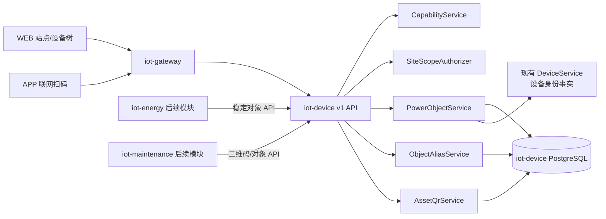
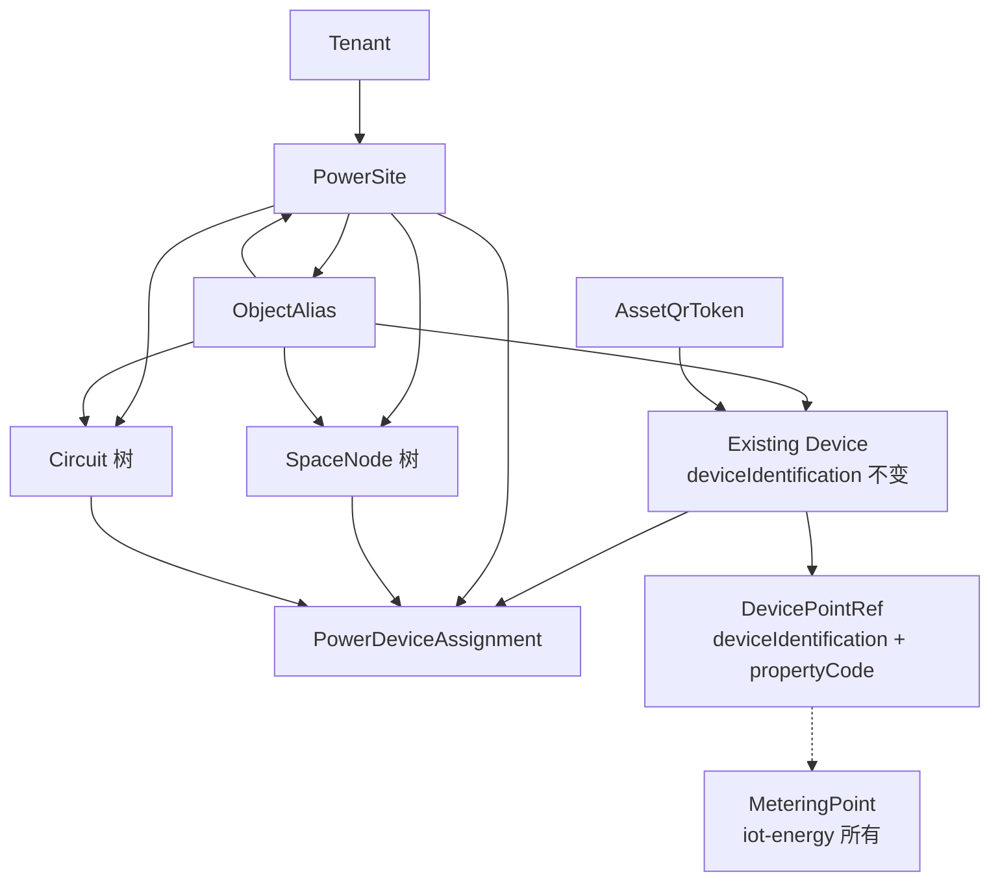
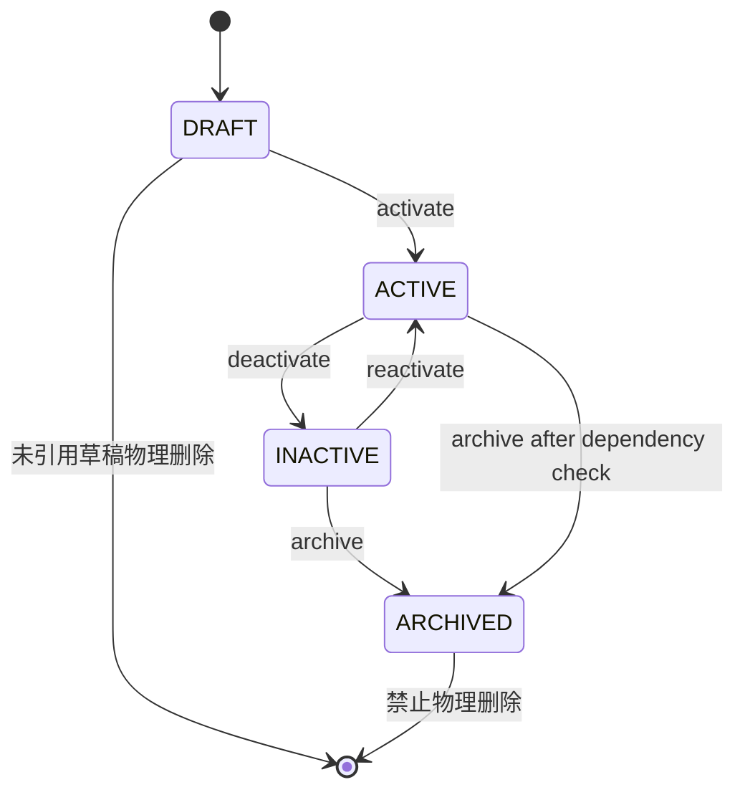
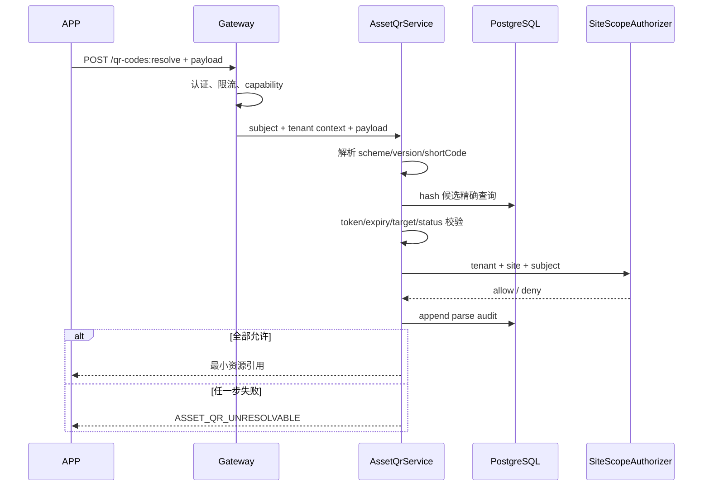

# TD-004：电力对象、别名、二维码与历史设备编码兼容

> 文档状态：In Review  
> 版本：1.0.5
> 日期：2026-08-04  
> 适用版本：standard / full；mini 不创建、签发或解析电力对象与资产二维码  
> 上游：[PRD-01 1.2.0](../../产品需求/电力运维云平台/PRD-01-站点设备与数据采集.md)、[SPEC-001 1.3.0](../../规格/电力运维云平台/SPEC-001-电力对象与测点编码规范.md)、[ADR-004 历史设备编码兼容](../../架构决策/电力运维云平台/ADR-004-历史设备编码兼容策略.md)、[ADR-008 二维码安全解析](../../架构决策/电力运维云平台/ADR-008-二维码安全解析方案.md)、[ADR-011 Capability Manifest](../../架构决策/电力运维云平台/ADR-011-Capability-Manifest规范.md)  
> 下游依赖：TD-005 物模型模板、站点设备树、能源计量点、设备档案、APP 扫码、collector 配置发布
> 评审处置：[TD-004 评审报告](../../开发规范/TD-004评审报告.md)（2026-08-04）

| 版本 | 日期 | 变更 |
|---|---|---|
| 1.0.1 | 2026-08-04 | 处置首次技术设计评审意见，冻结对象、归属、权限、二维码与 collector 查询契约 |
| 1.0.2 | 2026-08-10 | 登记核心五表 V006/U005 评审资产与临时库验证；未对目标实例执行，API、存量导入和全量安装基线继续 OPEN |
| 1.0.3 | 2026-08-10 | 完成 V006 架构/DBA 专项整改：补对象身份与 assignment 历史不可变 trigger、版本化关闭合同及增强反例；最终候选接受并形成目标窗口申请单，仍待 owner 批准 |
| 1.0.4 | 2026-08-10 | owner 明确批准后，V006 已由 runner 自动备份并仅落入本地目标集成实例；history/hash、空表计数、trigger、MIG-009、invalid index 与业务计数验收通过，API/导入/安装基线仍 OPEN |
| 1.0.5 | 2026-08-10 | 落地 `PowerObjectQueryApi`、DTO、tenant-safe JDBC Mapper/Service 与 provider；冻结 READY/NOT_BOUND/INACTIVE、确定性 objectRevision 和三项稳定错误，Java/静态契约 6 项及真实 PG 2 项 PASS，fixture 全回滚 |

## 1. 结论

M1 在 `iot-device` 内新增电力对象控制面，建立站点、空间树、一次回路树和设备当前归属；现有 `device` 仍是设备身份唯一事实源，`deviceIdentification` 原值、大小写、认证、Topic 和历史引用全部保持不变。电力关系通过 `device.id` 关联，并在所有外部契约中返回字符串形式的 canonical `deviceIdentification`。

对象编码创建后不可原地修改。新业务编码统一使用 SPEC-001 规则；需要“改码”时新增直接指向不可变目标主键的 alias，不建立 alias-to-alias 链。写入时使用命名空间事务锁与数据库唯一约束共同防止 canonical code 和 alias 竞态冲突。

M1 设备二维码使用 PostgreSQL 独立短码表。二维码只包含 `easyaiot://asset/v1/{shortCode}`；短码由至少 128 bit CSPRNG 生成，数据库只保存 `HMAC-SHA-256(serverPepper, shortCode)`。解析必须先认证，再校验 capability、租户、站点、对象和状态；不存在、过期、撤销、越权对外统一返回 `ASSET_QR_UNRESOLVABLE`，内部审计保留真实原因。

standard/full 共用同一组表、API、权限点、DTO、状态机和测试。full 仅允许提高站点、对象、二维码和导入配额；mini 不执行迁移后的电力初始化、不显示入口、不运行任务，调用电力 API 时返回统一 capability 不支持错误。

## 2. 范围与非目标

本 TD 冻结：

- 站点、空间树、一次回路树和设备归属模型；
- `siteCode`、`spaceCode`、`circuitCode`、`assetCode` 的校验、唯一范围和生命周期；
- alias 的直接目标模型、冲突检查、解析、停用和审计；
- 设备二维码的签发、轮换、撤销、解析、密钥轮换和审计；
- 新 v1 API、权限点、站点数据权限、错误码和 deep link 引用；
- 对象导入预览/应用协议，以及迁移和回滚边界；
- `Long deviceIdentification` 历史 VO 的调用链结论与兼容修复方案；
- SPEC-001 OBJ-001～OBJ-013 的落点和评审门禁。

本 TD 不冻结：

- 物模型模板字段和版本差异，归 TD-005；
- 遥测、ACK 和时序投影，归 TD-003；
- 能源倍率、结算规则和计量点业务表，归后续能源 TD；
- 设备电子档案、巡检和工单字段，归 `iot-maintenance` 后续 TD；
- APP 页面布局和相机扫码 SDK 选型；
- 二维码离线解析，M1 明确不支持；
- 站点规模、导入行数、二维码限流等未经压测的生产数值。

## 3. 现有实现核对与差距

| 现状证据 | 结论 | M1 处理 |
|---|---|---|
| `Device.deviceIdentification`、`DeviceParams.deviceIdentification` 和 Mapper 均为 `String/VARCHAR` | 主设备标识是稳定字符串 | 原值保留，禁止 lower-case、trim、数值化或批量改写 |
| `DeviceController.add` 当前把 Snowflake 值作为字符串设备标识 | 新建设备仍走现有平台生成规则 | TD-004 不改变生成语义；电力规范编码使用独立 `assetCode` |
| `DeviceInfo.deviceIdentification` 与 `DeviceInfoParams.deviceIdentification` 为 `Long` | 名称与语义冲突 | 该字段映射 `device_info.d_id`，实际是父设备内部主键，不是字符串设备标识 |
| `DeviceInfoServiceImpl` 使用该 Long 调用 `deviceService.findOneById`，拓扑转换写入 `deviceDO.getId()` | 调用链证实其真实语义为 `parentDeviceId` | 两阶段兼容改名，禁止把数据库列强转为字符串 |
| `DeviceLocation` 只有经纬度和行政区，缺少站点/空间/回路层级 | 不能表达电力对象双维度归属 | 保留为地图补充信息，不复用为电力空间树 |
| `application.yaml` 的租户忽略表包含 `device_location` | 该表不能作为站点授权事实 | 新增电力表不得进入 tenant ignore 清单；所有查询显式校验站点范围 |
| 初始化 SQL 中未看到 `device(tenant_id, device_identification)` 显式唯一约束 | 并发下可能出现历史重复风险 | 迁移前画像；无冲突后建立唯一索引，发现冲突则阻断而非自动改码 |
| 多个现有设备 Controller 的 `@PreAuthorize` 被注释 | 不能把现有页面隐藏当授权 | 新 v1 电力 API 必须启用服务端权限注解和 Service 二次范围校验 |
| 仓库未引入 Flyway/Liquibase | 只更新全量初始化 dump 不能覆盖升级 | 同时交付幂等升级 SQL、全新安装基线更新和 schema 版本记录 |

## 4. 领域归属与组件边界



| 模块 | 职责 | 禁止事项 |
|---|---|---|
| `iot-device-api` | 稳定对象引用、DTO、错误码和内部 OpenFeign 契约 | 不暴露 Mapper、表名和短码哈希 |
| `iot-device-biz` | 对象、归属、alias、二维码、权限和审计事务 | 不承载能源结算或巡检工单逻辑 |
| `iot-system` | 用户、角色、租户、权限点和 capability 查询事实 | 不直接查询电力对象表 |
| `iot-energy`（后续） | `meteringPointCode`、倍率、冻结值和能源关系 | 不复制站点、设备或二维码主数据 |
| `iot-maintenance`（后续） | 档案、巡检、工单；消费对象/二维码 API | 不另建第二套设备二维码短码表 |
| WEB / APP | 使用 v1 API 展示树、扫码和跳转 | 不解析短码、不缓存授权结论、不直连数据库 |

`iot-energy` 的计量点以 `tenantId + meteringPointCode` 为自身事实，并通过稳定引用 `{siteCode, deviceIdentification, propertyCode}` 绑定测点。它不得对 `iot-device` 表建立跨服务外键或直接数据库查询。本 TD 只冻结引用契约，不提前创建能源业务表。

## 5. 对象模型与不变量



M1 不变量：

1. 一个有效设备归属必须且只能属于一个站点；未绑定站点的历史设备仍可使用原非电力能力，但不能发布 collector 配置或产生电力事件。
2. 空间树和回路树分别维护父子关系，不共用父节点字段，不把空间当回路。
3. 一个设备当前最多有一个主空间和一个主回路，两者可同时为空，但站点不可为空。
4. 跨回路的辅助关系只用于检索/展示，不参与主拓扑、遥控联锁和能源结算；M1 不用复制设备主数据表达多归属。
5. 历史归属使用有效期保存；变更当前归属时关闭旧记录并新增记录，不覆写历史行。
6. 所有对象查询先以认证上下文确定 tenant，再以站点授权集合过滤；请求中的 `tenantId` 不能扩大范围。
7. 数据库数值 ID 只用于服务内部和受控关系；公共 JSON 中出现 ID 时编码为十进制字符串，并同时返回稳定业务编码。

## 6. 编码、规范化与命名空间

### 6.1 新业务编码

`siteCode`、`spaceCode`、`circuitCode`、`meteringPointCode`、`assetCode` 及新建 `propertyCode` 使用：

```text
^[a-z0-9](?:[a-z0-9-]{0,62}[a-z0-9])?$
```

写入规则：

- 输入必须是 Unicode 字符串，不执行 Unicode 同形字符替换；
- 使用 `Locale.ROOT` 转为 ASCII 小写后校验，禁止静默 trim；前后空白直接报错；
- 存储和返回规范化值；显示名称另存，可使用中文；
- `deviceIdentification` 不经过本流程，按原始字节语义精确比较；
- URL path 中的业务编码必须 percent-decode 一次后再校验，禁止双重解码。

### 6.2 唯一范围

| 对象 | 数据库唯一键/检查 |
|---|---|
| 站点 | `(tenant_id, site_code)` |
| 空间 | `(tenant_id, site_id, space_code)` |
| 回路 | `(tenant_id, site_id, circuit_code)` |
| 设备 | 目标 `(tenant_id, device_identification)`；存量画像通过后建立永久唯一索引 |
| 设备归属 | 当前记录 `(tenant_id, device_id) WHERE valid_to IS NULL` |
| 设备 `assetCode` | 独立 `power_device_asset` 中 `(tenant_id, asset_code)` 永久唯一；停用后不得被其他设备复用 |
| 计量点 | 后续 `iot-energy` 的 `(tenant_id, metering_point_code)` |
| alias | `(tenant_id, object_type, scope_key, alias_code)` |
| 短码 | `token_hash` 全局唯一；目标当前 active token 唯一 |

`scope_key` 是服务端生成的稳定内部字符串：站点为租户根标识，空间/回路为 site 主键字符串，设备为租户根标识。客户端不得传入或查询 `scope_key`。

### 6.3 canonical 与 alias 冲突

canonical code 和 alias 位于同一解析命名空间时不得同名。创建对象或 alias 的事务必须：

1. 计算 `namespaceKey = tenantId/objectType/scopeKey/normalizedCode`；
2. 获取 `pg_advisory_xact_lock(hashtextextended(namespaceKey, 0))`；
3. 在当前租户内同时检查 canonical 表与 alias 表；
4. 校验目标存在、同租户、同作用域且状态允许；
5. 写入并由表内唯一索引做第二道保护。

哈希碰撞只会造成额外串行，不影响正确性。任何实现不得采用“先查后插但不加锁”或捕获冲突后静默覆盖。

## 7. PostgreSQL Schema

所有新表位于 `iot-device` 所有的 PostgreSQL schema，包含 `tenant_id BIGINT NOT NULL`，受 MyBatis tenant interceptor 管理，并禁止加入 tenant ignore 清单。时间列使用 `TIMESTAMPTZ`；版本列用于乐观锁；操作者 ID 在数据库为 `BIGINT`，公共 JSON 按字符串返回。

### 7.1 `power_site`

| 列 | 类型 | 规则 |
|---|---|---|
| `id` | BIGINT | 内部主键 |
| `tenant_id` | BIGINT | 认证租户 |
| `site_code` | VARCHAR(64) | 规范编码，租户内唯一、不可更新 |
| `site_name` | VARCHAR(128) | 显示名称，允许同租户重复 |
| `owner_dept_id` | BIGINT | 关联 `iot-system` 部门/组织节点，无跨库外键 |
| `iana_time_zone` | VARCHAR(64) | 必须是可解析 IANA 时区 |
| `status` | VARCHAR(16) | `DRAFT/ACTIVE/INACTIVE/ARCHIVED` |
| `version` | BIGINT | 乐观锁，从 1 开始 |
| 审计列 | - | creator/updater、created_at/updated_at |

站点编码不可更新。`site_name` 允许重复，UI 必须同时展示 `siteCode` 和组织路径消除歧义。`INACTIVE/ARCHIVED` 站点拒绝新 collector 配置、二维码签发和新归属；读取历史数据仍需权限。

PRD 中的企业、园区组织层级复用 `iot-system` 的 tenant + department tree：企业通常对应 tenant 根，园区/事业部对应 department 节点，`PowerSite.ownerDeptId` 把电力站点挂到组织树。`iot-device` 不复制企业/园区主数据；创建、移动或读取站点时通过 `iot-system-api` 校验部门存在、同租户和当前数据权限，不能跨服务直查 `iot-system` 数据库。组织服务短暂不可用时写入失败关闭，已缓存的只读授权必须有短 TTL、版本/撤销失效和 tenant 键。

### 7.2 `power_space_node`

| 列 | 类型 | 规则 |
|---|---|---|
| `id`、`tenant_id`、`site_id` | BIGINT | 复合租户/站点约束 |
| `parent_id` | BIGINT NULL | 邻接表父节点，根节点为空 |
| `space_code` | VARCHAR(64) | 站点内唯一、不可更新 |
| `space_type` | VARCHAR(64) | M1 标准类型或租户局部 `x-` 扩展类型 |
| `space_name` | VARCHAR(128) | 显示名称 |
| `sort_order` | INTEGER | 只影响展示，允许同级重复 |
| `status`、`version`、审计列 | - | 与站点一致 |

M1 `space_type` 标准值为 `distribution-room/building/floor/workshop/production-line/area`；设备类型仍以 SPEC-001 §6 为准，不把设备类型误用为空间类型。扩展类型满足 `^x-[a-z0-9](?:[a-z0-9-]{0,60}[a-z0-9])?$`，语义仅在当前 tenant 内成立；相同扩展类型可被多个空间复用，不同 tenant 使用同名扩展不构成冲突，M1 不建立无业务属性的类型注册表。

父节点必须同租户、同站点。移动节点先以递归 CTE 收集源祖先/子树和目标祖先，在硬安全上限内检测自身、后代和异常存量环，再按 `(site_id,id)` 升序 `FOR UPDATE` 锁定涉及节点，防止并发反向移动和锁顺序死锁。硬安全上限为 64 层，manifest 的 `maxTreeDepth` 必须小于等于该值；standard/full 的产品配额需经真实站点样本和压测冻结，文档不以猜测值代替证据。超过产品配额拒绝写入，查询不得静默截断。

`sort_order` 接受服务端校验后的显式整数，同级重复时稳定排序为 `(sort_order, normalizedCode, id)`；移动节点不自动重排全部兄弟节点。批量重排使用独立 reorder API，在一个父节点事务内校验完整目标列表和 `version`，禁止客户端多次单行更新制造中间乱序。

### 7.3 `power_circuit`

结构与空间树独立：`id`、`tenant_id`、`site_id`、`parent_id`、`circuit_code`、`circuit_name`、`circuit_type`、`sort_order`、`status`、`version` 和审计列。M1 `circuit_type` 标准值为 `incoming/feeder/bus-coupler/transformer/branch/metering/other`，扩展值使用与空间类型相同的 `x-` 正则和 tenant 局部语义。父子、深度、锁顺序和排序规则与空间树相同，但 Mapper、Service 语义保持回路域，不用 `tree_type` 把两棵树合并。

### 7.4 设备资产身份与归属

#### 7.4.1 `power_device_asset`

设备规范资产身份与站点归属分离，避免设备移站或归属版本变化导致 `assetCode` 被复制到多条历史记录：

| 列 | 类型 | 规则 |
|---|---|---|
| `id`、`tenant_id` | BIGINT | 内部主键和租户 |
| `device_id` | BIGINT | 引用现有 `device.id`；每设备一条 |
| `asset_code` | VARCHAR(64) NULL | 新规范资产码；tenant 内永久唯一且不可更新 |
| `object_type` | VARCHAR(64) | SPEC-001 标准设备类型或 tenant 局部 `x-` 扩展 |
| `status` | VARCHAR(16) | `ACTIVE/INACTIVE/ARCHIVED` |
| `version`、审计列 | - | 乐观锁与操作者 |

`assetCode` 停用或设备归档后仍不得授予其他设备；需要新业务码时创建 alias 或在经批准的迁移流程中新建规范身份，不覆写旧值。设备类型扩展使用 §7.2 的 `x-` 正则；标准类型使用 SPEC-001 §6 清单。

#### 7.4.2 `power_device_assignment`

| 列 | 类型 | 规则 |
|---|---|---|
| `id`、`tenant_id` | BIGINT | 内部主键和租户 |
| `device_id` | BIGINT | 引用现有 `device.id`，同租户校验 |
| `site_id` | BIGINT | 必填 |
| `primary_space_id` | BIGINT NULL | 必须属于同一站点 |
| `primary_circuit_id` | BIGINT NULL | 必须属于同一站点 |
| `valid_from` | TIMESTAMPTZ | 左闭 |
| `valid_to` | TIMESTAMPTZ NULL | 右开；当前记录为空 |
| `change_reason` | VARCHAR(256) | 新增/变更必填 |
| `version`、审计列 | - | 乐观锁与操作者 |

变更归属执行单一事务：锁定当前行 → 校验目标站点/空间/回路和权限 → 设置旧行 `valid_to=effectiveAt` → 插入新行。`effectiveAt` 不得早于当前记录 `valid_from`；M1 不允许在 API 中回填交叠历史区间，历史修复使用受审计迁移任务。

### 7.5 `power_device_aux_relation`

保存非主拓扑的辅助关系，字段为 `tenant_id`、`device_id`、`site_id`、`dimension`、`target_id`、`relation_type`、有效期及审计。M1 冻结：

- `dimension=SPACE` 时只允许 `relation_type=AUXILIARY_LOCATION/MAINTENANCE_ZONE`；
- `dimension=CIRCUIT` 时只允许 `relation_type=BACKUP_SUPPLY/AUXILIARY_REFERENCE`；
- 其他维度或关系必须新增兼容枚举并评审，不得复用现有值改变语义；
- 本表只用于检索/展示。架构测试必须阻止 collector 配置、遥控联锁和能源结算包依赖或注入其 Mapper/Repository，只能读取 `power_device_assignment` 的主关系。

### 7.6 `power_object_alias`

| 列 | 类型 | 规则 |
|---|---|---|
| `id`、`tenant_id` | BIGINT | 内部主键和租户 |
| `object_type` | VARCHAR(24) | `SITE/SPACE/CIRCUIT/DEVICE` |
| `scope_key` | VARCHAR(64) | 服务端生成，不对外暴露 |
| `alias_code` | VARCHAR(64) | 新规范编码 |
| `target_id` | BIGINT | 直接指向 canonical 对象主键 |
| `status` | VARCHAR(16) | `ACTIVE/RETIRED/REVOKED` |
| `reason` | VARCHAR(256) | 创建与状态变化必填 |
| `created_by/at`、`updated_by/at` | - | 审计 |
| `retired_at/revoked_at` | TIMESTAMPTZ NULL | 状态时间 |

alias 只能直接指向 canonical 对象，API 和数据库模型均不接受 `targetAliasId`，因此新数据结构上不存在 alias 环。历史映射导入时先在内存中展开整条链，检测自引用、跨租户和直接/间接循环，成功后压平成 direct-to-target 行；发现循环整批预览失败。

- `ACTIVE`：声明支持 alias 的当前查询入口可解析；
- `RETIRED`：禁止用于新写入，只能在显式历史解析/审计入口返回目标；
- `REVOKED`：错误映射，不再解析，但记录永久保留；
- 已作为历史引用来源的 alias 不物理删除；
- canonical 精确查询永远先于 alias 查询，响应同时返回 `canonicalCode`、`matchedAlias` 和 `aliasStatus`，不改写调用方输入。

### 7.7 `asset_qr_token`

| 列 | 类型 | 规则 |
|---|---|---|
| `id`、`tenant_id` | BIGINT | 内部主键和租户 |
| `target_type` | VARCHAR(24) | M1 只启用 `DEVICE` |
| `target_id` | BIGINT | 不可变内部目标主键 |
| `token_hash` | BYTEA | HMAC-SHA-256，32 bytes，全局唯一 |
| `key_version` | VARCHAR(32) | pepper 版本 |
| `protocol_version` | VARCHAR(8) | M1 为 `v1` |
| `status` | VARCHAR(16) | `ACTIVE/REVOKED`；过期由时间计算 |
| `expires_at` | TIMESTAMPTZ NULL | 可选有效期 |
| `created_by/at`、`revoked_by/at` | - | 完整审计 |
| `revoke_reason` | VARCHAR(256) NULL | 撤销必填 |

使用 partial unique index 保证同一目标最多一个 `ACTIVE` token。轮换在同一事务中撤销旧 token 并插入新 hash；明文短码只在事务提交后的签发响应中出现一次，无法从数据库恢复。

### 7.8 `asset_qr_parse_audit`

解析审计是 append-only，完整 Schema 为：

| 列 | 类型 | 规则 |
|---|---|---|
| `id` | BIGINT | 内部主键，单调排序不用作外部身份 |
| `request_id` | UUID | 每次 HTTP 解析尝试唯一；客户端重试生成新值 |
| `tenant_id` | BIGINT | 认证上下文中的请求租户 |
| `subject_type` | VARCHAR(16) | `USER/SERVICE` |
| `subject_id` | VARCHAR(64) | 规范主体 ID，不保存姓名 |
| `token_id` | BIGINT NULL | 命中已知 token 时填写 |
| `token_fingerprint` | BYTEA | 32 bytes 独立审计 HMAC，不使用短前缀 |
| `audit_key_version` | VARCHAR(32) | 独立审计 pepper 版本，支持历史查询和轮换 |
| `target_type` | VARCHAR(24) NULL | 无法解析目标时为空 |
| `target_id`、`site_id` | BIGINT NULL | 仅内部审计使用 |
| `result_code` | VARCHAR(40) | 内部真实结果枚举 |
| `source_channel` | VARCHAR(24) | `APP/WEB/INTERNAL` |
| `client_summary` | JSONB | 有界白名单字段；不得含完整 IP、token 或设备凭据 |
| `trace_id` | VARCHAR(64) | 链路标识 |
| `occurred_at` | TIMESTAMPTZ | 服务端 UTC 事实时间 |
| `retain_until` | TIMESTAMPTZ | 清理下限；安全 hold 可延长不可缩短 |

`token_fingerprint = HMAC-SHA-256(auditPepper, shortCode)`，与解析 `token_hash` 使用独立密钥域；完整 shortCode、解析 token hash 和 pepper 均不得进入审计或普通日志。内部结果至少区分 `SUCCESS/MALFORMED/NOT_FOUND/EXPIRED/REVOKED/TARGET_INACTIVE/TENANT_DENIED/SITE_DENIED/RATE_LIMITED/AUDIT_FAILED`，外部错误仍按 §15 收敛。

默认审计保留期为 90 天，部署可以因法规/合同提高，不得在无安全和合规审批时降低；安全调查通过延长 `retain_until` 实施 hold。清理任务只删除 `retain_until < now()` 且未 hold 的行，分批执行并记录条数、水位和失败。索引见 §7.10。

成功解析必须先把 `SUCCESS` 审计提交到与 token/对象事实相同的 PostgreSQL 可靠边界，再返回资源；不允许 `audit_pending=true`、内存队列或“先成功后补审计”。解析审计插入失败时返回 `ASSET_QR_AUDIT_UNAVAILABLE`，不返回目标。这样不会把独立审计库变成额外单点：M1 不部署第二审计数据库；失败审计可被限频并告警，但不能为成功授权建立无持久证据的旁路。具体数据库故障、表只读、连接池耗尽和事务提交后响应丢失必须做故障注入。

### 7.9 `power_site_scope_grant`

显式站点授权表包含 `tenant_id`、`site_id`、`subject_type(USER/ROLE)`、`subject_id`、`status`、有效期、授权/撤销人和时间。subject 通过 `iot-system-api` 校验，不建立跨数据库外键。唯一键为 `(tenant_id, site_id, subject_type, subject_id)`；撤销保留历史行和审计，不物理删除。

站点可见集合由两部分合并后取当前 tenant：一是用户既有 department data permission 覆盖 `power_site.owner_dept_id` 的站点，二是仍有效的显式 USER/ROLE site grant。功能权限仍由角色权限点控制；site grant 只能授予数据范围，不能授予缺失的功能权限。显式拒绝、跨租户主体和失效角色不得通过缓存继续生效。

### 7.10 索引基线

除主键和 §6.2 唯一约束外，M1 至少建立以下索引；实现前用 `EXPLAIN (ANALYZE, BUFFERS)` 验证，禁止为满足表格机械创建重复索引：

| 表 | 索引 |
|---|---|
| `power_site` | `(tenant_id,status)`、`(tenant_id,owner_dept_id,status)` |
| `power_space_node` | unique `(tenant_id,site_id,space_code)`；`(tenant_id,site_id,parent_id,sort_order)` |
| `power_circuit` | unique `(tenant_id,site_id,circuit_code)`；`(tenant_id,site_id,parent_id,sort_order)` |
| `power_device_asset` | unique `(tenant_id,device_id)`、unique `(tenant_id,asset_code) WHERE asset_code IS NOT NULL`、`(tenant_id,object_type,status)` |
| `power_device_assignment` | unique `(tenant_id,device_id) WHERE valid_to IS NULL`；`(tenant_id,device_id,valid_from DESC)`、`(tenant_id,site_id,valid_to)` |
| `power_device_aux_relation` | `(tenant_id,device_id,valid_to)`、`(tenant_id,site_id,dimension,target_id,valid_to)` |
| `power_object_alias` | unique `(tenant_id,object_type,scope_key,alias_code)`；`(tenant_id,target_id,object_type,status)` |
| `asset_qr_token` | unique `(token_hash)`；unique `(tenant_id,target_type,target_id) WHERE status='ACTIVE'`；`(tenant_id,target_type,target_id,created_at DESC)` |
| `asset_qr_parse_audit` | unique `(tenant_id,request_id)`；`(tenant_id,occurred_at DESC)`、`(token_fingerprint,occurred_at DESC)`、`(tenant_id,subject_type,subject_id,occurred_at DESC)`、`(retain_until)` |
| `power_site_scope_grant` | unique `(tenant_id,site_id,subject_type,subject_id)`；`(tenant_id,subject_type,subject_id,status,valid_to)` |
| `power_idempotency_record` | unique `(tenant_id,principal_type,principal_id,operation,key_hash)`；`(expires_at)` |

### 7.11 站点授权缓存与撤销契约

权威事实仍是 `iot-system` 的 department/role data permission 和本域 `power_site_scope_grant`，Redis/Caffeine 只加速，不成为授权事实源：

1. `iot-system` 为 department/role 授权维护单调 `authorizationEpoch`；本域为显式 site grant 维护单调 `siteGrantEpoch`。两者在权威变更事务提交后更新。
2. 变更提交后发布 Redis Pub/Sub 失效通知，所有 `iot-device` 副本删除对应本地缓存；Pub/Sub 只负责快速唤醒，消息丢失由 epoch 和 TTL 双保险修复。
3. 缓存键固定为 `power:site-authz:v1:{tenantId}:{principalType}:{principalId}:{authorizationEpoch}:{siteGrantEpoch}`；tenant、主体和两个版本都是键的一部分，“tenant 键”不得仅靠 value 内字段表达。
4. positive 授权集合缓存最大 TTL 30 秒，negative 缓存最大 TTL 5 秒；这是 M1 撤权暴露窗口上限而非容量调优建议。配置只能调低，调高必须经过安全评审和合同变更。
5. 创建、修改、授权、撤销、二维码签发/撤销、collector 发布等安全敏感写操作绕过授权集合缓存，实时复核权威权限；普通只读和二维码解析可在未过期缓存内读取。
6. Redis 不可用时不接受新的缓存结果；`iot-system` 可用则实时查询。两者均不可用时，写操作 fail-closed；只读仅可使用仍在 TTL 内且 tenant/epoch 完整的本地值，过期即拒绝，不使用 stale-if-error。
7. 自动测试必须验证 department、role、用户和显式 site grant 的授权/撤销在 35 秒内跨副本生效；安全写立即生效。若测试环境无法达到此上限，TD 不得冻结。

### 7.12 `power_idempotency_record`

| 列 | 类型 | 规则 |
|---|---|---|
| `id`、`tenant_id` | BIGINT | 内部主键和租户 |
| `principal_type` | VARCHAR(16) | `USER/SERVICE` |
| `principal_id` | VARCHAR(64) | 防止不同主体碰撞同一 key |
| `operation` | VARCHAR(64) | 稳定操作编码，不使用 URL 全文 |
| `key_hash` | BYTEA | 32 bytes；对客户端 key 做服务端 HMAC，不存原文 |
| `request_hash` | BYTEA | method/path/规范 payload 的 SHA-256 |
| `state` | VARCHAR(20) | `IN_PROGRESS/SUCCEEDED/FAILED_FINAL` |
| `http_status` | INTEGER NULL | 已完成响应状态 |
| `response_payload` | JSONB NULL | 有界且脱敏；二维码明文必须排除 |
| `result_ref` | VARCHAR(128) NULL | 业务结果 ID，如 qrCodeId/importJobId |
| `created_at/updated_at/expires_at` | TIMESTAMPTZ | 生命周期 |

默认保留 24 小时，具体操作可以延长但不得在仍可重试的业务窗口内提前清理。定时任务按 `expires_at` 分批删除已完成记录；`IN_PROGRESS` 只能在确认没有活动事务且超过恢复阈值后转为可重试状态，不能直接删除。跨副本通过 §7.10 唯一约束争抢首个 insert；冲突方读取同一记录，request hash 不同返回 409 `IDEMPOTENCY_KEY_REUSED`，相同则返回已完成结果或 `IDEMPOTENCY_IN_PROGRESS`。

二维码签发/轮换的 `response_payload` 不保存 `payload/shortCode`。若首次事务已提交但响应丢失，相同 key 只能返回 `qrCodeId + replayable=false` 和 `ASSET_QR_RESPONSE_NOT_REPLAYABLE`，不得从数据库还原明文或再次隐式签发；客户端必须使用新 key 执行 rotate，原子撤销未知旧码后获得新的一次性 payload。

## 8. 对象生命周期与删除规则



- 只有从未被其他对象、遥测、collector 配置、alias、二维码或业务记录引用的 `DRAFT` 可物理删除；
- `ACTIVE/INACTIVE/ARCHIVED` 均保留业务编码和历史关系，禁止复用编码；
- 站点归档前必须确认无活动 collector、控制任务和未结束业务；
- 设备删除走现有 `DeviceService` 聚合校验，新增同步检查 assignment、alias、二维码和下游引用摘要；有引用时拒绝物理删除，只允许停用/归档；
- 定时引用扫描只用于发现历史异常，不能替代删除事务前检查。

## 9. 站点数据权限

权限判定顺序固定为：

1. gateway 完成身份认证；
2. `CapabilityService` 校验 `power.device.model` 已启用；
3. `@PreAuthorize` 校验功能权限；
4. Service 从认证上下文读取 `tenantId`，忽略请求中任何扩权 tenant；
5. `SiteScopeAuthorizer` 校验站点集合；
6. Repository 查询必须同时带 tenant 和 site 条件；
7. 返回前对 deep link/二维码目标再次检查状态和资源权限。

首批权限点：

| 权限 | 作用 |
|---|---|
| `power:site:read` / `power:site:manage` | 站点与树查询/维护 |
| `power:device-binding:read` / `power:device-binding:manage` | 设备归属查询/变更 |
| `power:asset-alias:read` / `power:asset-alias:manage` | alias 查询/维护 |
| `power:asset-qr:issue` / `power:asset-qr:revoke` | 二维码签发/撤销 |
| `power:asset-qr:resolve` | 联网扫码解析 |
| `power:object-import:preview` / `power:object-import:apply` | 导入预览/应用 |

平台管理员也必须受 tenant 边界限制；跨租户运维只允许既有受审计的平台级身份，并且不得通过普通租户 API 传 tenantId 模拟。站点权限拒绝和对象不存在在二维码解析中统一；普通管理 API 可返回 `FORBIDDEN`，但不得泄露其他租户对象名称、编码和状态。

`SiteScopeAuthorizer` 统一消费 `iot-system` department data permission、当前用户角色和 `power_site_scope_grant`，禁止各 Controller/Mapper 自行拼装授权规则。角色/部门/显式授权变更必须发布失效事件或主动清除缓存；事件丢失时 TTL 仍保证最终失效，安全敏感写操作可绕过缓存实时复核。

## 10. v1 HTTP API

外部统一经 gateway 映射到 `/api/v1/power`。Controller 只做协议校验和权限注解，业务规则在 Service，DO 不直接作为响应。

### 10.1 对象与树

| 方法 | 路径 | 说明 |
|---|---|---|
| `POST` | `/sites` | 创建草稿站点 |
| `GET` | `/sites/{siteCode}` | 按 canonical code 精确查询 |
| `GET` | `/sites` | 按授权站点分页查询 |
| `POST` | `/sites/{siteCode}:activate` | 激活站点 |
| `POST` | `/sites/{siteCode}:deactivate` | 停用站点 |
| `POST` | `/sites/{siteCode}/spaces` | 新增空间节点 |
| `GET` | `/sites/{siteCode}/spaces/tree` | 空间树 |
| `PUT` | `/sites/{siteCode}/spaces/{spaceCode}/parent` | 移动空间节点 |
| `PUT` | `/sites/{siteCode}/spaces:reorder` | 单父节点事务内批量重排空间同级顺序 |
| `POST` | `/sites/{siteCode}/circuits` | 新增回路 |
| `GET` | `/sites/{siteCode}/circuits/tree` | 回路树 |
| `PUT` | `/sites/{siteCode}/circuits/{circuitCode}/parent` | 移动回路 |
| `PUT` | `/sites/{siteCode}/circuits:reorder` | 单父节点事务内批量重排回路同级顺序 |
| `PUT` | `/devices/{deviceIdentification}/power-asset` | 创建/变更设备电力资产类型和状态；assetCode 不可更新 |
| `PUT` | `/devices/{deviceIdentification}/assignment` | 创建/变更当前电力归属 |
| `GET` | `/devices/{deviceIdentification}/assignment` | 当前归属及历史摘要 |

修改请求必须携带 `version`；冲突返回 `OBJECT_VERSION_CONFLICT`，客户端重新读取后决定，不做 last-write-wins。

设备归属请求示例：

```json
{
  "siteCode": "plant-a",
  "primarySpaceCode": "room-01",
  "primaryCircuitCode": "line-01",
  "effectiveAt": "2026-08-03T09:00:00+08:00",
  "reason": "M1 站点关系初始化",
  "version": "3"
}
```

响应中的 `deviceId`、`version` 等超过前端安全整数范围的字段均为十进制字符串。

### 10.2 alias

| 方法 | 路径 | 说明 |
|---|---|---|
| `POST` | `/object-aliases` | 创建 direct-to-target alias |
| `GET` | `/object-aliases:resolve` | 显式 alias 解析，需 type/site/code |
| `POST` | `/object-aliases/{aliasId}:retire` | 停止新写入使用，保留历史解析 |
| `POST` | `/object-aliases/{aliasId}:revoke` | 撤销错误映射 |

普通对象 API 只有在契约明确 `allowAlias=true` 时执行“canonical 精确查询 → ACTIVE alias 精确查询”。默认 false，禁止全局模糊匹配。

### 10.3 二维码

| 方法 | 路径 | 说明 |
|---|---|---|
| `POST` | `/devices/{deviceIdentification}/qr-codes` | 签发；返回一次性 payload |
| `POST` | `/devices/{deviceIdentification}/qr-codes:rotate` | 原子撤销旧码并签发新码 |
| `POST` | `/qr-codes/{qrCodeId}:revoke` | 按内部记录 ID 撤销，不需要明文短码 |
| `POST` | `/qr-codes:resolve` | 已认证解析二维码 payload |

签发响应：

```json
{
  "qrCodeId": "901234567890123456",
  "payload": "easyaiot://asset/v1/AQIDBAUGBwgJCgsMDQ4PEA",
  "protocolVersion": "v1",
  "expiresAt": null
}
```

解析成功只返回最小导航信息，不返回凭据、内部授权结论或敏感档案：

```json
{
  "resourceType": "DEVICE",
  "siteCode": "plant-a",
  "deviceIdentification": "TR_旧-001",
  "displayName": "1 号变压器",
  "route": "/power/assets/device/TR_%E6%97%A7-001"
}
```

客户端不能把 `route` 当永久授权；每次打开目标页面仍通过目标 API 重新鉴权。

解析成功响应字段冻结为：

| 字段 | 必填 | 规则 |
|---|---|---|
| `resourceType` | 是 | M1 固定 `DEVICE` |
| `siteCode` | 是 | SPEC-001 规范站点编码 |
| `deviceIdentification` | 是 | canonical 原始字符串，不做小写化 |
| `displayName` | 否 | 最大 128 字符，无名称时省略而非空串占位 |
| `route` | 是 | 相对路由；每个 path segment 按 RFC 3986 UTF-8 percent-encoding，禁止双重编码 |

签发响应的 `payload` 只在首次成功响应返回。幂等重放限制遵循 §7.12，不能为了重放响应把短码明文存入数据库。

### 10.4 对象导入

| 方法 | 路径 | 说明 |
|---|---|---|
| `POST` | `/object-imports:preview` | 上传 CSV/XLSX，生成逐行校验结果和内容 hash |
| `GET` | `/object-imports/{jobId}` | 查询预览/应用状态 |
| `POST` | `/object-imports/{jobId}:apply` | 仅对同一 hash、未过期预览执行 |
| `GET` | `/object-imports/{jobId}/errors` | 下载逐行错误 |

预览不修改业务表。应用使用 `jobId + contentHash` 幂等；任一行发生唯一冲突、权限变化或父节点变化时，默认整批回滚并输出错误。是否支持“仅应用成功行”属于后续版本能力，M1 不提供，避免产生半棵树。

最小列包括：`objectType`、`siteCode`、`objectCode`、`displayName`、`parentCode`、`deviceIdentification`、`spaceCode`、`circuitCode`、`assetCode`、`effectiveAt`。按对象类型判断必填项，未知列保留在预览但不写入。

## 11. 二维码密码学与解析流程

### 11.1 短码生成

- 使用操作系统 CSPRNG 生成至少 16 bytes；M1 推荐 16 bytes；
- 使用 Base64 URL-safe、无 padding 编码，16 bytes 对应 22 字符；
- 拒绝自定义随机种子、UUID 截断、Snowflake、时间戳和数据库序列；
- 最多有限次数重试 hash 唯一冲突，超过后失败并触发安全指标；
- `serverPepper` 只从密钥管理/受控环境注入，不进入 Nacos 明文、日志、数据库、文档样例或镜像。

### 11.2 hash 和密钥轮换

```text
tokenHash = HMAC-SHA-256(pepper[keyVersion], UTF8(shortCode))
```

新写只使用 current keyVersion；解析按记录 keyVersion 验证。为避免逐版本扫描放大时序侧信道，实现可以为当前和仍有效旧 key 并行计算候选 hash 后常量时间比较。轮换期间保留旧 key 只读，直到对应 ACTIVE token 全部轮换/过期并经过审计确认；删除旧 key 前必须备份恢复演练。pepper 泄露时批量撤销受影响 keyVersion 的 token 并重新签发，不能假设换 key 会自动撤销旧码。

### 11.3 解析顺序



协议、长度和字符集在 HMAC 前校验。对外响应状态、消息和基本耗时策略一致；内部指标区分 malformed、not-found、expired、revoked、target-inactive、tenant-denied、site-denied 和 audit-failed。不得为了统一错误而跳过审计或权限检查。

### 11.4 限流与日志

限流维度至少包含认证主体、tenant、来源 IP/设备摘要和全局服务水位。阈值由安全 TD 基于正常扫码峰值和压测冻结，本 TD 不填写猜测值。日志只记录 `requestId`、主体、结果大类、trace 和 token 指纹，不记录 payload/shortCode。

## 12. deep link 与跨域引用

跨域资源引用使用：

```json
{
  "resourceType": "DEVICE",
  "tenantId": "1001",
  "siteCode": "plant-a",
  "businessId": "TR_旧-001",
  "occurredAt": "2026-08-03T09:00:00+08:00"
}
```

- 新生产者的 `tenantId` 只发送十进制字符串；消费者兼容安全范围内旧 JSON integer；
- `businessId` 对 DEVICE 是 canonical `deviceIdentification`，不是 `device.id` 或 `assetCode`；
- link 可携带稳定业务 ID 和时间上下文，不得携带 access token、角色、tenant 授权结论或二维码 shortCode；
- 目标服务按当前认证、tenant、站点和资源状态重新鉴权；
- `siteCode` 对电力事件、遥测和 deep link 必填，禁止 `unassigned` 占位。

本节 JSON 是跨域导航的泛化 `ResourceRefV1`，支持后续 `SITE/SPACE/CIRCUIT/DEVICE`，因此使用 `resourceType + businessId`。它不替代 SPEC-001 §8 的设备遥测/业务事件契约：当 `resourceType=DEVICE` 或事件引用设备测点时，线上事件仍必须显式发送 `deviceIdentification`，测点事件还必须发送 `propertyCode`，不得用泛化 `businessId` 改名。两者映射如下：

| 场景 | 稳定字段 |
|---|---|
| 通用导航 `ResourceRefV1` | `resourceType + tenantId + siteCode + businessId + occurredAt?` |
| DEVICE 导航 | `businessId = canonical deviceIdentification`；解析后响应同时显式返回 `deviceIdentification` |
| 设备事件/遥测 | SPEC-001 §8：`tenantId + siteCode + deviceIdentification + propertyCode? + occurredAt` |

## 13. 历史 `deviceIdentification` 兼容方案

### 13.1 永久不变的契约

- `device.device_identification` 的存量值原样保留，包括中文、下划线、大写、纯数字和前导零；
- 设备认证、MQTT Topic、Redis key、TDengine tag、影子、告警、工单和外部事件继续使用原字符串；
- 新业务查询先精确匹配 canonical 字符串；只有明确支持 alias 的入口才回退；
- `assetCode`、`deviceIdentification` 和 `deviceId` 永不互换。

### 13.2 Long VO 调用链处置

确认的缺陷清单：

| 文件/字段 | 实际来源 | 真实语义 |
|---|---|---|
| `DeviceInfo.deviceIdentification: Long` | `device_info.d_id` | 父设备内部主键 |
| `DeviceInfoParams.deviceIdentification: Long` | 子设备新增/编辑请求 | 父设备内部主键 |
| `DeviceInfoMapper.xml` 对应映射 | `d_id BIGINT` | 父设备内部主键 |
| `DeviceInfoServiceImpl` | `findOneById(value)`、`deviceDO.getId()` | 父设备内部主键 |

修复采用扩展—迁移—收缩：

1. 在 Java 内部模型新增/改用 `parentDeviceId: Long`，Mapper 仍映射现有 `d_id`，数据库首期不改列；
2. 新 v1 DTO 使用 `parentDeviceId` 十进制字符串并在 Service 边界安全转换；
3. 旧 DeviceInfo API 在一个已公告兼容期内继续接受旧字段名 `deviceIdentification` 的数值形式；同时提交新旧字段时必须一致，否则返回 `AMBIGUOUS_PARENT_DEVICE_ID`；
4. 旧响应如必须维持数字字段，只保留在 legacy endpoint；WEB/APP 和新消费者迁到字符串 `parentDeviceId`；
5. 通过访问日志/指标确认旧字段调用归零后再移除兼容属性；移除属于 API 主版本变更；
6. 该修复不修改 `device.device_identification`，不把 `d_id` 转为 VARCHAR，也不批量生成新标识。

第 3 项“一致”的精确定义是：把新 `parentDeviceId` 十进制字符串严格解析为正 `Long`，与 legacy JSON 数字字段 `deviceIdentification` 的 Java `Long` 数值比较相等，并且该 `device.id` 存在于当前认证 tenant。禁止用字符串 trim、浮点转换或当前 tenant 之外的同值主键判定一致；任一字段溢出、非十进制、数值不等或 tenant 不匹配均返回 `AMBIGUOUS_PARENT_DEVICE_ID`，错误不得回显另一租户设备信息。

### 13.3 存量画像和唯一约束

升级前只读报告必须列出：

- 按 tenant 的重复 `deviceIdentification`；
- 大小写、中文、下划线、纯数字、前导零、空白和超长样本；
- 缺 tenant、软删除复用、孤立 `device_info.d_id`；
- MQTT/Redis/TDengine/影子/告警/工单等引用数量；
- 未绑定站点的设备清单。

重复或 tenant 异常必须阻断唯一索引和电力能力启用，并进入人工映射评审；迁移程序不得挑选“第一条”、自动小写或覆盖。画像清洁后建立 `(tenant_id, device_identification)` 永久唯一索引；软删除也不得复用历史设备标识。

## 14. collector 发布门禁

TD-001 发布 collector 配置前通过 `PowerObjectQueryApi` 获取不可变快照：

```json
{
  "tenantId": "1001",
  "siteCode": "plant-a",
  "deviceIdentification": "TR_旧-001",
  "spaceCode": "room-01",
  "circuitCode": "line-01",
  "assignmentVersion": "3",
  "active": true
}
```

缺少当前 assignment、siteCode 为空、站点/设备非 ACTIVE、租户不一致或调用方无站点权限时拒绝发布。collector 收到的是版本化快照，不连接 `iot-device` 数据库；归属变化必须生成新配置版本，不能在遥测 ingress 中临时猜测站点。

### 14.1 `PowerObjectQueryApi` 契约

- 契约位于 `iot-device-api`，供 TD-001 发布服务通过 OpenFeign 调用；内部网关路径为 `/internal-api/device/power-object-snapshots/collector`，使用服务身份、连接/读取超时和当前主版本 provider/consumer 合同测试。
- 请求使用认证服务上下文携带 tenant，并传 `deviceIdentification` 集合；tenant 不接受业务参数覆盖。响应 `PowerCollectorObjectSnapshotRespDTO` 包含上例字段以及 `deviceAssetVersion`、`assignmentVersion`、`objectRevision`、`status(READY/NOT_BOUND/INACTIVE)`。
- `assignmentVersion` 来自当前 `power_device_assignment.version`；`deviceAssetVersion` 来自 `power_device_asset.version`；`objectRevision` 是 site/asset/assignment 所有发布相关版本和 canonical ID 的确定性 hash。响应是查询时快照，不允许调用方用当前主数据重建 hash。
- TD-001 的 `configVersion` 是 collector 配置发布序号，**不等于** assignmentVersion。发布事务把 `objectRevision` 和各对象版本固化进 immutable ConfigSnapshot，再生成/推进独立 `configVersion`；同一对象版本可以出现在多个配置版本中。
- API 超时、5xx、依赖不可用或返回版本不完整时，本次发布保持旧 APPLIED 配置不变，发布校验记录 `RETRYABLE/POWER_OBJECT_SNAPSHOT_UNAVAILABLE`，由 TD-001 有界退避重试；不得 dispatch 到 NODE，也不得回退使用缓存的当前关系。
- `NOT_BOUND/INACTIVE` 是稳定业务拒绝，不自动重试；操作者修复归属/状态后重新发起发布。

1.0.5 实现证据：`iot-device-api` 已提供不含 tenantId 入参的批量 Feign 契约和字符串 ID 响应 DTO，
`iot-device-biz` 以认证 `TenantContextHolder` 为唯一 tenant 来源；JDBC 主查询及每个 JOIN 均显式闭合
tenant，未知/跨租户设备与同租户重复标识失败关闭。缺资产/当前归属返回 NOT_BOUND，设备、资产、站点
或所选空间/回路任一非活动返回 INACTIVE，仅闭合且版本完整时返回 READY。`objectRevision` 使用
`power-object-revision-v1` 长度前缀 canonical 字段串的 SHA-256，由服务端生成，调用方不得重建。
服务/错误路径与 Feign-provider 静态合同 6/6 PASS，目标 V006 真实 PG 合同 2/2 PASS；fixture 事务回滚后
五表和测试设备残留均为 0。站点数据权限的普通管理 API、写侧 Mapper/Service、导入和全量安装基线仍 OPEN。

collector 运行端不缓存或调用本 API。每次发布由中心重新查询并把结果固化到 ConfigSnapshot；APPLIED 运行端只使用该不可变快照。归属变化发布 `PowerObjectAssignmentChangedV1` 供控制面标记关联配置 `STALE_OBJECT_RELATION`，但不在运行端偷偷改写旧配置；必须经 TD-001 新配置发布/应用状态机产生新 `configVersion`。TD-003 继续按 envelope 的历史 `configVersion` 查已 APPLIED 快照，不能按当前 assignment 覆盖 backlog。

## 15. 错误码

新增错误码进入 `iot-device-api` 的稳定错误码段，名称语义冻结，具体整数在实现前检查仓库全局占用后分配：

| 错误名 | HTTP | 说明 |
|---|---:|---|
| `POWER_CAPABILITY_UNAVAILABLE` | 409 | 当前部署档位/能力不支持 |
| `POWER_CODE_INVALID` | 400 | 新编码不符合规则 |
| `POWER_CODE_CONFLICT` | 409 | canonical/alias 唯一冲突 |
| `POWER_OBJECT_NOT_FOUND` | 404 | 当前 tenant/scope 内不存在 |
| `POWER_OBJECT_FORBIDDEN` | 403 | 普通管理 API 无权限 |
| `POWER_TREE_CYCLE` | 409 | 空间/回路父子循环 |
| `POWER_TREE_DEPTH_EXCEEDED` | 409 | 超出 capability 树深配额 |
| `POWER_ASSIGNMENT_REQUIRED` | 409 | 未绑定站点，禁止电力能力 |
| `POWER_ASSIGNMENT_CONFLICT` | 409 | 有效期重叠或跨站关系 |
| `OBJECT_VERSION_CONFLICT` | 409 | 乐观锁冲突 |
| `ALIAS_TARGET_INVALID` | 409 | 目标/租户/作用域非法 |
| `ALIAS_CYCLE_DETECTED` | 409 | 历史导入链存在循环 |
| `ASSET_QR_UNRESOLVABLE` | 404 | 解析统一外部错误 |
| `ASSET_QR_AUDIT_UNAVAILABLE` | 503 | 审计不可用且不能安全返回对象 |
| `ASSET_QR_RESPONSE_NOT_REPLAYABLE` | 409 | 二维码已提交但一次性明文响应不可重放 |
| `OBJECT_IMPORT_STALE` | 409 | 预览 hash/权限/父关系已变化 |
| `AMBIGUOUS_PARENT_DEVICE_ID` | 400 | legacy/new 父设备字段冲突 |
| `IDEMPOTENCY_KEY_REUSED` | 409 | 相同 key 被用于不同请求 |
| `IDEMPOTENCY_IN_PROGRESS` | 409 | 相同请求仍在处理，可按 Retry-After 重试 |

二维码的 malformed/not-found/expired/revoked/forbidden 不映射成不同外部错误；`ASSET_QR_AUDIT_UNAVAILABLE` 只用于已认证服务故障，不表达目标是否存在。

普通校验错误响应使用稳定结构：

```json
{
  "code": "POWER_CODE_INVALID",
  "message": "业务编码不合法",
  "requestId": "6c72b91e-4470-4a12-bb4c-3ff4bd9b11d9",
  "details": [
    {"field": "siteCode", "reason": "regex_mismatch"}
  ]
}
```

`reason` 只允许稳定白名单：`required/length/regex_mismatch/leading_or_trailing_whitespace/reserved_value/version_conflict`。普通输入错误可以返回字段级详情；二维码不可解析、跨租户和跨站拒绝不得返回 details，以免形成枚举旁路。

## 16. 并发、幂等与事务

- 创建对象、alias、资产身份/归属变更、二维码签发/轮换和导入应用均接受 `Idempotency-Key`，完整存储、作用域、24 小时默认保留、跨副本竞争和二维码不可重放规则遵循 §7.12；
- key 相同且 request hash 不同返回 409 `IDEMPOTENCY_KEY_REUSED`，永不覆盖；相同且已完成返回可重放的脱敏结果，处理中返回 `IDEMPOTENCY_IN_PROGRESS`；
- 站点/空间/回路更新使用版本乐观锁；树移动额外锁定源/目标路径；
- alias 冲突使用 §6.3 命名空间事务锁；
- 设备归属使用当前行 partial unique index防止两个有效归属；
- 二维码轮换必须在一个 PostgreSQL 事务中撤销旧 token、创建新 hash、记录管理审计；事务失败不返回明文；
- 二维码解析只读业务目标，但成功审计与解析结果共享同一 PostgreSQL 可提交边界；审计提交失败不返回目标；
- 导入应用以 job 为互斥粒度，重复调用返回同一结果，不重复创建对象。

## 17. 审计与可观测性

必须审计：对象创建/激活/停用/归档、树移动、归属变更、assetCode/alias 创建及状态变化、二维码签发/轮换/撤销/解析、导入预览/应用、legacy 字段使用和迁移任务。

关键指标：

- `power_object_total{type,status}`；
- `power_assignment_unbound_device_total`；
- `power_alias_resolve_total{type,result,status}`；
- `power_alias_conflict_total{type}`；
- `asset_qr_issue_total{result,key_version}`；
- `asset_qr_resolve_total{result}`；
- `asset_qr_rate_limited_total{dimension}`；
- `asset_qr_audit_lag_seconds`；
- `asset_qr_audit_failure_total{reason}`；
- `power_site_authz_cache_total{result}` 与 `power_site_authz_epoch_lag_seconds`；
- `power_idempotency_record_total{operation,state}` 与 `power_idempotency_conflict_total{operation}`；
- `power_import_rows_total{result,object_type}`；
- `legacy_parent_device_field_total{endpoint,consumer}`。

日志携带 `traceId/requestId/tenantId/siteCode/objectType/canonical business ID`，但不得记录完整 shortCode、token hash、pepper、设备凭据或越权目标详情。高基数 ID 不进入 metrics label。

## 18. capability 与部署档位

复用 ADR-011 基础能力 `power.device.model`，不新建按版本命名的 capability。该能力启用时包含本 TD 的站点/树/归属/alias/联网二维码解析；二维码签发、对象导入等配额作为其 quota 子项。若后续需要独立授权商业能力，必须先修改 manifest Schema 和两档清单，不在代码中散落 profile 判断。

manifest 至少声明 `maxSites/maxObjects/maxActiveQr/maxImportRows/maxTreeDepth`，并保证 full 对每个共享配额不低于 standard。除 §7.11 的安全撤权 TTL 和 §7.2 的 64 层硬安全上限外，本文不写入未经真实数据与压测证明的站点数、二维码数和导入行数范围；实现前必须提供负载模型、原始结果、资源水位和拒绝行为，再冻结 production quota。评审建议中的 `100/1000` 等示例不能作为产品承诺或默认配置。

| 行为 | mini | standard | full |
|---|---|---|---|
| 电力对象 API/菜单/任务 | 关闭，统一 capability 错误 | 启用 | 启用 |
| Schema | 可随兼容升级存在空表，但不初始化业务数据 | 同一 Schema | 同一 Schema |
| 核心契约 | 不对外承诺支持 | 与 full 相同 | 与 standard 相同 |
| 配额 | 0 | manifest 候选值，待压测 | 仅提高配额 |
| 二维码安全/权限/审计 | 不启用 | 完整要求 | 完整要求，不可降低 |

CI 必须证明 full 启用能力是 standard 的严格超集，并扫描禁止出现 `StandardPowerObjectService`、`FullPowerObjectService`、档位专属 DTO/表/API 或业务层 `if profile == ...`。

## 19. 数据迁移、发布与回滚

### 19.1 交付物

实现时必须同时提供：

1. 可重复执行的版本化升级 SQL，创建表、约束、索引和 schema version；
2. `.scripts/postgresql/iot-device10.sql` 的全新安装基线更新；
3. preflight 只读画像脚本；
4. 站点/归属/alias 导入迁移任务，输出成功、跳过、失败和 hash；
5. 向后兼容的应用发布顺序与回滚脚本。

只修改全量 dump 不视为完成升级迁移。脚本不得自动修正 `deviceIdentification`，大索引使用在线/低锁策略并评估磁盘。

#### 19.1.1 核心关系 V006 Spike（1.0.2）

已新增 `assets/td005-migration/V006__power_object_assignment_core.sql`，一次事务建立
`power_site/power_space_node/power_circuit/power_device_asset/power_device_assignment` 五个核心表：

- 站点、空间、回路编码及 tenant/site/device 身份列由 CHECK + 唯一约束 + 不可变 trigger 保护；空间/回路父节点复合外键强制同租户同站点；
- 设备资产以 `device.id` 为身份来源，tenant guard 拒绝 `device_id/tenant_id` 交叉租户组合；
- assignment 通过复合外键闭合资产、站点、主空间和主回路，partial unique index 保证同租户设备最多一条当前归属；历史 trigger 只允许当前行 `valid_to` 关闭且 `version+1`，其余身份/拓扑/历史字段不可覆写；
- 所有表/列已有中文 COMMENT，时间使用 `TIMESTAMPTZ`，操作者使用 BIGINT，standard/full 共用同一 Schema；mini 只允许兼容空表；
- `U005__power_object_assignment_core.sql` 仅为空表 Schema 收缩候选，任一核心表非空即整体拒绝；未接 runner uninstall 驱动。

临时评审库 `td004_core_review_20260810` 已完成 runner 首次执行、同 hash 重放
`STEP_SKIPPED`、跨租户/当前归属唯一/跨站节点/编码不可变反例、READY 关系闭合、MIG-009、
U005 非空拒绝与空表卸载，全部 PASS；评审库已删除。owner 随后以
`USER-APPROVAL-20260810-V006` 明确批准目标窗口；runner 在仓库外备份成功后仅执行 V006，目标 history/hash、
五张空表、三个保护函数、六个 trigger、MIG-009、invalid index 与业务计数均验收通过。

仍 OPEN：全新安装 dump、preflight/存量导入、Mapper/Service/API、站点权限与 capability 接线。
V006 只关闭目标核心 Schema 门禁，不代表 TD-004 已上线或冻结。

### 19.2 发布顺序

1. 部署 additive Schema 和旧代码可忽略的新表；
2. 部署兼容读取和新 v1 API，capability 保持关闭；
3. 执行存量画像、重复/孤立修复审批和合同测试；
4. 建立唯一索引，导入站点及设备归属，生成对账报告；
5. 启用内部只读和 shadow 验证，比较旧设备查询与新对象解析；
6. 按 tenant/site 灰度开启 `power.device.model`；
7. 观察审计、权限拒绝、alias 命中和 collector 门禁后扩大范围；
8. legacy 父设备字段调用归零并跨完整发布周期后，另行评审收缩。

### 19.3 回滚

- 应用回滚只关闭 capability 和新写入，保留新表只读，不删除对象、alias、二维码和审计；
- 已撤销二维码不得因回滚重新生效；
- 已建立的新业务编码和设备归属历史不得回填到旧 `deviceIdentification`；
- Schema 收缩必须在独立发布、备份和保留期后执行，不作为故障回滚步骤；
- pepper/key 版本随数据备份恢复，恢复后抽样验证 active/revoked 语义。

## 20. 安全威胁与控制

| 威胁 | 控制 |
|---|---|
| 枚举设备或租户 | 随机短码、统一错误、组合限流、无业务明文 |
| 短码数据库泄露 | 只存 HMAC、pepper 外置、版本轮换 |
| 越权扫码 | 认证 + tenant + site + resource 逐层校验 |
| 重放旧二维码 | 可撤销、可选过期、目标停用暂停解析 |
| alias 抢占 canonical code | 命名空间事务锁 + 双表检查 + 唯一约束 |
| alias 循环 | 新结构 direct-to-target；导入完整链检测与压平 |
| IDOR | tenant 不取请求值，内部 ID 不作公共授权凭据 |
| 日志泄密 | 不记录 shortCode/hash/凭据，客户端摘要最小化 |
| 审计旁路 | 成功解析以审计可持久化为前置条件 |
| 批量导入越权 | preview/apply 两阶段都重新执行 tenant/site 权限 |

## 21. 测试与验收

### 21.1 单元与数据库测试

- 编码边界：2/64 字符、1/65 字符、大小写规范化、空白、Unicode、连字符首尾；
- tenant/site/space/circuit/assetCode/alias 的唯一范围和并发创建；
- 空间/回路直接循环、间接循环、跨站父节点和最大深度；
- 并发反向移动的固定锁顺序、64 层硬上限和 manifest `maxTreeDepth`；
- 设备双维度归属、历史有效期、并发变更和站点不一致；
- assetCode 跨归属版本永久唯一、停用后不可复用；
- alias exact-first、ACTIVE/RETIRED/REVOKED、canonical 冲突、自引用和历史链循环；
- CSPRNG 长度、Base64URL、HMAC fixture、keyVersion 双读/新写、token hash 唯一；
- 二维码签发、轮换、撤销、过期、目标停用和事务崩溃点；
- JSON 大整数均为字符串；tenantId 兼容读取安全旧整数。
- Idempotency-Key 跨副本竞争、不同 payload 冲突、过期清理和二维码响应丢失后安全 rotate。

### 21.2 权限与安全测试

- tenant A 无法通过 code、alias、内部 ID、导入或二维码访问 tenant B；
- 仅有 site-a 权限的主体无法列出、解析或推断 site-b；
- 二维码不存在/过期/撤销/越权的 HTTP 状态、响应体和可观察时序在允许容差内一致；
- 高频扫描触发主体/tenant/来源限流和安全告警；
- 审计数据库不可用时不返回成功目标；
- department/role/site grant 撤销在 35 秒内跨副本失效，安全写实时失效；
- 日志扫描确认无完整 shortCode、token hash、pepper 和凭据；
- 所有新 Controller 权限注解和 Service 范围校验均有架构测试。

### 21.3 兼容回归

使用中文、下划线、大写、纯数字、前导零样本覆盖：

- MQTT 认证和上下行 Topic；
- Redis cache key；
- PostgreSQL/TDengine 两种 `TelemetryStore`；
- 设备影子、告警、工单、摄像机关联和地图位置；
- 旧 DeviceInfo endpoint 与新 `parentDeviceId` v1 DTO；
- canonical 精确查询及声明支持的 alias 查询；
- standard→full 升级不重建对象身份和二维码。

### 21.4 业务验收

1. 创建站点、配电房和回路，把同一变压器绑定到空间和主回路，两棵树定位到同一 canonical 设备；
2. 为历史 `TR_旧-001` 补齐站点关系后发布 collector，原认证和 Topic 不变；
3. 未绑定站点的历史设备发布被拒绝，不产生 `unassigned` 遥测；
4. 创建 alias 后受支持查询返回 canonical ID 和命中 alias，冲突/循环被同步拒绝；
5. 签发设备二维码，授权用户可解析；撤销并轮换后旧码失败、新码成功，三类操作都有审计；
6. 无 site 权限用户扫码得到与不存在一致的外部错误；
7. 导入冲突在 preview 逐行显示，未确认前业务表零写入；重复 apply 不重复创建；
8. mini 无菜单、路由、初始化对象和后台任务；standard/full 运行同一合同测试。

## 22. SPEC-001 追踪矩阵

| 需求 | 设计落点 | 主要验证 |
|---|---|---|
| OBJ-001 | §6、§7 | 编码边界和数据库唯一并发测试 |
| OBJ-002 | §5、§7.2～7.3 | 两棵独立树及跨树隔离测试 |
| OBJ-003 | §5、§7.4 | 同一 device 双维度归属验收 |
| OBJ-004 | §6.3、§7.6、§8 | canonical 不可改、alias 流程 |
| OBJ-005 | §7.4、§8、§13 | 有效期历史和 legacy 回归 |
| OBJ-006 | §10.4 | preview/apply、逐行错误和幂等 |
| OBJ-007 | §7.7、§11 | 随机短码且不暴露内部 ID |
| OBJ-008 | §9、§21.2 | tenant/site 越权矩阵 |
| OBJ-009 | §7.7～7.8、§10.3、§11 | 撤销、权限、解析审计 |
| OBJ-010 | §10.3、§12 | stable business ID 与重新鉴权 |
| OBJ-011 | §5、§10、§12 | tenant 字符串/安全旧整数合同 |
| OBJ-012 | §5、§12、§14 | site 非空与 collector 发布门禁 |
| OBJ-013 | §6.3、§7.6 | direct-to-target 与历史链循环测试 |

## 23. 实现拆分与建议顺序

1. 建立 preflight 画像、数据库迁移骨架、对象/alias/QR DTO 与合同 fixture；先不启用 capability。
2. 实现站点、空间树、回路树、授权 epoch/缓存撤销、`SiteScopeAuthorizer` 和权限架构测试。
3. 实现永久设备资产身份、当前/历史归属、collector OpenFeign 查询快照及未绑定站点门禁。
4. 实现对象编码命名空间锁、alias direct-to-target、历史链导入检测和审计。
5. 实现 Idempotency-Key 可靠记录、二维码短码、HMAC keyVersion、签发/轮换/撤销/解析和安全审计故障路径。
6. 实现对象导入 preview/apply、逐行错误、幂等和回滚。
7. 完成 `DeviceInfo` 的 `parentDeviceId` 扩展兼容，迁移 WEB/APP/内部调用方，保留 legacy endpoint。
8. 更新 capability manifest、菜单/路由/API 元数据和 full strict-superset CI。
9. 执行租户/站点安全、历史标识链路、并发、迁移、备份恢复和 standard/full 合同测试。

先完成对象/权限和 assignment，再实现二维码；二维码解析依赖可靠站点授权事实，不能用临时空权限或前端隐藏先行上线。

## 24. 评审冻结门禁

TD-004 只有同时满足以下条件才可改为 `Approved / Frozen`：

1. SPEC-001 OBJ-001～OBJ-013 均有可执行合同/验收用例，追踪矩阵无空项；
2. `deviceIdentification` 存量画像完成，重复、tenant 异常、软删除复用和所有 Long VO 调用链有报告与处置责任人；
3. `DeviceInfo` legacy/new DTO 双字段策略、消费者清单、弃用期和回滚合同通过评审；
4. 新表租户拦截、站点权限、授权 epoch/30 秒最大缓存撤销、权限注解和跨租户/跨站矩阵自动测试通过；
5. canonical/alias 并发冲突、direct-to-target 和历史链循环检测在 PostgreSQL 集成测试中通过；
6. 二维码 CSPRNG/HMAC/keyVersion/轮换/撤销/统一错误/限流/日志脱敏/90 天审计保留/审计故障经过安全评审，且不存在 `audit_pending` 成功旁路；
7. 幂等升级 SQL、全新安装 dump、preflight、迁移对账、备份恢复和 capability 回滚完成演练；
8. collector 发布使用站点归属快照，未绑定设备不能发布或产生电力事件；
9. standard/full 共用同一实现且 strict-superset CI 通过，mini 零业务初始化、零任务、零菜单/API 支持声明；
10. 未经压测的配额和限流阈值保持候选状态，不作为销售或生产冻结值。

门禁完成前本文保持 In Review。允许开发迁移 Spike、合同测试和安全验证基础设施，但不得提前宣称对象模型、二维码安全或历史编码迁移已经上线完成。
