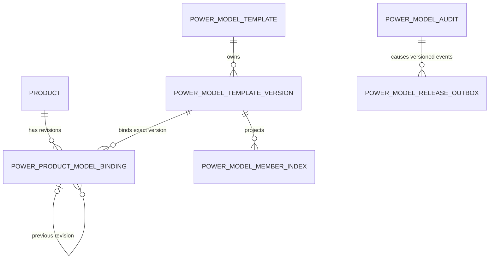
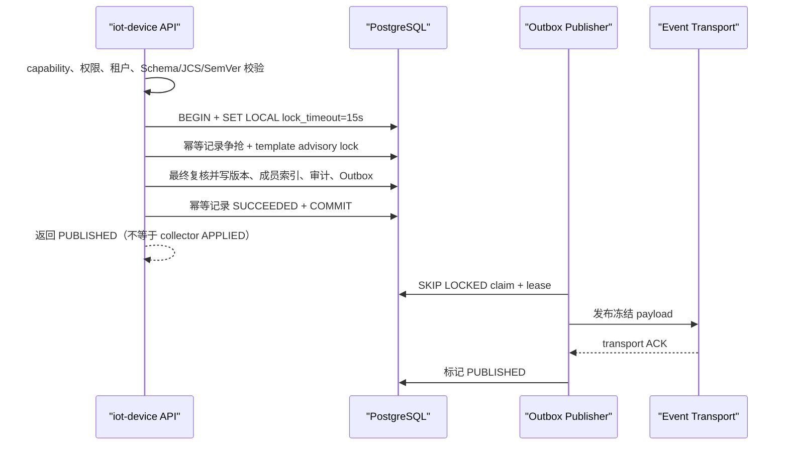
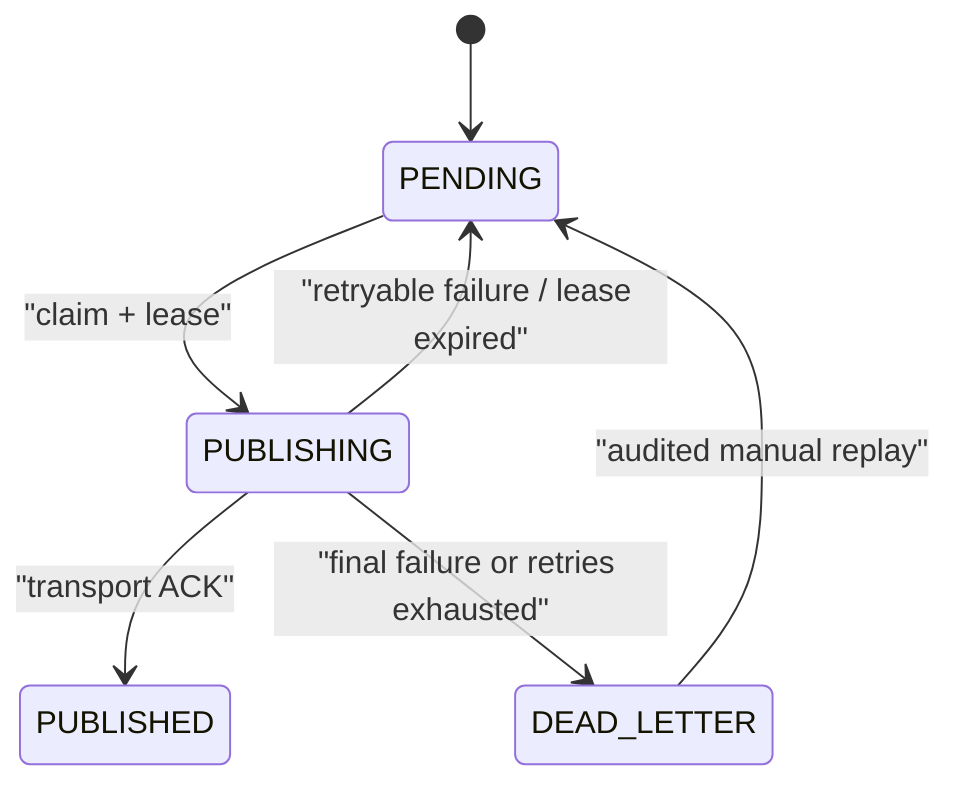

# TD-005：版本、绑定、审计与 Outbox 迁移回滚设计

> 版本：0.1.1
> 状态：In Review / Migration Candidate
> 日期：2026-08-06
> 强制双基线：[平台功能计划 1.4.0](../../架构设计/平台功能计划.md)、[EasyAIoT 项目开发宪法 1.4.0](../../开发规范/EasyAIoT项目开发宪法.md)
> 上游：[TD-005 1.0.16](./TD-005-物模型模板Schema版本差异与发布API.md)、[运行模型兼容与删除链设计 0.1.9](./TD-005-运行模型兼容与删除链技术设计.md)、[ADR-009](../../架构决策/电力运维云平台/ADR-009-物模型模板版本策略.md)、[ADR-011](../../架构决策/电力运维云平台/ADR-011-Capability-Manifest规范.md)、[ADR-012 1.0.2](../../架构决策/电力运维云平台/ADR-012-产品根属性与服务参数单一事实.md)
> 适用档位：`standard` / `full` 共用同一实现；`mini` 不建电力模板业务数据、不启动发布器并由 `power.device.model` fail-closed
> 执行限制：本文只形成 migration/rollback 候选；完成独立评审、目标库 precheck 和自动合同前，不得在任何共享或生产数据库执行 DDL

| 版本 | 日期 | 变更 |
|---|---|---|
| 0.1.0 | 2026-08-06 | 首次形成版本、绑定、领域审计与 Outbox migration/rollback 候选 |
| 0.1.1 | 2026-08-06 | 处置宪法专项与关联独立评审：补目标角色、事件混合版本、资源/API 预算、配置、网络超时、迁移锁影响、幂等和 product FK 前置门禁 |

## 1. 结论

M1 在 `iot-device` 的同一 PostgreSQL 数据库中增加模板身份、不可变版本、产品绑定修订、领域审计和发布 Outbox。模板发布、绑定应用、升级确认与回滚的业务事实、`power_idempotency_record`、领域审计和 Outbox 必须在一个本地事务内提交；HTTP 成功只表示控制面事实已持久化，不表示 collector 已应用。

领域审计使用本域追加写表，作为模型变更的权威审计事实。现有 `system_operate_log` 可继续记录通用操作日志，但它位于 `iot-system`，不能参与 `iot-device` 本地事务，不得替代本域审计或作为发布成功条件。

Outbox 发布器只在事务提交后异步投递。事件 ID 由应用在入事务前生成 UUID v4，PostgreSQL 使用 `UUID`，JSON 使用 RFC 4122 小写连字符 36 字符串；数据库唯一约束和消费者 Inbox 均以 `eventId` 去重。M1 不在数据库事务内调用 NODE、collector、Kafka、MQTT 或其他远程服务。

### 1.1 目标用户与角色

| 角色 | 业务目标 | 最小权限边界 |
|---|---|---|
| SYSTEM 模板管理员 | 维护平台标准模板身份、版本和生命周期 | `power:system-template:manage`；只允许平台管理域主体 |
| 租户模板编辑者 | 读取 SYSTEM 模板，创建和编辑本租户私有草稿 | `power:model-template:read/edit`；不能修改 SYSTEM 模板 |
| 模板发布者 | 校验并发布本租户模板正式版本 | `power:model-template:publish`；发布与编辑可由授权策略分离，但 M1 不虚构未被上游批准的强制双人审批角色 |
| 产品模型操作者 | 执行产品绑定预览、应用、升级确认和回滚 | `power:model-template:upgrade` 及产品数据权限；只能操作当前租户产品 |
| 审计与运维人员 | 查询受控领域审计、Outbox 状态，执行获批重放和对账 | 独立只读/重放权限；不能修改模板内容或绑定历史 |

最终用户仍通过 WEB/开放 API 使用 TD-005 主设计定义的稳定接口；任何角色都不得直连 PostgreSQL、Kafka 或 Outbox 表。

### 1.2 约束强度

本文中的“必须/不得”为 MUST，“应该/默认”为 SHOULD，“可以”为 MAY；未显式写出英文缩写不改变约束强度。宪法 §1.1 定义这些词的效力，并不要求每个句子重复标注英文关键字；实现和评审必须按语义执行。

## 2. 范围与非目标

本设计冻结候选：

- 首批版本、绑定、领域审计和 Outbox 表的列、约束、索引与租户边界；
- 发布、绑定、升级、回滚的本地事务边界和事件集合；
- Outbox claim、租约、重试、死信、对账和可观测性；
- additive migration、应用回滚、数据库保留和 destructive down 的拒绝条件；
- migration 自动合同、故障注入、三档和旧功能回归门禁。

本设计不冻结：

- Excel/JSON 导入任务及三方合并明细表的最终 DDL；它们在导入工作包单独评审；
- 运行模型八表的 unique/XOR/FK/RESTRICT 与产品删除链 DDL；继续由运行模型设计和 DEL 合同管理；
- collector 配置表及应用 ACK；继续遵循 TD-001～003；
- Kafka/MQTT 具体路由。M1 Outbox 先冻结领域事件，不把某个传输实现写入业务事务；
- 生产容量、清理批次和重试次数的最终数值。候选值必须经 standard 最低规格压测后冻结。

## 3. 已核对事实与前置依赖

1. 目标库 12 表画像和非空 legacy round-trip golden 已通过；现有运行模型约束、删除链和生产存量重跑仍为 OPEN。
2. `LegacyThingModelPersistenceService` 已证明同租户八表替换与失败回滚，但尚未接公开模型接口，也没有版本/绑定/审计/Outbox 表。
3. `power.device.model` capability、standard/full 同路径与 mini 前置拒绝已有合同证据；本设计不得增加 profile 分叉。
4. 仓库当前未发现 Flyway/Liquibase 执行器。评审前必须决定受控 migration runner、脚本清单、校验和、执行身份与流水线；在此之前 SQL 只能作为候选资产，不能复制到安装脚本自动执行。
5. `power_idempotency_record` 复用 TD-004 §7.12，不新建第二幂等表。若该表尚未落库，版本写 API 不得启用。
6. 绑定表对现有 `product` 的同租户 FK，依赖运行模型迁移先提供可引用唯一键。该 FK 未验证前，绑定写路径保持关闭，禁止以应用层校验长期替代。
7. 目标画像确认 `product` 有 29 列、`id` 主键、`tenant_id/product_identification NOT NULL`，但业务 unique/FK/check/trigger 均为 0；仓库 dump 的主键约束名为历史生成名，不能据此假定已有稳定 `(tenant_id, product_identification)` 唯一键。
8. 现有 capability manifest 在应用启动时由 `CapabilityAutoConfiguration` 读取为不可变快照；位置缺失时电力能力全部禁用，配置了不可读文件或 profile 不一致时启动失败。本文只消费该事实，不增加动态 profile 判断或第二 capability 源。

### 3.1 `product` 当前约束快照与 binding 前置

| 事实 | 当前状态 | 迁移影响 |
|---|---|---|
| `id` | BIGINT NOT NULL，单列 PK | binding 保留 `product_id` 审计副本，并在 trigger 中与锁定产品核对 |
| `tenant_id` | BIGINT NOT NULL | 可作为组合唯一键首列 |
| `product_identification` | VARCHAR(100) NOT NULL | 与 binding 审计副本长度保持一致 |
| `(tenant_id, product_identification)` | 当前无业务 UNIQUE；目标画像重复组为 0 | 必须先创建并验证唯一索引/约束，再创建 binding FK |
| 下游引用 | device、script、invoke response、OTA 等尚无 FK | 继续由运行模型 DEL/约束迁移管理，本设计不越权启用删除链 |

事实来源为仓库 `.scripts/postgresql/iot-device10.sql` 与 2026-08-05 目标 PostgreSQL 12 表只读画像。生产环境仍必须重跑同一画像；当前样本为 0 不能替代生产唯一性证明。

## 4. 目标结构

`content_canonical` 与 `binding_snapshot_canonical` 是唯一可写内容事实；对应 `jsonb` 只允许由同一应用对象在同一事务生成的查询投影。不得从 `jsonb` 重新序列化后计算或比较 JCS 哈希。

### 4.1 `power_model_template`

| 列 | 候选类型与约束 |
|---|---|
| `id` | `BIGINT` PK；使用仓库统一 ID 生成策略 |
| `tenant_id` | `BIGINT NOT NULL`；SYSTEM 固定 0，TENANT 为当前租户 |
| `template_code` | `VARCHAR(64) NOT NULL`；规范化后不可修改 |
| `template_name` / `device_type` | `VARCHAR(128) NOT NULL` / `VARCHAR(64) NOT NULL` |
| `template_kind` | `VARCHAR(16)` CHECK `STANDARD/VENDOR` |
| `owner_scope` | `VARCHAR(16)` CHECK `SYSTEM/TENANT` |
| `status` | `VARCHAR(16)` CHECK `ACTIVE/DISABLED` |
| `row_version` | `BIGINT NOT NULL DEFAULT 0` |
| 审计列 | `created_by/updated_by VARCHAR(64)`，`created_at/updated_at TIMESTAMPTZ` |

约束：`UNIQUE (tenant_id, template_code)`、`UNIQUE (tenant_id, id)`；CHECK 保证 `SYSTEM + tenant_id=0` 与 `TENANT + tenant_id<>0`。code 创建后由 trigger 拒绝修改。普通租户查询不得通过通用 `@TenantIgnore` 读取 SYSTEM 行；SYSTEM 只读查询使用专用 repository 和固定谓词。

### 4.2 `power_model_template_version`

| 列组 | 候选类型与约束 |
|---|---|
| 身份 | `id BIGINT` PK，`tenant_id/template_id BIGINT NOT NULL`，复合 FK 指向模板 |
| 版本 | `version VARCHAR(64)`，`major/minor/patch INTEGER`，`prerelease VARCHAR(64) NULL` |
| 生命周期 | `lifecycle VARCHAR(16)`；`DRAFT/PUBLISHED/DEPRECATED/RETIRED` |
| 厂家基线 | `base_template_version_id BIGINT NULL`、`base_version VARCHAR(64) NULL`、`base_content_hash VARCHAR(71) NULL` |
| 内容协议 | `schema_version VARCHAR(32)`、`canonicalization_version VARCHAR(32)`、`hash_algorithm VARCHAR(16)` |
| 内容事实 | `content_canonical TEXT NOT NULL`、`content_json JSONB NOT NULL`、`content_hash VARCHAR(71) NOT NULL` |
| 来源 | `source_type VARCHAR(16)`、`source_artifact_id VARCHAR(128) NULL` |
| 差异 | `diff_summary JSONB NOT NULL DEFAULT '{}'` |
| 草稿 | `draft_revision BIGINT`、`draft_state VARCHAR(16) NULL`、`last_activity_at/expires_at TIMESTAMPTZ NULL` |
| 发布 | `published_by VARCHAR(64) NULL`、`published_at TIMESTAMPTZ NULL` |
| 通用审计 | `created_by/updated_by`、`created_at/updated_at` |

约束与索引：

- `UNIQUE (tenant_id, template_id, version)`；
- `UNIQUE (tenant_id, template_id, content_hash)`；
- `UNIQUE (tenant_id, id)`，供绑定表复合 FK；
- `(tenant_id, template_id, lifecycle, major DESC, minor DESC, patch DESC)`；
- CHECK 固定 `SHA-256`、`jcs-rfc8785-v1` 和 `sha256:` + 64 位小写十六进制格式；
- VENDOR 的三个基线字段必须同时存在，STANDARD 必须同时为空；
- `PUBLISHED/DEPRECATED/RETIRED` 必须具有 `published_by/published_at`，不得带 prerelease；
- trigger 对已发布内容、版本、基线和来源字段执行不可变保护，只允许 `PUBLISHED→DEPRECATED→RETIRED`；任何回滚都创建新草稿或新绑定，不修改历史版本。

### 4.3 `power_model_member_index`

列为 `id/tenant_id/template_version_id/member_type/member_code/json_pointer/member_fingerprint/required/semantic_type`。复合 FK 指向同租户版本；唯一约束 `(tenant_id, template_version_id, member_type, member_code)`。它是 canonical 内容的事务内可重建投影，不开放独立 CRUD。

### 4.4 `power_product_model_binding`

| 列组 | 候选类型与约束 |
|---|---|
| 身份 | `id BIGINT` PK，`tenant_id/product_id BIGINT NOT NULL`，`product_identification VARCHAR(100) NOT NULL` |
| 修订 | `binding_revision BIGINT NOT NULL`，`status VARCHAR(20)` |
| 精确模板 | `template_version_id BIGINT NOT NULL`、`template_code VARCHAR(64)`、`template_version VARCHAR(64)`、`content_hash VARCHAR(71)` |
| 快照事实 | `binding_snapshot_canonical TEXT`、`binding_snapshot_json JSONB`、`binding_snapshot_hash VARCHAR(71)` |
| 关系链 | `previous_binding_id BIGINT NULL`、`upgrade_plan_id BIGINT NULL`、`rollback_from_binding_id BIGINT NULL` |
| 生效时间 | `effective_from TIMESTAMPTZ NOT NULL`、`effective_to TIMESTAMPTZ NULL` |
| 审计 | `created_by VARCHAR(64)`、`created_at TIMESTAMPTZ` |

约束与索引：

- `UNIQUE (tenant_id, product_id, binding_revision)`；
- `UNIQUE (tenant_id, id)`；
- 部分唯一索引：每个 `(tenant_id, product_id)` 只能有一个 `status='ACTIVE'`；
- binding 以 `(tenant_id, product_identification)` 复合 FK 指向 product 业务唯一键；`product_id` 是同一锁定行的不可变审计副本，由 INSERT/UPDATE trigger 校验一致。模板版本、previous/rollback binding 也使用同租户复合 FK；全部默认 `ON DELETE RESTRICT`；
- `ACTIVE` 必须 `effective_to IS NULL`，`SUPERSEDED/ROLLED_BACK` 必须有结束时间；
- `product_identification/template_code/template_version/content_hash` 是不可修改审计副本，必须与事务内锁定的权威对象一致；
- trigger 禁止修改历史 binding 的 snapshot canonical/json/hash、模板审计副本、修订号和关系链；状态/生效区间只允许由绑定状态机执行合法转换。`binding_snapshot_json` 必须从同一 canonical 对象生成，数据库合同重算 JCS/hash 并检测漂移；
- M1 永不物理删除历史绑定和快照。

运行模型成员到绑定的来源关联采用后续独立映射表或 additive `model_binding_id/model_member_fingerprint`；在方案评审前不修改现有八表列签名。

### 4.5 `power_model_audit`

该表是同事务、追加写、不可变的领域审计，不保存密钥、Token、完整导入文件或无限制 canonical 内容。

| 列 | 候选类型与规则 |
|---|---|
| `id` | `BIGINT` PK |
| `audit_event_id` | `UUID NOT NULL`，应用生成 UUID v4 |
| `tenant_id` | `BIGINT NOT NULL` |
| `operation` | `VARCHAR(64)`；稳定枚举 |
| `aggregate_type` / `aggregate_id` | `VARCHAR(32)` / `VARCHAR(128)` |
| `template_code/template_version` | 可空审计副本 |
| `product_id/product_identification/binding_revision` | 可空审计副本 |
| `principal_type/principal_id` | `VARCHAR(16/64) NOT NULL` |
| `request_id/trace_id` | `VARCHAR(64/128)`；至少 `request_id` 非空 |
| `source_type/source_artifact_id` | 可空；只记录受控 object key/业务 ID |
| `before_hash/after_hash` | `VARCHAR(71) NULL` |
| `semver_bump` | `VARCHAR(16) NULL` |
| `reason_code/reason_summary` | `VARCHAR(64/512) NULL`；summary 必须脱敏 |
| `diff_summary` | 有界 `JSONB`，只保存摘要 |
| `occurred_at` | `TIMESTAMPTZ NOT NULL`，服务端 UTC 事实 |

唯一约束为 `(tenant_id, audit_event_id)`；另建 `(tenant_id, aggregate_type, aggregate_id, occurred_at DESC)` 查询索引。`operation` 首批冻结为 `TEMPLATE_PUBLISHED/TEMPLATE_DEPRECATED/TEMPLATE_RETIRED/BINDING_APPLIED/BINDING_UPGRADED/BINDING_ROLLED_BACK`。数据库角色只授予 INSERT/SELECT；trigger 拒绝 UPDATE/DELETE。冲突决策的完整前后值如确需保存，进入单独受控表并限制权限，不扩大本表普通查询面。

### 4.6 `power_model_release_outbox`

| 列 | 候选类型与规则 |
|---|---|
| `id` | `BIGINT` PK |
| `event_id` | `UUID NOT NULL UNIQUE`，应用在事务前生成 UUID v4 |
| `tenant_id` | `BIGINT NOT NULL` |
| `audit_event_id` | `UUID NOT NULL`，复合 FK 指向同租户领域审计；同一操作在双版本窗口可产生多个不同主版本事件 |
| `aggregate_type/aggregate_id` | `VARCHAR(32/128) NOT NULL` |
| `event_type` | `VARCHAR(96) NOT NULL`，名称包含主版本 `V1` |
| `schema_version` | `INTEGER NOT NULL DEFAULT 1` |
| `payload` / `payload_hash` | 有界 `JSONB NOT NULL` / `VARCHAR(71) NOT NULL` |
| `status` | `PENDING/PUBLISHING/PUBLISHED/DEAD_LETTER` |
| `retry_count/max_retries` | `INTEGER NOT NULL`；`max_retries` 首轮候选 12，待压测冻结 |
| 调度 | `next_attempt_at/lease_until TIMESTAMPTZ`、`lease_owner VARCHAR(128)`；值固定为 `pmoutbox-{instanceId}` 的 DNS-label 兼容 ASCII，启动校验总长 ≤63 |
| 结果 | `last_error_code VARCHAR(64)`、`last_error_digest VARCHAR(128)`、`published_at TIMESTAMPTZ` |
| 时间 | `created_at/updated_at TIMESTAMPTZ NOT NULL` |

首批事件：

- `POWER_MODEL_TEMPLATE_PUBLISHED_V1`；
- `POWER_MODEL_TEMPLATE_LIFECYCLE_CHANGED_V1`；
- `POWER_PRODUCT_MODEL_BINDING_APPLIED_V1`；
- `POWER_PRODUCT_MODEL_BINDING_ROLLED_BACK_V1`。

首批事件分别在生产者 API 模块 `iot-device-api/src/main/resources/events/{event-name}/v1.json` 保存 Draft 2020-12 Schema；Schema 文件名使用事件名的小写 kebab-case。唯一约束 `(tenant_id, audit_event_id, event_type)` 防止同一操作重复生成同一主版本事件，同时允许破坏性升级窗口内从一条审计事实原子产生 V1/V2 两条 Outbox；不得复制审计行伪造双发。

payload 公共 envelope 固定包含 `eventId/eventType/schemaVersion/tenantId/aggregateType/aggregateId/occurredAt/requestId/traceId/data`。bigint ID 一律输出十进制字符串；时间使用 UTC ISO 8601。payload 在入库前生成并计算 `sha256:` 哈希，重试不得刷新 `eventId/occurredAt/payload`。

#### 4.6.1 消费者、transport 与 Inbox 决策边界

M1 的确定消费者是 TD-001 collector 配置发布协调器，它消费模板发布/绑定事件并异步创建或关联更高 `configVersion`；通用操作日志、WEB 和 APP 不是消息消费者。其他告警、分析或通知消费者必须登记模块 owner、事件类型、当前版本、Inbox/幂等位置和退出条件后才能加入。

transport 仍为 OPEN 架构选择：优先评估仓库既有 Kafka 事件总线；只有在部署依赖、顺序、容量、消息大小和运维证据不满足时才比较 MQTT/内部 HTTP。选择必须形成 Accepted ADR 或补充 ADR，冻结 topic/route、key、最大消息大小、连接/读取超时、重试责任和消费者 Inbox。无论 transport 如何选择，业务事务、Outbox envelope、eventId 和 Schema 不变；HTTP 不能降级为事务内远程调用。

消费者 Inbox 候选最小字段为 `tenant_id/event_id/event_type/payload_hash/status/received_at/processed_at/last_error_code`，`event_id` 全局唯一；同 eventId 同 hash 返回 DUPLICATE，同 eventId 不同 hash 进入隔离并 critical。Inbox 保留窗口不得短于生产者可重试、死信人工重放和双版本运行窗口的最大值。

#### 4.6.2 Schema 生命周期与混合版本运行

- 同一主版本只允许 additive 兼容变化：新增可选字段，消费者必须忽略未知可选字段；不得删除字段、改类型/语义、收紧 required 或原地修改已发布 Schema；
- 破坏性变化创建新的 `..._V2` eventType、`v2.json` 和独立 versioned topic/route。旧 Schema 和 fixture 在消费者全部退出、旧积压/死信清零及保留期结束前不得删除；
- 升级顺序固定为：登记消费者清单 → 部署可消费 V2 的消费者并保留 V1 → 生产者在同一业务事务写 V1/V2 两条 Outbox → 按消费者逐个切换和对账 → 至少跨一个完整发布周期 → 旧积压与死信清零 → 停止 V1 → 经审批删除旧合同；
- V1 消费者收到已登记的 V1 additive 字段必须继续处理；收到未知主版本不得错误标记为业务成功，也不得阻塞整个消费线程，应写隔离/DLQ、告警并等待兼容消费者；
- 云端、NODE 和 collector 可独立升级。控制面不得仅因新消费者未部署就覆盖旧版本 payload；混合版本窗口由双发和消费者 Inbox 去重保证，collector 最终应用状态仍按 TD-001 的 `configVersion` 查询；
- CI 必须对当前与上一主版本运行生产者 Schema 校验、向后兼容检查、消费者 fixture、未知可选字段、重复 eventId、同 ID 异 hash、双发对账和未知主版本隔离测试。

索引至少包括：

- dispatch：`(status, next_attempt_at, created_at, id) WHERE status IN ('PENDING','PUBLISHING')`；
- lease recovery：`(status, lease_until) WHERE status='PUBLISHING'`；
- aggregate trace：`(tenant_id, aggregate_type, aggregate_id, created_at DESC)`；
- retention：`(status, published_at, id) WHERE status='PUBLISHED'`。

## 5. 原子事务合同

### 5.1 模板发布

canonical/Schema/diff 的重计算在持锁前完成；持锁后必须重新验证草稿 revision、目标 version、content hash 和 capability。版本、索引、审计、Outbox 或幂等任一步失败均整体回滚，不留下 PUBLISHED 版本或伪成功记录。

持锁后的权威源必须是事务内重新读取的 PostgreSQL 行，不得使用 Redis、本地 cache 或持锁前 DTO：

| 最终复核 | 锁与动作 | 失败语义 |
|---|---|---|
| capability | 使用请求进入时的不可变 manifest 快照；若部署切换要求重启，则旧实例先摘流 | `CAPABILITY_NOT_SUPPORTED`，事务回滚 |
| 草稿 revision/state | `SELECT ... FOR UPDATE` 后比对 `draft_revision` 且必须 ACTIVE | `MODEL_DRAFT_REVISION_CONFLICT` |
| 模板身份/tenant | 锁定同租户 template，复核 ownerScope | 统一不存在或 `MODEL_TEMPLATE_SCOPE_DENIED` |
| version/hash | 在 advisory lock 内查询目标 version/content hash 是否已存在 | 同 hash 幂等返回；异 hash `MODEL_TEMPLATE_VERSION_CONFLICT` |
| 幂等记录 | 读取同主体/operation/keyHash 的 request hash/state | 沿用 TD-004 幂等错误，不创建第二结果 |
| 审计/Outbox | 事务提交前断言操作对应审计及要求的事件行数 | `MODEL_ATOMIC_WRITE_FAILED`，整体回滚 |

advisory lock 等待受 `lock_timeout=15s` 限制，服务端不在同一请求内盲目循环争抢；超时返回可重试 409。客户端只可复用同一 Idempotency-Key，采用有界退避最多 3 次，仍失败时由用户重新确认，禁止生成新 key 制造并发发布。

### 5.2 首次绑定、升级与回滚

同一事务固定顺序：

1. capability、权限、租户、幂等和请求哈希校验；
2. `SELECT ... FOR UPDATE` 锁定同租户 product 和当前 ACTIVE binding；
3. 锁定目标 PUBLISHED 精确版本；升级/回滚另锁定 plan 或历史 binding；
4. 生成并验证 snapshot/hash，将其投影到现有七张模型子表；
5. 校验写后成员 fingerprint；
6. 关闭旧 ACTIVE，插入更高 revision 的新 ACTIVE binding；
7. 插入领域审计与对应 Outbox；
8. 幂等记录转 SUCCEEDED 并提交。

任何失败整体回滚；不得先提交运行表再补绑定，不得先关闭旧 ACTIVE 后跨事务创建新 ACTIVE。回滚创建更高 revision，不修改历史 binding，不删除新版本期间遥测。

### 5.3 审计与 Outbox 失败语义

- 审计 INSERT 失败：业务事务失败，不发布、不绑定；
- Outbox INSERT 失败：业务事务失败，不能降级为“稍后补事件”；
- 事务提交后传输失败：业务事实保持成功，Outbox 重试并告警；
- 通用 `system_operate_log` 写失败：不反向破坏已经原子提交的领域事实，但必须产生运维告警并可由领域审计对账；
- 外部传输成功、状态回写前崩溃：允许重复发布，消费者按 `eventId` 幂等；
- DEAD_LETTER 不自动删除，人工修复后以相同 eventId 重放，不创建语义重复事件。

### 5.4 继承 API 的性能与边界预算

本子设计不新增 HTTP 路由，继承 TD-005 主设计的发布、绑定、升级确认和回滚 API，但必须为其新增事务成本负责。以下为 standard 最低规格的准入候选，不是已验证承诺：

| 项目 | M1 候选目标 |
|---|---|
| 单实例持续写吞吐 | 发布/绑定类合计 5 req/s，20 req/s 短时突发；超过并发 quota 返回明确限流 |
| 正常写延迟 | P95 ≤ 1 s、P99 ≤ 3 s，不包含已经声明为异步的事件投递 |
| 请求总超时 | 20 s；数据库 lock timeout 15 s；超时结果通过同一幂等 key 查询/重放 |
| 请求体 | 不超过 `maxTemplateCanonicalBytes` 且 HTTP 硬上限候选 2 MiB，取二者较小值 |
| 同步响应体 | 不超过 256 KiB；canonical/snapshot 正文使用独立精确读取接口，不进入列表 |
| 列表/批次 | 默认 20、硬上限 100；Outbox 内部批次见 §6 配置 |

最终值必须用真实 PostgreSQL、standard 16 GB 最低规格和最大合法模板压测 P50/P95/P99、锁等待、SQL plan、CPU、RSS、WAL、磁盘增长与网络字节；不达标时先收紧 quota/批次或优化索引，不复制 full 实现、不降低事务和审计要求。

## 6. Outbox 状态机与发布器

claim 使用短事务 `FOR UPDATE SKIP LOCKED`，写入 `PUBLISHING/lease_owner/lease_until/retry_count` 后立即提交，网络发送不持数据库锁。租约到期由恢复任务原子退回 PENDING；旧 owner 后续 ACK 必须以 `event_id + lease_owner` 条件更新，影响 0 行时不得覆盖新租约结果。

候选重试为指数退避 + full jitter，基础 1 秒、上限 30 分钟、最多 12 次；这些数值为 OPEN 容量参数。最终失败必须保存稳定错误码与脱敏摘要。发布器至少暴露 backlog、oldest age、publish duration、retry、dead-letter、lease recovery 指标；`model_release_outbox_lag_seconds` 不得带 tenantId/templateCode 等高基数标签。

### 6.1 配置清单与安全默认值

配置统一使用 Nacos/部署配置，代码不得写 profile 分支。除永久 capability 外均由 `easyaiot.power.model.outbox.*` 管理；旧部署缺少配置时采用下表安全默认值。所有数值仍需压测确认，放宽必须评审。

| 配置 | 类型 | 默认值 | 必填 | 用途与示例 |
|---|---|---:|---|---|
| `publisher-enabled` | boolean | `false` | 否 | migration/合同完成后才设 true；mini 即使误设也因 capability 不装配 |
| `batch-size` | integer | `100` | 否 | 单次 claim 上限，范围 1～500 |
| `poll-interval` | duration | `1s` | 否 | 空队列轮询间隔，例如 `1s` |
| `lease-duration` | duration | `60s` | 否 | 必须大于 connect+read timeout 和一次发送预算，例如 `60s` |
| `max-retries` | integer | `12` | 否 | 可重试失败上限；非重试错误直接 DEAD_LETTER |
| `retry-base-delay` | duration | `1s` | 否 | full jitter 基础退避 |
| `retry-max-delay` | duration | `30m` | 否 | 单次退避上限 |
| `connect-timeout` | duration | `3s` | 否 | transport 建连超时；不得为 0/无限 |
| `read-timeout` | duration | `5s` | 否 | 单次发送/ACK 读取超时；不得为 0/无限 |
| `max-payload-bytes` | data size | `2MiB` | 否 | 序列化后事件硬上限；超限在业务事务内拒绝 |
| `published-retention` | duration | `30d` | 否 | 仅为最低候选；自动清理在保留评审前仍关闭 |
| `reconcile-cron` | cron | `0 15 2 * * ?` | 否 | 每日领域事实/审计/Outbox 对账示例 |

`publisher-enabled` 的 owner 是 iot-device 模型域代码 owner，作用域为服务实例，创建原因是 migration 灰度，默认关闭；它不是永久产品能力源。正式启用必须绑定审批单和启用时间，所有环境 migration 完成后应删除该临时门禁并只保留 ADR-011 capability。安全、权限、租户、审计和原子性不得通过该开关降级。

### 6.2 资源预算与网络故障边界

- CPU：发布器候选最多 2 个工作线程；空闲轮询不得持续忙等。standard 最低规格下新增平均 CPU 目标 < 0.25 core，压测峰值 < 1 core；
- 内存：单批最多 `batch-size × max-payload-bytes`，实现必须流式/逐条发送，禁止一次把理论 200 MiB 全部复制进堆；新增 RSS 目标 ≤ 64 MiB；
- 数据库：发布器连接池最多 2 个专用连接，claim 短事务，网络发送不持锁；必须记录扫描行、命中索引、WAL 字节和 vacuum 影响；
- 磁盘：日增长按 `事件数 × (payload+索引+审计)` 实测并保留至少 30 天空间；容量达到卷 70% warning、85% critical 时停止非必要历史导出并触发保留策略评审，不能删除 PENDING/DEAD_LETTER 腾空间；
- 网络：健康 transport 下持续投递目标至少 50 events/s，单事件投递 P95 ≤ 5 s；10,000 条 backlog 的恢复目标 ≤ 15 分钟且不使业务写 P95 超预算；
- GPU/显存/边缘资源：本组件不使用 GPU，不部署到 EDGE/NODE/collector；只在中心 `iot-device` 产生控制面成本。

网络调用必须同时设置 3 秒连接和 5 秒读取超时。只有明确的连接失败、超时、限流和服务端暂时错误可重试；认证、Schema、payload 超限和同 ID 异 hash 为 final。transport 连接池、线程和序列化 buffer 必须有界并在服务停止时释放。上述预算均为 Review Candidate，只有原始压测证据可转为冻结值。

PUBLISHED 行 M1 至少保留一个完整发布周期且不少于 30 天；在运维保留政策、对账和恢复演练批准前不启用自动物理清理。领域审计与 DEAD_LETTER 在 M1 不自动删除。

## 7. Migration 候选

### 7.1 资产与执行器门禁

评审通过后再生成两份 UTF-8 无 BOM 资产：

- `assets/td005-migration/V001__power_model_version_binding_audit_outbox.sql`；
- `assets/td005-migration/U001__power_model_version_binding_audit_outbox.sql`。

`V001` 只能 additive 创建对象；`U001` 是带拒绝条件的受控卸载脚本，不作为日常应用回滚。两者进入 SHA-256 manifest，并记录目标 PostgreSQL 版本、执行人、审批单、开始/结束时间和输出。正式放入应用/安装目录前，必须先决定 migration runner；禁止由应用多副本启动时并发执行裸 SQL。

### 7.2 执行阶段

| 阶段 | 动作 | 失败处理 |
|---|---|---|
| M0 | 备份；重跑 12 表画像、重复/孤儿/tenant/列签名 precheck；确认 capability 关闭 | 任一非预期差异立即停止 |
| M0.5 | 由 TD-004 migration 落地 `power_idempotency_record`，验证跨副本唯一争抢、同 key 异 hash、24 小时保留和清理恢复 | 表或合同未通过则所有版本写 API 保持关闭 |
| M1 | 创建模板、版本、成员索引、审计、Outbox 表与本组内部约束 | 整个 DDL 事务回滚 |
| M1.5 | 对生产 `product` 重跑重复 precheck；用 `CREATE UNIQUE INDEX CONCURRENTLY` 创建 `(tenant_id, product_identification)` 唯一索引，随后短锁附加稳定 UNIQUE 约束并进入画像基线 | 索引失败时保留/清理 INVALID index 后停止；禁止自动归并产品 |
| M2 | 创建 binding 表；复合 FK 先 `NOT VALID`，独立扫描后 `VALIDATE CONSTRAINT` | unique/FK 未验证则不启用 binding 写路径 |
| M3 | 部署 capability 关闭的新应用；执行 repository、租户、不可变、Outbox 故障合同 | 仅回滚应用，保留 additive 空表 |
| M4 | 独立验证 FK/trigger/index；重跑画像和旧非电力回归 | 验证失败保持 capability 关闭 |
| M5 | standard 小流量启用；full 复用相同产物仅提高 quota | 指标或对账异常立即关闭 capability |

不得把历史非电力产品回填成伪版本或伪绑定。只有用户显式创建私有基线并确认预览后，才产生真实 VENDOR 版本与 binding。

### 7.3 锁表、耗时、磁盘和失败清理评估

- M1 新表创建只产生 catalog/DDL 锁，不扫描现有业务大表；必须在维护窗口执行并记录实际锁等待、WAL 和磁盘增长；
- M1.5 的唯一索引是当前主要大表风险。`CONCURRENTLY` 不阻塞普通读写，但会长时间扫描、增加 CPU/IO/WAL，并可能因并发写入或重复数据失败；执行前后均需磁盘安全余量、`pg_stat_progress_create_index` 监控和重复查询；
- `CREATE UNIQUE INDEX CONCURRENTLY` 不能放入普通 migration 事务。runner 必须把它建模为可恢复独立步骤；失败产生的 INVALID index 只能经核对后按批准脚本清理，不能让后续阶段继续；
- 使用已有唯一索引附加约束、创建/验证 FK 和 trigger 仍可能获取表锁或扫描引用表。必须设置 `lock_timeout/statement_timeout`、记录执行计划与持续时间，并在超时后零业务语义变化退出；
- M2 `VALIDATE CONSTRAINT` 与 12 表约束迁移错峰，避免同时扫描 product/运行表。生产耗时、临时空间、WAL、复制延迟和回滚时间未形成原始证据前保持 OPEN；
- 回滚优先停应用并保留 additive 对象。只有 §8.2 空表条件满足时才卸载；任何非空事实都不得为缩短维护窗口而删除。

### 7.4 幂等与重复执行

migration runner 以迁移 ID 和脚本 SHA-256 记录执行事实；同 ID 同 hash 可识别为已执行，同 ID 不同 hash 必须阻断。`CREATE TABLE IF NOT EXISTS` 不能替代列签名/约束签名校验；发现同名异构对象必须失败，禁止静默继续。

## 8. 回滚设计

### 8.1 应用回滚（首选）

1. 关闭 `power.device.model` 和新 UI，停止新发布/绑定请求；
2. 停止 Outbox claim，等待已持有租约完成或超时回收；
3. 对账 PENDING/PUBLISHING/DEAD_LETTER、版本、绑定和审计数量及 hash；
4. 若新绑定有业务问题，使用正式 rollback API 创建更高 binding revision；必要时按 TD-001 创建更高 collector `configVersion`；
5. 切回已经通过 golden 的 legacy adapter/旧应用；
6. 数据库表保留只读，不删除 PUBLISHED 版本、绑定、审计或 Outbox。

### 8.2 数据库卸载（只允许空表）

`U001` 执行前必须同时满足：capability 已关闭、发布器停止、所有新表业务行数为 0、没有 FK/视图/函数/权限依赖、备份与恢复演练有效、变更审批明确允许删除。脚本必须在单事务中按反向依赖顺序删除，并在首条 DDL 前重复断言；任一条件不满足直接抛错且零变更。

一旦存在任何版本、绑定、审计或 Outbox 业务行，M1 禁止 destructive down；只能执行应用回滚并保留 additive Schema。后续收缩必须另立 ADR，定义备份、保留期、审批、恢复演练和消费者退出条件。

## 9. 权限、租户与安全

- 所有外部写入先验证认证、`@PreAuthorize`、当前 tenant 和 `power.device.model`；tenantId 不从请求体接收；
- SYSTEM 模板只允许 `power:system-template:manage`，普通租户只读；绑定只能发生在当前业务 tenant；
- 后台发布器是内部服务身份，只能读取/更新 Outbox 状态，不能修改模板、绑定或审计业务列；
- 审计普通查询默认不返回 `diff_summary` 正文，正文需独立权限与精确 ID；
- 日志不得输出 canonical、snapshot、完整 payload、导入行值、幂等 key 或凭据；
- `reason_summary/last_error_digest` 先去控制字符和敏感字段再限长；
- 数据库权限应分为业务写、Outbox 发布和只读运维角色，禁止共享超管凭据。

## 10. 自动合同与故障注入

| ID | 场景 | 通过条件 |
|---|---|---|
| MIG-001 | 空库执行 V001 两次 | 第二次识别同 ID/hash；Schema 签名一致 |
| MIG-002 | 同名表列或约束被篡改 | precheck 阻断，零 DDL 变化 |
| MIG-003 | 12 表画像出现重复/孤儿/tenant 异常 | 阻断且不自动修数据 |
| MIG-004 | U001 面对任一非空新表 | 明确拒绝，全部对象保留 |
| MIG-005 | `power_idempotency_record` 不存在或合同失败 | M1/M2 可评审但写 API 不启用 |
| MIG-006 | product unique concurrent 创建失败/留下 INVALID index | 阻断 FK；按批准清理脚本恢复，不影响现有产品写 |
| TX-001 | 版本 INSERT 后审计失败 | 版本、索引、幂等、Outbox 全部回滚 |
| TX-002 | 绑定投影第 N 表失败 | 原运行模型和 ACTIVE binding 完整恢复 |
| TX-003 | Outbox INSERT 失败 | 业务与审计均不提交 |
| TX-004 | 提交成功、HTTP 响应丢失 | 相同 Idempotency-Key 返回原结果，不增版本/事件 |
| OUT-001 | 两发布器并发 claim | 同一时刻每个 event 只有一个有效 lease |
| OUT-002 | 发送成功后状态回写前崩溃 | 相同 eventId 可重发，消费者只生效一次 |
| OUT-003 | lease 过期与迟到 ACK 竞争 | 旧 owner 不能覆盖新 owner 结果 |
| OUT-004 | retryable/final 错误 | 正确退避或进入 DEAD_LETTER，业务事实不回滚 |
| OUT-005 | V1 payload 增加未知可选字段 | 当前 V1 消费者继续处理，业务语义不变 |
| OUT-006 | 当前/上一主版本 fixture 与 Schema | 生产者、消费者和 CI 同时通过；破坏性变化不能伪装为 V1 |
| OUT-007 | V1/V2 双发及逐消费者切换 | 同 audit 产生两个 eventId；各 Inbox 只生效一次且对账一致 |
| OUT-008 | 旧消费者收到未知主版本 | 写隔离/DLQ并告警，不标记业务成功、不阻塞其他事件 |
| OUT-009 | transport 建连/读取超时和服务停止 | 3s/5s 内退出或重试；线程、连接、buffer 均释放 |
| AUD-001 | 尝试 UPDATE/DELETE 审计 | 数据库拒绝 |
| TEN-009 | tenant 2 读取 tenant 1 版本/绑定/审计 | 404/空，不泄露存在性 |
| TEN-010 | SYSTEM 模板普通租户写入 | 拒绝；专用只读查询可见 |
| PROF-001 | standard/full 同请求 | 同 Schema、SQL、事件和错误语义 |
| PROF-002 | mini 调用或启动发布器 | API 前置拒绝，零新表读写，任务未装配 |
| LEG-001 | 非电力旧 `/thingModel` 回归 | mini/standard/full 旧行为一致 |
| CFG-001 | 配置缺失、越界或 lease≤网络预算 | 使用安全默认或启动失败；不存在无限超时/无界批次 |
| PERF-001 | standard 最低规格和最大合法模板 | 达到 §5.4/§6.2 候选或保持 OPEN，不得修改为虚假 PASS |

测试必须使用真实 PostgreSQL 事务与唯一 fixture，结束后核对全部新表和八张运行表残留为 0。还需执行 trigger mutation、并发锁、消费者当前/上一主版本 Schema 合同以及 standard 最低资源下 P95/P99 与 backlog 恢复压测。

## 11. 可观测性与运维对账

除 TD-005 既有指标外增加：

- `power_model_domain_audit_total{operation,result}`；
- `power_model_outbox_backlog{status}`；
- `power_model_outbox_oldest_age_seconds{status}`；
- `power_model_outbox_publish_total{eventType,result}`；
- `power_model_outbox_retry_total{errorCode}`；
- `power_model_outbox_lease_recovery_total`。

每日对账至少比较：成功幂等记录、业务聚合变更、领域审计、Outbox 总数；每个成功写操作应恰有一条对应审计，要求对外通知的操作还应恰有一条 eventId。对账只能报告差异，不自动伪造审计或事件；修复需审批并保留来源。

告警基线：出现 DEAD_LETTER、审计对账缺失或 payload hash 不一致立即 critical；backlog age、retry rate 和 lease recovery 阈值由压测后冻结。健康接口区分 `businessWrite/audit/outboxPublisher/transport`，传输故障不得伪报业务写失败。

## 12. 双基线与上游追踪

| 要求 | 本设计落点 |
|---|---|
| standard/full 单一实现，mini 排除 | capability 前置、同表同事件同测试、PROF-001/002 |
| DEVICE 是控制面 | 所有版本/绑定/审计事实位于 `iot-device` |
| 兼容、可回滚 | additive Schema、legacy 不伪回填、应用回滚优先 |
| 租户与安全默认开启 | 复合 tenant FK、服务端 tenant、权限和专用 SYSTEM repository |
| 关键事件最终一致 | 同事务 Outbox、UUID 幂等、租约重试和死信 |
| 数据库扩展—迁移—收缩 | M0～M5；有数据时禁止 destructive down |
| 证据诚实性 | 候选值和未运行 DDL 明确标记 OPEN |
| ADR-009 不可变版本 | canonical/hash、发布 trigger、只创建新修订 |
| ADR-011 capability 单一事实 | 只复用 `power.device.model` |
| ADR-012 单一事实 | 不新增/回填 `product_properties.service_id` |

## 13. 评审冻结门禁与 OPEN 项

本文从 `In Review` 转为 `Approved / Frozen` 前必须关闭：

1. 确定 migration runner、执行锁、history 表和 SHA-256 校验机制；
2. 由 DBA/代码 owner 核对全部列类型、稳定约束名、索引、trigger、权限和目标 PostgreSQL 兼容性；
3. TD-004 `power_idempotency_record` DDL 已落地，跨副本唯一争抢、同 key 异 hash、24 小时保留、清理和恢复合同通过；
4. 在生产画像重复为 0 的证据上创建并验证 product `(tenant_id, product_identification)` unique，再验证 binding 同租户 FK 和启用顺序；
5. 冻结事件 payload JSON Schema、逻辑消费者清单、当前/上一主版本、未知字段、未知主版本和 V1/V2 双发合同；
6. 通过 ADR 明确 Outbox transport、topic/route、消息上限、消费者 Inbox、`eventId` 去重和退出条件；
7. 配置清单进入 `env.example`/Nacos 说明，网络超时和 standard 最低规格资源/API/恢复压测达到候选目标并冻结容量、保留和告警值；
8. 生成 V001/U001 候选及 manifest，完成 MIG/TX/OUT/AUD/TEN/PROF/LEG/CFG/PERF 自动合同；
9. 完成备份、恢复、应用回滚、INVALID index 清理和空表卸载演练；
10. 把评审结论追加到 TD-005 评审报告，并同步主 TD、运行模型设计与续作入口。

当前 OPEN：迁移执行器、幂等表落库、product unique/binding FK、事件消费者/transport/Inbox、Schema 双版本合同、容量和超时压测、审计/Outbox 保留政策、SQL 资产及全部本设计自动证据。任何一项未关闭时，不得执行 DDL、接公开接口或宣称审计/Outbox 已完成。
