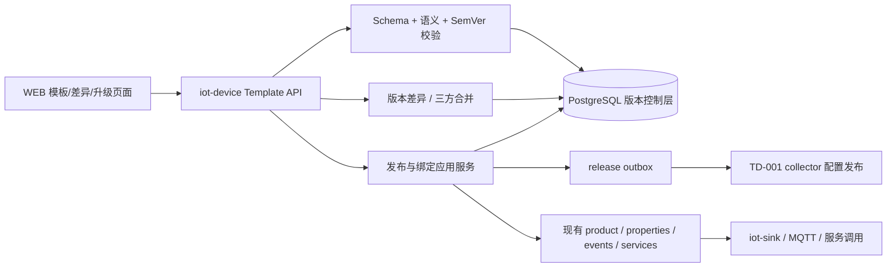
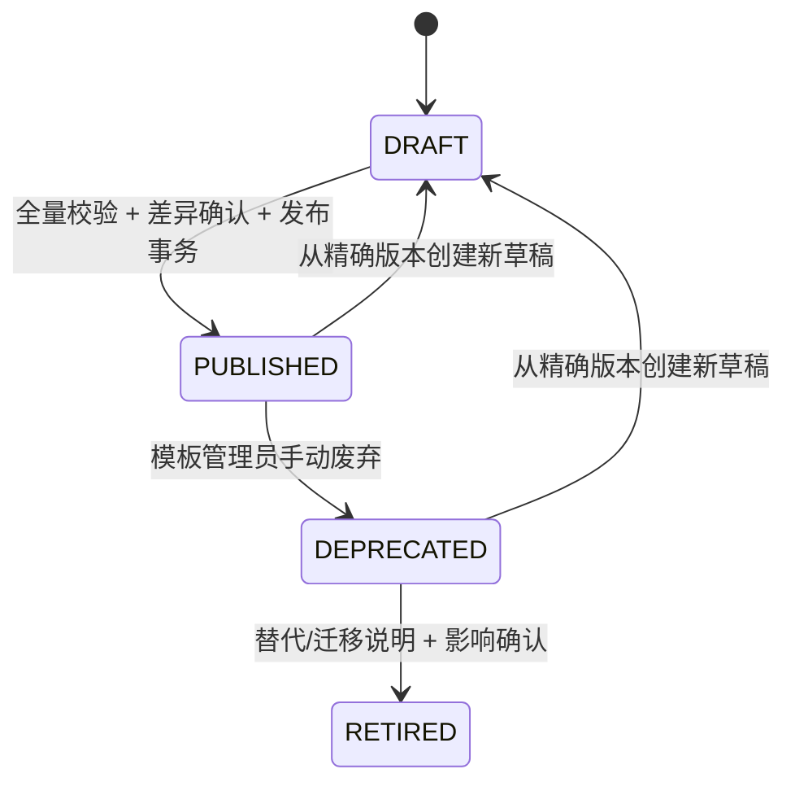

# TD-005：物模型模板 Schema、版本差异与发布 API

> 文档状态：In Review  
> 版本：1.0.52
> 日期：2026-08-11
> 适用版本：standard / full 共用同一实现；mini 不创建、导入、发布、绑定或升级电力物模型模板  
> 上游：[PRD-01 1.2.0](../../产品需求/电力运维云平台/PRD-01-站点设备与数据采集.md)、[SPEC-001 1.3.0](../../规格/电力运维云平台/SPEC-001-电力对象与测点编码规范.md)、[SPEC-002 1.3.0](../../规格/电力运维云平台/SPEC-002-电力设备物模型模板.md)、[ADR-009 物模型模板版本策略](../../架构决策/电力运维云平台/ADR-009-物模型模板版本策略.md)、[ADR-011 Capability Manifest](../../架构决策/电力运维云平台/ADR-011-Capability-Manifest规范.md)  
> 评审处置：[TD-005 评审报告](../../开发规范/TD-005评审报告.md)，运行模型以 §22 为准，版本/绑定/审计/Outbox migration 以 §23 为准
> 下游依赖：产品实例化、collector 点表发布、设备档案、告警策略、SCADA、能源计量点、遥控安全闭环

变更记录：

| 版本 | 变更 |
|---|---|
| 1.0.0 | 首次设计：Schema、SemVer/JCS/hash、三方差异、绑定、升级、导入与发布 API |
| 1.0.1 | 落地首次评审 22 项处置，补齐幂等、capability、安全导入、CT/PT、并发与兼容契约 |
| 1.0.2 | 增加 §24 自动证据；修正合法样例 eventCode 并建立 Schema/JCS golden |
| 1.0.3 | 处置二次复核 R-01～R-05：输出精度、路由风格、409 语义、版本叙事和 UTF-8 契约 |
| 1.0.4 | 处置画像评审 R1～R7：画像 JSON Schema/列签名/双作用域重复/生产重跑契约，并建立 Proposed ADR-012 |
| 1.0.5 | 处置孤儿属性方案 O1～O7：动态引用扫描、完整快照断言、回滚父对象保护和 COPY 基线修正规则 |
| 1.0.6 | 完成 4 条孤儿属性修复执行与修复后画像；该子门禁 PASS，整体仍为 OPEN_REMEDIATION_REQUIRED |
| 1.0.7 | ADR-012 转 Accepted；新增运行模型兼容与删除链技术设计，冻结 Mapper/DO/VO、租户、唯一约束和删除合同候选 |
| 1.0.8 | 处置 ADR-012 独立复核及运行模型 R1～R10：保持 20 列批准签名，细化 12 表画像、作用域 SQL、删除和回滚证据 |
| 1.0.9 | 处置 ADR-012 宪法专项复核：区分 Accepted 与交付 DoD，补 owner、golden 前置、Feign、性能和删除审批门禁 |
| 1.0.10 | 完成 12 表目标库画像与首份非空旧格式 round-trip fixture/golden；冻结迁移前兼容合同，不冒充生产 adapter 已实现 |
| 1.0.11 | 完成第一批运行模型生产实现与 Java 合同测试；Mapper/DO/根属性 DTO 和 legacy 只读投影已有证据，其余交付门禁保持 OPEN |
| 1.0.12 | 主代码 Java legacy 双向转换直接消费冻结 8 表 golden 并通过合同测试；数据库持久化接线与租户集成仍保持 OPEN |
| 1.0.13 | 完成真实 PostgreSQL 根属性 TEN-001～004/006 子合同，修复混租户批量删除部分成功；其余 TEN 与八表持久化仍 OPEN |
| 1.0.14 | 完成内部八表聚合持久化/导出、TEN-005 应用校验和数据库失败回滚；公开接口、约束及其余交付门禁仍 OPEN |
| 1.0.15 | 落地 ADR-011 capability manifest/共享服务/只读 API，补稳定业务错误并完成 TEN-007/008；审计/Outbox 与公开模型接口仍 OPEN |
| 1.0.16 | 形成并处置版本/绑定/审计/Outbox migration 0.1.1 宪法专项评审，补双版本事件、资源配置、幂等及 product unique/FK 前置；DDL 仍未执行 |
| 1.0.17 | 与 TD-001 1.0.13 对齐 RTUPointBindings 四项策略事实、VALIDATED 候选单派生身份与事件确认人审计；V007 仍为未执行评审候选 |
| 1.0.18 | 落地首个产品绑定 apply API：权限/capability/租户/幂等 fail-closed，同事务写绑定、领域审计、Outbox 与 VALIDATED collector 候选；目标 PostgreSQL 原子合同 2/2 PASS |
| 1.0.19 | 端到端核对识别 ADR-015 首发投影死循环；绑定 apply Controller 增加独立默认关闭门禁，首发单一写序完成专项决策前禁止开放 |
| 1.0.20 | 按 ADR-015 落地人工首发 PUBLISHED+投影同事务写序；真实 PG 首发/重复/不同事件/CAS 回滚合同与默认关闭门禁 4/4 PASS |
| 1.0.21 | 冻结写链四项启动门禁与三阶段灰度顺序；配置组合 8/8、Compose 解析 PASS，实际开关仍未启用 |
| 1.0.22 | 登记模板编排 API 独立默认关闭开关；灰度顺序细化为第四端口→事件链→模板 API→绑定 API，任一写 API 均要求 capability 与至少 32 UTF-8 字节 HMAC secret |
| 1.0.23 | 补目标系统库权限画像与 seed/rollback 候选：七个冻结权限当前为 0，权限 seed 与 canary 角色授权分离，目标库执行仍需独立批准 |
| 1.0.24 | owner 独立批准后完成系统库自动备份与七项权限 seed；精确七行验收 PASS、角色关联为 0，API/secret/容器/canary 均未变更 |
| 1.0.25 | 形成隔离 canary 角色授权候选：测试租户 122 的 14 类业务事实均为 0，仅拟向角色 111 增量授予 read/edit/publish；双库只读 preflight PASS，仍待独立批准 |
| 1.0.26 | 形成 HMAC secret 仓库外文件 + Compose secret + Spring Config Tree 注入候选；明文环境变量在安全覆盖层中清空，API 与运行容器均未变更 |
| 1.0.27 | 补宿主机 secret 文件只读预检：拒绝仓库内/相对/reparse、BOM/换行/非法 UTF-8/短值/NUL/宽泛读取 ACL，且不输出路径、值或摘要 |
| 1.0.28 | 冻结 HMAC 注入窗口前阶段 2 运行基线：full、Topic 6/1/30 天、消费组 lag=0、数据库积压 0、业务 4/4/17；全量只读预检 16/16 PASS |
| 1.0.29 | 形成默认只读的 Secret 注入窗口执行器：双因子执行门禁、仅重建 iot-device、健康/挂载/阶段 2 复验及基础 Compose 自动回退 |
| 1.0.30 | 形成 tenant 122 隔离模板 Canary 三请求资产与独立窗口：单只读测点、无产品/设备/绑定，运行标识服务端或窗口生成，未执行 API 写入 |
| 1.0.31 | 提交模板 API 与运行准备资产并将 Canary manifest 回填资产基准 commit af41b515；请求/Schema hash 不变，运行门禁仍 OPEN |
| 1.0.32 | 修复 Windows PowerShell 管道未固定 UTF-8 导致 Canary 中文租户名假漂移；新增仅允许运行两份 READ ONLY SQL 的封装入口 |
| 1.0.33 | owner 批准后在仓库外生成 HMAC Secret：CSPRNG 48 字节→64 字节 Base64，严格 UTF-8/无换行/收紧 ACL 预检 PASS；尚未注入或重建容器 |
| 1.0.34 | owner 独立批准后完成 Config Tree Secret 注入与仅重建 iot-device；补 Kafka 重新入组有界等待，最终挂载 64/明文 0/API false/阶段 2 PASS |
| 1.0.35 | owner 独立批准并在新备份校验成功后，仅向 tenant 122 / role 111 授予 read/edit/publish；禁止权限为 0，API/Secret/容器/Canary 均未变化 |
| 1.0.36 | 补默认只读、失败自动回退的 template API 执行器；owner 精确批准后仅重建 iot-device，最终 template=true/binding=false/Secret 保留/未写 Canary |
| 1.0.37 | Canary 前检发现网关未路由 `/api/v1/power/**` 且候选用户无活动令牌；补原样转发路由与静态合同，构建 PASS，尚未部署或写 Canary |
| 1.0.38 | owner 批准无现存网关基线下首次部署；仅创建 healthy 的 `iot-gateway`，JAR 哈希一致且其他容器未重建，未调用 API 或写 Canary |
| 1.0.39 | Canary 认证前检确认账户、角色、30 分钟 token 策略就绪，但本机无 WEB 镜像/容器；形成 full 档位 WEB 首次部署独立窗口，未登录或取 token |
| 1.0.40 | owner 批准后仅以 full 构建并首次创建 healthy 的 WEB；依赖容器和 token 基线未变，形成不导出 token 的独立浏览器认证窗口 |
| 1.0.41 | 浏览器认证窗口获批，但应用内浏览器在导航前因主机权限无法建立控制连接；登录未执行、token 仍为 0，待修复连接或另批 Chrome CDP |
| 1.0.42 | tenant 123 / user 132 认证-only harness 验收 PASS；Canary 三请求资产重定向为 `canary-meter-123` 并重算哈希，请求/Schema 合同 1/1 PASS，manifest 基准提交仍 OPEN |
| 1.0.43 | tenant 123 Canary 资产基准提交 `1ec8e801` 已形成并回填 manifest；完整资产/Schema/网关合同复验通过后关闭可追溯门禁 |
| 1.0.44 | 新增 tenant 123 双库只读前检与静态合同；实跑确认身份/权限 3/0、十四类业务事实残留 0，运行前新鲜度门禁 PASS |
| 1.0.45 | 重认证因白名单外 logout 判失败并完成四令牌收敛；网络门禁改为页面内置、先全拒绝后开放，合同与 full harness 构建 PASS，尚未部署 |
| 1.0.46 | owner 独立批准后仅重建 WEB 部署页面内置网络门禁；新镜像/容器 healthy，运行资产命中门禁常量，其他 20 个容器未变化 |
| 1.0.47 | REAUTH-V2 在页面内置门禁下认证-only PASS；新令牌仅核对元数据，双库只读新鲜度复核权限 3/0、十四类残留 0，Canary 写入仍 OPEN |
| 1.0.48 | 单次 Canary 在 identity HTTP 404 后停止且零残留；定位运行 iot-device JAR 缺少模板 API 类，须独立修复部署后重新认证和审批 |
| 1.0.49 | identity 404 后完成浏览器存储与 6118/6117 精确收敛；系统库备份校验通过，active=0/0、权限 3/0、十四类残留 0 |
| 1.0.50 | 定位旧暂存 JAR 与本机 Maven Java 8 覆盖；显式 Java 17 构建新候选，四类存在且聚焦合同 11/11 PASS，待独立部署 |
| 1.0.51 | 新镜像因真实 Config Tree Secret 未绑定而启动失败并仅回退 iot-device；旧镜像恢复 healthy、权限 3/0、十四类残留 0 |
| 1.0.52 | 将 Config Tree 挂载文件直接映射最终 Secret 属性，新增真实 Spring Config Data 有挂载/无挂载启动合同；聚焦测试 16/16 PASS，待新部署审批 |

## 1. 结论

M1 不新建独立“物模型服务”，而是在 `iot-device` 内为现有产品物模型增加版本化控制层。现有 `product`、`product_properties`、`product_event`、`product_services` 与命令参数表继续作为产品运行时模型；新增模板身份、不可变版本、产品绑定快照、导入任务、三方差异、升级计划和发布 Outbox。这样既复用现有设备接入、遥测、服务调用链，又不把可编辑运行表冒充已发布模板事实。

当前 `/thingModel/{productIdentification}` 的发布实现只校验产品标识非空并返回“发布成功”，没有保存版本、内容哈希、发布审计或不可变快照；模板、属性、事件和服务仍可通过 CRUD 原地修改和删除。因此现状只能作为编辑能力复用，不能判定满足 SPEC-002/ADR-009。

发布模板使用 [Draft 2020-12 JSON Schema](../../规格/电力运维云平台/assets/model-templates/easyaiot-power-model-template.schema.json)，按 `jcs-rfc8785-v1` 生成 canonical UTF-8，再计算 `SHA-256`。同一 `templateCode + version` 只允许一个内容哈希；`PUBLISHED` 内容不可原地更新。产品始终绑定精确模板版本和绑定快照，模板发布、升级或废弃不会自动改变已运行产品。

厂家模板保存精确的标准模板基线版本与哈希。基线升级采用旧标准 `B`、厂家当前 `V`、新标准 `N` 三方差异；只有无冲突项可自动合并，冲突必须逐项决策。回滚创建新的产品绑定修订并恢复历史精确版本/快照，不删除升级后产生的遥测。

standard/full 使用相同 Schema、表、API、权限点、状态机、差异算法、导入格式和测试；full 只能提高模板数、导入行数、并发任务等配额。mini 通过 capability 禁用，不维护第二套实现。

## 2. 范围与非目标

本 TD 冻结候选：

- 模板、属性、事件、服务和参数的 canonical JSON Schema；
- `DRAFT → PUBLISHED → DEPRECATED → RETIRED` 生命周期；
- SemVer 兼容性分类、内容哈希和发布不可变规则；
- 系统标准模板、租户/厂家派生模板与三方差异；
- 产品实例化、升级预览、确认、绑定快照和回滚；
- JSON/Excel 统一导入、逐项错误和发布包资产；
- PostgreSQL 表、事务、幂等、审计、API 和错误码；
- SPEC-002 TM-001～TM-014 的验证落点。

本 TD 不冻结：

- Modbus 寄存器地址、功能码、字节序和轮询调度；其版本化运行快照遵循 TD-001；
- 遥测 envelope、应用 ACK、时序投影和数据完整率；归 TD-002/003；
- 告警策略实例、通知升级和值班表；模板只保存建议和事件默认等级；
- 高风险服务的完整审批业务；本 TD 只冻结风险标记和发布校验，执行仍必须进入统一遥控安全闭环；
- IEC 61850 强制映射；`standardMappings` 仍为可选字段；
- 未经行业专家复核的生产阈值、采样周期或模板全集；随附点位字典当前为 `REVIEW_CANDIDATE`；
- 将现有全部非电力产品自动迁移到新版本层。

## 3. 现有实现核对与差距

| 现有实现 | 可复用能力 | 不能直接满足的部分 |
|---|---|---|
| `ProductTemplateController/ServiceImpl` | 模板基础 CRUD、列表、Excel 导出 | 可原地编辑/删除；无 SemVer、发布态、基线、哈希和租户只读共享语义；权限注解被注释 |
| `ProductProperties/ProductEvent/ProductServices` | 属性、事件、服务的运行时表与管理 API | 字段不足；缺少精度、语义类型、采样建议、风险级别、ACK、告警建议；无发布不可变保护 |
| `ProductServiceThingModelHelper` | 服务入参/出参与默认命令同步 | 保存策略为删除后重建参数；没有版本快照、风险与发布校验 |
| `ThingModelController` | 聚合查询属性/事件/服务，前端入口已存在 | `release` 是无持久化占位成功；重复检查仅应用层且跨成员类型，数据库无稳定唯一约束 |
| `ProductServiceImpl.importProductJson` | JSON 上传和基础解析入口 | 只接受旧格式；遇错返回字符串/通用失败；无全量错误、差异预览、版本、哈希或 Excel；`updateSupport` 未形成受控覆盖语义 |
| `product` 与运行时物模型表 | 现有设备、遥测、服务调用依赖，可保持运行 | `product.template_identification` 当前被主动清空；不能作为新绑定事实；产品删除级联代码与标识含义需专项回归 |
| PostgreSQL `tenant_id` + MyBatis 租户拦截 | 可复用租户隔离基础设施 | 系统标准模板跨租户只读需要专用仓储；不能开放通用 `TenantIgnore` 写入口 |
| WEB `phsyicalModal.ts` | 现有产品物模型编辑 UI/API | 发布按钮调用占位接口；没有版本、差异、导入任务、升级影响和错误下载界面 |

实现前 P0 数据库门禁：目标库与仓库 SQL dump 均未声明 `product_properties.service_id`，但 Mapper 基础列、upsert 和公开查询仍使用该列；运行实体 `ProductProperties` 没有 `serviceId`，legacy Param/Result VO 却声明该字段。生成式 `insert` 还存在列值数量漂移和裸 `jdbcType=BIGINT}`。目标实例的 4 条孤儿属性已清零，但七张画像运行表仍没有业务唯一约束、外键或 trigger；删除依赖还应扩展覆盖 `product_event_response`、`product_script`、设备和历史引用。完整证据见[目标数据库画像报告](./TD-005-目标数据库与现有实现画像报告.md)与[运行模型兼容与删除链技术设计](./TD-005-运行模型兼容与删除链技术设计.md)。ADR-012 已接受，但 Mapper/DO/VO、DDL、租户和删除合同未通过前不得执行模板绑定 migration。

## 4. 组件边界



| 组件 | 负责 | 不负责 |
|---|---|---|
| `iot-device` 模板域 | 身份、版本、校验、差异、导入、发布、产品绑定、审计 | 现场串口轮询、时序存储、审批执行 |
| 现有产品物模型域 | 产品当前可执行的属性/事件/服务模型 | 模板版本历史与三方合并 |
| TD-001 collector 配置域 | RTU 点表、配置版本、应用结果 | 定义标准行业物模型语义 |
| WEB | 编辑、预览、逐项决策和确认 | 自行推断 SemVer、租户权限或发布成功 |

`power_model_template_version.content_canonical` 是模板版本唯一可写业务内容事实；`content_json` 必须在同一事务内由 canonical 文本解析生成或由数据库生成列维护，只作为查询投影，禁止独立更新。成员索引是可重建投影，只用于唯一校验、差异和影响查询。运行时产品表是产品当前执行事实，不能反向覆盖已发布模板。

## 5. Canonical JSON Schema

### 5.1 发布根对象

| 字段 | 规则 |
|---|---|
| `schemaVersion` | M1 固定 `1.0.0` |
| `templateCode` | 2～64 位 ASCII 小写、数字、连字符；稳定不可改 |
| `templateName` | 显示名称，可随新版本调整 |
| `deviceType` | SPEC-002 的 10 类标准设备枚举 |
| `templateKind` | `STANDARD` 或 `VENDOR` |
| `version` | SemVer；生产绑定只接受无 prerelease 的正式版本 |
| `base` | `VENDOR` 必填：标准 `templateCode/version/contentHash`；`STANDARD` 禁止 |
| `properties/events/services` | 至少一条属性；成员 code 在各自成员类型内唯一 |

模板 code 和新建 `propertyCode` 遵循 SPEC-001。三相相量属性使用 `-a/-b/-c`；线电压 code 遵循随附标准点位字典，M1 候选显式枚举 `voltage-ab/voltage-bc/voltage-ca`，不把 `-ab/-bc/-ca` 扩展为通用三相后缀规则，冻结前必须经行业专家复核。厂家私有属性以 `x-vendor-` 开头。既有不合规 `deviceIdentification/propertyCode` 不被原地改写，迁移通过绑定映射或新 code 处理。

`schemaVersion` 与模板 SemVer 分离演进：Schema PATCH 只修订说明或等价约束；MINOR 只允许向后兼容的 additive 扩展，旧内容必须继续通过；MAJOR 使用新的版本化 `$id` 和独立 validator。每个已发布模板永久按其记录的 `schemaVersion` 解释，迁移到新 Schema 必须生成新草稿、新 canonical 和新模板版本，不原地改写历史内容。

### 5.2 属性

属性字段至少包含 `propertyCode/propertyName/dataType/accessMode/semanticType/sampleHint/required`。`FLOAT/DOUBLE` 必须同时包含 `precision` 和 `roundingMode=HALF_UP`。`ENUM/BITMAP` 必须带完整值表。`CUMULATIVE` 的 `dataType` 仍描述设备源值宽度；进入 TD-002/003 遥测消息和对外 API 后固定 `valueEncoding=decimal-string`，禁止先经过 JavaScript Number 或 binary float。Schema 的 `$defs.decimal` 用于边界、死区和模板配置等十进制字段，不要求把累计量 `dataType` 改成 `STRING`。

`required=true` 表示从该模板创建或升级产品时，产品物模型中必须存在兼容属性定义；不是要求设备每个采样周期都必须产生值。采样缺失由 TD-003 完整率和 Gap 语义处理。

### 5.3 互感器变比语义

电流互感器和电压互感器均固定三个独立必选配置属性：额定一次值、额定二次值、`transformation-ratio`。`transformation-ratio` 沿用 SPEC-002 已允许的 `DOUBLE`，`unit=1`、`precision=6`、`roundingMode=HALF_UP`、`semanticType=CONFIGURATION`；不得为本字段新增 `DECIMAL` 数据类型或形成第二套 Schema。

服务端计算 `ratio = ratedPrimary / ratedSecondary`，额定二次值必须大于 0；输入、除法和乘法全部使用 Java `BigDecimal` 等十进制实现。`transformation-ratio.precision=6` 只约束 ratio 字段的存储和比较：除法结果按 6 位小数 `HALF_UP` 后与模板显式 ratio 比较，不一致返回 `MODEL_TRANSFORMATION_RATIO_MISMATCH`，不能静默采用任一方。

遥测归一化中间值 `rawSecondaryValue × ratio` 保持任意十进制精度，不在中间步骤按 ratio 的 6 位精度截断；写入 TD-003 envelope 前，由目标归一化属性自身的 `precision/roundingMode` 决定最终舍入，例如目标属性 precision=3 时输出 3 位 `HALF_UP`。输出沿用 `valueEncoding=decimal-string`。若目标数值属性没有可判定的 precision，校验失败而不是猜测默认值。该规则同时写入标准点位字典和 Excel 使用说明，最终数值仍须通过行业专家门禁。

### 5.4 事件与服务

事件冻结默认严重级别、输入、是否要求确认和告警策略建议。建议不会直接创建租户告警实例。

服务冻结风险级别、入参/出参、超时和幂等语义。`HIGH_RISK` 必须同时满足：

- `approvalRequired=true`；
- `secondConfirmationRequired=true`；
- `deviceFeedbackRequired=true`；
- `idempotency=REQUIRED`。

任一缺失均阻止模板发布。模板标记不能代替实际执行权限、审批和现场反馈校验。

### 5.5 不进入标准模板的字段

从站号、寄存器地址、功能码、寄存器数量、源数据类型、字节序、字序、scale、offset 和轮询周期属于 `RTUPointBindings`。模板与点表可由同一导入任务原子校验，但分别版本化，标准模板 JSON 中出现这些字段必须因 `additionalProperties=false` 被拒绝。

## 6. Canonicalization 与内容哈希

1. 服务端将上传 JSON/Excel 转为 Schema 对象，补充明确规定的默认值；未定义默认值不得猜测。
2. 所有 code 在进入对象前执行 trim 和小写规范化；若规范化后与原值不同，返回警告并要求预览确认，发布内容只保存规范值。
3. 使用 JSON Canonicalization Scheme RFC 8785，版本标识 `jcs-rfc8785-v1`；数组顺序按业务规则稳定排序：模板成员按 `memberCode`，参数按 `parameterCode`，映射按 `standard + identifier`。
4. `contentCanonical` 保存实际哈希输入 UTF-8 文本；`contentJson` 由该文本解析，仅供查询。
5. `contentHash = "sha256:" + lowercaseHex(SHA-256(UTF-8(contentCanonical)))`。
6. `templateCode/version/base` 和全部业务字段进入哈希；生命周期、发布人、发布时间、租户权限和数据库 ID 不进入哈希。
7. 同一 `templateId + version` 不同哈希返回 `MODEL_TEMPLATE_VERSION_HASH_CONFLICT`，绝不覆盖。

应用层必须一次生成 canonical 字节并复用于入库、哈希、导出和发布包；不得从 PostgreSQL `jsonb` 重新序列化后比较哈希。

## 7. 生命周期与 SemVer



- `DRAFT` 可编辑，使用 `draftRevision + If-Match` 乐观锁；草稿历史保留审计。
- 草稿另有管理态 `draftState=ACTIVE/ABANDONED`，不扩展 SPEC-002 的版本生命周期。默认连续 90 天无活动后由清理任务标记为 `ABANDONED`，保留模板身份、code、内容和审计，不释放或复用稳定 code；需要继续时从该草稿克隆新的 ACTIVE 草稿。
- `PUBLISHED` 内容、版本、基线和哈希不可修改；只允许生命周期元数据变化。
- `DEPRECATED` 禁止新产品绑定，现有绑定继续运行并可发起受控升级。
- `RETIRED` 需要无新绑定、结构化 `migrationNotice` 和影响报告已确认；不会强制移动已有产品。`migrationNotice` 固定包含 `alternativeTemplateCode`、`alternativeVersion`、`migrationSteps[]`、`compatibleUntil`，替代版本必须已发布且可读取。
- 生产产品禁止绑定 prerelease；prerelease 只用于无生产设备的试点范围，按保留策略清理未引用版本。

### 7.1 服务器计算最小版本增量

| 变化 | 最低增量 |
|---|---|
| 删除必选属性；改变 code、类型或单位语义；收紧范围使存量值非法；新增 `required=true`；改变高风险语义 | MAJOR |
| 新增可选属性/事件/服务；放宽范围；增加可选标准映射 | MINOR |
| 文档、示例、翻译或不影响执行的展示元数据 | PATCH |

客户端提交目标版本，服务端根据结构化 diff 计算 `minimumBump`。目标版本低于最低增量阻止发布；高于最低增量允许但记录原因。服务端不允许调用方通过标记 `PATCH` 绕过结构判断。

## 8. 系统模板、租户模板与厂家继承

- 系统标准模板：`ownerScope=SYSTEM`、`tenantId=0`，由平台模板管理员发布；业务租户只读共享。
- 厂家/租户模板：`ownerScope=TENANT`、`tenantId` 非零，只能在本租户读取、编辑、派生和绑定。
- 派生时必须保存精确 `baseTemplateVersionId/baseVersion/baseContentHash`，禁止使用“latest”浮动基线。
- 不允许共享可写模板对象；跨租户复制必须创建新身份、新版本线和审计来源。
- capability 只控制是否启用与配额，不能修改模板 ID、code、SemVer、required 校验或哈希规则。

系统模板跨租户读取只能通过专用只读仓储：内部使用租户忽略上下文后仍强制 `owner_scope='SYSTEM'`，不得复用为任意租户写操作。租户模板所有 SQL 继续由租户拦截器约束。

## 9. 三方差异与冲突决策

厂家基线升级输入：旧标准 `B`、厂家当前 `V`、新标准 `N`。成员身份键为 `memberType + memberCode`，字段路径使用稳定 JSON Pointer。

| 条件 | 结果 |
|---|---|
| `V == B` 且 `N != B` | 自动采用 `N` |
| `N == B` 且 `V != B` | 保留厂家 `V` |
| `V == N` | 采用共同值 |
| `V != B`、`N != B` 且 `V != N` | `CONFLICT`，必须人工决策 |
| 标准删除、厂家修改同一成员 | `DELETE_MODIFY_CONFLICT` |
| 两侧新增同 code 但指纹不同 | `ADD_ADD_CONFLICT` |

冲突决策只允许 `KEEP_VENDOR/TAKE_STANDARD/MANUAL_VALUE/DROP`。每次决策保存 `decision_before_value_json/decision_after_value_json` 完整快照、各自 SHA-256、`decision_reason/decided_by/decided_at`；快照按租户权限保护且禁止在普通日志中输出。全部冲突关闭后才生成新的厂家 `DRAFT`；发布仍要重新执行 Schema、required、SemVer、风险和租户校验。预览结果用输入三份哈希寻址，相同输入必须得到相同 diff。

## 10. PostgreSQL Schema

### 10.1 `power_model_template`

| 字段 | 约束 |
|---|---|
| `id` | bigint PK |
| `tenant_id` | 非空；SYSTEM 固定 0，TENANT 为当前租户 |
| `template_code` | varchar(64)，规范化后稳定不可改 |
| `template_name/device_type` | 显示名与设备类型 |
| `template_kind` | `STANDARD/VENDOR` |
| `owner_scope` | `SYSTEM/TENANT` |
| `status` | 身份状态 `ACTIVE/DISABLED`，不代替版本生命周期 |
| 审计列 | `created_by/at`、`updated_by/at`、`row_version` |

唯一约束 `(tenant_id, template_code)`；CHECK 保证 SYSTEM/0 与 TENANT/非 0 对应。code 创建后数据库 trigger 阻止修改。

### 10.2 `power_model_template_version`

| 字段 | 约束 |
|---|---|
| `id/template_id/tenant_id` | PK、FK 和租户边界 |
| `version/major/minor/patch/prerelease` | SemVer 原文与可索引拆分值 |
| `lifecycle` | `DRAFT/PUBLISHED/DEPRECATED/RETIRED` |
| `base_template_version_id/base_version/base_content_hash` | VENDOR 必填，STANDARD 为空 |
| `schema_version` | `1.0.0` |
| `canonicalization_version/hash_algorithm` | `jcs-rfc8785-v1` / `SHA-256` |
| `content_canonical/content_json/content_hash` | 实际字节文本、查询投影和 `sha256:` 哈希 |
| `source_type/source_artifact_id` | UI/JSON/EXCEL/SYSTEM_SEED 与导入来源 |
| `diff_summary` | 结构化差异和最低 SemVer 增量 |
| `published_by/at` | 发布审计 |
| `draft_revision` | 草稿乐观锁 |
| `draft_state/last_activity_at/expires_at` | 草稿管理态和 90 天无活动清理依据；非草稿为空 |

唯一约束 `(template_id, version)` 和 `(template_id, content_hash)`。发布 trigger 禁止修改内容列、版本列和基线列；生命周期只允许本 TD 定义的前向转换。

### 10.3 `power_model_member_index`

保存 `template_version_id/member_type/member_code/json_pointer/member_fingerprint/required/semantic_type`。它由 canonical 内容在同一事务生成，唯一约束 `(template_version_id, member_type, member_code)`；可从内容重建，不接受独立 CRUD。M1 索引基线为：

- `(template_version_id, member_type, required) WHERE required=true`，支持实例化必选项校验；
- `(template_version_id, member_type, semantic_type)`，支持影响与语义查询；
- `(member_fingerprint)`，支持版本与 B/V/N 差异候选定位。

### 10.4 `power_product_model_binding`

| 字段 | 说明 |
|---|---|
| `product_id/product_identification/tenant_id` | 指向现有产品并固化稳定标识 |
| `binding_revision` | 产品内单调递增 |
| `template_version_id/template_code/template_version/content_hash` | 精确版本引用和审计副本 |
| `binding_snapshot_canonical/json/hash` | 产品实例化后的完整属性/事件/服务快照；canonical 为唯一可写事实，json 为事务生成查询投影 |
| `status` | `ACTIVE/SUPERSEDED/ROLLED_BACK` |
| `previous_binding_id/upgrade_plan_id` | 升级与回滚链 |
| `effective_from/to` | 解释历史遥测的有效期 |

唯一约束 `(tenant_id, product_id, binding_revision)`；部分唯一索引保证一个产品只有一条 `ACTIVE`。新表不复用当前会被代码清空的 `product.template_identification`。

`binding_snapshot_canonical` 使用 PostgreSQL `TEXT`/TOAST，只保存紧凑 canonical 文本；大小计入 `maxTemplateCanonicalBytes` 配额。列表默认不返回 snapshot，历史 UI 分页且默认只取最近 20 个修订，查看正文使用独立精确修订 API。M1 不删除或迁出 `SUPERSEDED/ROLLED_BACK` 快照，因为它们是回滚和历史解释依据；冷存储只能在后续 ADR 明确可验证恢复、哈希校验和保留期后引入。

### 10.5 导入、升级和发布表

- `power_model_import_job`：任务、文件哈希、格式、状态、租户、总行数和错误数；
- `power_model_import_error`：`code/path/sheet/row/column/memberCode/severity/message`；
- `power_model_upgrade_plan`：源/目标版本、影响快照、diff、状态 `OPEN/CONFIRMED/APPLIED/INVALIDATED/EXPIRED`、确认人和有效期；
- `power_model_upgrade_conflict`：三方值、冲突类型、决策前后完整 JSON/哈希和审计；
- `power_model_release_outbox`：`event_id/aggregate_id/event_type/payload/status/retry`，`event_id` 在写 Outbox 前用 UUID v4 生成并设唯一约束，和发布/绑定事务同提交；消费者以 `event_id` 唯一去重，禁止使用 `templateId + timestamp` 等可预测组合。

导入原文件放 MinIO，数据库只保存 object key、size、MIME 和 SHA-256；禁止保存本地绝对路径或可执行公式结果。

## 11. v1 HTTP API

所有内部 bigint ID 以十进制字符串返回。会产生业务副作用的写 API 必须接受 `Idempotency-Key`，修改草稿/计划同时接受 `If-Match`。幂等契约直接复用 TD-004 §7.12 的 `power_idempotency_record`，包括主体作用域、HMAC key hash、规范请求 SHA-256、24 小时默认保留、跨副本唯一争抢、恢复和清理规则；本 TD 不新建同类表。`operation` 使用 `POWER_MODEL_TEMPLATE_CREATE/DRAFT_UPDATE/PUBLISH/IMPORT_CREATE/BINDING_APPLY/UPGRADE_CONFIRM/ROLLBACK` 等稳定编码。

Header 处理顺序固定为：先解析幂等记录；相同 key 但不同 request hash 返回 HTTP 409 `IDEMPOTENCY_KEY_REUSED`，相同请求已完成则直接重放原响应且不再检查 `If-Match`，仍在执行则返回 `IDEMPOTENCY_IN_PROGRESS`；只有首次执行才校验 `If-Match`，不匹配返回 HTTP 412 `MODEL_PRECONDITION_FAILED`。锁超时等可重试失败允许客户端以相同 key 和相同 request hash 重试，不能要求换 key 来绕过未知执行结果。

失败响应 envelope 固定为：

```json
{
  "code": "MODEL_TEMPLATE_SCHEMA_INVALID",
  "message": "物模型模板校验失败",
  "errors": [],
  "traceId": "01...",
  "timestamp": "2026-08-04T10:00:00.000+08:00",
  "retryable": false
}
```

单一业务错误也使用该 envelope；`errors` 可为空，批量校验时按 §12 放入全部当前可判定错误。

路由风格在 M1 固定使用字面量冒号 action suffix，例如 `/{draftId}:validate`、`/{draftId}:publish`、`/{planId}:materialize`；Spring Controller、OpenAPI、WEB SDK、Gateway 路由、访问日志和契约测试必须使用同一字面量路径，不得同时引入 `/{id}/actions/{action}` 或无冒号别名。Controller 映射形如 `@PostMapping("/{draftId}:validate")`。RFC 3986 允许 path segment 中出现冒号；客户端应发送字面量 `:`，不得依赖 `%3A` 在不同代理间被等价解码。若目标 Gateway/客户端合同测试证明冒号不兼容，必须在首次 GA 前通过一次 API 变更统一迁移全部 action 路径，不允许仓库内长期混用两种风格。

### 11.1 模板与版本

| 方法 | 路径 | 说明 |
|---|---|---|
| `GET` | `/api/v1/power/model-templates` | 系统只读模板 + 当前租户模板列表 |
| `POST` | `/api/v1/power/model-templates` | 创建模板身份 |
| `POST` | `/api/v1/power/model-templates/{code}/drafts` | 从空白或精确版本创建草稿 |
| `PUT` | `/api/v1/power/model-templates/{code}/drafts/{draftId}` | `If-Match` 替换草稿内容 |
| `POST` | `/api/v1/power/model-templates/{code}/drafts/{draftId}:validate` | 返回全量错误和最低版本增量 |
| `GET` | `/api/v1/power/model-templates/{code}/versions/{version}` | 读取精确版本、哈希和内容 |
| `GET` | `/api/v1/power/model-templates/{code}/versions/{from}:diff/{to}` | 结构化差异 |
| `POST` | `/api/v1/power/model-templates/{code}/drafts/{draftId}:publish` | 发布正式版本 |
| `POST` | `/api/v1/power/model-templates/{code}/versions/{version}:deprecate` | 废弃 |
| `POST` | `/api/v1/power/model-templates/{code}/versions/{version}:retire` | 完成前置检查后退役 |

发布成功响应至少返回 `templateCode/version/lifecycle/contentHash/schemaVersion/canonicalizationVersion/publishedAt`。HTTP 成功不等于 collector 已应用；若发布包包含 RTU 点表，另返回 `collectorConfigReleaseId/status=VALIDATED|PUBLISHED`。

### 11.2 派生和三方合并

| 方法 | 路径 | 说明 |
|---|---|---|
| `POST` | `/api/v1/power/model-templates/{code}/versions/{version}:derive` | 创建本租户厂家模板 |
| `POST` | `/api/v1/power/model-templates/{vendorCode}:rebase-preview` | 生成 B/V/N 三方差异 |
| `PUT` | `/api/v1/power/model-rebases/{planId}/conflicts/{conflictId}` | 保存逐项决策 |
| `POST` | `/api/v1/power/model-rebases/{planId}:materialize` | 全部冲突关闭后生成草稿 |

### 11.3 导入

| 方法 | 路径 | 说明 |
|---|---|---|
| `POST` | `/api/v1/power/model-imports` | 上传 JSON 或 Excel，返回任务 ID |
| `GET` | `/api/v1/power/model-imports/{jobId}` | 状态、计数和文件哈希 |
| `GET` | `/api/v1/power/model-imports/{jobId}/errors` | 分页机器错误数组 |
| `GET` | `/api/v1/power/model-imports/{jobId}/errors.xlsx` | 下载逐行错误文件 |
| `POST` | `/api/v1/power/model-imports/{jobId}:validate` | Schema、语义、点表和影响校验 |
| `GET` | `/api/v1/power/model-imports/{jobId}/diff` | 版本和 RTU 点表差异预览 |
| `POST` | `/api/v1/power/model-imports/{jobId}:publish` | 预览确认后发布控制面版本 |

上传只创建隔离 staging，不直接修改模板或运行时产品。M1 只接受 UTF-8 JSON 和无宏 OOXML `.xlsx`，显式拒绝 `.xls/.xlsm`；扩展名、声明 MIME 和 magic/ZIP 结构必须一致。

Excel 解析复用仓库 `iot-common-excel` 与 `iot-parent` 统一管理的 EasyExcel 依赖，不在业务模块私带另一版本或直接建立第二套 POI 解析链；依赖版本升级必须先过兼容与漏洞扫描。进入 EasyExcel 前执行 OOXML ZIP 预检：限制原始/展开大小、压缩比、entry 数、Sheet/行/列/单元格文本长度；拒绝绝对路径或 `..` entry、`vbaProject.bin`、OLE/`xl/embeddings`、外部链接、connections/query tables、PivotTable/PivotCache 和任意公式单元格。解析器不计算公式、不访问外部网络或资源；公式命中返回 `MODEL_IMPORT_FORMULA_NOT_ALLOWED`，其他禁用项返回稳定安全错误。

JSON 只使用服务端随版本打包的 Draft 2020-12 Schema，关闭不受信任的外部 `$ref`、自定义 resolver 和远程 schema 拉取，并限制字节数、嵌套深度、数组成员数、字符串长度与数值位数。MinIO object key 由服务端生成 `power-model-imports/{tenantId}/{yyyyMM}/{UUID}.{ext}`；原文件名仅作为去路径、去控制字符、限长后的显示元数据，绝不参与 key 或本地路径拼接。恶意样本进入隔离区并执行平台统一恶意文件扫描；扫描未通过前不得解析、预览或发布。

### 11.4 产品实例化、升级和回滚

| 方法 | 路径 | 说明 |
|---|---|---|
| `POST` | `/api/v1/products/{productIdentification}/model-binding:preview` | 创建/升级前 required 与兼容校验 |
| `POST` | `/api/v1/products/{productIdentification}/model-binding:apply` | 固化运行时模型和绑定修订 |
| `POST` | `/api/v1/products/{productIdentification}/model-upgrades:preview` | 设备、点位、告警、SCADA 和 API 影响 |
| `POST` | `/api/v1/products/{productIdentification}/model-upgrades/{planId}:confirm` | 确认并切换绑定 |
| `POST` | `/api/v1/products/{productIdentification}/model-bindings/{revision}:rollback` | 以新修订恢复历史快照 |

## 12. 校验与稳定错误数组

校验一次返回全部当前可判定错误，不因第一项失败短路。错误对象：

```json
{
  "code": "MODEL_REQUIRED_PROPERTY_MISSING",
  "templateCode": "std-transformer",
  "templateVersion": "1.0.0",
  "path": "/properties/winding-temp-a",
  "propertyCode": "winding-temp-a",
  "productPropertyCode": null,
  "sheet": "Properties",
  "row": 18,
  "column": "propertyCode*",
  "severity": "ERROR",
  "message": "产品缺少模板必选属性"
}
```

产品实例化对每个 `required=true` 属性校验：存在、code 精确匹配、类型兼容、单位兼容、precision 不低于模板、访问模式不放宽安全边界。非必选缺失进入 `WARNING` 和差异预览，不阻止发布。重复 code、同一 RTU 绑定重复、破坏性变更未升级 MAJOR、高风险控制不完整均为 `ERROR`。

稳定错误码至少包含：

- `MODEL_TEMPLATE_SCHEMA_INVALID`；
- `MODEL_TEMPLATE_VERSION_HASH_CONFLICT`；
- `MODEL_TEMPLATE_PUBLISHED_IMMUTABLE`；
- `MODEL_TEMPLATE_SEMVER_BUMP_TOO_LOW`；
- `MODEL_REQUIRED_PROPERTY_MISSING`；
- `MODEL_PROPERTY_TYPE_INCOMPATIBLE`；
- `MODEL_PROPERTY_UNIT_INCOMPATIBLE`；
- `MODEL_PROPERTY_PRECISION_REQUIRED`；
- `MODEL_TRANSFORMATION_RATIO_MISMATCH`；
- `MODEL_HIGH_RISK_POLICY_INCOMPLETE`；
- `MODEL_REBASE_CONFLICT_UNRESOLVED`；
- `MODEL_SYSTEM_TEMPLATE_READ_ONLY`；
- `MODEL_TENANT_TEMPLATE_FORBIDDEN`；
- `MODEL_DEPRECATED_NEW_BINDING_DENIED`；
- `MODEL_RETIRE_PRECONDITION_FAILED`；
- `MODEL_IMPORT_FORMULA_NOT_ALLOWED`；
- `MODEL_IMPORT_UNSAFE_WORKBOOK`；
- `MODEL_IMPORT_UNTRUSTED_SCHEMA_REFERENCE`；
- `MODEL_RELEASE_BUNDLE_NOT_VALIDATED`；
- `MODEL_LEGACY_RELEASE_DENIED`；
- `MODEL_UPGRADE_PLAN_INVALIDATED`；
- `MODEL_TEMPLATE_PUBLISH_LOCK_TIMEOUT`；
- `MODEL_PRECONDITION_FAILED`；
- `IDEMPOTENCY_KEY_REUSED`；
- `IDEMPOTENCY_IN_PROGRESS`。

## 13. 产品实例化与运行时物模型同步

应用绑定必须在一个 `iot-device` 数据库事务内：

1. 锁定产品和当前 ACTIVE 绑定；
2. 重新读取目标 `PUBLISHED` 精确版本并校验租户/生命周期；
3. 依据预览哈希验证计划未过期；
4. 生成产品完整 binding snapshot 和哈希；
5. 将快照映射到现有属性/事件/服务/命令表；
6. 全量校验写后模型与快照成员指纹一致；
7. 旧绑定改为 `SUPERSEDED`，插入新 ACTIVE 修订；
8. 写审计与 Outbox 后提交。

实现不得逐表提交。任何表写入失败必须整体回滚，现有采集任务继续使用旧配置。运行时表新增 `model_binding_id/model_member_fingerprint` 或建立独立映射表，禁止仅凭显示名推断来源。

历史自定义产品默认保持 `LEGACY_UNVERSIONED`，继续现有功能。只有用户显式执行“从当前物模型创建产品私有基线”并通过预览后，才生成 `VENDOR` 1.0.0 候选；不会强制套用标准模板或改写历史 code。

## 14. 升级影响、确认与回滚

升级预览必须固化：产品、设备数、必选属性缺口、RTU 点位、告警策略、SCADA 绑定、能源计量点、API 消费者、collector 配置版本和破坏性成员。影响快照按 `sourceHash + targetHash + currentBindingHash` 寻址，任一输入变化后旧计划原子转为 `INVALIDATED`，继续确认返回 `MODEL_UPGRADE_PLAN_INVALIDATED`。失效计划永久只读保留，不能重新激活；用户必须重新调用 preview 生成新 plan，新 plan 通过 `supersedesPlanId` 关联旧记录。

MINOR/PATCH 不自动升级；MAJOR 必须包含映射/迁移说明、双读或兼容期限、collector 变更和回滚步骤。确认只切换当前产品，不批量改变其他产品。

回滚：

- 读取历史绑定修订的精确模板版本和 snapshot；
- 创建更高的 `bindingRevision`，状态 ACTIVE，并记录 `rollbackFromBindingId`；
- 若需回滚 collector，按 TD-001 创建新的更高 `configVersion`，复制历史已应用快照；
- 不倒退版本号、不修改历史行、不删除新版本期间遥测；
- 查询历史数据时按 envelope/config/binding version 解释。

## 15. Excel/JSON 发布资产

固定资产目录：[assets/model-templates](../../规格/电力运维云平台/assets/model-templates/)。M1 候选包含：

| 资产 | 用途 | 当前状态 |
|---|---|---|
| `easyaiot-power-model-template.schema.json` | Draft 2020-12 机器校验基线 | Review candidate |
| `example-standard-meter-1.0.0.json` | 最小合法 JSON 样例 | Review candidate |
| `standard-point-dictionary-v1.json` | 10 类模板、71 个属性、16 个事件、7 个高风险服务候选 | Review candidate |
| `easyaiot-power-model-import-v1.xlsx` | Templates/Properties/Events/Services/参数/标准映射/RTU 点表统一导入 | Review candidate |
| `model-template-assets.manifest.json` | 文件大小和 SHA-256；冻结时更新 Git commit | Review candidate |

Excel 中模板页与 `RTUPointBindings` 页分别版本化。`RTUPointBindings` 必须逐设备显式提供
`requestTimeoutMs/maxRetries`，逐点显式提供 `dataPriority/pollGroup`；不得从 poller 默认值、
`device.extension` 当前值或上一发布单补齐。导入发布事务在 `iot-device` 先同时完成模板和点表静态校验；
事务提交模板版本、产品绑定候选、带同一 Outbox `sourceEventId` 和确认人的
`iot_collector_config_release=VALIDATED`，不会在事务内调用 NODE。canonical 发布单是这四项策略唯一的
版本化与审计事实，任何变更都生成更高 `configVersion`，旧单不可原地修改。后续消费者只能按
`tenantId + workloadId + sourceEventId` 精确推进候选，禁止复制上一版点表代替缺失候选；所需派生身份
列登记于 TD-001 V007 评审候选，未批准落库前第四协调端口保持不装配。任一静态校验失败时不产生
PUBLISHED 模板或 collector 发布单。

1.0.18 首个生产事务入口已落地为
`POST /api/v1/products/{productIdentification}/model-binding:apply`。客户端必须提供
`Idempotency-Key`、`X-Request-Id`、精确已发布模板版本、绑定快照和缺少服务端分配字段的 collector
源快照；tenant/actor/eventId/bindingRevision/configVersion/generatedAt 由服务端取得或生成。服务端使用
产品行锁与 workload advisory lock 串行化，以 JCS 单次生成绑定及 collector canonical/hash，并按
binding→audit→Outbox→VALIDATED candidate 的外键顺序同事务提交，不调用 NODE。幂等 secret 只允许从
`EASYAIOT_POWER_MODEL_IDEMPOTENCY_HMAC_SECRET`/配置中心注入，空值或少于 32 UTF-8 字节时 fail-closed。

1.0.19 更正可用性结论：该事务的数据库原子性合同仍为 PASS，但尚不能判定为可开放的生产闭环。
消费者当前先读取 ACTIVE workload 投影，首次候选提交时投影不存在，会走 `IMPACT_EMPTY` 而不推进
`VALIDATED` 候选，与 ADR-015 “首次发布在发布单进入 PUBLISHED/APPLIED 的同事务创建 revision=1 投影”
冲突。Controller 因此增加 `EASYAIOT_POWER_MODEL_BINDING_APPLY_API_ENABLED=false` 独立门禁；该开关与
第四端口开关均不得启用，直至首发同步发布或异步精确候选发布被专项评审冻结并完成真实 PostgreSQL
端到端合同。本更正不修改 V001～V007，不执行 DDL，也不改变 mini 禁用语义。

1.0.20 选择并实现 ADR-015 已接受的同步人工首发写序：同一 `apply` 数据库事务仍先生成经过完整静态
校验的 `VALIDATED` 不可变候选，随后 CAS 为 `PUBLISHED`，并创建 revision=1 ACTIVE 投影；后续同
workload 人工发布在身份不漂移且无未覆盖活动 workload 时推进投影 revision。Outbox 仍用于可靠通知，
消费端看到 desired 已一致后只写协调审计与 PROCESSED Inbox，不重复生成发布单。目标 PostgreSQL 已验证
首发、幂等重投、不同 event 的 1→2 单调推进、强制投影 CAS 失败时绑定/审计/Outbox/发布单整体回滚，
fixture 八类均为 0，业务计数 4/4/17 未变化。API 与第四端口开关仍默认关闭，待显式启用评审；mini 不变。

1.0.21 启用评审确认写链实际包含四项运行事实：绑定 API、第四端口、事件总开关和服务端幂等 HMAC
secret。`PowerModelActivationGuard` 在 Spring 启动期拒绝不完整组合、mini/unconfigured 档位、capability
关闭、事件开启但第四端口关闭，以及 API 开启但 secret 少于 32 UTF-8 字节。Compose 只向 iot-device
传递这些变量，env.example 与 application 均默认关闭且不包含真实 secret。合法灰度顺序为先第四端口、
再事件链、最后写 API；回滚时先关 API，待 Outbox 排空后再关事件链和第四端口。评审状态为有条件通过但
未激活，实际环境修改仍需独立批准与 Kafka/积压/消费者健康证据。

1.0.22 补充模板编排入口的独立运行事实：`EASYAIOT_POWER_MODEL_TEMPLATE_API_ENABLED` 默认 false，
控制 §11.1 当前已实现的 identity、草稿、校验和发布 Controller，不与产品绑定入口共享开关。启动门禁在
模板 API 或绑定 API 任一开启时均要求 standard/full、`power.device.model` capability 和至少 32 UTF-8
字节的服务端 HMAC secret；绑定 API 还要求模板 API、第四端口和事件链均已开启。合法灰度顺序细化为
第四端口→事件链→模板 API→绑定 API；回滚反向执行，先关绑定 API，再关模板 API，待 Outbox 排空后
再关事件链和第四端口。模板 API 开启只授权编排已批准 canary 所需的模板事实，不自动授权产品绑定或
任何实际 canary 写入；两个 API 的实际环境变更均需独立批准。

1.0.23 只读画像确认权限事实位于 `ruoyi-vue-pro20.public.system_menu`，目标实例中 §16 七个权限点均为
0，源码注解不能替代权限事实。权限 seed 候选固定在
`.scripts/postgresql/td005-permissions/`：只创建七个 `type=3` 权限按钮并挂到已存在的
`产品管理(id=2931)`，不创建页面、不自动绑定任何角色；错误数据库、父节点漂移、部分既有权限、ID 占用
或重复语义必须 fail-closed。rollback 只删除 seed 精确创建且没有活动角色关联的七行。seed 目标库窗口、
canary 角色选择和 `system_role_menu` 授权是三个独立动作；均需备份/只读复核和独立批准，
`power:system-template:manage` 不得默认授予 canary 角色。冻结目录已补只读 preflight 与落库后 verify，
执行范围、资产 hash、备份、验收和回滚边界见
[TD-005 权限 Seed 窗口申请单](./TD-005权限Seed窗口申请单-20260811.md)。1.0.24 记录该窗口已按
`USER-APPROVAL-20260811-TD005-PERMISSION-SEED` 执行完成：自动备份校验通过，七行精确验收 PASS，
活动角色关联为 0；角色授权、API、secret、容器运行态和 canary 仍保持独立 OPEN。

1.0.25 只读画像选择 tenant 122 作为模板 API canary 候选：该测试租户在 iot-device20 的产品、设备、
模板、绑定、事件、幂等与 collector 共 14 类事实均为 0。候选操作角色 111 是该租户现有租户管理员并关联
1 个活动用户；它已有 180 项菜单，不是全局最小权限角色，因此授权设计只保证“增量最小化”，仅新增
3900～3902 的 read/edit/publish，明确拒绝 3903～3906。双库冻结 preflight 已实跑 PASS 并回滚，授权范围、
资产 hash、备份与精确撤销见
[TD-005 Canary 角色授权窗口申请单](./TD-005Canary角色授权窗口申请单-20260811.md)。该候选后续已在
1.0.35 按独立批准完成授权和验收，仅 3900～3902 生效；3903～3906 保持为 0。

1.0.26 将服务端 HMAC secret 的推荐运行时保管方式冻结为“仓库外绝对路径文件 → Compose secret →
`/run/secrets/` → Spring Config Tree”。安全覆盖层
`DEVICE/docker-compose.power-model-secret.yml` 清空基础 Compose 中的兼容环境变量，避免 secret 出现在
容器环境元数据；`application.yaml` 明确让 Config Tree 属性优先，直接环境变量只保留给非 Compose 场景
兼容。文件不得进入仓库、Nacos 或 `.env`，内容须无 BOM、无换行且至少 32 UTF-8 字节；预检只报告字节数
与来源，不打印值或摘要。Compose 合并解析、PowerShell 语法、静态契约测试均 PASS。具体执行、验收和
回退边界见 [TD-005 HMAC Secret 注入窗口申请单](./TD-005HMAC-Secret注入窗口申请单-20260811.md)；
当前未生成/注入真实 secret、未重建容器、未启用 API，窗口仍待独立批准。

1.0.27 为上述窗口增加 `power_model_secret_file_preflight.ps1`。脚本在 Compose 解析和容器重建之前读取
owner 指定文件，仅输出稳定门禁代码与布尔结果；相对路径、仓库内路径、目录/reparse point、UTF-8 BOM、
非法 UTF-8、CR/LF、少于 32 字节、空白/NUL 内容或 Everyone/Authenticated Users/Builtin Users 宽泛读取
权限均失败关闭。脚本不生成、修改或删除文件，不输出路径、内容、摘要或字节样本。该静态合同已纳入
Java 契约测试 2/2 PASS、0 skipped；相对路径反例按退出码 2 拒绝，仓库外 48 字节严格 UTF-8、收紧 ACL
临时假数据正例全门禁 PASS 且已清理。运行窗口、API 与角色门禁状态不变。

1.0.28 使用 `full / 6 partitions / replication factor 1 / retention.ms=2592000000` 精确参数对当前阶段 2
执行全量只读激活预检，16/16 PASS。除容器与 capability 健康外，冻结事实包括 template/binding API
均关闭、release/events 开启、V001～V007 7/7 SUCCEEDED、数据库写链四表积压为 0、invalid index=0、
业务基线 4/4/17、主 Topic 与 DLQ 参数一致、消费组 6 分区在线且 lag=0。HMAC 注入窗口必须在重建前后
使用同一参数集复验，且不得借该窗口调整 Topic、capability、API、数据库或消费者配置。本次仍只读，
未注入 secret、未重建容器。

1.0.29 增加 `power_model_secret_injection_window.ps1` 作为冻结执行入口。脚本默认只执行 secret 文件、
Compose 和阶段 2 基线检查；只有同时给出 `-Execute` 与固定批准令牌才进入变更路径。变更范围固定为
`docker compose up -d --no-deps --force-recreate iot-device`，禁止连带重建依赖；重建后等待 healthy，验证
Config Tree 挂载不少于 32 字节、容器明文环境 secret 为 0，再复跑 1.0.28 的 16 项基线。任何失败均用
基础 Compose 仅重建 `iot-device` 并复验，不执行 `compose down`，不删除 owner 的仓库外文件。执行器静态
合同已纳入测试；本次仅形成候选，未运行带 `-Execute` 路径。

执行器契约测试 3/3 PASS、0 skipped。仓库外临时假数据的完整 `READY_ONLY` 演练同时通过文件门禁与
阶段 2 的 16 项预检，返回 `runtimeChanged=false`，执行前后 `iot-device` 容器 ID 一致；临时文件已清理。
演练中发现并修复阶段 2 子脚本把诊断文本混入布尔返回管道的误判风险，现仅以单一布尔值决定门禁。

1.0.30 形成 `assets/td005-canary/`：identity、draft、publish 三个唯一允许请求体使用专用
`canary-meter-122`，内容仅有一个只读 A 相电压测点，events/services 为空，不携带 tenant、actor、
draftId、ETag、幂等键、requestId 或 secret。未来执行顺序固定为 identity→draft→validate→publish，
且发布必须另获单次 Canary 写入批准；不得调用产品绑定或创建产品/设备。执行边界见
[TD-005 隔离模板 Canary 窗口申请单](./TD-005隔离模板Canary窗口申请单-20260811.md)。当前仍仅是离线
请求候选；Secret 注入、角色授权和 template API 开启已分别完成，但单次 Canary 写入仍是独立 OPEN 门禁。

请求语义与 manifest 逐字节 hash 契约 2/2 PASS、0 skipped；生产 Schema hash 同时精确匹配。

1.0.31 将模板 API、权限/Secret/Canary 运行准备资产提交为
`af41b51517bee12e36a50c75b6009e96d76f4dea`，Canary manifest 已回填该资产基准提交；三个请求及生产
Schema 均相对该提交无漂移。manifest 仍为 `REVIEW_CANDIDATE`，提交号只关闭可追溯门禁，不授权角色、
Secret 注入、容器重建、template API 开启或 Canary 写入。

1.0.32 提交后只读复验首次因 Windows PowerShell native pipeline 默认编码误报
`TD005_CANARY_TENANT_MISMATCH`；独立查询确认 tenant 122、role 111、活动用户 1 和 TD-005 关联 0 均未
漂移。显式设置无 BOM UTF-8 后，角色 preflight、tenant 14 类空事实 preflight 与阶段 2 16 项基线全部
PASS。新增 `run_readonly_preflight.ps1` 固定 UTF-8，并在执行前拒绝不含 `BEGIN TRANSACTION READ ONLY`
或包含独立 `COMMIT` 的 SQL；封装入口不引用 apply/rollback。该修复不改变数据库或运行态。

只读封装实跑 PASS，两事务均显式 ROLLBACK；扩展后的 Canary 角色与编码安全合同 2/2 PASS、0 skipped。

1.0.33 按 `USER-APPROVAL-20260811-TD005-HMAC-SECRET-GENERATION` 仅执行仓库外 Secret 文件生成与只读
预检。系统 CSPRNG 生成 48 个随机字节，Base64 文件为 64 UTF-8 字节；普通文件、非 reparse point、仓库
外、无 BOM/换行/NUL、严格 UTF-8、长度和 ACL 全部门禁 PASS，宽泛读取主体为 0。未记录值或摘要，未将
Secret 注入环境变量、Nacos、仓库或容器；`iot-device` 未重建，template/binding API 和角色均未变化。

1.0.34 按 `USER-APPROVAL-20260811-TD005-HMAC-SECRET-INJECTION` 执行。首次挂载后因 Kafka 消费组尚在
重新入组，阶段 2 后检失败关闭并自动回退；回退后挂载 0、API=false、消费组恢复且基线全 PASS。执行器
因此增加 6×5 秒有界重新入组等待，并修复回退结果输出被抑制的问题；`READY_ONLY` 与契约测试 4/4 PASS
后在同一批准范围重试成功。最终 `iot-device` healthy，Config Tree 挂载 64 字节，容器明文环境 Secret=0，
template/binding API=false，阶段 2 16 项、数据库基线和消费组全部 PASS。角色关联与 tenant 122 事实仍为
0；未启用 API、未授权角色、未写 Canary 数据。

1.0.35 按 `USER-APPROVAL-20260811-TD005-CANARY-ROLE-GRANT` 执行。冻结资产 hash 与双库只读 preflight
均 PASS；仓库外 custom-format 备份经容器/宿主机 SHA-256 一致性和 `pg_restore -l` 校验后，单事务仅新增
tenant 122 / role 111 到菜单 3900～3902 的三条关系。独立 verify 精确返回 read/edit/publish 三项，
3903～3906 为 0，tenant 122 业务事实仍为 0。template/binding API=false，Secret 未修改，`iot-device`
启动时间未变化，阶段 2 16/16 PASS；未创建或调用 Canary 业务数据。

1.0.36 新增独立 Compose 覆盖层和默认只读的 template API 激活执行器，绑定 API 固定为 false；失败回退
同样保留 Secret 覆盖层并恢复 template API=false。Java 17 reactor 构建与执行器合同 6/6 PASS，零变更
`READY_ONLY` 验证容器 ID/启动时间不变。owner 按
`USER-APPROVAL-20260811-TD005-TEMPLATE-API-ACTIVATION` 精确批准后，仅重建 `iot-device`。最终
template API=true、binding API=false、Config Tree Secret=64 字节、明文 Secret=0，template-api 阶段
16/16 PASS；角色仍精确为 3900～3902，tenant 122 业务事实为 0。未调用任何 API、未写 Canary 数据，
自动回退未触发。

1.0.37 在单次 Canary 只读前检中确认：三个请求资产与 `af41b515` 基准提交及 manifest hash 均逐字节一致，
template-api 阶段 16/16 PASS，role 111 精确三项权限且 tenant 122 业务事实为 0；但当前网关没有
`/api/v1/power/**` 路由，候选用户 113（`aoteman`）未过期 OAuth2 token 数量为 0。为遵守对外 API 统一经
gateway 的双基线，新增 `device-power-model-api`，将 `/api/v1/power/**` 原样转发到 `device-server`，不做
StripPrefix/RewritePath；Canary 资产/路由合同 3/3 PASS，`iot-gateway` Java 17 package BUILD SUCCESS。
路由尚未部署，未重建网关、未生成/读取 token、未调用 API 或写 Canary；网关部署和真实用户登录仍是 OPEN。

1.0.38 执行网关窗口前发现运行态没有 `iot-gateway` 容器或 `iot-gateway:latest` 镜像，原“保留当前镜像并
重建”前提不成立，故先 fail-closed 停止。owner 随后以
`USER-APPROVAL-20260811-TD005-POWER-API-GATEWAY-FIRST-DEPLOY` 明确批准无网关基线下首次部署及失败时删除
新网关恢复原状态。执行仅从冻结 gateway JAR 构建镜像并以 `--no-deps` 创建 `iot-gateway`；容器 healthy，
容器内 `/app/app.jar` 与宿主构建 JAR SHA-256 均为
`2A91097BD2AC616E5CD82A6A15D55901C07B7EBB5E0CDB31CD153B615C96992E`。`iot-device`、`iot-system`、
`iot-infra`、PostgreSQL、Kafka 的容器 ID 与启动时间均未变化；template-api 阶段 17 项 PASS，role 111
仍精确拥有 3900～3902、3903～3906 为 0，tenant 122 的 14 类事实仍为 0。未获取 token、未调用任何
业务 API、未写 Canary，回退未触发；当前剩余运行门禁仅为候选用户正常登录取得短时令牌及独立 Canary
写入批准。

1.0.39 继续执行认证准备的只读画像：tenant 122 “测试租户”与 `113/aoteman` 均启用且未删除，用户仅有
一个活动角色；role 111 仍精确拥有 3900～3902、禁止权限为 0，未过期访问令牌为 0。默认 OAuth2 client
启用，普通登录访问令牌有效期为 1800 秒；窗口必须设置 `rememberMe=false`，禁止扩大为 30 天访问令牌。
`iot-gateway` 与 `iot-system` healthy，但运行态没有 `web-service` 容器或 `web-service:latest` 镜像，本机
也没有 8888 登录面。Dockerfile 已冻结 `VITE_GLOB_DEPLOY_PROFILE=full` 默认构建参数并在生产环境文件末尾
覆盖仓库通用默认值，因此无需修改源码；但构建和首次创建 WEB 仍属于独立运行变更，已形成
`TD-005Canary登录面部署窗口申请单-20260811.md`，未获批准前不得部署。该前检未登录、未读取密码或 token、
未调用业务 API、未写 Canary。

1.0.40 按 `USER-APPROVAL-20260811-TD005-CANARY-WEB-FIRST-DEPLOY` 执行 WEB 首次部署：构建日志明确
将 `VITE_GLOB_DEPLOY_PROFILE=full` 追加到生产构建环境，Vite 与 postBuild 成功；仅以 `--no-deps` 创建
`web-service`。最终容器 healthy，宿主 8888 映射到容器 80；`iot-gateway`、`iot-system`、`iot-device`、
PostgreSQL、Kafka 的容器 ID和启动时间均未变化。template-api 阶段 17 项 PASS，未过期 token 仍为 0，
允许权限仍为 3、禁止权限为 0，tenant 122 的 14 类事实为 0。本窗口未打开 WEB、未登录、未调用 API、
未写 Canary，删除式回退未触发。下一步已拆为独立浏览器认证窗口：用户本人输入现有凭据和验证码，
`rememberMe=false`，只保留 1800 秒 access token 于浏览器会话，不导出 token 内容；该窗口仍待 owner 批准。

1.0.41 owner 以 `USER-APPROVAL-20260811-TD005-CANARY-BROWSER-AUTH` 批准独立认证窗口后，应用内
浏览器控制在打开 `http://localhost:8888` 前即因主机拒绝读取浏览器连接所需的用户配置元数据而失败；未发生
页面导航、租户查询、验证码、登录或 permission-info 请求。按浏览器安全规则未改用其他控制方式，也未直接
调用登录 API。事后只读核验 token=0、允许权限=3、禁止权限=0，WEB/gateway/system/device 容器 ID与启动
时间不变且均 healthy。本窗口状态为 `BLOCKED_BROWSER_CONTROL / NOT_EXECUTED`；须修复应用内浏览器连接，
或由 owner 另行明确批准使用 Chrome CDP 后才能重试，现有批准不扩展到替代控制面。

1.0.42 经后续独立批准，认证-only harness 已在 tenant 123 / user 132 上完成一次认证：tenant、captcha、
login、permission-info 四步均成功，页面未进入 Dashboard，Nginx 仅记录批准认证端点，新增 access/refresh
元数据各一条且未读取 Token 字段。由于原 Canary 资产仍绑定 tenant 122，本版将 identity、draft、publish
请求统一重定向为 `canary-meter-123`，描述与发布原因同步改为 tenant 123，manifest 升为 1.1.0 并重算三个
请求文件的逐字节 SHA-256；生产 Schema SHA-256 未漂移。Java 17 下请求/Schema 合同 1/1 PASS，证明单只读
测点、空 events/services、无 tenant/actor/draftId/ETag/idempotency/requestId/secret 运行事实。为避免伪造
冻结状态，manifest 暂保留 `gitCommit=UNCOMMITTED`；形成实际资产基准提交并回填前，不得申请或执行
identity→draft→validate→publish。tenant 123 的 14 类空事实新鲜度复核也保持 OPEN。

1.0.43 已创建聚焦资产基准提交 `1ec8e801d33436b7d176709c45c115faefe3b41c`，该提交包含 tenant 123
identity/draft/publish 的精确字节、合同测试、认证 harness 与执行证据；用户配置和临时浏览器白名单未纳入。
manifest 已回填该 40 位提交号并保持三个请求及生产 Schema 哈希不变。Java 17 完整资产合同 3/3 PASS，
覆盖请求/Schema、manifest 精确字节/真实提交格式和网关 `/api/v1/power/**` 原样路由。该提交与测试只关闭
资产可追溯门禁，不授权任何运行调用；tenant 123 十四类空事实新鲜度复核仍是后续门禁。

1.0.44 新增 `.scripts/postgresql/td005-canary-tenant123/` 双库只读前检：`ruoyi-vue-pro20` 精确核对
tenant 123 `codex测试`、user 132 `aotemane`、role 112、允许菜单 3900～3902 与禁止菜单 3903～3906；
`iot-device20` 汇总产品、设备、模板、版本、成员索引、绑定、审计、Outbox/Inbox、collector release、引用标记、
协调审计、workload projection 与幂等记录十四类事实。两个 SQL 均使用 `BEGIN TRANSACTION READ ONLY` 并
显式 `ROLLBACK`，包装器拒绝非只读事务或 `COMMIT` 并固定 UTF-8。Java 17 完整合同 **4/4 PASS**；实际
双库执行返回允许权限 3、禁止权限 0、残留 0，运行前新鲜度门禁转为 **PASS**。20:33:11 仅按 ID/状态/到期
时间核对 access 6114 与 refresh 6113 均 active，未查询 Token 字段。上述证据不授权业务 API 调用或 Canary
写入，identity→draft→validate→publish 仍须 owner 独立精确批准。

1.0.45 的重新认证窗口发现旧 CDP 注入门禁未能跨页面重载保持：tenant 查询 401 后 Axios 调用了白名单外
logout，尽管随后五类认证请求成功，窗口仍按失败关闭。独立收敛窗口在 custom-format 全库备份 hash/TOC
通过后，仅软撤销 access 6114/6116 与 refresh 6113/6115；tenant 123 / user 132 未删除令牌恢复 0/0，权限
3/0 与十四类空事实未漂移。修复把唯一网络门禁作为 harness 页面最先执行模块，先将 fetch/XHR/sendBeacon/
WebSocket/EventSource 全部 fail-closed，全部网络面安装成功后才开放五类认证路径；logout、refresh、跨域、
重复安装和部分安装失败合同 PASS。full+harness 生产构建 PASS 且产物包含门禁标记，但尚未部署；再次认证、
Canary 写入仍分别需要独立批准。执行证据见
[`auth-harness-reauth-failure-containment-20260811.md`](./assets/td005-canary/auth-harness-reauth-failure-containment-20260811.md)。

1.0.46 按 `USER-APPROVAL-20260811-TD005-AUTH-HARNESS-NETWORK-GATE-WEB-DEPLOY` 仅构建并以 `--no-deps`
重建 web-service。构建参数明确为 full+harness=true，Vite/postBuild PASS；旧镜像 `6789fb7c…c89e` 保留专用
回退标签，新镜像 `fd7c5887…c1e3a`、新容器 `f96616cd0756…` healthy/restartCount=0。运行静态资产
`index-c6336efc.js` 同时包含 fail-closed 与阻断常量，其他 20 个容器 ID 未变化。部署窗口未打开浏览器、未登录、
未调用 API 或写 Canary；再次认证与 Canary 写入仍是两个独立 OPEN 门禁。

1.0.47 按 `USER-APPROVAL-20260811-TD005-AUTH-HARNESS-REAUTH-V2` 完成新的单次认证：清除两类 Web Storage
但不读取其值，输入凭据前页面内置门禁为 true；用户本人完成 tenant 123 / user 132 登录后，tenant、captcha、
login、permission-info 四步均 ok，login 精确一次，页面未离开 harness，资源记录未出现白名单外 API。只读数据库
元数据确认 access 6118 / refresh 6117 active=1/1，未查询 Token 字段。21:34 再次执行双库 READ ONLY 前检并
ROLLBACK，权限仍为 3/0、十四类业务事实残留仍为 0。认证和运行前新鲜度门禁已关闭；
`identity→draft→validate→publish` 单次 Canary 写入仍须 owner 独立精确批准。执行证据见
[`auth-harness-reauth-v2-execution-20260811.md`](./assets/td005-canary/auth-harness-reauth-v2-execution-20260811.md)。

1.0.48 按 `USER-APPROVAL-20260811-TD005-CANARY-TEMPLATE-SINGLE-WRITE` 完成 hash、access 元数据、双库只读
前检和仓库外 custom-format 备份后，首个 identity 请求返回 HTTP 404；窗口立即停止，未调用 draft、validate、
publish，失败后十四类业务事实仍为 0。只读诊断确认网关运行 JAR 含 `/api/v1/power/**` 路由且容器 healthy，
但 iot-device 运行 JAR 缺少 `PowerModelTemplateController` 和模板服务类，template=true 无法产生真实路由。
下一步须另批当前源码镜像的仅 iot-device 修复部署，验收运行类和路由后重新认证；本次 Canary 批准不可复用。
执行证据见
[`template-single-write-attempt-20260811.md`](./assets/td005-canary/template-single-write-attempt-20260811.md)。

1.0.49 按 `USER-APPROVAL-20260811-TD005-CANARY-404-TOKEN-CONTAINMENT` 无读取地清除独立 Chrome 中
`localhost:8888` 的 localStorage/sessionStorage；系统库仓库外 custom-format 备份 1,118,403 字节、SHA-256
`8804eea3…bc1619`、TOC 1,039 行 PASS。单事务仅软撤销 access 6118 / refresh 6117，两行均 deleted=1，
tenant 123 / user 132 active=0/0，未查询 Token 字段。最终双库 READ ONLY 前检权限 3/0、十四类业务事实
残留 0，相关容器均 healthy 且未重建。执行证据见
[`canary-404-token-containment-20260811.md`](./assets/td005-canary/canary-404-token-containment-20260811.md)。

1.0.50 的镜像修复前检确认：旧 `DEVICE/target/jars/iot-device-biz.jar` hash `49469f2c…d5c04` 缺少
PowerModelTemplate Controller/Service 四类，正是运行镜像 404 的构建产物根因。本机 Maven 用户 settings 又以
默认 profile 将 source/target 覆盖为 1.8；未修改用户配置或 POM，而是在构建命令显式锁定仓库要求的 Java 17。
反应堆 33/33 BUILD SUCCESS，新候选及暂存 JAR hash 均为 `953cc5d9…0346d6`，四类存在；模板 Controller 与
冻结 Canary 资产合同 11/11 PASS。未构建镜像、未重建容器或调用 API；下一步仍须 owner 独立批准仅重建
iot-device。前检证据见
[`iot-device-template-api-image-repair-preflight-20260811.md`](./assets/td005-canary/iot-device-template-api-image-repair-preflight-20260811.md)。

1.0.51 按 `USER-APPROVAL-20260811-TD005-IOT-DEVICE-TEMPLATE-API-IMAGE-REPAIR-DEPLOY` 构建包含模板四类的
新镜像并仅重建 iot-device；新容器在启动门禁解析到的 HMAC Secret 少于 32 字节，150 秒内未 healthy，因此
未执行路由探针或任何 API。挂载文件只读元数据为存在、可读、64 字节，暴露现有测试仅验证 Config Tree 静态
文本/挂载而未验证真实 Spring 属性解析。自动回退恢复旧镜像 `4fa86930…705b` 与 healthy iot-device；其他相关
容器启动时间未变，最终双库前检权限 3/0、十四类业务事实残留 0。下一步须先补真实 Config Tree 绑定合同并
修复 Secret provider，再另批部署。证据见
[`iot-device-template-api-image-repair-deploy-attempt-20260811.md`](./assets/td005-canary/iot-device-template-api-image-repair-deploy-attempt-20260811.md)。

1.0.52 已在源码层关闭上述解析缺口：Compose Secret 的 Config Tree 文件名从中间属性
`easyaiot.power-model.idempotency-hmac-secret-file-content` 改为最终属性
`easyaiot.power-model.idempotency-hmac-secret`，应用配置继续保留明文环境变量空值兼容回退。新增真实
Spring Config Data 启动合同，以临时 Config Tree 目录验证“挂载存在时最终属性取得测试 Secret、挂载缺失时
最终属性保持空值并由既有启动门禁 fail-closed”；连同静态挂载合同和 ActivationGuard 共 16/16 PASS。
本轮未读取或修改仓库外 Secret，未构建镜像、重建容器、调用 API 或修改数据库。Java 17 反应堆 33/33
BUILD SUCCESS；新暂存 JAR 为 279,652,971 字节，SHA-256
`54bedaec85bed61f7afe012dcbc5eda933c4e6958c8ade6ca3a6c86e4143b009`，模板四类齐全，内置配置命中最终属性
且不含旧中间键。运行态仍是已回退的旧镜像；下一步须申请新的仅 iot-device 部署窗口，1.0.51 的批准不得
复用。前检证据见
[`iot-device-configtree-runtime-repair-preflight-20260811.md`](./assets/td005-canary/iot-device-configtree-runtime-repair-preflight-20260811.md)。

manifest 必须指向包含对应资产字节的真实 Git commit；`UNCOMMITTED` 或相对该提交发生内容漂移时不得进入运行窗口。

所有 JSON、Schema、golden manifest 和验证文本资产固定为 UTF-8 无 BOM；服务端、脚本、CI 和编辑器必须显式使用 UTF-8，禁止依赖 Windows 活动代码页。`.xlsx` 为 OOXML ZIP 二进制，不适用文本编码规则。验证脚本必须拒绝带 BOM 或不能按严格 UTF-8 解码的文本资产，终端回显乱码不能作为修改文件编码的依据。

## 16. 权限、安全与 capability

权限点：

- `power:model-template:read`；
- `power:model-template:edit`；
- `power:model-template:publish`；
- `power:model-template:import`；
- `power:model-template:upgrade`；
- `power:model-template:retire`；
- `power:system-template:manage`（仅平台管理员）。

新 Controller 必须启用 `@PreAuthorize` 权限校验和统一 capability guard，不能延续现有被注释的权限占位。权限决定“主体能否操作”，capability 决定“当前部署是否提供能力”，两者不能互相代替。导入文件执行 §11.3 的格式、结构、容量和恶意内容预检；错误下载使用一次性授权 URL，不泄露其他租户内容。

capability key 固定复用 ADR-011 已登记的 `power.device.model`，不新增语义重叠的 `power.model-template`。mini 返回统一 `CAPABILITY_NOT_SUPPORTED` 且不显示入口、不运行 seed/import/publish/background-cleanup 任务。standard/full 路由同一 Bean、同一数据结构和同一前端代码；禁止 `if (full)` 复制发布或校验逻辑。

quota key 清单冻结为：`maxTemplates`、`maxImportLines`、`maxConcurrentImportJobs`、`maxConcurrentPublish`、`maxRebasesPerDay`、`maxVersionsPerTemplate`、`maxTemplateCanonicalBytes`。具体值可经压测调整，但 standard/full 必须使用相同 key 和含义，full 只能取相同或更高数值，不能以 quota 改变 Schema、错误码、事务或安全校验。

旧入口的兼容门禁按仓库实际路径冻结：

1. `ThingModelController` 现有 `PUT /thingModel/{productIdentification}`（并兼容控制器已声明的空路径变体）先执行既有身份/权限和租户产品查询；非电力产品保持原行为。
2. 电力域产品在 mini 返回 `CAPABILITY_NOT_SUPPORTED`；standard/full 一律返回 HTTP 409 `MODEL_LEGACY_RELEASE_DENIED`，响应携带 `migrationTarget=/api/v1/products/{productIdentification}/model-binding:preview`，不得继续返回占位“发布成功”。这里保留 409：旧端点对非电力产品仍存在，因此不能用表示资源整体消失的 410；拒绝也不是主体权限不足，因此不能用 403。409 明确表示该写请求与产品已进入电力版本化发布策略的当前状态冲突。
3. WEB 实际文件 `WEB/src/api/device/phsyicalModal.ts` 及对应路由、菜单和发布按钮统一读取服务端 capability manifest；无能力时隐藏入口，能力状态未知时禁用并等待，已启用时才展示。前端门禁只改善体验，后端始终权威拒绝。
4. 架构/回归测试必须直接调用旧端点覆盖 mini 电力拒绝、standard/full 电力迁移拒绝和三档非电力兼容，防止绕过新发布 API。

## 17. 并发、幂等与事务

- 模板身份创建按 `(tenantId, templateCode)` 数据库唯一约束；
- 草稿更新使用 `draftRevision/If-Match`；
- 发布按 `templateId` PostgreSQL advisory transaction lock 串行化，再校验版本和哈希；事务开始后执行 `SET LOCAL lock_timeout='15s'`，并保证 canonical/校验在持锁前完成，持锁阶段只做最终复核和原子写入。超时整体回滚并返回 HTTP 409 `MODEL_TEMPLATE_PUBLISH_LOCK_TIMEOUT`、`retryable=true`；15 秒为 M1 契约默认值，调整需以并发测试更新本 TD；
- 产品绑定按 `productId` 行锁串行化；
- 导入、发布、绑定、升级确认和回滚复用 TD-004 `power_idempotency_record`，唯一作用域为 `(tenantId, principalType, principalId, operation, keyHash)`；
- 相同版本/相同哈希重放返回原结果；相同版本/不同哈希拒绝；
- `power_idempotency_record` 的首次 insert、业务写、审计与 Outbox 处于同一数据库事务；失败回滚不得留下伪 `SUCCEEDED`。相同 key/hash 重放、不同 hash 冲突和 `IN_PROGRESS` 恢复严格按 TD-004 §7.12；
- Outbox 与业务事务同提交，生产者写入前生成 UUID v4 `eventId`，消费者按 `eventId` 唯一约束幂等；
- 远程 NODE/collector 调用绝不放在数据库事务中。

## 18. 审计与可观测性

审计至少记录：模板身份/版本、租户、操作者、来源、基线、前后哈希、SemVer 分类、差异摘要、冲突决策的受控前后 JSON/哈希、发布/废弃/退役原因、产品绑定修订和回滚链。敏感导入内容只记录对象 key 和哈希，不记录完整文件或凭据；冲突完整快照只存审计表受控列，不进入普通日志或指标标签。

指标至少包含：

- `model_template_validate_total{result,source}`；
- `model_template_publish_total{result,kind}`；
- `model_template_publish_duration_seconds`；
- `model_template_rebase_conflicts{type}`；
- `model_template_import_errors{code,sheet}`；
- `model_product_binding_total{operation,result}`；
- `model_release_outbox_lag_seconds`；
- `model_tenant_access_denied_total`。

日志携带 `tenantId/templateCode/version/contentHash/jobId/planId/requestId`，禁止输出完整 canonical 内容、导入行值或用户令牌。

## 19. 兼容、迁移与发布

### 19.1 兼容原则

- 非电力产品继续使用现有 CRUD 和运行链，不因 standard/full 启用电力模板而改变行为；
- 新电力模板 API 使用独立 `/api/v1/power` 路径，不改现有 DTO 必填字段；
- 现有 `/thingModel` 聚合查询保留；旧写/发布入口对非电力产品维持兼容，对已标记电力域的产品按 §16 强制返回稳定迁移错误，不能继续假成功；兼容窗口截止 M1 GA 后 6 个月，届时删除电力域兼容分支前必须完成调用量观测、迁移通知和独立变更评审，非电力接口是否退役另行决策；
- 新字段采用 additive 响应，WEB/VISUALIZE/APP 应忽略未知字段；
- 现有 product/service/property/event 表不作为模板发布历史，不回填伪造版本。

### 19.2 发布顺序

1. 目标环境数据库/Mapper/VO 画像与 remediation：ADR-012 冻结 `service_id` 单一事实，处置孤儿数据，修正唯一约束、租户合同和删除链；
2. 新表、trigger、索引和 repository，capability 默认关闭；
3. Schema/canonical/hash/SemVer/diff 单元与数据库合同测试；
4. 导入 staging、错误下载、发布与 Outbox；
5. 产品绑定事务和运行表适配，完成旧功能回归；
6. WEB 版本/差异/升级页面；
7. 行业专家复核 10 类模板和点位全集，更新 manifest 的真实 commit/hash；
8. standard 灰度启用并完成迁移演练；full 只提高配额后复用相同产物；
9. mini 验证无入口、无任务、无 seed 和统一 capability 响应。

### 19.3 回滚

应用回滚先关闭 capability 和新 UI；旧产品运行表与 API 继续工作。数据库只停止新写，不删除版本、绑定、导入或审计表。若新绑定导致问题，按第 14 节创建绑定/collector 新回滚版本；不得通过数据库手工更新 PUBLISHED 内容或删除遥测恢复。

## 20. 测试与验收

### 20.1 Schema 与资产

- JSON Schema 正/反 fixture：非法 code、未知字段、FLOAT 无 precision、ENUM 无值表、VENDOR 无 base、高风险策略不完整；
- canonical JCS golden bytes 和 SHA-256 跨 Java/TypeScript 一致；
- Excel 9 个 Sheet、列定义、数据验证、公式禁用、错误定位和文件 hash；恶意 fixture 至少覆盖 `.xls/.xlsm`、宏、公式、OLE 嵌入、外部链接、connections/query、PivotTable/Cache、ZIP Slip、ZIP Bomb 与超限单元格；
- JSON fixture 覆盖外部 `$ref`、远程 resolver、过深嵌套、超长字符串、超大数组和超长数值；验证不会发生网络访问；
- 10 类模板、三相后缀、线电压显式字典项、CT/PT 独立类型、变比必选/十进制计算/不一致拒绝；
- manifest 大小/hash 与实际文件一致，冻结 commit 非 `UNCOMMITTED`。

### 20.2 数据库和并发

- PUBLISHED update/delete trigger；同版本不同 hash；并发发布；
- 一个产品仅一条 ACTIVE 绑定；升级/回滚并发；
- SYSTEM 只读跨租户、TENANT 隔离和越权无信息泄露；
- idempotency 相同/不同 requestHash、跨副本争抢、24 小时保留与 `If-Match` 优先级；advisory lock 15 秒超时/同 key 重试；Outbox UUID v4 去重与事务原子性。

### 20.3 差异和产品绑定

- MAJOR/MINOR/PATCH 全组合与最低增量；
- B/V/N 自动合并、delete-modify、add-add、人工值和输入哈希失效；
- required 缺失一次返回完整错误数组；类型、单位、精度、重复绑定；
- 写运行表中途失败整体回滚，旧采集不停止；
- 回滚恢复精确快照，升级后遥测仍可查询解释。

### 20.4 版本和回归

- standard/full 对同一请求产生相同 canonical bytes、hash、diff、错误码和 SQL 结构；
- full 配额提高不改变语义；
- mini 入口、API、后台任务和 seed 均禁用；standard/full 的 `power.device.model` key 与 quota schema 一致；
- 旧 `PUT /thingModel/{productIdentification}` 覆盖 mini 电力拒绝、standard/full 电力迁移拒绝、三档非电力兼容；
- 现有非电力产品 CRUD、物模型编辑、MQTT 遥测、服务调用和设备页面回归；
- SPEC-002 场景 A～G 全部自动化，其中高风险执行链需与后续遥控 TD 联合验收。

## 21. SPEC-002 追踪矩阵

| 需求 | 设计落点 | 主要证据 |
|---|---|---|
| TM-001 版本化且不可原改 | §6、§7、§10.2 | hash golden、immutability trigger |
| TM-002 厂家精确继承 | §8、§10.2 | base version/hash DB test |
| TM-003 稳定 propertyCode | §5、§10.3 | Schema、唯一约束、命名 fixture |
| TM-004 高风险审批标记 | §5.4、§12 | 负 fixture、联合遥控验收 |
| TM-005 导入先校验预览 | §11.3、§15 | import workflow test |
| TM-006 升级影响设备/点位 | §11.4、§14 | impact snapshot contract |
| TM-007 运行事实仍为现有链 | §4、§13 | MQTT/服务调用回归 |
| TM-008 租户权限和系统只读 | §8、§16 | tenant isolation/security test |
| TM-009 必选属性阻止发布 | §5.2、§12、§13 | complete error-array test |
| TM-010 三方 diff/人工冲突 | §9 | B/V/N matrix test |
| TM-011 精确回滚/不删数据 | §14、§19.3 | rollback rehearsal |
| TM-012 精度/十进制表达 | §5.2、§5.3、§6 | schema + decimal/ratio contract |
| TM-013 废弃/退役规则 | §7、§11.1 | state/precondition test |
| TM-014 稳定完整错误数组 | §11.3、§12 | JSON/Excel batch errors |

## 22. 实现拆分与建议顺序

| 顺序 | 工作包 | 模块 | 完成证据 |
|---:|---|---|---|
| 1 | 现网 Schema/Mapper/VO 画像与 legacy 回归基线 | `iot-device` | 可复现报告 + 集成 fixture |
| 2 | 新表、trigger、索引、租户仓储 | `iot-device-biz` | migration/repository/tenant tests |
| 3 | JSON Schema、canonical/hash、SemVer、diff 核心 | `iot-device-api/biz` | golden + mutation tests |
| 4 | 导入 staging、全量错误和资产 hash | `iot-device`、MinIO | JSON/Excel contract tests |
| 5 | 发布状态机、幂等和 Outbox | `iot-device` | concurrency/failure tests |
| 6 | 产品绑定、运行表映射、升级和回滚 | `iot-device` | atomicity + non-regression |
| 7 | collector 发布包联动 | `iot-device`、TD-001 链 | bundle/async status tests |
| 8 | 模板/差异/导入/升级 UI | WEB | typecheck + E2E |
| 9 | 行业模板评审、manifest 冻结与 standard 灰度 | 文档/部署 | 专家签字 + commit/hash + 演练 |

该顺序只实现一套核心。standard/full 不得分别开发 Controller、Service、表或前端页面；差异只由 capability 配额测试覆盖。

## 23. 评审冻结门禁

TD-005 由 In Review 转 `Approved / Frozen` 前必须全部满足：

1. 目标数据库画像完成，ADR-012 保持 Accepted，孤儿数据可审计处置，Mapper/DO/VO、业务唯一约束、租户 CRUD 和删除链合同全部通过；
2. Schema 经标准 JSON Schema Draft 2020-12 validator 正反 fixture 验证；
3. JCS canonical/hash 至少两个语言实现的 golden 一致；
4. 10 类模板和 71 个属性由电力领域专家复核，尤其三相、单位、累计量、CT/PT 变比和高风险服务；
5. Excel 逐 Sheet 导入、OOXML/JSON 恶意 fixture、公式/宏/OLE/外链拒绝、MinIO key 隔离、错误下载和 RTU 分区版本合同通过；
6. 发布不可变、SemVer、三方合并、租户隔离、required 全量错误和幂等并发测试通过；
7. 产品绑定写入失败回滚、升级影响、精确回滚和旧非电力功能回归通过；
8. standard/full 相同产物与 mini 禁用测试通过；
9. 资产 manifest 写入实际 Git commit 并复算哈希，不再包含 `UNCOMMITTED`；
10. 评审结论和遗留风险写入正式 TD-005 评审报告。

在上述门禁关闭前，本设计和随附资产只能用于评审、Spike 和测试实现拆分，不得宣称模板功能已开发完成或生产冻结。

## 24. 自动证据状态（2026-08-04）

[Schema/JCS 自动验证报告](../../规格/电力运维云平台/assets/model-templates/verification/README.md) 已形成可复现证据：

- Python `jsonschema 4.26.0` 以 Draft 2020-12 检查 Schema，并执行 2 个正例、11 个反例，全部通过预期；
- 验证发现原最小样例 `eventCode=measurement_abnormal` 不符合 code 正则，已修正为 `measurement-abnormal` 并复算 manifest；
- Python `rfc8785 0.1.4` 与 Node/ECMAScript 独立实现对业务样例和 Unicode/数值样例生成相同 canonical 字节与 SHA-256；golden 以 Base64 保存精确字节；
- release manifest 的 4 个资产 size/hash 自动复核通过。

因此 §23 门禁 2 已有资产级 PASS 证据；门禁 3 已有两个语言实现的资产级 PASS，但生产 Java/TypeScript 实现仍须消费同一 golden 形成集成合同测试。Schema 外的 code 唯一、SemVer、CT/PT、租户、事务和恶意导入规则没有因为本验证自动关闭。TD 状态继续保持 In Review。

### 24.1 目标数据库画像与评审处置状态

[TD-005 目标数据库与现有实现画像报告](./TD-005-目标数据库与现有实现画像报告.md) 已在 `postgres-server / iot-device20` 以只读事务完成。目标库确认 `product_properties` 不存在 `service_id`，七张运行表没有业务唯一约束、外键或触发器；4 个产品和 21 个属性中曾存在 4 条孤儿属性。画像当时的仓库 Mapper 仍在基础列、upsert 和公开查询中依赖 `service_id`，运行实体没有该字段，接口 VO 有该字段，部分旧 service-property statement 缺失或查询缺列；其中 Mapper/DO/VO 与只读 adapter 的第一批代码修复状态见 §24.5。

画像评审 R1～R7 已处置：画像脚本/结果升级至 v1.1，结构化保存七表完整列签名和 tenant 状态，分别检查产品/模板成员作用域重复及标识异常，并增加结果 JSON Schema 与生产重跑阻断/告警契约。[ADR-012](../../架构决策/电力运维云平台/ADR-012-产品根属性与服务参数单一事实.md) 已于 2026-08-05 评审接受，冻结根属性与 command 参数链的单一事实。

[TD-005 孤儿属性处置方案 0.2.0](./TD-005-孤儿属性处置方案.md) 已完成执行。初始化 COPY 旧种子由 4 行降为 0，数据库以 `COMMIT_REMEDIATION=true` 精确删除 4 行；修复后画像 `product_properties=17`，六类 orphan、七类重复组和六类标识作用域异常全部为 0，现行演示产品/设备/属性保持 3/3/9。该子门禁 PASS，但 Mapper、唯一约束、租户和删除链代码门禁仍未关闭。

因此 §23 门禁 1 的“本地目标集成实例事实采集、ADR-012 接受、孤儿属性处置”三个子项已完成，但整体门禁仍为 `OPEN_REMEDIATION_REQUIRED`。12 表扩展画像、迁移前旧格式 round-trip 合同、Mapper/DO/VO 第一批修复、Java 纯转换 golden 消费、内部 PostgreSQL 八表聚合持久化、稳定错误和 TEN-007/008 已由 §24.4～§24.9 补齐；仍须补齐公开模型接口、审计/Outbox、唯一约束、删除链及其余生产合同；生产存量环境上线前仍须按 result schema 重跑画像并附原始输出。

### 24.2 ADR-012 与运行模型契约状态

[ADR 评审报告 §11](../../开发规范/ADR评审报告.md)确认：ADR-012 的事实归属决策可接受，原“先完成代码才能接受 ADR、但未接受又不得修代码”的循环门禁已拆分。`Accepted` 只授权按单一事实方向实施，不代表当前 Mapper/API/数据库已合格。

配套 [TD-005 运行模型兼容与删除链技术设计 0.1.8](./TD-005-运行模型兼容与删除链技术设计.md) 已形成 Review Candidate，包含：

- 根属性、服务、命令、输入/输出及事件参数的依赖图；
- DO/Request/Response/MapStruct 分层和 legacy adapter；
- `ProductPropertiesMapper` 确定性漂移清单；
- unique、XOR scope、tenant composite FK 与 RESTRICT 迁移顺序；
- TEN-001～008 和 DEL-001～010 合同；
- 产品单条/批量删除统一编排、保护引用和逐阶段失败回滚。

独立复核确认 `product_properties` 批准列签名仍为 20 列；评审中的“18 列”源于把修复前 21 条数据行误作列数，已明确驳回。扩展画像固定为 8 张核心运行表和 4 张受保护依赖表，共 12 张；ACTIVE binding 表实现后追加。

该配套设计仍为 In Review。扩展画像和非空旧格式 fixture/golden 已完成并冻结；Mapper/DO/根属性 DTO 与 legacy 只读 adapter 的第一批实现已由 §24.5 补齐，主代码 Java 双向纯转换已由 §24.6 直接消费同一 golden，根属性及八表 PostgreSQL tenant/rollback、稳定错误和 capability 档位证据已由 §24.7～§24.9 补齐。下一证据步骤是先冻结审计/Outbox 新表与迁移，再接公开模型接口和 migration/rollback 候选。

### 24.3 ADR-012 宪法专项复核状态

[ADR-012 宪法专项评审](../../开发规范/ADR-012评审报告-宪法专项.md)确认事实归属决策没有宪法级冲突，但纠正原“DoD 11/11 全部合规”结论：宪法 §15 实际有 12 项，当前仅 3 项决策/文档级 PASS，7 项交付证据 OPEN，2 项在设计阶段 N/A。ADR Accepted 不得被扩大解释为功能已完成。

ADR-012 1.0.2 与运行模型 0.1.8 已补收缩 owner/到期日、golden 先于 Mapper/DO/VO 迁移、备份/保留期/审批/恢复演练、OpenFeign 超时/降级、分层测试及 standard 最低规格性能证据。12 表画像、前置 golden、第一批 Java 合同、Java 纯转换 round-trip、根属性租户合同、内部八表持久化/TEN-005/回滚及 capability TEN-007/008 已有执行证据；其余交付门禁仍未关闭，TD-005 继续保持 `In Review / OPEN_REMEDIATION_REQUIRED`。

### 24.4 12 表画像与迁移前兼容 golden（2026-08-05）

目标画像脚本已升级到 1.2.0，结果 Schema 升级到 1.1.0，并在 `postgres-server / iot-device20` 只读事务中覆盖 8 张核心运行表与 4 张受保护依赖表。12 张表均存在，跨表孤儿和当前关系异常均为 0；`product_script` 缺少主键，业务唯一约束、外键、check、trigger 仍为 0，`ota_packages.tenant_id` 仍允许为空，因此整体门禁不变。

首份非空旧格式兼容合同已冻结到 `verification/legacy-roundtrip/easyaiot-legacy-thing-model-v1_td005-1.0.10/`。覆盖根属性、服务、命令、输入/输出参数、事件和事件输出参数，验证旧 JSON→8 表运行投影→旧 JSON、批准差异外语义相等、JCS canonical 与 manifest/hash，资产级结果 PASS。该证据只关闭“Mapper/DO/VO 迁移前必须先有可评审 golden”的前置子门禁；生产 Java/TypeScript adapter、PostgreSQL tenant 集成、唯一/FK/trigger、TEN/DEL、性能与三档回归仍为 OPEN。

### 24.5 运行模型第一批生产实现（2026-08-05）

[TD-005 运行模型兼容与删除链技术设计 0.1.8](./TD-005-运行模型兼容与删除链技术设计.md) 已记录本批次实现和执行证据：

- `ProductPropertyDO` 与 legacy API 对象分层，持久化对象显式承载 tenant 和产品/模板作用域；
- 根属性 Mapper 与 20 列批准签名对齐，彻底移除不存在的 `product_properties.service_id` 和两个旧 serviceId statement；
- 新根属性 Request/Response 不含 `serviceId`，旧 Param/Result 字段仅作废弃兼容；
- legacy provider 与既有产品/模板聚合调用改为从 command input/output 投影；
- Java 17 反应堆编译 PASS；MyBatis XML/statement、动态 SQL、DO/DTO 边界和 legacy adapter 共 6 项定向测试 PASS。

该批次没有执行 PostgreSQL tenant CRUD；主代码 Java 双向纯转换消费冻结 8 表 round-trip golden 的证据由 §24.6 补充。数据库持久化接线、约束、删除链、TEN/DEL、TypeScript、三档回归和性能门禁继续 OPEN，TD-005 状态保持 `In Review / OPEN_REMEDIATION_REQUIRED`。

### 24.6 Java legacy 双向转换 golden 合同（2026-08-05）

新增主代码 `LegacyThingModelRuntimeAdapter`，把冻结的旧格式 JSON 确定性投影到 product、root property、service、command、command request、command response、event、event response 八类运行行，并可从这些行恢复冻结的旧格式输出。新增合同测试直接读取 `verification/legacy-roundtrip/easyaiot-legacy-thing-model-v1_td005-1.0.10/` 的原始 fixture 与两份 golden；八表投影和导出结构等价断言均 PASS，同时验证根属性 `serviceId` 与歧义 `services[].properties` fail-closed。

联合运行 Mapper、legacy service-property adapter 和双向转换测试共 9 项，0 failure、0 error，Java 17 反应堆编译 PASS。因此“主代码 Java 纯转换消费 frozen golden”子门禁为 **PASS**。该 adapter 当前不访问数据库，尚未替换旧 `/thingModel` 写入/导出流程；在 PostgreSQL tenant CRUD、拦截器、事务回滚与接口合同完成前，生产 adapter 总门禁仍为 **PARTIAL**，不得宣称 TD-005 已完成或冻结。

### 24.7 PostgreSQL 根属性租户 CRUD 子合同（2026-08-05）

在本地 `postgres-server / iot-device20` 上新增事务回滚型 Java 集成测试，真实加载 `ProductPropertiesMapper.xml`、`MybatisPlusInterceptor`、`TenantLineInnerInterceptor` 与 `TenantDatabaseInterceptor`。TEN-001、TEN-002、TEN-003、TEN-004、TEN-006 的根属性子合同 PASS，测试结束回滚且残留 fixture 为 0。

测试首次发现混租户批量删除的完整性计数子查询没有被拦截器自动限定 tenant，导致请求可能部分成功。Mapper 已显式把子查询 tenant 与 DELETE 外层 tenant 关联，混入其他租户或不存在 ID 时整批影响 0 行；静态合同禁止文本替换参数。连同既有 Mapper、legacy adapter 与 frozen golden 回归共 13 项测试，0 failure、0 error、0 skipped，Java 17 反应堆 `BUILD SUCCESS`。

本证据仅关闭根属性 TEN-001～004/006 子门禁。TEN-004 业务层统一不存在错误、跨服务/命令/参数的 TEN-005、档位一致性 TEN-007、mini capability TEN-008、八表持久化事务及旧接口接线仍为 OPEN，因此 §23 总门禁和生产 adapter 状态不变。

### 24.8 内部八表聚合持久化、TEN-005 与回滚（2026-08-05）

新增 `LegacyThingModelPersistenceService`：按当前 tenant 锁定唯一既有 product 聚合根，不创建或覆盖产品档案；在单个事务中替换其余七张模型子表，并从同租户 JOIN 链导出 runtime projection/旧格式。服务在任何删除前验证 runtime 全行 tenant、产品作用域、service→command→request/response 与 event→response 引用，影子 `serviceId` 不一致返回 `MODEL_SERVICE_PARAM_RELATION_INVALID`；全部 SQL 显式绑定 tenant，命令参数动态表名受内部白名单限制。

真实 PostgreSQL 测试覆盖：七子表写入与导出；其他 tenant 按同 productIdentification 导出返回 `MODEL_PRODUCT_NOT_FOUND`；跨租户参数或影子 service 关系不一致在删除前拒绝；删除并部分插入后触发 NOT NULL 异常，保存点回滚后原模型完整恢复。测试外层事务整体回滚，八表 fixture 残留总数为 0。连同既有合同共 17 项测试，0 failure、0 error、0 skipped，Java 17 反应堆 `BUILD SUCCESS`。

因此 Java 内部聚合持久化/导出、TEN-005 应用校验与数据库失败回滚子门禁为 **PASS**。该内部服务尚未接入公开 `/thingModel`；本小节完成时稳定错误与 TEN-007/008 尚未关闭，后续已由 §24.9 补齐。审计/Outbox、unique/XOR/tenant FK/RESTRICT、DEL、TypeScript、三档端到端回归和性能门禁仍为 OPEN，TD-005 继续保持 `In Review / OPEN_REMEDIATION_REQUIRED`。

### 24.9 Capability、稳定错误与 TEN-007/008（2026-08-05）

按 ADR-011 新增 `.scripts/docker/capabilities/capability.schema.json`、`electric-standard.json` 和 `electric-full.json`。两档共同启用 `power.device.model`，使用完全相同的七个 quota key；full 只提高数值并额外启用 `power.scada.editor`。两份 manifest 当前版本为 `0.1.0`，quota 数值只作为合同测试候选，容量压测和发布评审前不得升级为 1.0 或用于销售承诺。AJV Draft 2020-12 strict 模式对两份 manifest 验证 PASS，共享合同测试同时证明 `enabled(standard) ⊂ enabled(full)`、共有依赖不减少且共有配额不降低。

`iot-common-env` 新增唯一 `CapabilityService`：读取版本化 manifest、校验 schema/profile/product/能力编码、计算 SHA-256，并在未配置 manifest 时 fail-closed。`iot-system` 新增只读 `GET /system/capabilities`，返回生效能力、配额、不可用原因、manifest/schema 版本与哈希。Docker Compose 只读挂载同一 manifest 目录；安装器把 profile 和文件位置同步到 Java 服务。standard 的旧裁剪规则已移除 `iot-device` 跳过项，与《平台功能计划》1.3 的目标部署要求一致；mini 不加载电力 manifest。

`LegacyThingModelPersistenceService` 在解析 legacy JSON 或访问数据库前统一检查 `power.device.model`。设备错误段新增 `1_003_023_000～010`，`CAPABILITY_NOT_SUPPORTED`、产品不存在、tenant 不匹配、服务参数关系和运行契约错误均转为平台 `ServiceException`，不再由内部持久化边界向上泄漏不稳定 `IllegalArgumentException`。

真实 PostgreSQL TEN-007 对 standard/full 调用同一 Bean/SQL/legacy 语义（忽略每次替换合法新建的代理 ID），TEN-008 证明 mini 在解析无效输入和访问模型表前返回 `1_003_023_000 CAPABILITY_NOT_SUPPORTED`，且三类代表模型表保持 0 行。共享 capability 测试 4 项、只读 API 测试 1 项、设备侧既有与新增目标测试 19 项全部 PASS；两测试 tenant 在 product 加七张子表的残留总数为 0。

因此稳定错误与 TEN-007/008 子门禁转为 **PASS**。这不代表三档端到端回归完成：旧 `/thingModel` 电力/非电力分流、WEB capability 消费、后台任务/seed 禁用仍待公开接口阶段验证。`power_model_release_outbox`、版本/绑定/审计表尚未有批准 migration，本批次没有提前造表或伪造审计；审计/Outbox、DDL 约束、DEL、TypeScript、性能及公开接口继续 OPEN。

### 24.10 版本、绑定、审计与 Outbox migration 候选（2026-08-06）

新增 [migration/rollback 子设计 0.1.1](./TD-005-版本绑定审计Outbox迁移与回滚设计.md)，冻结候选的模板版本、绑定修订、领域审计和 Outbox 同事务边界；`system_operate_log` 只作通用日志，不替代 `iot-device` 本域审计。事件采用 UUID v4、版本化 Schema、消费者 Inbox 去重、租约重试和 V1/V2 双发迁移；standard/full 共用实现，mini 不装配发布任务。

宪法专项与关联独立评审的合理意见已完成文档处置：增加目标角色、当前/上一主版本合同、未知字段/未知主版本处理、API/资源候选预算、配置默认、网络超时、migration 锁风险，以及 TD-004 `power_idempotency_record` 和 product `(tenant_id, product_identification)` unique 的串行前置。评审所称“每条约束未显式标 MUST/SHOULD/MAY 即违规”不符合宪法 §1.1，已用全局强度约定澄清。

该子设计仍为 `In Review / Migration Candidate`。仓库尚无批准 migration runner；幂等表、product unique/binding FK、transport/消费者 Inbox、事件 Schema/fixture、SQL/manifest、压测和备份恢复全部 OPEN。本轮未执行 DDL，不把文本整改计作实现证据。
