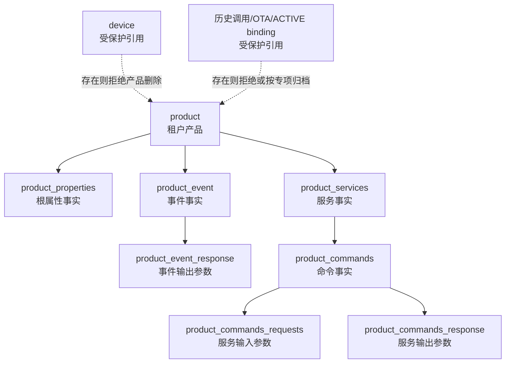

# TD-005：运行模型兼容与删除链技术设计

> 文档状态：In Review
> 版本：0.1.0
> 日期：2026-08-05
> 上游：[ADR-012 产品根属性与服务参数单一事实](../../架构决策/电力运维云平台/ADR-012-产品根属性与服务参数单一事实.md)、[TD-005 1.0.7](./TD-005-物模型模板Schema版本差异与发布API.md)
> 适用档位：standard/full 共用同一实现；mini 不启用电力模板能力
> 说明：本文件冻结候选实现契约，不代表生产代码或数据库迁移已经完成

## 1. 结论

M1 保留现有运行表，但必须修复其事实边界：根属性只在 `product_properties`，服务参数只在 command request/response 链。旧“服务属性”API 通过兼容 adapter 投影，不再读取或写入不存在的 `product_properties.service_id`。

产品删除由一个 tenant-safe 事务编排器统一处理。存在设备、历史服务调用、未完成 OTA、ACTIVE 模板绑定或未知下游引用时拒绝删除；允许删除时显式删除模型子项，任一步失败整体回滚。数据库使用唯一、作用域、同租户引用和 RESTRICT 约束兜底，避免代码遗漏再次产生孤儿。

## 2. 现状证据与差距

| 证据 | 当前事实 | 设计处置 |
|---|---|---|
| 目标库画像 | `product_properties` 20 列，无 `service_id` | 禁止补列，清理 Mapper 引用 |
| `Base_Column_List` / upsert | 仍引用 `service_id` | 与批准列签名逐列对齐 |
| `findAllByServiceId` | Java 可调用，XML statement 被注释 | 删除生产调用，保留兼容 adapter |
| `selectPropertiesByServiceIdList` | 查询不存在列 | 由 command request/response 聚合替换 |
| `ProductPropertyParamVO/ResultVO` | 暴露或必填 `serviceId` | 标记 legacy；新 DTO 分离根属性与服务参数 |
| `ProductServiceThingModelHelper` | 已读写 command 参数链 | 作为迁移参考，不直接视为完成证据 |
| 产品批量删除 | 把 product code 当 template code 删除；遗漏命令/参数/事件/脚本 | 统一删除编排器与完整依赖图 |
| 产品单条删除 | 直接删除产品 | 委托同一批量编排器 |
| 目标库 | 7 张画像表唯一/FK/trigger 为 0 | 分阶段增加约束并验证 |
| 扩展依赖 | `product_event_response`、`product_script`、`device` 等未纳入原 7 表画像 | 扩展删除前依赖扫描和合同 fixture |

目标实例当前 4 个产品均各关联 1 个设备。因此真实产品不能作为删除成功样例；合同测试必须事务内创建独立 fixture，并在测试结束回滚或清理。

## 3. 目标业务架构

模板作用域的属性、事件和服务使用 `template_identification` 指向租户模板；产品作用域使用 `product_identification` 指向租户产品。两种作用域必须且只能存在一种。

## 4. Java 分层与对象契约

### 4.1 包与职责

| 层 | 建议对象 | 约束 |
|---|---|---|
| `iot-device-biz/dal/dataobject/product` | `ProductDO`、`ProductPropertyDO`、`ProductServiceDO`、`ProductCommandDO`、`ProductCommandRequestDO`、`ProductCommandResponseDO`、`ProductEventDO`、`ProductEventResponseDO` | 仅持久化；包含 `tenantId` 和审计字段；不得作为 Controller 响应 |
| `iot-device-api/.../request` | `ProductRootPropertySaveRequest`、`ProductServiceSaveRequest`、`ServiceInputParamRequest`、`ServiceOutputParamRequest` | 不接收 `tenantId`；服务参数不接收可信 `serviceId/commandId` |
| `iot-device-api/.../response` | `ProductRootPropertyResponse`、`ProductServiceDetailResponse` | 根属性无 `serviceId`；服务参数嵌套在明确的 input/output 集合 |
| `iot-device-biz/convert/product` | MapStruct converters | DO/VO 显式映射；禁止宽松 Bean copy 吞掉字段漂移 |
| `iot-device-biz/service/product` | `ProductRuntimeModelService`、`ProductDeletionService` | 事务、租户、锁、删除和聚合唯一入口 |
| `iot-device-biz/dal/pgsql/product` | tenant-safe Mapper/Repository | 不暴露无作用域查询；空 ID 列表直接拒绝或返回空，不生成全表 SQL |

现有 `ProductProperties` 等 API VO 与数据库实体混用只能作为迁移态。新代码不得继续扩大混用；迁移完成后旧类标记 `@Deprecated` 并记录删除版本。

### 4.2 服务参数关联

1. `product_commands.service_id` 是命令所属服务事实。
2. request/response 通过 `commands_id` 关联命令。
3. request/response 的兼容 `service_id` 由服务端从命令派生，读取时不作为 join 主路径。
4. 若影子 `service_id` 与命令不一致，写入失败并记录 `MODEL_SERVICE_PARAM_RELATION_INVALID`；不得静默修正跨租户数据。
5. 新服务保存事务顺序：锁定作用域 → upsert 服务 → upsert/default 命令 → 校验并替换输入/输出 → 写审计/Outbox → 提交。

## 5. Mapper 修复清单

### 5.1 `ProductPropertiesMapper`

- `BaseResultMap/Base_Column_List/insert/insertOrUpdate` 与画像批准的 20 列逐列一致；彻底移除 `service_id`。
- 修复 `insert` 列/值数量不一致和裸 `jdbcType=BIGINT}`。
- 删除 `findAllByServiceId`、`selectPropertiesByServiceIdList` 的 Mapper、Service、Feign 生产调用。
- 根属性查询必须使用 `(tenant context, productIdentification)` 或 `(tenant context, templateIdentification)`，禁止 OR 混合两个作用域。
- 写入前校验 XOR scope；`propertyCode` 规范化后由数据库唯一约束最终裁决。

### 5.2 聚合、缓存与兼容调用者

| 调用者 | 迁移方式 |
|---|---|
| `ProductServiceImpl.productJsonDataAnalysis` | 根属性单独写 `product_properties`；服务 input/output 写 command 参数链 |
| `ProductTemplateServiceImpl` | 服务参数从 command 链导出；不得把参数包装成根属性 |
| `ProductServiceImpl.selectFullProductByProductIdentification` | 响应增加根级 `properties`；每个服务只包含 commands/input/output |
| `ProductModelCacheService` | 消费新的聚合结果与 cache schema version；旧缓存键失效而非混读 |
| `RemoteProductPropertiesService` | 旧按 serviceId 查询标记废弃，由 adapter 投影 command 参数；新增调用不得使用 |
| `ProductServiceThingModelHelper` | 补齐 tenant、唯一、权限、错误码和失败回滚后并入正式 service，不保留平行事实入口 |

兼容 adapter 只能读 command 参数并转换为旧 `ProductPropertyResultVO` 形状。旧请求中的 `serviceId` 仅用于定位服务；参数内容仍写 command 表，不得写根属性表。

## 6. 数据库约束与迁移

### 6.1 约束目标

迁移脚本必须可重复执行，并使用稳定命名：

| 对象 | 目标约束 |
|---|---|
| `product` | `UNIQUE (tenant_id, product_identification)`；另建 `lower(product_identification)` 冲突索引 |
| `product_template` | `UNIQUE (tenant_id, template_identification)`；另建大小写冲突索引 |
| 属性/事件/服务 | CHECK：产品/模板作用域恰好一个非空；两个 partial unique index 分别约束 `(tenant, scope, lower(code))` |
| `product_services` | `UNIQUE (tenant_id, id)` 供复合 FK 使用 |
| `product_commands` | FK `(tenant_id, service_id)`；`UNIQUE (tenant_id, id)` |
| command request/response | FK `(tenant_id, commands_id)`；兼容期校验 `service_id` 与命令一致；参数 code 在同一 command/direction 内唯一 |
| `product_event_response` | FK `(tenant_id, event_id)`；参数 code 在同一 event 内唯一（列补齐后启用） |
| `device` | FK `(tenant_id, product_identification)`，`ON DELETE RESTRICT` |
| `product_script` | 同租户 product 引用；`product_id/product_identification` 必须指向同一产品 |

所有业务 FK 默认 `ON DELETE RESTRICT`，由服务层显式编排删除。这样遗漏子表会导致事务失败，而不是静默遗留孤儿或误删设备。数据库约束名称、DDL 和最终列签名必须进入画像批准基线。

### 6.2 上线步骤

1. 只读 precheck：重复、XOR 异常、孤儿、大小写冲突、影子 serviceId 漂移和下游引用。
2. 建索引使用适合生产的低锁策略；大表 `CREATE UNIQUE INDEX CONCURRENTLY` 不放入普通事务。
3. 先建 exact unique/partial unique/check；FK 可先 `NOT VALID`，再独立 `VALIDATE CONSTRAINT`。
4. 应用先兼容新约束，再启用写路径；禁止先加约束导致旧写入停机。
5. 修复后重跑扩展画像，确认 8 张运行表及下游保护表的签名、重复、异常、孤儿、FK 与 trigger 基线。

任一 precheck 非零时停止迁移，不自动删除或归并业务数据。

## 7. 租户 CRUD 契约

| 编号 | 场景 | 期望 |
|---|---|---|
| TEN-001 | tenant 1 创建根属性 | 行的 tenant_id 只能来自服务端上下文 |
| TEN-002 | tenant 2 按 tenant 1 的 ID 查询 | 404/空，不泄露对象存在性 |
| TEN-003 | tenant 2 更新/删除 tenant 1 对象 | 影响行数 0，业务返回统一不存在 |
| TEN-004 | 批量 ID 混入其他租户 | 整批拒绝，不部分修改 |
| TEN-005 | 服务、命令、参数来自不同租户 | FK/服务校验拒绝，事务回滚 |
| TEN-006 | 未提供 tenant context | fail-closed，不使用数据库默认 `0` |
| TEN-007 | standard/full 同请求 | 相同 SQL 语义、结果和错误码 |
| TEN-008 | mini 调用电力模板 API | `CAPABILITY_NOT_SUPPORTED`，无数据库写入 |

运行模型表不得加入 `ignore-tables`，后台任务必须按 `TenantUtils.execute` 逐租户执行。平台 SYSTEM 模板使用 TD-005 新版本表的 owner scope，不通过 `@TenantIgnore` 绕过现有运行表。

## 8. 产品删除契约

### 8.1 统一入口

`deleteProductById(id)` 必须调用 `deleteProducts(Set.of(id))`。批量编排器：

1. 去重并排序 ID，拒绝空集合、null 和超限批量；
2. 在当前 tenant 下 `SELECT ... FOR UPDATE` 锁定全部产品；缺少任一 ID 则整批 404；
3. 收集 product/template 标识，运行下游保护查询；
4. 若存在 device、历史调用、未完成 OTA、ACTIVE binding 或未知引用，返回完整阻断摘要且不删除；
5. 删除 command requests/responses；
6. 删除 commands，再删除 services；
7. 删除 event responses，再删除 events；
8. 删除产品作用域 properties 和允许清理的 product scripts；
9. 删除 product；
10. 写审计与 Outbox，同一事务提交。

删除产品不得删除 `product_template` 或模板作用域成员。调用参数始终使用 `productIdentification`，旧 `deleteByTemplateIds` 命名和实现必须拆分为明确的 `deleteByProductIdentifications` / `deleteByTemplateIdentifications`。

### 8.2 失败与幂等

- 每个删除阶段均需故障注入测试；异常后所有表行数和内容与事务前完全一致。
- 重复删除同一已删除 ID 返回稳定幂等结果或 404，必须在 API 契约中二选一；M1 候选为同一 idempotency key 重放原结果，普通新请求返回 404。
- 数据库 RESTRICT 异常映射为稳定业务错误，不返回原始表名、SQL 或其他租户信息。
- 删除审计记录产品 ID、标识、各子表删除数、阻断原因、requestId 和操作者；不记录密钥。

### 8.3 合同测试

| 编号 | 场景 | 期望 |
|---|---|---|
| DEL-001 | 无下游产品单条删除 | 完整模型链删除，审计/Outbox 同提交 |
| DEL-002 | 两个无下游产品批量删除 | 全部成功 |
| DEL-003 | 批量含不存在或跨租户 ID | 全部不删除 |
| DEL-004 | 产品存在设备 | `PRODUCT_DELETE_BLOCKED_BY_DEVICE` |
| DEL-005 | 产品存在历史调用/未完成 OTA/ACTIVE binding | 对应稳定阻断码 |
| DEL-006 | 参数、命令、服务任一步失败 | 全链回滚 |
| DEL-007 | 事件参数、事件、属性、脚本任一步失败 | 全链回滚 |
| DEL-008 | 数据库发现未知 RESTRICT 引用 | fail-closed，原数据不变 |
| DEL-009 | 删除产品不影响共享模板 | template 及模板成员完全不变 |
| DEL-010 | 相同 idempotency key 重放 | 返回原结果，不重复发 Outbox |

## 9. 旧格式与非电力兼容

至少建立一个非空 fixture：1 个根属性、1 个服务、1 个命令、2 个输入参数、2 个输出参数和 1 个事件。验证：

- 旧 JSON 导入 → 运行表 → 旧 JSON 导出 round-trip；
- 新聚合响应能明确区分 root properties 与 service input/output；
- 旧 adapter 响应形状兼容，但不产生 `product_properties.service_id`；
- MQTT 遥测仍按根 propertyCode 校验；设备服务调用仍按 serviceCode/command 参数校验；
- cache schema 升级后不混读旧值；
- 非电力产品在 mini/standard/full 保持现有可用行为。

兼容差异必须形成批准的 golden 差异清单，不能以“旧路径本来已损坏”为由跳过回归。

## 10. 可观测性与错误码

关键指标：

- `product_model_legacy_adapter_calls_total{operation,caller}`；
- `product_model_relation_violation_total{relation}`；
- `product_delete_total{result,reason}`；
- `product_delete_rollback_total{stage}`；
- `product_model_tenant_denied_total{operation}`。

稳定错误码至少包含：`MODEL_PROPERTY_SCOPE_INVALID`、`MODEL_MEMBER_CODE_DUPLICATE`、`MODEL_SERVICE_PARAM_RELATION_INVALID`、`PRODUCT_DELETE_BLOCKED_BY_DEVICE`、`PRODUCT_DELETE_BLOCKED_BY_HISTORY`、`PRODUCT_DELETE_BLOCKED_BY_BINDING`、`PRODUCT_DELETE_REFERENCE_UNKNOWN`、`MODEL_TENANT_SCOPE_VIOLATION`。

## 11. 发布、回滚与实现顺序

建议顺序：

1. 扩展画像到 `product_event_response` 与下游保护引用，建立非空 fixture/golden；
2. 修正 `ProductPropertiesMapper` 的确定性缺列和 statement 漂移；
3. 引入 DO/Request/Response/MapStruct 分层和新的聚合 repository；
4. 迁移 Product/Template 聚合、缓存与 Feign，启用 legacy adapter 监控；
5. 加入唯一、XOR、同租户 FK/RESTRICT 约束；
6. 实现统一删除编排器与 TEN/DEL 合同测试；
7. 执行非电力回归、standard/full 同结果和 mini 禁用验证；
8. 生产画像重跑、迁移与应用回滚演练后关闭本子门禁。

回滚顺序：关闭新写路径 → 切回兼容 adapter → 回滚应用；数据库 additive 约束只在确认旧应用不兼容时按批准脚本移除。不得恢复不存在的 `product_properties.service_id`，不得回填双事实。

## 12. 冻结门禁

本文件转 `Approved / Frozen` 前必须具备：

- ADR-012 保持 Accepted，调用者清单经代码 owner 复核；
- 扩展画像、DDL migration/rollback 与原始输出；
- Mapper statement 启动检查和模块编译；
- 非空 fixture、旧格式 round-trip 和缓存 golden；
- TEN-001～008、DEL-001～010 全部自动化通过；
- 生产 Java/TypeScript 消费 JCS/hash golden 的结果不受本次兼容改造影响；
- standard/full 同一实现，mini 无入口/任务/seed；
- TD-005 评审报告记录最终结论与遗留风险。

在门禁关闭前只能进入实现分支和测试，不得宣称运行模型修复或 TD-005 已生产冻结。
