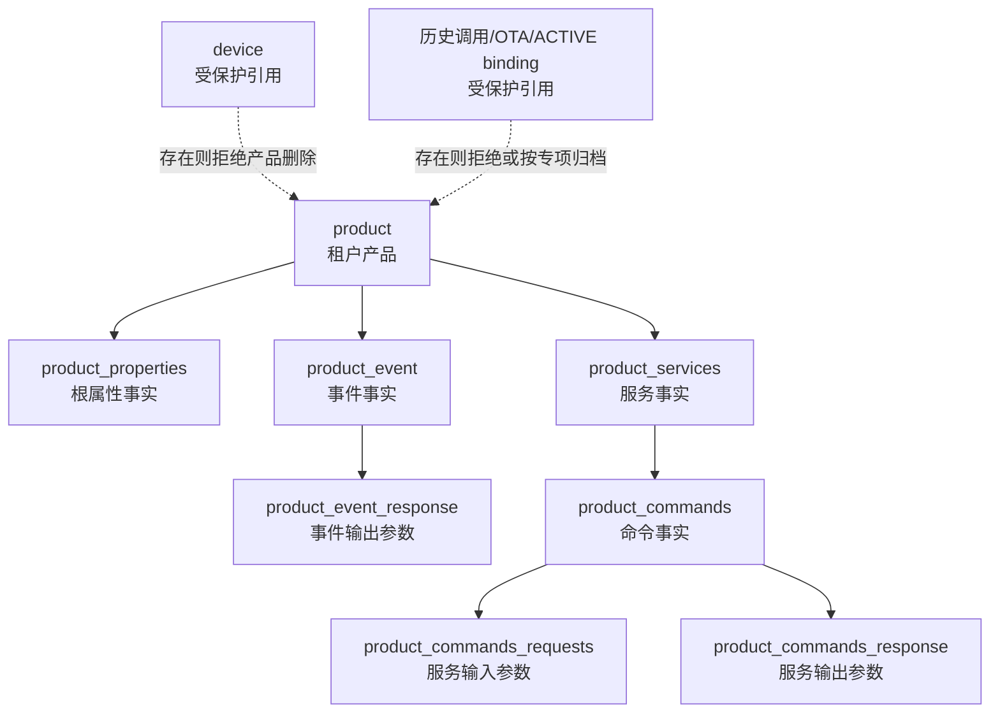

# TD-005：运行模型兼容与删除链技术设计

> 文档状态：In Review
> 版本：0.1.5
> 日期：2026-08-05
> 上游：[ADR-012 1.0.2 产品根属性与服务参数单一事实](../../架构决策/电力运维云平台/ADR-012-产品根属性与服务参数单一事实.md)、[TD-005 1.0.12](./TD-005-物模型模板Schema版本差异与发布API.md)
> 适用档位：standard/full 共用同一实现；mini 不启用电力模板能力
> 说明：本文件冻结候选实现契约，不代表生产代码或数据库迁移已经完成

变更记录：

| 版本 | 变更 |
|---|---|
| 0.1.0 | 首次形成运行事实兼容、租户约束和统一删除链候选设计 |
| 0.1.1 | 复核 R1～R10：纠正批准列签名为 20 列，细化作用域 SQL、脚本删除、扩展画像、回滚、golden 与 TenantIgnore 门禁 |
| 0.1.2 | 处置宪法专项复核：补 Feign 超时/降级、分层测试、性能预算、收缩审批和交付 DoD 证据边界 |
| 0.1.3 | 执行 12 表画像并冻结首份非空旧格式 round-trip fixture/golden，授权按该合同开始 Mapper/DO/VO 实现 |
| 0.1.4 | 完成第一批生产实现：20 列 Mapper/DO 分层、根属性 DTO、legacy command 链投影和 6 项 Java 合同测试；其余门禁保持 OPEN |
| 0.1.5 | 新增主代码 legacy 8 表双向转换 adapter，直接消费冻结 fixture/golden；Java 定向合同测试累计 9 项 PASS，数据库接线与租户集成仍 OPEN |

## 1. 结论

M1 保留现有运行表，但必须修复其事实边界：根属性只在 `product_properties`，服务参数只在 command request/response 链。旧“服务属性”API 通过兼容 adapter 投影，不再读取或写入不存在的 `product_properties.service_id`。

产品删除由一个 tenant-safe 事务编排器统一处理。存在设备、历史服务调用、未完成 OTA、ACTIVE 模板绑定或未知下游引用时拒绝删除；允许删除时显式删除模型子项，任一步失败整体回滚。数据库使用唯一、作用域、同租户引用和 RESTRICT 约束兜底，避免代码遗漏再次产生孤儿。

## 2. 现状证据与差距

| 证据 | 当前事实 | 设计处置 |
|---|---|---|
| 目标库画像 | `product_properties` 20 列，无 `service_id` | 禁止补列，清理 Mapper 引用 |
| `Base_Column_List` / upsert | 仍引用 `service_id` | 与批准列签名逐列对齐 |
| `findAllByServiceId` | Java 可调用，XML statement 被注释 | 删除生产调用，保留兼容 adapter |
| `selectPropertiesByServiceIdList` | 查询不存在列 | 由 command request/response 聚合替换 |
| `ProductPropertyParamVO/ResultVO` | 暴露或必填 `serviceId` | 标记 legacy；新 DTO 分离根属性与服务参数 |
| `ProductServiceThingModelHelper` | 已读写 command 参数链 | 作为迁移参考，不直接视为完成证据 |
| 产品批量删除 | 把 product code 当 template code 删除；遗漏命令/参数/事件/脚本 | 统一删除编排器与完整依赖图 |
| 产品单条删除 | 直接删除产品 | 委托同一批量编排器 |
| 目标库 | 7 张画像表唯一/FK/trigger 为 0 | 分阶段增加约束并验证 |
| 扩展依赖 | `product_event_response`、`product_script`、`device` 等未纳入原 7 表画像 | 扩展删除前依赖扫描和合同 fixture |

`product_properties` 的批准签名以画像结果 `schemaFacts.tables.product_properties` 为唯一依据，共 20 列：`id`、`property_name`、`property_code`、`datatype`、`description`、`enumlist`、`max`、`maxlength`、`method`、`min`、`required`、`step`、`unit`、`create_by`、`create_time`、`update_by`、`update_time`、`template_identification`、`product_identification`、`tenant_id`。画像报告中的“21 行样本”是修复前数据行数，不是列数；不得据此把批准签名改成 18 列。

目标实例当前 4 个产品均各关联 1 个设备。因此真实产品不能作为删除成功样例；合同测试必须事务内创建独立 fixture，并在测试结束回滚或清理。

## 3. 目标业务架构



模板作用域的属性、事件和服务使用 `template_identification` 指向租户模板；产品作用域使用 `product_identification` 指向租户产品。两种作用域必须且只能存在一种。

## 4. Java 分层与对象契约

### 4.1 包与职责

| 层 | 建议对象 | 约束 |
|---|---|---|
| `iot-device-biz/dal/dataobject/product` | `ProductDO`、`ProductPropertyDO`、`ProductServiceDO`、`ProductCommandDO`、`ProductCommandRequestDO`、`ProductCommandResponseDO`、`ProductEventDO`、`ProductEventResponseDO` | 仅持久化；包含 `tenantId` 和审计字段；`ProductPropertyDO` 显式声明 `tenantId/productIdentification/templateIdentification`；不得作为 Controller 响应 |
| `iot-device-api/.../request` | `ProductRootPropertySaveRequest`、`ProductServiceSaveRequest`、`ServiceInputParamRequest`、`ServiceOutputParamRequest` | 不接收 `tenantId`；服务参数不接收可信 `serviceId/commandId` |
| `iot-device-api/.../response` | `ProductRootPropertyResponse`、`ProductServiceDetailResponse` | 根属性无 `serviceId`；服务参数嵌套在明确的 input/output 集合 |
| `iot-device-biz/convert/product` | MapStruct converters | DO/VO 显式映射；禁止宽松 Bean copy 吞掉字段漂移 |
| `iot-device-biz/service/product` | `ProductRuntimeModelService`、`ProductDeletionService` | 事务、租户、锁、删除和聚合唯一入口 |
| `iot-device-biz/dal/pgsql/product` | tenant-safe Mapper/Repository | 不暴露无作用域查询；空 ID 列表直接拒绝或返回空，不生成全表 SQL |

现有 `ProductProperties` 等 API VO 与数据库实体混用只能作为迁移态。新代码不得继续扩大混用；迁移完成后旧类标记 `@Deprecated` 并记录删除版本。

`ProductPropertyDO` 必须显式声明 `tenantId`、`productIdentification`、`templateIdentification`。`tenantId` 的 INSERT 值由服务端租户上下文/拦截器负责，Request 不得提交；SELECT 的 `BaseResultMap` 仍必须显式映射这三个字段，不能依赖自动映射或把拦截器误当成读取映射器。

### 4.2 服务参数关联

1. `product_commands.service_id` 是命令所属服务事实。
2. request/response 通过 `commands_id` 关联命令。
3. request/response 的兼容 `service_id` 由服务端从命令派生，读取时不作为 join 主路径。
4. 若影子 `service_id` 与命令不一致，写入失败并记录 `MODEL_SERVICE_PARAM_RELATION_INVALID`；不得静默修正跨租户数据。
5. 新服务保存事务顺序：锁定作用域 → upsert 服务 → upsert/default 命令 → 校验并替换输入/输出 → 写审计/Outbox → 提交。

## 5. Mapper 修复清单

### 5.1 `ProductPropertiesMapper`

- `BaseResultMap/Base_Column_List/insert/insertOrUpdate` 与画像批准的 20 列逐列一致；彻底移除 `service_id`。
- `BaseResultMap` 必须显式映射 `tenant_id → tenantId`、`product_identification → productIdentification`、`template_identification → templateIdentification`，并通过合同测试证明 20 列均可读取；现有公共 `ProductProperties` 已有后两个字段但缺少 `tenantId`，不等同于合格的新 DO。
- 修复 `insert` 列/值数量不一致和裸 `jdbcType=BIGINT}`。
- 删除 `findAllByServiceId`、`selectPropertiesByServiceIdList` 的 Mapper、Service、Feign 生产调用。
- 根属性查询必须使用 `(tenant context, productIdentification)` 或 `(tenant context, templateIdentification)`，禁止 OR 混合两个作用域。
- 写入前校验 XOR scope；`propertyCode` 规范化后由数据库唯一约束最终裁决。

### 5.2 聚合、缓存与兼容调用者

| 调用者 | 迁移方式 |
|---|---|
| `ProductServiceImpl.productJsonDataAnalysis` | 根属性单独写 `product_properties`；服务 input/output 写 command 参数链 |
| `ProductTemplateServiceImpl` | 服务参数从 command 链导出；不得把参数包装成根属性 |
| `ProductServiceImpl.selectFullProductByProductIdentification` | 响应增加根级 `properties`；每个服务只包含 commands/input/output |
| `ProductModelCacheService` | 消费新的聚合结果与 cache schema version；旧缓存键失效而非混读 |
| `RemoteProductPropertiesService` | 旧按 serviceId 查询标记废弃，由 adapter 投影 command 参数；新增调用不得使用 |
| `ProductServiceThingModelHelper` | 补齐 tenant、唯一、权限、错误码和失败回滚后并入正式 service，不保留平行事实入口 |

兼容 adapter 只能读 command 参数并转换为旧 `ProductPropertyResultVO` 形状。旧请求中的 `serviceId` 仅用于定位服务；参数内容仍写 command 表，不得写根属性表。

旧 OpenFeign 契约在兼容窗口内必须显式配置连接/读取超时、有限重试和稳定降级错误；不得以空集合伪装依赖失败。提供者/消费者合同同时覆盖当前聚合契约和 legacy adapter，直至旧契约正式下线。

## 6. 数据库约束与迁移

### 6.1 约束目标

迁移脚本必须可重复执行，并使用稳定命名：

| 对象 | 目标约束 |
|---|---|
| `product` | `UNIQUE (tenant_id, product_identification)`；另建 `lower(product_identification)` 冲突索引 |
| `product_template` | `UNIQUE (tenant_id, template_identification)`；另建大小写冲突索引 |
| 属性/事件/服务 | CHECK：产品/模板作用域恰好一个非空；两个 partial unique index 分别约束 `(tenant, scope, lower(code))` |
| `product_services` | `UNIQUE (tenant_id, id)` 供复合 FK 使用 |
| `product_commands` | FK `(tenant_id, service_id)`；`UNIQUE (tenant_id, id)` |
| command request/response | FK `(tenant_id, commands_id)`；兼容期校验 `service_id` 与命令一致；参数 code 在同一 command/direction 内唯一 |
| `product_event_response` | FK `(tenant_id, event_id)`；参数 code 在同一 event 内唯一（列补齐后启用） |
| `device` | FK `(tenant_id, product_identification)`，`ON DELETE RESTRICT` |
| `product_script` | 同租户 product 引用；`product_id/product_identification` 必须指向同一产品 |

所有业务 FK 默认 `ON DELETE RESTRICT`，由服务层显式编排删除。这样遗漏子表会导致事务失败，而不是静默遗留孤儿或误删设备。数据库约束名称、DDL 和最终列签名必须进入画像批准基线。

PostgreSQL 作用域约束统一使用 `CHECK (num_nonnulls(product_identification, template_identification) = 1)`。每张具有双作用域的成员表分别建立产品和模板 partial unique index；`product_properties` 的冻结样式为：

```sql
CREATE UNIQUE INDEX uq_product_properties_product_code_ci
    ON product_properties (tenant_id, product_identification, lower(property_code))
    WHERE product_identification IS NOT NULL;

CREATE UNIQUE INDEX uq_product_properties_template_code_ci
    ON product_properties (tenant_id, template_identification, lower(property_code))
    WHERE template_identification IS NOT NULL;
```

事件和服务表按各自稳定 code 列使用同一模式，不得用一个包含两个可空 scope 的普通唯一约束替代。

### 6.2 上线步骤

1. 只读 precheck：重复、XOR 异常、孤儿、大小写冲突、影子 serviceId 漂移和下游引用。
2. 建索引使用适合生产的低锁策略；大表 `CREATE UNIQUE INDEX CONCURRENTLY` 不放入普通事务。
3. 先建 exact unique/partial unique/check；FK 可先 `NOT VALID`，再独立 `VALIDATE CONSTRAINT`。
4. 应用先兼容新约束，并在目标 PostgreSQL 上通过 TEN-001～008、DEL-001～010 后再启用写路径；禁止用“代码已兼容”的声明替代合同证据，也禁止先加约束导致旧写入停机。
5. 修复后重跑扩展画像。范围固定为 8 张核心运行表：`product`、`product_properties`、`product_event`、`product_event_response`、`product_services`、`product_commands`、`product_commands_requests`、`product_commands_response`；以及 4 张受保护依赖表：`product_script`、`device`、`device_service_invoke_response`、`ota_packages`，合计 12 张。逐表记录列签名、租户列、重复、作用域异常、孤儿、FK、unique/check 与 trigger 基线；ACTIVE binding 表实现后必须追加而不能静默替换现有清单。

任一 precheck 非零时停止迁移，不自动删除或归并业务数据。

## 7. 租户 CRUD 契约

| 编号 | 场景 | 期望 |
|---|---|---|
| TEN-001 | tenant 1 创建根属性 | 行的 tenant_id 只能来自服务端上下文 |
| TEN-002 | tenant 2 按 tenant 1 的 ID 查询 | 404/空，不泄露对象存在性 |
| TEN-003 | tenant 2 更新/删除 tenant 1 对象 | 影响行数 0，业务返回统一不存在 |
| TEN-004 | 批量 ID 混入其他租户 | 整批拒绝，不部分修改 |
| TEN-005 | 服务、命令、参数来自不同租户 | FK/服务校验拒绝，事务回滚 |
| TEN-006 | 未提供 tenant context | fail-closed，不使用数据库默认 `0` |
| TEN-007 | standard/full 同请求 | 相同 SQL 语义、结果和错误码 |
| TEN-008 | mini 调用电力模板 API | `CAPABILITY_NOT_SUPPORTED`，无数据库写入 |

运行模型表不得加入 `ignore-tables`，后台任务必须按 `TenantUtils.execute` 逐租户执行。平台 SYSTEM 模板使用 TD-005 新版本表的 owner scope，不通过 `@TenantIgnore` 绕过现有运行表。

## 8. 产品删除契约

### 8.1 统一入口

`deleteProductById(id)` 必须调用 `deleteProducts(Set.of(id))`。批量编排器：

1. 去重并排序 ID，拒绝空集合、null 和超限批量；默认及硬上限均为 500 个产品 ID，若压测要求更小则只允许下调；
2. 在当前 tenant 下 `SELECT ... FOR UPDATE` 锁定全部产品；缺少任一 ID 则整批 404；
3. 收集 product/template 标识，运行下游保护查询；
4. 显式查询 `device`、`device_service_invoke_response`、`ota_packages` 和 ACTIVE binding；若存在设备、历史调用、未完成 OTA、有效绑定或未知引用，返回完整阻断摘要且不删除；
5. 删除 command requests/responses；
6. 删除 commands，再删除 services；
7. 删除 event responses，再删除 events；
8. 删除产品作用域 properties 和允许清理的 product scripts；
9. 删除 product；
10. 写审计与 Outbox，同一事务提交。

删除产品不得删除 `product_template` 或模板作用域成员。调用参数始终使用 `productIdentification`，旧 `deleteByTemplateIds` 命名和实现必须拆分为明确的 `deleteByProductIdentifications` / `deleteByTemplateIdentifications`。

`product_script` 不是模板/全局脚本仓储；目标表同时保存 `product_id` 与非空 `product_identification`。删除时只允许清理“当前 tenant + `product_id` 等于已锁定产品 ID + `product_identification` 等于已锁定产品编码”的交集。任一字段单独匹配、两字段互相矛盾或租户不一致时必须以未知受保护引用 fail-closed，不得猜测作用域或扩大删除范围。

### 8.2 失败与幂等

- 每个删除阶段均需故障注入测试；异常后所有表行数和内容与事务前完全一致。
- 重复删除同一已删除 ID 返回稳定幂等结果或 404，必须在 API 契约中二选一；M1 候选为同一 idempotency key 重放原结果，普通新请求返回 404。
- 数据库 RESTRICT 异常映射为稳定业务错误，不返回原始表名、SQL 或其他租户信息。
- 删除审计记录产品 ID、标识、各子表删除数、阻断原因、requestId 和操作者；不记录密钥。

### 8.3 合同测试

| 编号 | 场景 | 期望 |
|---|---|---|
| DEL-001 | 无下游产品单条删除 | 完整模型链删除，审计/Outbox 同提交 |
| DEL-002 | 两个无下游产品批量删除 | 全部成功 |
| DEL-003 | 批量含不存在或跨租户 ID | 全部不删除 |
| DEL-004 | 产品存在设备 | `PRODUCT_DELETE_BLOCKED_BY_DEVICE` |
| DEL-005 | 产品存在历史调用/未完成 OTA/ACTIVE binding | 对应稳定阻断码 |
| DEL-006 | 参数、命令、服务任一步失败 | 全链回滚 |
| DEL-007 | 事件参数、事件、属性、脚本任一步失败 | 全链回滚 |
| DEL-008 | 数据库发现未知 RESTRICT 引用 | fail-closed，原数据不变 |
| DEL-009 | 删除产品不影响共享模板 | template 及模板成员完全不变 |
| DEL-010 | 相同 idempotency key 重放 | 返回原结果，不重复发 Outbox |

## 9. 旧格式与非电力兼容

至少建立一个非空 fixture：1 个根属性、1 个服务、1 个命令、2 个输入参数、2 个输出参数和 1 个事件。验证：

- 旧 JSON 导入 → 运行表 → 旧 JSON 导出 round-trip；
- 新聚合响应能明确区分 root properties 与 service input/output；
- 旧 adapter 响应形状兼容，但不产生 `product_properties.service_id`；
- MQTT 遥测仍按根 propertyCode 校验；设备服务调用仍按 serviceCode/command 参数校验；
- cache schema 升级后不混读旧值；
- 非电力产品在 mini/standard/full 保持现有可用行为。

兼容差异必须形成批准的 golden 差异清单，不能以“旧路径本来已损坏”为由跳过回归。

fixture/golden 目录按 `legacySchemaVersion + TD-005Version` 版本化。manifest 必须记录 fixture、期望输出、canonical 文件的相对路径与 SHA-256；任何 golden 变更必须同步更新 manifest/hash，并由评审确认是批准差异而非自动覆盖。

首份非空 round-trip golden 及 manifest/hash 必须在 Mapper/DO/VO 迁移代码开始前完成评审；§11 第 2 步不得与该前置证据并行抢跑。

## 10. 可观测性与错误码

关键指标：

- `product_model_legacy_adapter_calls_total{operation,caller}`；
- `product_model_relation_violation_total{relation}`；
- `product_delete_total{result,reason}`；
- `product_delete_rollback_total{stage}`；
- `product_model_tenant_denied_total{operation}`。

稳定错误码至少包含：`MODEL_PROPERTY_SCOPE_INVALID`、`MODEL_MEMBER_CODE_DUPLICATE`、`MODEL_SERVICE_PARAM_RELATION_INVALID`、`PRODUCT_DELETE_BLOCKED_BY_DEVICE`、`PRODUCT_DELETE_BLOCKED_BY_HISTORY`、`PRODUCT_DELETE_BLOCKED_BY_BINDING`、`PRODUCT_DELETE_REFERENCE_UNKNOWN`、`MODEL_TENANT_SCOPE_VIOLATION`。

性能与资源预算遵循宪法默认值：普通运行模型查询 P95 不高于 500 ms，写操作 P95 不高于 1 s；同步批量删除最多 500 个 ID，超过上限必须拒绝或改为可查询状态的异步任务。冻结前必须在 standard 最低资源规格上给出数据库查询计划、索引命中、P95/P99、最大请求/响应体和 500 项批量的 CPU/内存/锁等待证据；full 复用同一业务实现，仅允许基础设施和配额增强。

## 11. 发布、回滚与实现顺序

建议顺序：

1. 扩展画像到 `product_event_response` 与下游保护引用，建立非空 fixture/golden；
2. 修正 `ProductPropertiesMapper` 的确定性缺列和 statement 漂移；
3. 引入 DO/Request/Response/MapStruct 分层和新的聚合 repository；
4. 迁移 Product/Template 聚合、缓存与 Feign，启用 legacy adapter 监控；
5. 加入唯一、XOR、同租户 FK/RESTRICT 约束；
6. 实现统一删除编排器与 TEN/DEL 合同测试；
7. 执行非电力回归、standard/full 同结果和 mini 禁用验证；
8. 生产画像重跑、迁移与应用回滚演练后关闭本子门禁。

回滚顺序：关闭新写路径 → 验证 legacy adapter 能从 command 链为旧响应派生 `serviceId` → 运行“新应用写入、旧应用/adapter 读取”的双向兼容测试 → 切回兼容 adapter → 回滚应用。数据库 additive 约束只在确认旧应用不兼容时按批准脚本移除。不得恢复不存在的 `product_properties.service_id`，不得回填双事实。

## 12. 冻结门禁

本文件转 `Approved / Frozen` 前必须具备：

- ADR-012 保持 Accepted，调用者清单经代码 owner 复核；
- 扩展画像、DDL migration/rollback 与原始输出；
- 影子列收缩跟踪项已登记 owner/到期日；独立收缩 ADR 包含备份、保留期、审批、执行/回滚脚本和恢复演练；
- Mapper statement 启动检查和模块编译；
- 非空 fixture、旧格式 round-trip 和缓存 golden；
- golden 文件 SHA-256 与版本化 manifest 同步且差异经评审；
- TEN-001～008、DEL-001～010 全部自动化通过；
- 分层测试明确覆盖 Mapper/转换/校验单元测试，PostgreSQL/事务/约束集成测试，Feign 提供者/消费者合同和产品删除端到端测试；
- OpenFeign 连接/读取超时、有限重试、降级错误及依赖超时测试通过；
- standard 最低资源规格下的查询/写入 P95/P99、查询计划、批量上限和资源证据通过；
- 当前画像识别的 5 个 `@TenantIgnore` 使用点完成静态复核，新代码不通过这些入口触达任何运行表；
- SYSTEM 模板只使用新版本模板仓储，查询硬编码 `owner_scope='SYSTEM' AND tenant_id=0`，普通租户只读且不存在通用 TenantIgnore 写路径；
- 生产 Java/TypeScript 消费 JCS/hash golden 的结果不受本次兼容改造影响；
- standard/full 同一实现，mini 无入口/任务/seed；
- TD-005 评审报告记录最终结论与遗留风险。

在门禁关闭前只能进入实现分支和测试，不得宣称运行模型修复或 TD-005 已生产冻结。

## 13. 评审意见（2026-08-05）

### 13.1 总体评价

**技术设计质量：高。** 本文精准承接画像报告 §4 的 11 项 P0 风险、孤儿属性处置方案和 ADR-012 的单一事实方向，形成"事实边界修复 + 删除链统一 + 数据库约束兜底"的三层闭环。核心亮点：

- **事实边界清晰**：§1/§3 把"根属性 vs 服务参数"彻底分家，旧"服务属性"通过兼容 adapter 投影，不再读取不存在的 `service_id`；
- **删除链统一**：§8.1 把单条删除 `deleteProductById` 强制委托给批量编排器 `deleteProducts(Set.of(id))`，覆盖完整依赖图 `requests → responses → commands → services → event_responses → events → properties → scripts → product`；
- **数据库约束兜底**：§6.1 用 `RESTRICT` 约束 + 同租户 FK + XOR scope CHECK 防御代码遗漏再次产生孤儿；
- **租户契约完整**：§7 TEN-001～008 覆盖跨租户查询/写入/批量混合/fail-closed/档位隔离，与 TD-005 §16 capability 一致；
- **合同测试覆盖**：§8.3 DEL-001～010 覆盖正常/批量/跨租户/下游阻断/回滚/幂等/不影响共享模板，场景完整；
- **非电力兼容**：§9 明确要求"不得以'旧路径本来已损坏'为由跳过回归"，建立 round-trip golden。

### 13.2 关键问题（MEDIUM）

| # | 位置 | 观察 | 建议修订 |
|---|---|---|---|
| R1 | §2 表格 / §5.1 | "`product_properties` 20 列"与画像报告 §3（21 行样本的列数）和 `Base_Column_List` 实际列数（含 `service_id` 为 17，去除后为 16）不一致。DDL 实际为 19 列（含 `id`/`tenant_id`/`product_identification`/`template_identification`）；若加上这两列则 18。设计未明确"批准列签名"是否包含 `product_identification` / `template_identification` 两列 | 明确"批准列签名 = 18 列（含 `id`、`tenant_id`、`product_identification`、`template_identification`，不含 `service_id`）"；BaseResultMap 必须补 `product_identification` 和 `template_identification` 两个 `<result>` 映射，否则 `selectByPrimaryKey` 投影出这两列但 DO 无字段接收，作用域信息在应用层丢失 |
| R2 | §8.1 第 8 步 | "删除产品作用域 properties 和**允许清理的** product scripts"——"允许清理"语义未定义。`product_script` 可能包含产品级脚本和共享脚本两类，作用域不清 | 明确：(a) `product_script` 按 `product_identification` 作用域过滤；(b) 仅清理 `product_identification = 被删除产品` 的脚本；(c) 模板作用域或全局脚本不进入删除图 |
| R3 | §6.1 | "CHECK：产品/模板作用域恰好一个非空"未给出 SQL 表达式。PostgreSQL CHECK 不能直接用 XOR 关键字 | 冻结表达式：`CHECK (((product_identification IS NOT NULL)::int + (template_identification IS NOT NULL)::int) = 1)`；并对 `lower(code)` 用 partial unique index `(tenant_id, product_identification, lower(code)) WHERE product_identification IS NOT NULL` 与 `(tenant_id, template_identification, lower(code)) WHERE template_identification IS NOT NULL` 分离两个作用域 |
| R4 | §11 回滚顺序 | "关闭新写路径 → 切回兼容 adapter → 回滚应用"未说明按新约束写入的数据如何兼容旧应用。旧应用期望 `ProductPropertyResultVO.serviceId` 有值，但新应用写入后 `product_properties` 无 `service_id` | 补：(a) 回滚前先验证 legacy adapter 能从 command 链派生 `serviceId`；(b) 冻结"新应用写入数据在回滚后仍可通过 adapter 读取"的双向兼容测试；(c) 回滚后不恢复 `service_id` 列，遵守 ADR-012 "不得回填双事实" |
| R5 | §4.1 DO 分层 | DO 必须包含 `tenantId`、`productIdentification`、`templateIdentification`，但当前 `ProductProperties` 实体三者皆无 | 明确：(a) DO 显式声明三个字段；(b) `BaseResultMap` 同步补三个 `<result>`；(c) `tenantId` 由 `TenantLineInnerInterceptor` 在 INSERT 时自动注入，但 SELECT 投影必须显式映射 |

### 13.3 次要建议（LOW）

| # | 位置 | 建议 |
|---|---|---|
| R6 | §2 | "扩展依赖" 提到 `product_event_response` / `product_script` / `device`，但未明确扩展画像的列签名和 FK 基线。建议补"扩展画像 8 张表清单"：`product` / `product_properties` / `product_event` / `product_event_response` / `product_services` / `product_commands` / `product_commands_requests` / `product_commands_response` / `product_script` / `device` / `device_service_invoke_response` / `ota_packages` |
| R7 | §8.1 第 4 步 | "下游保护查询"应明确覆盖 `device_service_invoke_response` 和 `ota_packages`，而不仅是 `device`。当前 DEL-005 阻断码"历史调用/未完成 OTA"暗示会查，但设计正文未列出 |
| R8 | §9 | 非电力回归 golden 建议版本化管理（按 schema 版本 + TD-005 版本），并在 §12 冻结门禁中增加"golden 文件哈希与 manifest 同步" |
| R9 | §6.2 上线步骤 | 第 4 步"应用先兼容新约束，再启用写路径"需明确"兼容"的定义——建议增加"应用写入路径已通过 TEN/DEL 合同测试"作为启用前置条件 |
| R10 | §12 冻结门禁 | 增加一项：`@TenantIgnore` 5 处使用点（画像报告 §7.1）必须在新代码中不再触达运行表；新系统模板仓储硬编码 `owner_scope='SYSTEM' AND tenant_id=0` |

### 13.4 与上游文档的协同

- **与 ADR-012 协同**：§1/§3/§4/§5 全面落地"根属性 vs 服务参数单一事实"，不补 `service_id`、不回填双事实；§11 回滚顺序明确"不得恢复不存在的 `service_id`"；
- **与画像报告协同**：§2 表格 10 项证据直接承接画像报告 §4 的 10 行 P0 风险；§5.1 修复清单覆盖画像报告识别的所有 Mapper 漂移；§6.1 约束目标覆盖画像报告 §3"唯一/FK/trigger 为 0"；
- **与孤儿属性处置方案协同**：本设计第 8 节删除链统一后，未来不会再产生新的孤儿属性；§6.1 RESTRICT 约束是"预防再犯"的数据库兜底；
- **与 TD-005 主文档协同**：§7 TEN-008 与 TD-005 §16 capability `power.device.model` 一致；§12 冻结门禁呼应 TD-005 §23 门禁 1/6/7/8。

### 13.5 结论

**技术设计可采纳。** 与 ADR-012 方向一致，与画像报告 P0 风险一一对应，删除链 + 约束 + 合同测试三层防御完整。

执行建议：

1. **先补 R1–R5**：明确"批准列签名 = 18 列"、BaseResultMap 补齐三字段、`product_script` 作用域清理范围、CHECK 表达式 SQL、回滚双向兼容测试、DO 字段声明；
2. **按 §11 顺序实现**：扩展画像 → Mapper 修复 → DO/Request/Response 分层 → 聚合/缓存迁移 → 约束添加 → 删除编排器 → 非电力回归 → 生产画像；
3. **合同测试必须真实运行**：TEN-001～008、DEL-001～010 全部 18 个场景在 CI 中持久化，不能只在设计文档中"声明通过"；
4. **扩展画像 8+ 张表**：本设计扩展了画像范围（`product_event_response`、`product_script`、`device`、`device_service_invoke_response`、`ota_packages`），新画像结果必须进入画像报告 §3 的批准基线；
5. **回滚演练**：在 staging 环境执行一次"新应用上线 → 按新约束写入数据 → 触发回滚 → 旧应用恢复"全流程，验证 legacy adapter 派生 `serviceId` 的能力。

本设计获批并执行后，可关闭画像报告 §7 的"删除链代码 FAIL"和"Mapper/实体/VO 一致性 FAIL"两个子门禁；其他子门禁（`service_id` 一致性 → 由 ADR-012 Accepted 关闭、业务唯一约束 → 由 §6.1 约束添加关闭、租户结构 CRUD 合同 → 由 §7 TEN 测试关闭）仍需单独证据。TD-005 整体状态继续维持 `In Review`。

### 13.6 最终处置

| 评审项 | 处置 | 依据/修订 |
|---|---|---|
| R1 | 驳回原列数并纠正 | 画像 JSON 明确 `columnCount=20`；“21”是修复前数据行数。批准签名保持 20 列，并补齐三个作用域/租户字段映射要求 |
| R2 | 采纳并按目标表事实收紧 | `product_script` 必须同时匹配 tenant、产品 ID 和产品编码；不一致即 fail-closed，不臆造模板/全局脚本作用域 |
| R3～R5 | 采纳并细化 | 使用 `num_nonnulls(...)=1`、双 partial unique index、双向回滚兼容测试和显式 DO/ResultMap 字段 |
| R6、R7 | 采纳并纠正数量 | 固定为 8 张核心运行表 + 4 张受保护依赖表，共 12 张；保护查询显式覆盖历史调用和 OTA |
| R8～R10 | 采纳 | golden/manifest 版本与 hash、启用前 TEN/DEL 证据、TenantIgnore 和 SYSTEM owner scope 门禁已补入正文 |

评审正文 §13.2/§13.5 中“18 列”“8+ 张表”及“设计获批即可关闭代码门禁”均不作为实施依据。ADR-012 Accepted 只关闭事实归属决策；影子列一致性、Mapper/DO/VO、删除链和约束门禁必须由真实代码、DDL、测试及目标库结果逐项关闭。本文件继续保持 `In Review`。

## 14. 迁移前证据冻结（2026-08-05）

### 14.1 12 表画像

`target-schema-profile.sql` 1.2.0 已在本地目标集成实例的只读事务中执行，`target-schema-profile-result.schema.json` 1.1.0 与机器摘要校验 PASS。8 张核心运行表和 4 张受保护依赖表均存在，当前跨表孤儿与关系不一致为 0。以下风险仍阻断 DDL/删除链上线：`product_script` 缺少主键；业务唯一约束、外键、check、trigger 均为 0；`ota_packages.tenant_id` 可空；多数命令、事件、脚本、历史调用和 OTA 表为空，只能证明结构，不能证明生产数据兼容。

### 14.2 非空旧格式 round-trip fixture/golden

冻结目录：`verification/legacy-roundtrip/easyaiot-legacy-thing-model-v1_td005-1.0.10/`。fixture 是非电力通用产品，适用于 mini/standard/full 既有行为回归，不向 mini 引入电力能力。覆盖 1 个根属性、1 个服务、1 个命令、1 个输入参数、1 个输出参数、1 个事件和 1 个事件输出参数，并投影到全部 8 张核心运行表。

批准差异限于数据库生成 ID、由 command 链派生的 `serviceId/commandId`、兼容别名、描述镜像、BOOL 标签和数据库数值文本恢复为 JSON 数值。以下不允许变化：根属性不得出现 `serviceId`；服务参数只能进入 command request/response；不得创建或回填 `product_properties.service_id`；tenant 与产品标识必须保持；批准差异外业务语义必须结构相等。

参考验证已对运行投影、旧格式输出、JCS canonical 和 manifest SHA-256 执行 PASS，canonical SHA-256 为 `b0457e19d65a5de810222ab2ee5ac92fdafcb799058d3857944f88aa66e70262`。本证据完成了 §9/§12 要求的 Mapper/DO/VO 迁移前置冻结；主代码 Java 纯转换 adapter 已在 §14.5 消费同一 fixture/golden，但 TypeScript 客户端、PostgreSQL tenant 持久化与接口接线尚未完成，因此兼容实现总门禁仍不能转 PASS。

### 14.3 当前授权边界

- 允许：按冻结 golden 修正 Mapper/DO/VO/ResultMap 和 legacy adapter，编写 migration/rollback 候选及自动测试；
- 禁止：把参考验证描述为生产代码 PASS，提前启用 DDL 约束，或开始尚未通过 TEN/DEL 的产品删除链；
- 状态：本设计继续为 `In Review / OPEN_REMEDIATION_REQUIRED`。

### 14.4 第一批生产实现证据（2026-08-05）

已按冻结合同完成以下代码修复：

- 新增 `ProductPropertyDO`，显式声明 `tenantId/productIdentification/templateIdentification`，不声明 `serviceId`；原 `ProductProperties` 退出 Mapper 持久化边界并标记为 legacy；
- `ProductPropertiesMapper.xml` 的 `BaseResultMap/Base_Column_List` 与画像批准的 20 列逐列一致，修复原 `insert` 绑定错误；公开 Mapper/Service 已移除 `findAllByServiceId` 和 `selectPropertiesByServiceIdList`；
- 新增 `ProductRootPropertySaveRequest/ProductRootPropertyResponse`，均不接收或返回 `serviceId`，保存请求也不接收 `tenantId`；原 `ProductPropertyParamVO/ResultVO.serviceId` 仅保留为 `@Deprecated` 兼容字段且不再必填；
- 新增 `LegacyServicePropertyAdapter`，旧按服务读取只从 `product_commands → product_commands_requests/response` 聚合投影；旧 Feign 路由与 provider 对齐为 path variable，失败返回稳定失败结果而非空集合；
- `ProductServiceImpl` 和 `ProductTemplateServiceImpl` 不再查询 `product_properties.service_id`；产品聚合结果把根属性放在产品级 `properties`，服务参数继续位于 command request/response 链；
- 空 ID/模板列表查询和删除使用 `1 = 0` fail-closed，不生成无条件全表访问。

执行证据：

1. `mvn -pl iot-device/iot-device-biz -am compile -DskipTests -Dmaven.compiler.source=17 -Dmaven.compiler.target=17`：`BUILD SUCCESS`；
2. 定向运行 `ProductPropertiesMapperContractTest`、`LegacyServicePropertyAdapterTest`：6 tests，0 failure，0 error；
3. 合同测试实际使用 MyBatis `XMLMapperBuilder` 解析 XML，并逐一断言每个公开 Mapper 方法存在 statement；同时断言批准列签名、DO/DTO 事实边界和 legacy input/output 投影。

本批次只把“确定性 Mapper/DO/VO 漂移”和“旧 service-property 只读投影”从未实现推进为已有单元/合同证据，**尚未关闭整个兼容实现门禁**。冻结 golden 的 Java 纯转换消费已由 §14.5 补齐；PostgreSQL tenant CRUD/拦截器集成、命令影子 `service_id` 一致性校验、旧缓存与 Feign 消费者合同、migration/rollback、唯一/XOR/FK/RESTRICT、TEN/DEL、三档回归和性能证据仍为 OPEN。不得启用 DDL 约束，也不得进入产品删除链上线。

### 14.5 Java 双向转换 golden 证据（2026-08-05）

新增主代码 `LegacyThingModelRuntimeAdapter`，在不访问数据库的前提下完成 `easyaiot-legacy-thing-model-v1` 旧 JSON 与 TD-005 八张核心运行表投影之间的双向转换：

- importer 覆盖产品、根属性、服务、命令、命令输入、命令输出、事件和事件输出八类行；根属性拒绝 `serviceId`，非空或类型错误的 `services[].properties` 拒绝导入，防止歧义数据再次写入根属性事实；
- exporter 从 command request/response 与 event response 恢复旧结构，并仅生成冻结合同允许的 `serviceId/commandId`、描述镜像、BOOL 标签和数值文本恢复差异；
- `LegacyThingModelRuntimeAdapterGoldenTest` 直接读取冻结目录中的 `legacy-input.json`、`runtime-rows.golden.json` 和 `legacy-output.golden.json`，没有复制或重写测试数据；确定性 ID 分配后，八表投影和旧格式输出均与 golden 结构等价；
- 联合复跑 `ProductPropertiesMapperContractTest`、`LegacyServicePropertyAdapterTest` 与新增 golden 测试：9 tests，0 failure，0 error；Java 17 反应堆编译 PASS。

本证据把“主代码 Java 纯转换消费冻结 round-trip golden”子门禁转为 **PASS**，但 adapter 尚未接入现有 `/thingModel` 写入/导出端点，也未证明真实 PostgreSQL 事务、租户拦截器、回滚与并发行为。为避免在 TEN 合同前扩大写路径，本批次不替换旧接口；兼容实现总门禁继续为 **PARTIAL / OPEN_REMEDIATION_REQUIRED**。
