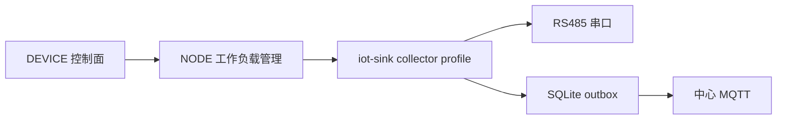

# ADR-001：RTU Poller 运行位置

> 状态：Accepted  
> 日期：2026-07-30  
> 决策范围：M1 站点设备与数据采集  
> 关联：POWER-SPEC-003  
> 产品基线：平台功能计划 1.5.0 / 项目开发宪法 1.6.0

配套决策：[ADR-007 collector 打包与 NODE 管理](./ADR-007-collector打包与NODE管理契约.md)。ADR-005 已因 mini 排除电力功能而废止。

## 背景

仓库已经在 `iot-sink` 中实现 `IotModbusRtuPollingProtocol`、轮询调度、串口互斥和下行写入。EDGE 已按 ADR-016 退役（原定位为轻量算法运行时），若在 EDGE 再实现 RTU，会产生两套协议栈、点表解释和升级路径。

## 决策

M1 以 `iot-sink` 为 RTU Poller 的唯一权威实现，运行于能直接访问物理串口的站点节点：

- NODE 负责部署、启停、版本和健康状态，不承载轮询业务；具体采用 ADR-007 的受控容器工作负载契约。
- EDGE 已按 ADR-016 退役，不包含且不再评估 Modbus RTU Poller；后续采集扩展必须复用 `iot-sink collector` 契约，改变该边界须以新 ADR 显式替代 ADR-016。
- 中心 `iot-sink` 只有在物理串口直接连接中心主机时才可作为 Poller；该形态属于受控例外，必须由架构负责人审批，登记串口资产、单实例互斥、资源配额、故障域和回退方案，并纳入与站点 collector 相同的健康、升级和审计契约。
- 新增 collector profile，供 standard/full 站点按部署拓扑裁剪非必需依赖；电力 collector 不部署到 mini。
- 同一物理串口同一时刻只能由一个 collector 实例持有；调度/迁移前必须释放所有权。

## 理由

- 最大化复用现有 Java 协议实现和设备消息模型。
- 避免 EDGE 与 SINK 双栈漂移。
- 串口访问天然要求靠近现场，中心化轮询不具备普适性。
- NODE 已具备工作负载生命周期职责，符合既有模块边界。

## 被否决方案

- **在 EDGE 重写 Poller**：协议和配置双栈，测试与升级成本高，违反 EDGE 当前职责。
- **全部在中心运行**：无法可靠访问远端 USB/硬件串口，网络故障会中断采集。
- **新增独立语言采集服务**：M1 无必要，会重复现有能力；后续只有在实测资源不达标时以新 ADR 评估。

## 后果与验证

- 需要为 `iot-sink` 增加 collector 启动配置、远程配置应用、持久队列和资源限制。
- collector 资源预算、依赖和串口规模分别在 standard/full 的 TD-001 中压测冻结。
- 必须验证 Linux 串口映射、Windows COM、单端口互斥、节点迁移、配置回滚和中心断网 24 小时。

## 回滚

保留现有中心 `iot-sink` 轮询开关。若 collector profile 未通过资源或稳定性验收，可仅在串口直连的 standard/full 节点启用，不能临时把协议复制到 RUNTIME 或新边缘服务。
