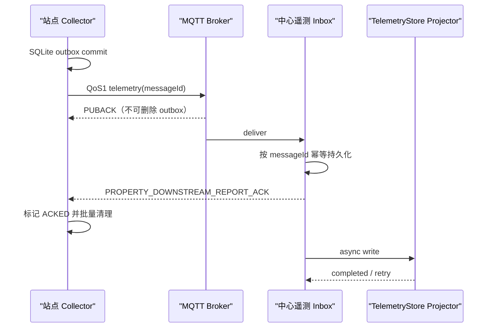

# ADR-003：遥测 ACK 机制

> 状态：Accepted  
> 日期：2026-07-30  
> 决策范围：M1 遥测可靠上报  
> 关联：POWER-SPEC-004  
> 产品基线：平台功能计划 1.4.0 / 项目开发宪法 1.4.0

## 问题

MQTT QoS 1 的 PUBACK 只能证明 Broker 接收发布，不能证明业务服务已持久保存。现有代码虽然定义了 `PROPERTY_DOWNSTREAM_REPORT_ACK`，但 RTU Poller 设置 `needReply=false`，且当前存储服务会捕获 TDengine 异常而不向发送端传播失败。

## 决策

采用“两级确认”：MQTT QoS 1 保证传输，应用 ACK 保证中心可靠接收。



M1 中心可靠收件箱使用 PostgreSQL，`message_id` 唯一。ACK 在收件箱事务提交后发送；`TelemetryStore` 投影异步重试，standard 投影到 PostgreSQL 分区表，full 投影到 TDengine。这样 ACK 的语义是 `ACCEPTED_DURABLE`，而不是“所有派生视图已完成”。

ACK 示例：

```json
{
  "schemaVersion": "1.0",
  "messageId": "01K...",
  "requestId": "req-...",
  "status": "ACCEPTED_DURABLE",
  "code": 0,
  "persistedAt": "2026-07-30T11:00:00.123+08:00"
}
```

| status | 发送端行为 |
|---|---|
| `ACCEPTED_DURABLE` | 删除对应 outbox 条目 |
| `DUPLICATE` | 视同成功并删除 |
| `REJECTED_RETRYABLE` | 保留并按退避策略重发 |
| `REJECTED_FINAL` | 转死信、停止自动重试并告警 |

ACK 必须匹配原 `messageId`；未知或格式错误 ACK 只记录诊断。超时重发保留原消息 ID。中心重复收到相同消息时返回 `DUPLICATE`，不得重复产生逻辑遥测或告警。

## 实现影响

- 新增中心 telemetry inbox、唯一索引、消费状态和清理任务。
- 调整 RTU 上报，使其进入 outbox 并订阅属性上报 ACK。
- `DeviceDataStorageService` 需要返回明确写入结果；不能继续用吞异常的方式驱动可靠性状态。
- `TelemetryStore` projector 必须可幂等；至少以 inbox `messageId` 控制作业只完成一次，失败可重试。
- ACK Topic 复用现有 `PROPERTY_DOWNSTREAM_REPORT_ACK`，不新增平行 Topic。

### 两层幂等与失败补偿

- 第一层由 PostgreSQL inbox 对 `(tenant_id, message_id)` 建唯一约束；重复投递返回 `DUPLICATE`，不得创建第二个投影任务。
- 第二层由投影状态机控制，固定为 `RECEIVED → PROJECTING → COMPLETED`，失败回到 `RETRY_WAIT`。TDengine/PostgreSQL 时序后端写入使用确定性样本键，重复执行不得产生重复逻辑样本。
- 默认指数退避重试 12 次，最大间隔 30 分钟；达到上限后进入 `PROJECTION_DEAD_LETTER`，保留完整 inbox 载荷，不得删除。
- 投影死信默认产生“重要”级运维告警；只有影响安全关键测点，或积压接近 inbox/磁盘保护水位并存在数据丢失风险时，才升级为“紧急”。对账补偿任务至少每小时扫描“已 ACK 但未 COMPLETED”的记录并可人工立即触发。
- 修复依赖后，运维人员可按消息、设备、站点或时间范围重新投影；成功后关闭告警并保留尝试审计。
- 历史查询 API 必须返回后端水位和数据完整性状态；响应体至少包含 `dataStatus`、`projectionWatermark`、`projectionLagSeconds` 和 `lastCompletedAt`。存在投影积压时不得把“暂未可查”表述为“原始数据丢失”。HTTP 状态码和错误码由 API Technical Design 统一冻结，不使用 HTTP 206 表达普通投影滞后，因为 206 的标准语义是字节范围的部分内容。
- inbox 投影进入 `PROJECTION_DEAD_LETTER` 时记录 `stage=CENTER_PROJECTION` 的缺口/滞后事实；该记录用于可见性与对账，不等同于原始载荷丢失，也不得与 ADR-002 的 `EDGE_DELIVERY` 缺口重复计数。

目标时序后端按部署档位选择，遵循 [ADR-006 standard/full 时序存储抽象](./ADR-006-mini-standard时序存储方案.md)。

## 回滚

通过能力协商字段启用 `telemetryAckV1`。旧节点可继续原上报模式，但平台必须显示“不具备可靠补传”，不得伪装为已确认。新节点在未协商到应用 ACK 时进入 `INCOMPATIBLE/DEGRADED`，阻止启用“可靠补传”配置并持续告警；运维必须升级中心，或经审批切换到明确标注数据风险的 legacy 模式，不得静默等待至容量淘汰。
