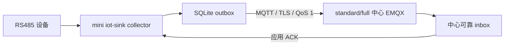

# ADR-005：mini 采集通信方案

> 状态：Superseded（不实施）  
> 日期：2026-07-30  
> 决策范围：M1 mini 站点采集上行、下行与告警通道  
> 关联：ADR-001、ADR-002、ADR-003、POWER-SPEC-003、POWER-SPEC-004

> 替代说明：当前《平台功能计划》1.4.0 与《EasyAIoT 项目开发宪法》1.4.0 明确电力运维平台不支持 mini。本 ADR 以下内容仅保留历史决策过程，不得用于需求、设计、开发、部署或验收；现行通信与部署决策见 ADR-001、ADR-003、ADR-007、ADR-011。

## 背景

现有 `mini` 部署脚本明确关闭本地 EMQX，但 M1 要求站点 collector 具备采集、缓存和补传。MQTT 客户端并不要求 Broker 与 collector 同机，因此“mini 无本地 EMQX”不等于无法使用 MQTT；必须明确 Broker 所在位置和断网行为。

## 决策

M1 mini 采用“无本地 Broker、collector 主动连接上级 Broker”的模式：

- mini 不部署本地 EMQX；collector 内置 MQTT client，主动连接配置的 standard/full 中心 EMQX。
- 出站连接使用 TLS，生产环境 MUST 使用设备/节点级身份；客户端证书或密钥由安装配置注入，不写入点表和 SQLite 遥测库。
- 遥测、质量异常和本地缓存/缺口告警统一通过 MQTT 上报。collector 不直接连接中心 Kafka。
- 配置发布、控制命令和应用 ACK 使用同一连接的独立 Topic；遥测与控制语义不得混用。
- 网络不可用时继续采集并写 SQLite outbox；恢复后实时优先、历史限速补传。
- mini 安装必须配置并探测上级 Broker 地址。未配置时只能进入明确的 `OFFLINE_UNBOUND` 调试状态，不得标记为可生产验收。
- standard/full 可让 collector 连接同机或集群 EMQX，但 Topic、信封、QoS 和 ACK 契约完全相同。

## 被否决方案

- **mini 强制部署 EMQX**：增加内存和运维负担，与当前 profile 冲突。
- **mini 改用 HTTP 上报**：形成第二套确认、下行和重连协议，增加混合版本复杂度。
- **collector 直连 Kafka**：暴露中心内部中间件，增加凭据和网络边界风险。

## 可用性与安全

- Broker 地址至少支持主备列表；默认指数退避并带随机抖动，最大重连间隔 60 秒。
- 必须校验证书、主机名和租户/节点 Topic ACL，禁止 `insecureSkipVerify` 作为生产配置。
- 指标包括连接状态、连续离线时长、重连次数、最近 PUBACK、最近应用 ACK、outbox 水位和告警积压。

## 回滚

通信配置版本化并保留上一可用 Broker 配置。新配置连接/鉴权失败时回退上一版本；不删除 outbox。若中心不可达，现场采集继续到容量保护触发。
