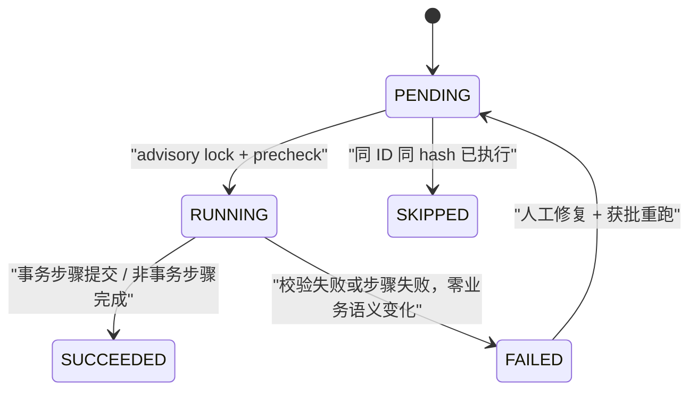

# ADR-013：受控数据库迁移执行器（TD-005 migration runner）

> 状态：Proposed（已完成宪法专项设计处置、DBA/架构专项处置、Spike 与演练证据、DBA/代码 owner 双签；standard 最低规格压测经 owner 决定豁免；完整 12 表画像生产重跑已按 Runbook 执行并 PASS，仅余 owner 对执行环境的生产指定）
> 版本：1.4.4
> 日期：2026-08-07
> 决策范围：TD-005 版本、绑定、审计与 Outbox 迁移的执行器选型
> 影响章节：《EasyAIoT 项目开发宪法》§6.2、§6.3、§8、§9、§10.2、§10.3、§12.2、§14、§15；《平台功能计划》§1.3
> 产品基线：平台功能计划 1.4.0 / 项目开发宪法 1.5.0
> 宪法专项评审：[ADR-013评审报告-宪法专项.md](../../开发规范/ADR-013评审报告-宪法专项.md)

| 版本 | 日期 | 变更 |
|---|---|---|
| 1.0.0 | 2026-08-06 | 首次形成受控迁移步骤执行器候选 |
| 1.1.0 | 2026-08-06 | 处置宪法专项评审 M-01～M-20/P-01～P-14：补目标用户与角色、状态机、CLI/错误码、配置清单、history 索引与时间类型、中文注释、资源影响、超时/重试/日志、目标平台、文档同步、执行角色与 MIG-007～009 |
| 1.2.0 | 2026-08-06 | 新增候选 runner Spike（`.scripts/postgresql/td005-migration/`）与 MIG-001/002/004/007/009 临时库证据 |
| 1.3.0 | 2026-08-06 | 新增运行时画像 precheck（MIG-003/005）、INVALID index 检测（MIG-006）与连接超时快速失败（MIG-008）临时库证据 |
| 1.3.1 | 2026-08-06 | 12 表画像 v1.2.0 新鲜度重跑 PASS：与 2026-08-05 基线逐项一致，无 blocking 条件触发；生产存量重跑继续 OPEN |
| 1.4.0 | 2026-08-07 | 处置 [DBA/架构专项评审](../../开发规范/ADR-013与ADR-014评审报告-DBA架构专项.md) H-01～H-04/M-01～M-10/L-01～L-05：runner 两阶段先校验后执行、lock/statement 超时有界、强制备份、有界重试、FAILED 落史、CLI 对齐；V001/V002 拆分 + 新增 M16 约束附加步骤；trigger 身份列/生命周期加固；索引签名核对；角色授权候选资产；MIG 证据重跑 |
| 1.4.1 | 2026-08-07 | 补演练证据：索引签名漂移反例、MIG-005 幂等表门禁双向、备份/恢复演练（损毁后异库恢复逐项一致）、回滚演练（uninstall 后六表清零、history/约束/幂等表按设计保留）；MIG-009 门禁对已落库幂等表实测生效 |
| 1.4.2 | 2026-08-07 | 幂等表正式落库步骤建模：新增 runner 步骤 `M05`（`steps/M05__power_idempotency_record.sql`，链首串行前置、单事务，DDL 与评审候选逐字一致），步骤链扩展为 M05 → M15 → M16 → V001 → V002，CLI `--step` 与 env 清单同步；M05 建模演练全项 PASS（见证据表），MIG-005 升 PASS；剩余 OPEN 收敛为画像生产重跑/压测/DBA 复核签字 |
| 1.4.3 | 2026-08-07 | ① DBA/代码 owner 复核签字关闭：按《ADR-013与ADR-014复核签字包》走查并双签通过（青见/qingjian1984 兼两角），走查当日复跑全项 PASS（记录见签字包 §5.1）。② standard 最低规格压测经 owner 决定豁免、不执行（压测方案保留为以后需要时的规程）；据此 §资源影响评估与预算中的候选预算值不再等待压测证据，保持**候选未冻结**标记，生产执行前按当时环境人工评估。剩余 OPEN 仅余：完整 12 表画像生产重跑 |
| 1.4.4 | 2026-08-07 | 完整 12 表画像生产重跑按 Runbook 执行并 **PASS**（只读事务、脚本 v1.2.0、Schema 1.1.0 校验通过、与 2026-08-05 冻结基线逐项零差异、六项阻断条件均未触发；证据包 profile-rerun-prod-20260807 五件归档）。环境性质如实声明：执行于本地目标集成实例 iot-device20，`productionRerunRequired` 是否由本次重跑满足**待 owner 指定**，指定前状态维持 Proposed |

## 背景

TD-005 migration 候选要求：迁移脚本可重复执行、记录执行事实（migration ID + SHA-256）、单实例受控执行、`CREATE UNIQUE INDEX CONCURRENTLY` 建模为可恢复独立步骤，且批准前不得执行 DDL。

仓库现状核对：

- 无 Flyway/Liquibase；Spring Boot 2.7.18，`iot-device-biz` 使用 `dynamic-datasource-spring-boot-starter`，主库为 PostgreSQL `iot-device20`。
- 全新安装由 `.scripts/postgresql/*10.sql` 全量基线 + `init-databases.sh`/`install_middleware_linux.sh` 在空库首启时导入。
- 存量结构同步由 `.scripts/postgresql/schema-sync/sync_schema_migra.sh`（migra 差异引擎）承担：默认 dry-run、应用前自动备份、破坏性语句默认拒绝；但没有迁移历史表、逐脚本校验和和执行锁。
- 应用侧存在 `EdgeNodeSchemaInitializer`、`DatasetSchemaInitializer` 等 `CREATE TABLE IF NOT EXISTS` 兜底建表器，只适合轻量兼容，不适合受控迁移。

## 目标用户与角色

| 角色 | 职责 | 最小权限边界 |
|---|---|---|
| DBA | 评审 DDL/约束/trigger、批准并执行生产迁移、核对 INVALID index 清理 | `migration_executor` 角色 + 只读画像角色；不得使用超管 |
| 代码 owner | 维护执行器脚本与 V001/U001 SQL 资产、评审 diff | 仓库写权限 + `migration_executor` 角色 |
| 运维 | 执行备份、dry-run/apply、观察日志与对账 | `migration_executor` 角色 + 备份目录权限 |
| 审批人 | 对生产执行审批单；不得由执行人自批 | 审批系统角色；审批 ID 必须写入 `evidence` |

任何角色不得直连业务表执行未经审批的 DDL；SQL 来源限定为 `.doc/技术设计/电力运维云平台/assets/td005-migration/` 受控目录。

## 候选方案

| 方案 | 优点 | 风险/缺口 |
|---|---|---|
| A. 引入 Flyway Community SQL 迁移 | 版本历史、校验和、重放语义成熟 | 与现有 `*10.sql` + schema-sync 形成第二套 Schema 事实；dynamic-datasource 集成需单独验证；`CONCURRENTLY` 不能进入普通事务，仍要另建非事务步骤；所有存量部署需 baseline |
| B. 引入 Liquibase | 同样具备历史与校验和 | 风格与仓库 SQL-first 不符；上述 dynamic-datasource、CONCURRENTLY、双 Schema 事实问题相同 |
| C. 直接扩展 schema-sync | 复用现有备份/漂移/拦截能力 | migra 输出是非确定差异，缺逐脚本校验和、执行顺序和可恢复步骤语义；把迁移事实与漂移工具混为一谈 |
| D. 受控迁移步骤执行器（推荐） | 保持 `*10.sql` 为唯一安装基线，schema-sync 只做漂移校验；显式 history 表 + SHA-256 + advisory lock；事务步骤与非事务步骤分离 | 需要自建小型执行器；必须在评审、合同测试和演练后启用 |

## 决策（候选）

采用方案 D：建立 `.scripts/postgresql/td005-migration/` 受控迁移步骤执行器，并满足以下约束。本段使用宪法 §1.1 强度语义，未重复英文缩写不改变效力。

### MUST

- MUST 引导创建 `schema_migration_history`：`migration_id` 唯一、`script_sha256`、`status`、`started_at/finished_at`、`executed_by`、`evidence JSONB`；同 ID 同 hash 识别为已执行并返回 SKIPPED，同 ID 异 hash 必须阻断。
- MUST 全程持有 PostgreSQL session advisory lock，禁止多实例并发执行；锁获取失败按 §重试与超时 处理，不得无限等待。
- MUST 默认 dry-run；`--apply` 前调用现有 `pg_dump` 备份流程；破坏性语句默认拒绝。
- MUST 事务型步骤在 `ON_ERROR_STOP=1` 单事务内执行，提交成功后才写 SUCCEEDED；非事务型步骤（M1.5 `CREATE UNIQUE INDEX CONCURRENTLY`）单独建模，可恢复、可检测 INVALID index。
- MUST 生产执行携带审批单并写入 `evidence`；审批 ID 缺失时拒绝执行。
- MUST 每条新表/新字段 DDL 提供中文 `COMMENT ON TABLE`/`COMMENT ON COLUMN`，说明业务语义、取值约束、不可变/审计规则和事实来源；迁移脚本与全量 dump 同步保留。

### SHOULD / MAY

- SHOULD 执行后使用 `sync_schema_migra.sh` 做结构漂移核对，再运行 MIG/TX/OUT/AUD/TEN/PROF/LEG/CFG/PERF 合同。
- MAY 在平台未来统一运行时迁移引擎评审通过后，将本执行器迁移至 Flyway 等成熟框架；届时仍须保留非事务步骤语义。

## 状态机



- 事务型步骤失败整体回滚；非事务型步骤失败保留现场，检测 INVALID index 后按批准脚本清理。
- 同一迁移先修复后重跑，不得用新 hash 掩盖同 ID 变更；同 ID 异 hash 必须阻断并要求新 migration ID。
- SKIPPED 仅为返回语义：同 ID 同 hash 已执行的步骤在日志中标记 STEP_SKIPPED，不向 history 写入 SKIPPED 行；FAILED 行由 runner 在失败后以脱敏错误摘要补记（M-08 处置）。

## CLI 接口契约

```text
td005-migration.sh dry-run [--db <database>]
td005-migration.sh apply [--db <database>] [--step M05|M15|M16|V001|V002] [--approval <id>] [--yes]
td005-migration.sh uninstall [--db <database>] [--approval <id>] [--yes]
td005-migration.sh check-comments [--db <database>]
```

| 参数/子命令 | 说明 |
|---|---|
| `dry-run` | 默认模式；只输出各步骤资产 SHA-256 与执行计划，不产生变更 |
| `apply` | 两阶段执行：先完成全部校验（hash/INVALID index/索引签名），再按依赖顺序执行未完成步骤 |
| `uninstall` | 受控卸载（U001 空表断言）；不设独立破坏性豁免开关，非空即拒绝 |
| `check-comments` | 中文注释完整性门禁（MIG-009） |
| `--db` | 目标数据库，默认 `iot-device20` |
| `--step` | 只执行指定步骤（M05/M15/M16/V001/V002）；缺省按依赖顺序执行全部未完成步骤（M05 → M15 → M16 → V001 → V002） |
| `--approval` | apply/uninstall 必填；审批单 ID 写入 history evidence |
| `--yes` | 跳过交互确认（仅与 apply/uninstall 配合） |

退出码：`0` 成功或无变更、`1` 执行失败、`2` 校验/precheck 失败。校验阶段失败（hash/签名/索引/precheck/审批/备份缺失）保证零业务 DDL 变化。错误码首批固定：

| 错误码 | 语义 |
|---|---|
| `MIGRATION_LOCK_BUSY` | advisory lock 获取超时/被占 |
| `HASH_MISMATCH` | 同 migration ID 不同 SHA-256 |
| `NON_EMPTY_TABLE_REJECTED` | U001 遇到非空表拒绝卸载 |
| `DEPENDENCY_TIMEOUT` | PostgreSQL 连接/读取/语句超时 |
| `PG_CONNECTION_FAILED` | PostgreSQL 不可用快速失败 |
| `INVALID_INDEX_DETECTED` | CONCURRENTLY 留下 INVALID index |
| `APPROVAL_MISSING` | 生产执行缺少审批单 |
| `BACKUP_MISSING` | apply/uninstall 未设置 BACKUP_DIR（备份 MUST） |
| `INDEX_SIGNATURE_MISMATCH` | 同名索引存在但定义漂移（列/谓词/唯一性不符） |
| `UNSUPPORTED_PLATFORM` | 当前平台不受支持 |

## 配置清单

执行器配置通过 CLI 参数或 `.env` 表达，不写死在脚本；敏感值不得提供真实默认值。

| 配置 | 类型 | 候选默认值 | 必填 | 说明与示例 |
|---|---|---:|---|---|
| `lock-key` | integer | `913005`（`TD005_MIG_LOCK` 的评审候选稳定键） | 是 | advisory lock 键值，须与 runner 实现一致；更换必须同步本表 |
| `connect-timeout` | duration | `3s` | 是 | PostgreSQL 建连超时；不得为 0/无限 |
| `read-timeout` | duration | `5s` | 是 | 单次命令读取超时；不得为 0/无限 |
| `statement-timeout` | duration | `15s` | 是 | 事务型步骤语句超时；CONCURRENTLY 步骤独立配置 |
| `lock-wait` | duration | `15s` | 是 | advisory lock 等待上限 |
| `retry-max` | integer | `3` | 是 | 仅对可重试错误（锁忙/暂时失败）重试 |
| `retry-base-delay` | duration | `1s` | 是 | 指数退避基础值 |
| `retry-max-delay` | duration | `4s` | 是 | 单次退避上限 |
| `history-retention` | duration | `2y` | 否 | SUCCEEDED 历史保留候选值；自动清理需评审 |
| `approval-required` | boolean | `true` | 是 | 生产 apply 必须携带审批单 |
| `dry-run-default` | boolean | `true` | 是 | 未显式 `--apply` 时只预览 |

## schema_migration_history

history 表 DDL 由 runner 引导逻辑独占维护（单一事实源，DBA/架构专项 M-01 处置；V001 不再包含该表），设计要点：

- 全部时间列 MUST 使用 `TIMESTAMPTZ`，不依赖服务器默认时区。
- 索引：`UNIQUE (migration_id)`、`(status, started_at DESC)`；成功/失败均以 `ON CONFLICT (migration_id)` 更新同一行，started/finished 取真实 `clock_timestamp()`。
- 每条列 MUST 附中文 `COMMENT ON COLUMN`，表级 MUST 附 `COMMENT ON TABLE`；runner 引导包含全部 9 条中文注释并纳入 check-comments 门禁。
- 该表属于运维域元数据，不承载租户业务数据，不参与业务租户隔离。

## 资源影响评估与预算

- `CREATE UNIQUE INDEX CONCURRENTLY`：会长时间扫描 `product` 并增加 CPU/IO/WAL/磁盘消耗；执行前后必须评估磁盘余量、监控 `pg_stat_progress_create_index`，失败产生 INVALID index 时按批准脚本清理，禁止自动归并数据。
- `pg_dump` 备份：磁盘占用约等于目标库体积，备份与迁移错峰执行并核对空间水位。
- `schema-sync` 漂移核对：会临时创建参考库，磁盘占用约等于全量基线体积；dry-run 与 apply 均产生差异/备份产物。
- 以上均为候选预算，只有附带标准最低规格原始压测证据后才能冻结。

## 日志契约

- 结构化输出至少包含 `migration_id`、`step`、`status`、`duration_ms`、`error_code`、`error_digest`、`approval_id`。
- 不得记录 PostgreSQL 密码、Token、审批凭证、canonical/snapshot 正文或业务敏感值；摘要必须脱敏。
- `schema_migration_history.evidence` 只保存审批单 ID、目标 PostgreSQL 版本、执行开始/结束时间和输出摘要，不保存完整日志。

## 目标平台、依赖顺序与执行角色

- 执行器脚本 MUST 支持 Linux、macOS、ARM、麒麟及 Windows（Git Bash/WSL 或原生 psql）路径；禁止硬编码凭据和绝对路径。
- 执行顺序：PostgreSQL 健康检查就绪 → dry-run → 备份 → apply → drift 核对 → 合同测试。
- 新增 `migration_executor` 数据库角色：仅授予目标 Schema 的 CREATE/ALTER/DROP、`schema_migration_history` 的 INSERT/SELECT/UPDATE，以及迁移步骤所需最小权限；禁止超管和跨库读写。
- 只读画像使用独立只读角色，与执行角色分离。

## 失败与恢复

- 事务型步骤失败：单事务回滚，业务零变化。
- 非事务型步骤失败：立即停止后续步骤，检测 INVALID index，仅按批准脚本清理；修复后重跑同一步骤。
- 执行器崩溃：session advisory lock 随连接关闭释放；下一轮运行依据 history 中同 ID 同 hash 判定已完成/失败，不盲目重放。
- PostgreSQL 不可用：连接超时后快速退出（退出码 1，`PG_CONNECTION_FAILED`），不得无限等待或重启风暴。

## 验证方式

| ID | 场景 | 通过条件 |
|---|---|---|
| MIG-001 | 空库执行 V001 两次 | 第二次识别同 ID/hash；Schema 签名一致 |
| MIG-002 | 同名表列或约束被篡改 | precheck 阻断，零 DDL 变化 |
| MIG-003 | 12 表画像出现重复/孤儿/tenant 异常 | 阻断且不自动修数据 |
| MIG-004 | U001 面对任一非空新表 | 明确拒绝，全部对象保留 |
| MIG-005 | `power_idempotency_record` 不存在或合同失败 | M1/M2 可评审但写 API 不启用 |
| MIG-006 | product unique concurrent 创建失败/留下 INVALID index | 阻断 FK；按批准清理脚本恢复 |
| MIG-007 | 只读数据库角色尝试执行 DDL | 拒绝执行，错误码明确 |
| MIG-008 | PostgreSQL 连接中断恢复 | 超时快速失败；修复后同 ID 同 hash 重跑幂等 |
| MIG-009 | V001/U001 DDL 中文注释完整性 | 逐表逐列 diff 核对 COMMENT 存在且语义完整；无注释不得通过最低门禁 |

另须完成：备份/恢复演练、应用回滚演练、INVALID index 清理演练、schema-sync 漂移核对与三档（mini/standard/full）回归。

## 文档同步

- `schema_migration_history` 与执行器使用说明 MUST 同步到 `.doc/架构设计/` 和 `.scripts/postgresql/README.md`。
- 新配置项 MUST 同步 `env.example`/Nacos 说明；部署步骤同步安装与运维文档。
- 本 ADR 转 Accepted 前，以上同步必须完成并可评审。

## 迁移与回滚

本 ADR 本身不产生生产 DDL；批准后的执行顺序遵循 TD-005 migration §7.2 M0～M5。回滚优先应用回滚，数据库卸载只允许空表。

## 评审处置

2026-08-06 宪法专项评审（M-01～M-20 / P-01～P-14）已逐项纳入本版本设计；其中 M-08/M-20 所指“V001 SQL 资产未生成、无中文注释”的事实已被当前候选资产替代（V001/U001 已生成且含中文表/字段注释），本 ADR 同时把该 MUST 显式固化。

## Spike 实现与 MIG 证据（2026-08-06）

候选执行器已实现于 `.scripts/postgresql/td005-migration/td005_migration.sh`，支持 `dry-run/apply/uninstall/check-comments`，并内建 `schema_migration_history`、advisory lock、SHA-256 校验、事务/非事务步骤分离。在本地临时 PostgreSQL 18.4 评审库完成：

| 合同 | 结果 | 说明 |
|---|---|---|
| MIG-001 | PASS | 第二次 apply 识别同 ID/hash 并跳过 |
| MIG-002 | PASS | 篡改 V001 副本触发 `HASH_MISMATCH`，非零退出且零变更 |
| MIG-004 | PASS | U001 面对非空审计表拒绝卸载 |
| MIG-007 | PASS | 只读角色 DDL 被拒绝 |
| MIG-009 | PASS | 7 张表/126 字段中文注释完整性检查通过 |
| MIG-003 | PARTIAL PASS | precheck 阻断产品重复与运行表孤儿；完整 12 表画像/tenant 异常重跑仍 OPEN |
| MIG-005 | PASS | `REQUIRE_IDEMPOTENCY=1` 时缺失 `power_idempotency_record` 阻断（既有环境门禁保留）；1.4.2 起新装环境由 runner 步骤 `M05` 链首正式落库，写 API 启用前置满足 |
| MIG-006 | PASS | INVALID index 被检测阻断，清理后重跑恢复 |
| MIG-008 | PASS | 不可达连接约 2.5s 快速失败；恢复连接后同 ID/hash 幂等重跑 |

所有测试使用临时库并在结束后清理，未执行任何生产/共享库 DDL。

2026-08-07 DBA/架构专项处置后重跑（临时评审库 `td005_review_tmp`，PostgreSQL 18.4，含最小 `product` 表；用后已清理）：

| 合同 | 结果 | 说明 |
|---|---|---|
| 步骤链 | PASS | M15（CONCURRENTLY）→ M16（约束附加）→ V001（五表）→ V002（binding + FK VALIDATE）全链路 SUCCEEDED，备份文件生成并写入 evidence |
| MIG-001 | PASS | 二次 apply 四步全部 STEP_SKIPPED，零变更 |
| MIG-002 | PASS（无前置条件） | 篡改 V001 在校验阶段即 HASH_MISMATCH（退出码 2），先于任何步骤执行，零业务变更——不再依赖 M15 历史或失败前置 |
| MIG-004 | PASS | 审计表非空时 U001 拒绝且零变更；附加发现：追加写 trigger 同时阻断 DELETE，非空审计表无法通过 SQL 清空，进一步强化"非空禁止 destructive down" |
| MIG-009 | PASS | check-comments 覆盖 history + V001/V002 六表全中文注释；清单已扩展纳入 `power_idempotency_record`/`power_model_event_inbox`（未建表自动跳过） |
| H-01 锁等待 | PASS | 他会话持有 advisory lock 时，`lock_timeout=3s` 有界失败并映射 `MIGRATION_LOCK_BUSY`，按 3/1s/4s 退避重试后退出码 1，无无限等待 |
| H-02 备份 MUST | PASS | 未设 `BACKUP_DIR` 时 apply/uninstall 以退出码 2 拒绝；未携带 `--approval` 同样退出码 2 |
| M-08 失败落史 | PASS | U001 失败后 history 记录 FAILED 行（含 `error_code` 与脱敏摘要）；成功行 started/finished 为真实时间 |
| Trigger 反例 | PASS | SemVer 一致性 CHECK、DRAFT→RETIRED 拒绝、已发布版本 `template_id`/`published_by` 篡改拒绝、PUBLISHED→DEPRECATED 合法迁移均符合预期 |
| 空表卸载 | PASS | 全新库 apply 后 uninstall 全量卸载 SUCCEEDED |

M-06 索引签名核对已实现并通过正向路径（合法索引通过校验）；签名漂移反例与 MIG-003 完整 12 表画像、MIG-005 幂等表落库合同、压测与备份/恢复/回滚演练继续 OPEN。

2026-08-07 演练批次（同一临时评审库策略，用后清理）：

| 演练 | 结果 | 说明 |
|---|---|---|
| M-06 签名漂移反例 | PASS | 同名索引列序颠倒时校验阶段 `INDEX_SIGNATURE_MISMATCH`（退出码 2），零业务变更；按批准清理漂移索引后重跑四步全部 SUCCEEDED（恢复路径） |
| MIG-005 双向 | PASS | `REQUIRE_IDEMPOTENCY=1` 且表缺失时 precheck 阻断（退出码 2，`missing_power_idempotency_record`）；候选 DDL 落临时库后 precheck PASS，烟测 8 反例 + 24h 默认窗口 + 注释完整性复跑 PASS |
| MIG-009 扩展生效 | PASS | 幂等表落库后 check-comments 将其纳入检查，九表清单实测 PASS |
| 备份/恢复演练 | PASS | runner apply 自动产出 pg_dump 备份；人为损毁（DROP 审计表 + 删 product 行）后从备份异库恢复，product/idempotency/history 计数与审计表逐项还原 |
| 回滚演练 | PASS | 恢复后 uninstall SUCCEEDED：六张新表全部删除、history 5 行保留、`uq_product_tenant_identification` 约束按设计保留、幂等表（TD-004 域）不受影响 |

2026-08-07 M05 建模演练批次（临时评审库 `td005_m05_review`，PostgreSQL 18.4，最小 `product` 夹具 4 行；用后已销毁，`iot-device20` 未触碰且 product=4 与画像基线一致）：

| 演练 | 结果 | 说明 |
|---|---|---|
| 五步骤链 | PASS | M05（幂等表，单事务）→ M15 → M16 → V001 → V002 全链 SUCCEEDED；history 五行 SUCCEEDED，hash 与 dry-run manifest 一致，started ≤ finished |
| MIG-001 重跑 | PASS | 二次 apply 五步全部 STEP_SKIPPED，零变更 |
| MIG-002 M05 篡改 | PASS | M05 资产追加一字节后 apply 在校验阶段 `HASH_MISMATCH M05`（退出码 2），零业务变更、history 无新增；恢复资产后重跑五步全部 SKIPPED（恢复路径） |
| 幂等语义烟测 | PASS | 24h 默认保留窗口断言、IN_PROGRESS→SUCCEEDED 迁移、9 项约束/争抢反例（hash 长度、终态响应一致性、枚举、payload 上限、过期次序、主体类型、同作用域二次争抢、跨租户隔离）全部按预期，SMOKE_RESULT=2 |
| MIG-009 | PASS | check-comments 九表清单对含 M05 落库结果实测 PASS |
| U001 保留语义 | PASS | 空表卸载后 `power_idempotency_record`（TD-004 资产）与 history 保留，六张 TD-005 表清零 |

2026-08-07 画像生产重跑批次（按《TD-005-生产画像重跑Runbook》执行，证据包 [profile-rerun-prod-20260807](../../规格/电力运维云平台/assets/model-templates/verification/profile-rerun-prod-20260807/)）：

| 走查项 | 结果 | 说明 |
|---|---|---|
| §3.1 资产版本核对 | PASS | 画像脚本 v1.2.0（sha256 前缀 `736a27e0d1f2`）、结果 Schema 1.1.0、2026-08-05 基线与当前 HEAD 一致 |
| §3.2 只读执行 | PASS | `iot-device20`（PostgreSQL 18.4），PGOPTIONS 强制 `default_transaction_read_only=on` + `statement_timeout=300000`；psql 退出码 0，原始输出 `PROFILE_VERSION=1.2.0`、ENV 行 readOnly=`on`、ROLLBACK 收尾，12 表全覆盖 |
| §3.3 解析校验 | PASS | jsonschema 1.1.0 校验 PASS；与 2026-08-05 冻结基线逐项 diff **零差异**（仅 verifiedDate 豁免）；§3.4 全部六项阻断条件均未触发，无告警项 |
| §3.4 判定 | **PASS** | 证据包五件（env.txt / 原始输出 / 结果 JSON / diff-vs-baseline.md / verdict.md）归档完成 |

环境性质如实声明（宪法 §15）：本环境唯一可达目标实例为本地目标集成实例 `iot-device20`，非独立生产实例；执行账号为 postgres（实例无专用只读角色，只读性由 PGOPTIONS 强制保障）。`comparisonContract.productionRerunRequired` 是否由本次重跑满足**待 owner 指定**（见证据包 verdict.md）：指定满足则三项人工闭环全数关闭、本 ADR 可转 Accepted；指定不满足则本项保持 OPEN、本证据包作为预演证据保留。指定前状态维持 Proposed。

剩余 OPEN 收敛为：完整 12 表画像生产重跑的 **owner 环境指定**（重跑本身已执行并 PASS；DBA/代码 owner 复核签字已于 1.4.3 双签关闭；standard 最低规格压测经 owner 决定豁免，候选预算保持未冻结标记）。

2026-08-06 画像新鲜度重跑：在本地目标集成实例 `postgres-server / iot-device20` 以只读事务重跑 12 表画像 v1.2.0（原始 psql 输出 `target-schema-profile-raw-2026-08-06.txt`，机器结果 `target-schema-profile-result-2026-08-06.json`，结果 Schema 1.1.0 校验 PASS）。与 2026-08-05 冻结基线逐项比对完全一致（仅日期字段差异）：行数 `product=4 / product_properties=17 / device=4` 与其余 9 表为 0 不变，七类重复组、六类标识异常、十三类孤儿、三类关系不匹配全部为 0，`product_properties.service_id` 仍缺失，unique/FK/check/trigger 仍为 0，无任何 blocking 条件触发。该重跑只确认画像在测试活动后无漂移，`comparisonContract.productionRerunRequired` 仍为 true，生产存量重跑继续 OPEN，门禁维持 `OPEN_REMEDIATION_REQUIRED`。

## 开放项

候选 runner 已存在；剩余 OPEN：完整 12 表画像生产重跑的 owner 环境指定（重跑已于 1.4.4 按 Runbook 执行并 PASS，证据包 profile-rerun-prod-20260807；执行环境为本地目标集成实例，是否计为生产重跑待 owner 指定）。`power_idempotency_record` 经 runner 正式落库的步骤建模已于 1.4.2 关闭（步骤 `M05`）；DBA/代码 owner 复核签字已于 1.4.3 双签关闭，standard 最低规格压测经 owner 决定豁免（候选预算保持未冻结）。本 ADR 转 Accepted 前不得对生产库执行 DDL。
