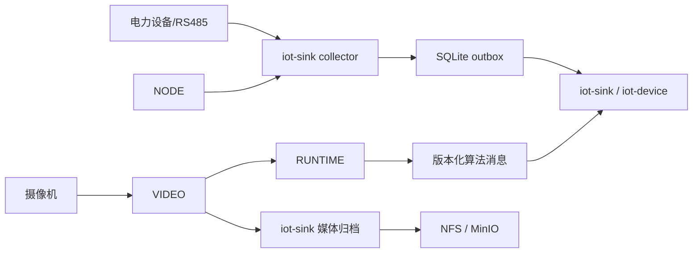

# ADR-016：EDGE 退役与 RUNTIME 边缘执行边界

> 状态：Accepted
> 版本：1.0.0
> 日期：2026-08-12
> 决策范围：电力采集、边缘推理、告警媒体与节点编排
> 代码事实：`847b3c85`（移除 EDGE）、`42945f3f`（RUNTIME 告警走消息总线）、`242f8f31` / `7c47d3b9`（统一媒体归档）
> 产品基线：平台功能计划 1.5.0 / 项目开发宪法 1.6.0

## 背景

主线已经删除 `EDGE/`，并将原 `TASK/` 高性能执行能力迁移为 `RUNTIME/`。同时，VIDEO 的录像与告警媒体已委托平台归档，`iot-sink` 负责录像回调、告警媒体归档和 NFS 路径治理。原基线仍把 EDGE/TASK 列为当前模块，并保留“EDGE 方案延至 M2 评估”，与代码事实冲突。

电力 M1 已冻结 `NODE + iot-sink collector + SQLite outbox + 应用 ACK` 采集链。继续保留 EDGE 作为电力采集或边缘推理候选，会重新引入第二套部署、配置、消息和状态语义。

## 决策

1. `EDGE/` 自本 ADR 起视为退役模块，不再作为新需求、设计、开发、部署或验收依据；历史文档中的 EDGE 仅保留决策审计语义。
2. 电力采集唯一实施链保持为 `NODE -> iot-sink collector -> SQLite outbox -> MQTT/ACK -> TelemetryStore`。不得在 RUNTIME、VIDEO 或新边缘服务中复制 Modbus RTU Poller、点表解释、补传或 ACK 状态机。
3. `RUNTIME/` 是原 `TASK/` 的现行高性能执行模块，承载 C++17 本地推理、编解码、实时/抓拍/轮巡执行；由 VIDEO 生成任务配置并由 VIDEO/NODE 管理生命周期。RUNTIME 不承载设备台账、告警处置状态、工单或其他控制面事实。
4. RUNTIME 算法结果通过版本化消息进入平台；`iot-device` 维护统一告警事实和状态机。RUNTIME、VIDEO、iot-sink 的来源记录仅作为来源与证据，不复制确认、处置、恢复和关闭状态。
5. 告警图片和录像采用 `RUNTIME/VIDEO -> iot-sink -> NFS/MinIO` 统一归档链。VIDEO 不维护第二套平台媒体目录或独立告警处置事实；电力告警通过 `alarmId/sourceType/sourceId` 关联归档证据。
6. `standard/full` 共享上述契约；full 仅增加事故前后录像冻结、预置位联动、事故追忆、规模和保留期。`mini` 继续不支持电力能力。

## 兼容与迁移

- 代码、Compose、安装脚本和新文档不得重新引用 `EDGE/` 或 `TASK/` 路径。
- 旧配置中的 EDGE/TASK 名称不自动解释为 RUNTIME；需要迁移时必须显式转换执行器、任务类型、消息版本、资源配额和回滚配置。
- ADR-001 中“M2 重新评估 EDGE Poller”被本 ADR 替代；ADR-001、ADR-002、ADR-003、ADR-006、ADR-007 的 collector、Outbox、ACK 和存储决策继续有效。
- ADR-010 的统一告警模型继续有效；媒体证据归档不是告警状态事实源。

## 后果

- 正向：删除双协议栈和双边缘运行时选择，采集、推理、告警、媒体的 owner 更清晰；M1 可沿冻结的可靠采集链继续实现。
- 成本：需修订仍引用 EDGE/TASK 的基线和下游架构文档，并补 RUNTIME 消息合同、告警证据关联与 NFS/MinIO 运维验收。
- 限制：本 ADR 不把视觉推理列入 M1 数据采集完成条件；电力视觉告警与事故追忆仍按平台功能计划的阶段 2 实施。

## 验证与回滚

- CI/文档检查必须确认现行模块清单无 `EDGE/`、`TASK/` 实施路径，RUNTIME 至少完成 CMake 构建或最小推理样例。
- 采集验收继续覆盖 24 小时断网补传、应用 ACK、重复消息幂等、容量保护和数据完整率。
- 视频联动验收覆盖算法消息、统一告警映射、媒体归档、权限签发、NFS/MinIO 不可用降级与证据可追溯。
- 若 RUNTIME 不满足现场资源或稳定性要求，只能关闭对应视觉能力或回退到已批准的 VIDEO/Python 执行器；不得恢复 EDGE 或把采集迁入 RUNTIME，除非新 ADR 明确替代本决策。
