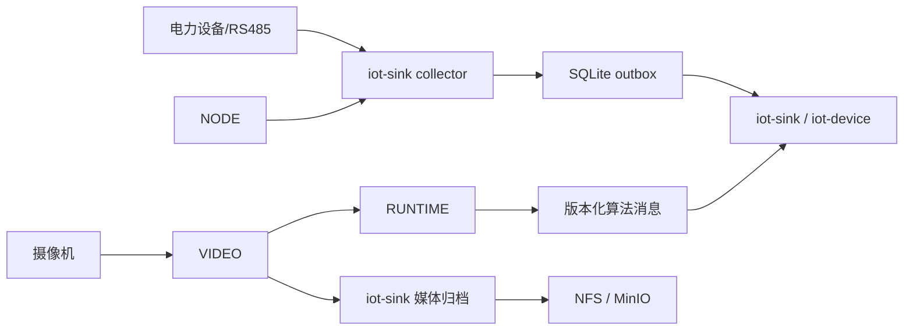

# ADR-016：EDGE 退役与 RUNTIME 边缘执行边界

> 状态：Accepted
> 版本：1.2.0
> 日期：2026-08-12
> 决策范围：电力采集、边缘推理、告警媒体与节点编排
> 代码事实：`847b3c85`（移除 EDGE）、`42945f3f`（RUNTIME 告警走消息总线）、`242f8f31` / `7c47d3b9`（统一媒体归档）
> 产品基线：平台功能计划 1.5.0 / 项目开发宪法 1.6.0
> 评审依据：[ADR-016 评审报告](../../开发规范/ADR-016评审报告.md)

| 版本 | 日期 | 变更 |
|---|---|---|
| 1.0.0 | 2026-08-12 | 追认 EDGE 退役、RUNTIME 接管高性能执行及媒体统一归档的代码事实 |
| 1.2.0 | 2026-08-12 | 处置覆盖度评估 G1/G3/G4：ALGO_BUS_TRANSPORT 三端统一丢弃（HTTP AlarmCallback 彻底下线）；MQTT→Kafka 通知桥接（iot-alert-notification-send）；iot-sink→video 库 enrichment 失败静默（告警事实优先于通知） |
| 1.1.0 | 2026-08-12 | 处置评审 M-01～M-04、L-01～L-05，补告警同步、消息可靠性、生命周期、媒体降级与历史例外契约 |

## 背景

主线已经删除 `EDGE/`，并将原 `TASK/` 高性能执行能力迁移为 `RUNTIME/`。同时，VIDEO 的录像与告警媒体已委托平台归档，`iot-sink` 负责录像回调、告警媒体归档和 NFS 路径治理。原基线仍把 EDGE/TASK 列为当前模块，并保留“EDGE 方案延至 M2 评估”，与代码事实冲突。

电力 M1 已冻结 `NODE + iot-sink collector + SQLite outbox + 应用 ACK` 采集链。继续保留 EDGE 作为电力采集或边缘推理候选，会重新引入第二套部署、配置、消息和状态语义。

## 决策

1. `EDGE/` 自本 ADR 起视为退役模块，不再作为新需求、设计、开发、部署或验收依据；历史文档中的 EDGE 仅保留决策审计语义。
2. 电力采集唯一实施链保持为 `NODE -> iot-sink collector -> SQLite outbox -> MQTT/ACK -> TelemetryStore`。不得在 RUNTIME、VIDEO 或新边缘服务中复制 Modbus RTU Poller、点表解释、补传或 ACK 状态机。
3. `RUNTIME/` 是原 `TASK/` 的现行高性能执行模块，承载 C++17 本地推理、编解码、实时/抓拍/轮巡执行。VIDEO 负责生成任务配置、接收 HTTP 心跳和展示任务运行事实；RUNTIME 告警仍走 MQTT，不得因心跳通道而回退为 VIDEO 告警事实源。RUNTIME 的宿主生命周期目标上归 NODE 受控工作负载管理，并复用 ADR-007 的结构化规格、状态机、健康 facet、不可变版本和回滚原则；但不得直接复用 `workloadType=iot-sink-collector`。原生进程/容器形态、执行器类型、PID/容器标识和模型/配置回滚原子性须由独立 TD 冻结，未冻结前不得宣称 NODE 生命周期闭环已落地。
4. RUNTIME 算法结果通过版本化消息进入平台；`iot-device` 按 ADR-010 维护唯一告警主记录 `alarm_record` 和处置状态机。RUNTIME、VIDEO、iot-sink 的来源记录仅作为不可变来源/证据，不复制确认、处置、恢复和关闭状态。来源记录通过 `(tenantId, sourceType, sourceId, cycleKey)` 唯一映射到全局 `alarmId`；来源系统发布版本化 `AlarmRaised`/`AlarmRecovered`，统一告警消费者必须先持久化 Inbox 再创建或推进告警周期。同一 `messageId` 同一内容摘要视为重复，不同摘要视为冲突并隔离；同一来源周期依靠映射唯一约束幂等。该同步链和表结构尚未实现，继续作为告警 TD 的 OPEN 门禁，禁止直接把 VIDEO `alertId` 当作 `alarmId`。iot-sink 在告警来源落库后，命中通知配置则转发 Kafka `iot-alert-notification-send`（key=deviceId）触发下游通知分发，作为统一告警通知的唯一出口；iot-sink 从 `video` 库 `algorithm_task` 只读 enrichment 通知配置（channels/notifyUsers/notifyMethods），失败时（video 库不可达或未配置）告警仍正常落库、仅不触发通知并记可观测日志——告警事实优先于通知，enrichment 失败不得阻塞告警入库。
5. 当前 RUNTIME 算法总线 Envelope V1 指 `version="1.0"`、`msgId`、`msgType`、`tenant`、`ts`、`payload`；Envelope `version` 是消息 Schema 主次版本，不等于任务 `configVersion`。新增字段必须允许旧消费者忽略，不兼容主版本必须拒绝或隔离。现有 `mqtt/iot-*` + `IotAlgoBusMqttHandler` 是兼容接入事实，尚未纳入 ADR-014 的 TD-005 物模型 Inbox 实现范围，也没有应用级 ACK；MQTT QoS/PUBACK 不等于告警业务已受理。告警 TD 必须复用 ADR-014 的稳定消息 ID、内容摘要、先 Inbox 后副作用、重试/DLQ、未知主版本隔离和可观测性原则，但建立独立的告警事件 Schema 与 Inbox 契约；RUNTIME 重试必须复用原 `msgId`，不得每次重试生成新 ID。`algoBusTransport` 关闭 MQTT 时，RUNTIME、VIDEO、iot-sink 三端统一为告警丢弃，HTTP `AlarmCallback` 彻底下线，不保留任何 HTTP 回退路径；该开关仅用于调试或受控降级，生产默认开启 MQTT，关闭期间产生的告警由 RUNTIME/VIDEO 在可观测日志中显式记录为丢弃。
6. 告警图片和录像采用 `RUNTIME/VIDEO -> iot-sink -> NFS/MinIO` 统一归档链。VIDEO 不维护第二套平台媒体目录或独立告警处置事实；归档证据以 `alarmId + sourceType + sourceId + evidenceId` 关联，媒体上传失败不得回滚或删除已成立的统一告警事实。
7. NFS/MinIO 降级遵循“告警事实优先、媒体最终一致、失败显式可见”：
   - NFS 挂载不可用时，RUNTIME/VIDEO 不得把共享挂载点退化为宿主机非受管业务目录；推理可继续并上报无媒体或媒体待补事实，禁止伪造 `image_path`/`record_path`。
   - 已写入 NFS、但 MinIO 不可用时，iot-sink 保留源文件并以持久化归档任务重试；达到容量或重试上限后转显式失败/死信，不得静默丢弃。
   - 录像不可生成或源文件已丢失时，记录可审计证据缺口；不得阻塞统一告警入库，也不得用空成功响应掩盖缺片。
   - 最终一致性窗口、NFS 暂存配额、重试退避、死信处置和恢复演练由媒体归档 TD/容量测试冻结；冻结并验收前，本条只构成目标契约，不代表降级能力已完成。
8. `standard/full` 共享上述契约；full 仅增加事故前后录像冻结、预置位联动、事故追忆、规模和保留期，对应《平台功能计划》§1.2、§4.2、§6.1、阶段 2 和 §8.9。`mini` 继续不支持电力能力。

## 兼容与迁移

- 代码、Compose、安装脚本和新文档不得重新引用 `EDGE/` 或 `TASK/` 路径。
- 旧配置中的 EDGE/TASK 名称不自动解释为 RUNTIME；需要迁移时必须显式转换执行器、任务类型、消息版本、资源配额和回滚配置。
- ADR-001 中“M2 重新评估 EDGE Poller”被本 ADR 替代；ADR-001、ADR-002、ADR-003、ADR-006、ADR-007 的 collector、Outbox、ACK 和存储决策继续有效。
- ADR-010 的 `alarm_record`、告警周期和来源映射决策继续有效；媒体证据归档不是告警状态事实源。
- ADR-014 当前实现范围仍是 TD-005 物模型事件；本 ADR 只要求告警事件复用其可靠性原则，不把两类事件写入同一 Inbox，也不把现状误记为已经满足 ADR-014。
- 历史 ADR 中的 `EDGE_DELIVERY` 等领域常量可保留，但必须明确其为阶段名或审计语义，与已退役 `EDGE/` 模块无运行时关系；其余把 EDGE/TASK 写成当前实施模块的内容继续排查并标注。

## 评审处置

| 评审项 | 处置 | 结论 |
|---|---|---|
| M-01 来源记录与告警主记录 | 采纳 | 按 ADR-010 冻结来源周期映射键、事件同步方向、Inbox 与双层幂等；实现保持 OPEN |
| M-02 与 ADR-014 的关系 | 部分采纳 | 复用可靠性原则，但 ADR-014 现有 TD-005 Inbox 不覆盖算法告警；需独立告警 Inbox/Schema |
| M-03 RUNTIME 生命周期 | 采纳 | 纳入 NODE 受控工作负载目标，复用 ADR-007 原则但不复用 collector 类型；执行形态 TD 待冻结 |
| M-04 NFS/MinIO 降级 | 采纳 | 冻结事实优先、媒体最终一致、无非受管本地回退和显式证据缺口；参数与实现保持 OPEN |
| L-01 消息版本 | 采纳 | 明确 Envelope V1 字段及其与 `configVersion` 的区别 |
| L-02 心跳通道 | 采纳 | 明确 HTTP -> VIDEO 心跳与 MQTT 告警双通道 |
| L-03 full 能力追溯 | 采纳 | 增加功能计划章节交叉引用 |
| L-04 历史 EDGE 表述 | 采纳 | 保留合法历史/阶段常量，现行实施表述继续审计；不机械替换业务变量 `TASK` |
| L-05 事后追认 | 采纳 | 本次登记为主线合并后的一日内追认例外；后续模块退役或边界变更必须先 ADR 或与实现同批提交 |

## 后果

- 正向：删除双协议栈和双边缘运行时选择，采集、推理、告警、媒体的 owner 更清晰；M1 可沿冻结的可靠采集链继续实现。
- 成本：需修订仍引用 EDGE/TASK 的现行实施文档，并补 RUNTIME 告警 Inbox、NODE 生命周期合同、告警证据关联与 NFS/MinIO 运维验收。
- 限制：本 ADR 不把视觉推理列入 M1 数据采集完成条件；电力视觉告警与事故追忆仍按平台功能计划的阶段 2 实施。

## 验证与回滚

- CI/文档检查必须确认现行模块清单无 `EDGE/`、`TASK/` 实施路径，RUNTIME 至少完成 CMake 构建或最小推理样例。
- 采集验收继续覆盖 24 小时断网补传、应用 ACK、重复消息幂等、容量保护和数据完整率。
- 视频联动验收覆盖 Envelope 版本/未知主版本隔离、稳定 `msgId` 重试、告警 Inbox 幂等、统一告警映射、媒体归档、权限签发、NFS/MinIO 不可用降级与证据可追溯。
- RUNTIME 生命周期验收覆盖 NODE 结构化部署、进程/容器健康、HTTP 心跳与实际进程状态对账、配置/模型版本回滚；不得用 VIDEO 心跳单独证明进程受控。
- 若 RUNTIME 不满足现场资源或稳定性要求，只能关闭对应视觉能力或回退到已批准的 VIDEO/Python 执行器；不得恢复 EDGE 或把采集迁入 RUNTIME，除非新 ADR 明确替代本决策。
