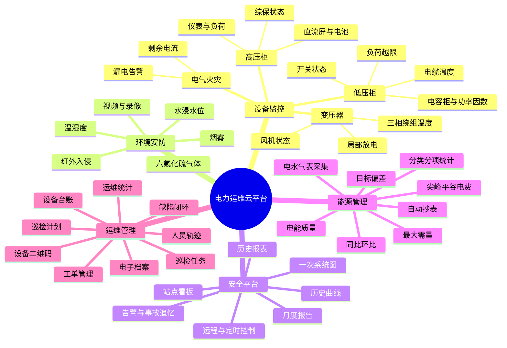
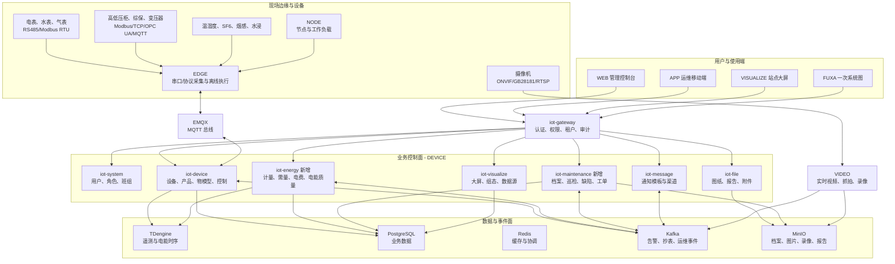
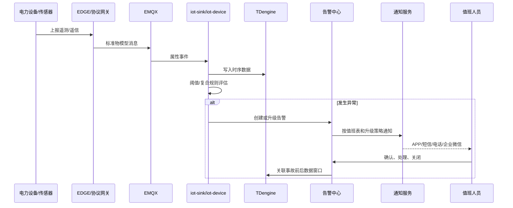
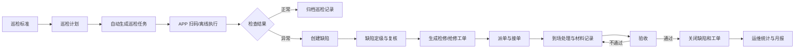
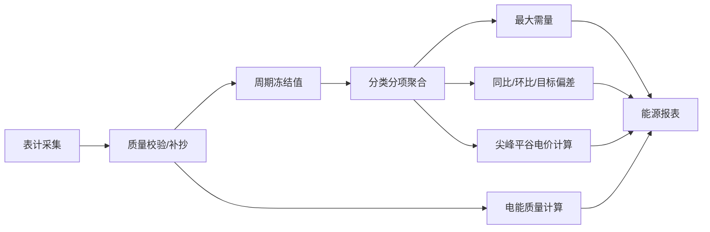
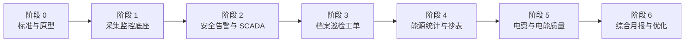

# EasyAIoT 电力运维云平台功能计划

> 文档版本：1.0.0  
> 编制日期：2026-07-30  
> 需求来源：`电力运维云平台价值.pdf`  
> 适用基线：EasyAIoT 当前仓库  
> 结论口径：基于代码与架构文档静态核对；“满足”表示平台已有可复用实现，不代表具体现场设备、网关和通知渠道已经完成联调。

## 1. 建设目标

在不破坏 EasyAIoT 云边端一体化架构的前提下，将现有通用 AIoT 平台扩展为覆盖以下业务闭环的电力运维云平台：

1. 电气设备与配电房环境的实时监控。
2. 异常检测、告警通知、事故追忆和安全控制。
3. 站点看板、电力一次图、历史曲线和业务报表。
4. 表计采集、能耗统计、需量、电费和电能质量分析。
5. 设备档案、巡检、缺陷、工单、人员和绩效闭环。

目标产品不是重新建设一套独立系统，而是在现有 DEVICE、WEB、VISUALIZE、APP、EDGE、VIDEO 和消息体系之上新增电力领域能力。

## 2. 总体判断

当前系统已具备电力平台约 60%～70% 的通用技术底座：

- 设备、产品与物模型。
- MQTT、Modbus、OPC UA 等设备接入基础。
- TDengine 时序数据。
- 属性阈值、告警策略、健康评分和预测诊断。
- 物模型服务调用、属性下发和设备操作日志。
- 视频接入、实时查看、抓拍与录像回放。
- 消息模板和通知配置。
- 低代码大屏与 FUXA SCADA/HMI。
- WEB 管理端和 APP 基础框架。

主要缺口集中在两个领域：

- **能源管理域**：表计、回路、抄表、能源组织、需量、尖峰平谷、电费和电能质量。
- **运维管理域**：档案、二维码、巡检、缺陷、工单、人员轨迹、评价和月报。

## 3. 平台功能脑图



## 4. 功能对比与建设分类

### 4.1 已满足或基本满足的功能

以下功能可直接复用现有平台，主要工作是配置电力物模型、制作行业模板和完成现场联调。

| 功能 | 当前基础 | 后续工作 | 目标模块 |
|---|---|---|---|
| 产品与设备管理 | 产品、设备、子设备、拓扑、在线状态 | 建立高压柜、变压器、低压柜、环境传感器等产品模板 | `iot-device`、WEB |
| 通用遥测采集 | MQTT、Modbus、OPC UA、物模型属性上报 | 对接现场网关并统一电力测点编码 | `iot-device`、`iot-sink`、EDGE |
| 时序数据存储 | TDengine 超级表与设备子表 | 统一采样周期、质量码和保留策略 | `iot-tdengine` |
| 历史运行曲线 | 设备属性历史查询与 ECharts 曲线 | 增加多测点对比和常用时间范围 | WEB |
| 属性阈值告警 | 阈值、等级、策略、未恢复告警 | 提供电力默认阈值模板和迟滞/持续时间规则 | `iot-device`、WEB |
| 设备健康评分 | 已有设备健康评分与预测诊断 | 增加电力设备评分因子 | `iot-device` |
| 远程设备服务调用 | 物模型属性设置、服务调用、操作日志 | 对接分合闸等具体服务模型 | `iot-device`、WEB |
| 视频实时查看 | RTSP、GB28181、SRS/ZLMediaKit | 配电房摄像头绑定站点和设备 | VIDEO、WEB、APP |
| 抓拍和录像回放 | 已有抓拍、录像、存储空间和回放 | 告警事件与对应录像片段关联 | VIDEO、`iot-sink` |
| 可视化大屏 | 大屏项目、模板、数据源、发布 | 制作电力站点模板 | `iot-visualize`、VISUALIZE |
| Web SCADA | 已集成 FUXA SCADA/HMI | 制作电力一次图图元和点位绑定规范 | `iot-visualize`、FUXA |
| 用户、角色和权限 | 用户、角色、菜单、数据权限、多租户 | 增加电力运维岗位和操作权限点 | `iot-system` |
| 文件存储 | 文件服务和 MinIO | 用于图纸、手册和试验报告 | `iot-file` |

### 4.2 需要修改和增强的功能

这些能力已有基础，但现有语义、交互或安全性不足以直接满足电力业务。

| 功能 | 现状问题 | 修改计划 | 优先级 |
|---|---|---|---:|
| 电力设备物模型 | 仅有通用产品物模型，没有标准电力模板 | 增加设备类型、标准属性、事件、服务、单位、枚举和默认告警模板 | P0 |
| RS485 设备接入 | 系统以网络协议为主，未形成串口采集配置闭环 | 在 EDGE/NODE 增加串口、波特率、校验位、站号、寄存器映射；支持 RS485-Modbus RTU | P0 |
| 阈值告警 | 主要是单值比较 | 增加持续时间、迟滞区间、恢复阈值、复合条件、告警抑制、维护模式和规则版本 | P0 |
| 告警通知 | 已有模板和推送，但现场渠道未核验 | 增加值班表、升级策略、确认/关闭、短信/电话/企业微信适配和送达状态 | P0 |
| 事故追忆 | 告警、时序、操作日志彼此分散 | 建立事件时间线，冻结事故前后遥测、告警、操作、图片和录像证据 | P1 |
| 远程分合闸 | 通用属性/服务调用可执行，但不具备电力安全闭环 | 增加二次确认、操作票、双人复核、联锁校验、超时、回执和审计 | P0 |
| 定时控制 | 有任务调度基础，缺少设备控制计划 | 新增控制计划、有效期、审批、冲突检测、取消和执行记录 | P1 |
| 历史曲线 | 以单设备单属性查看为主 | 增加多回路、多测点、日周月聚合、最大最小平均值和数据导出 | P1 |
| 自定义报表 | 存在通用 Excel 能力，但没有领域报表 | 增加指标选择、分组、时间粒度、模板保存、定时生成和导出 | P1 |
| 站点看板 | 可视化平台通用，没有站点业务聚合 API | 新增站点容量、负荷、设备状态、告警、用能和运维指标接口 | P0 |
| 一次系统图 | FUXA 可画图，但缺少电力图元与拓扑语义 | 增加母线、开关、刀闸、变压器、电容器图元及遥信/遥测/遥控绑定 | P0 |
| 视频联动 | 视频和设备告警是两套入口 | 告警触发预置位、抓拍/录像，告警详情可直接回看 | P1 |
| APP | 当前以设备、告警和算法为主 | 增加扫码、档案、巡检、工单、缺陷和位置上报页面 | P1 |
| 设备档案 | 有设备台账和文件服务，字段和分类不足 | 扩展厂家、型号、投运、质保、联系人、附件分类和档案版本 | P1 |

### 4.3 需要新增加的功能

#### 4.3.1 能源管理域

| 新功能 | 核心内容 | 建议归属 |
|---|---|---|
| 能源组织模型 | 企业、园区、站点、楼栋、楼层、车间、产线、回路、计量点 | 新模块 `iot-energy` |
| 表计管理 | 电表、水表、气表、倍率、读数类型、结算周期和数据质量 | `iot-energy` |
| 自动抄表 | 定时采集、补抄、人工补录、复核、冻结值和抄表台账 | `iot-energy` + EDGE |
| 分类分项统计 | 按组织、区域、能源类型、设备和回路聚合 | `iot-energy` |
| 最大需量 | 滑动窗口、需量峰值、发生时间和越限告警 | `iot-energy` |
| 目标与偏差 | 目标值、预算值、实际值和偏差率 | `iot-energy` |
| 尖峰平谷策略 | 电价方案、时段日历、节假日和阶梯价格 | `iot-energy` |
| 电费分析 | 尖峰平谷电量、基本电费、力调电费和费用趋势 | `iot-energy` |
| 同比环比 | 日、周、月、年同比环比与基线对比 | `iot-energy` |
| 电能质量 | 三相不平衡、谐波、THD、频率、电压偏差和功率因数 | `iot-energy` |
| 能源报表 | 日报、月报、费用报表、能效排行和导出 | `iot-energy` + WEB |

#### 4.3.2 运维管理域

| 新功能 | 核心内容 | 建议归属 |
|---|---|---|
| 设备档案中心 | 台账、电子文档、档案版本、质保提醒 | 新模块 `iot-maintenance` |
| 二维码 | 设备码生成、扫码鉴权、移动端设备主页 | `iot-maintenance` + APP |
| 巡检标准 | 检查项、步骤、方法、合格规则、拍照要求 | `iot-maintenance` |
| 巡检计划 | 周期、站点、设备范围、班组、人员和排班 | `iot-maintenance` |
| 巡检任务 | 领取、执行、离线保存、提交和复核 | `iot-maintenance` + APP |
| 缺陷管理 | 缺陷登记、定级、分派、整改、验收和关闭 | `iot-maintenance` |
| 工单管理 | 抢修、检修、试验、保养工单及 SLA | `iot-maintenance` |
| 工单流程 | 派单、接单、到场、处理、暂停、转派、验收和评价 | `iot-maintenance` |
| 备品备件关联 | 工单使用的备件、数量和成本；首期可只记录不建库存 | `iot-maintenance` |
| 运维统计 | 工单数量、及时率、完结率、重复故障和人员工作量 | `iot-maintenance` |
| 客户评价 | 工单满意度、标签和意见 | `iot-maintenance` |
| 人员轨迹 | APP 定位、签到、轨迹、围栏和隐私授权 | `iot-maintenance` + APP |

#### 4.3.3 综合报告域

月度报告可先作为 `iot-energy` 与 `iot-maintenance` 的组合应用，不建议首期单独拆微服务。

报告至少包含：

- 设备运行情况。
- 告警数量、等级、响应和关闭情况。
- 巡检、缺陷、工单和维护情况。
- 能耗分布、同比环比和最大需量。
- 电能质量。
- 尖峰平谷电量和电费。
- 下月风险与维护建议。

## 5. 目标业务架构图



## 6. 关键业务闭环

### 6.1 监测告警闭环



### 6.2 巡检缺陷工单闭环



### 6.3 能源核算闭环



## 7. 建议开发模块顺序

模块顺序遵循“先打通数据，再形成安全闭环，再建设运维闭环，最后做高级分析”。



### 阶段 0：标准、模型与可验证原型

目标：冻结电力领域统一语言，避免各模块重复定义。

交付：

- 站点、配电房、回路、设备、测点、计量点编码规范。
- 高压柜、变压器、低压柜、直流屏、电容柜及环境传感器物模型模板。
- 告警等级和状态机。
- 一次图图元及点位绑定规范。
- 选取一个真实配电房完成端到端原型。

### 阶段 1：采集与监控底座

目标：先实现“数据进得来、存得住、看得到”。

开发顺序：

1. EDGE 增加 RS485/Modbus RTU 采集配置。
2. DEVICE 增加电力产品模板和测点标准。
3. TDengine 完善数据质量、采样周期和历史聚合。
4. WEB 完善实时状态、多曲线和站点设备树。
5. 接入温湿度、烟雾、水浸、SF6 和摄像机。

### 阶段 2：安全告警、控制与 SCADA

目标：形成配电房无人值守的最小可用产品。

开发顺序：

1. 增强阈值、复合规则、恢复和告警抑制。
2. 建立值班表、通知升级和告警确认闭环。
3. 建设事故追忆和视频联动。
4. 增加安全遥控、操作票、双人复核和联锁。
5. 制作站点看板和电力一次图模板。

### 阶段 3：档案、巡检、缺陷与工单

目标：形成运维业务闭环。

开发顺序：

1. 创建 `iot-maintenance` 模块和数据库。
2. 建设设备档案、附件分类和二维码。
3. 建设巡检标准、计划、任务和记录。
4. 建设缺陷状态机。
5. 建设工单状态机、派单和 SLA。
6. APP 增加扫码、离线巡检、缺陷和工单。
7. 增加工作量、及时率和评价统计。

### 阶段 4：表计与基础能源管理

目标：形成可信的用能数据和自动抄表闭环。

开发顺序：

1. 创建 `iot-energy` 模块和数据库。
2. 建设能源组织、回路、计量点和表计。
3. 建设自动抄表、补抄、复核和冻结值。
4. 建设分类分项、同比环比和目标偏差。
5. 输出能源日报和基础月报。

### 阶段 5：高级能源与电能质量

目标：形成节能和电力质量分析能力。

开发顺序：

1. 最大需量和需量越限。
2. 电价时段日历和尖峰平谷计费。
3. 功率因数及力调费用。
4. 三相不平衡、谐波和 THD。
5. 电费模拟、节能建议和异常能耗识别。

### 阶段 6：综合报告和持续优化

目标：把监测、能源和运维数据转化为经营价值。

交付：

- 电力运行月报。
- 告警和事故分析。
- 运维质量分析。
- 能源成本分析。
- 多站点对标与能效排行。
- 报告定时生成、审批、归档和发送。

## 8. 大致概要设计

### 8.1 新增 Java 模块

建议遵循 DEVICE 现有 API/BIZ 分层：

```text
DEVICE/
├── iot-energy/
│   ├── iot-energy-api/
│   └── iot-energy-biz/
└── iot-maintenance/
    ├── iot-maintenance-api/
    └── iot-maintenance-biz/
```

`iot-energy` 负责能源领域，不直接操作 `iot-device` 数据库；通过 OpenFeign API 获取设备、产品和测点信息，通过 Kafka 消费遥测事件或通过 TDengine 服务查询时序数据。

`iot-maintenance` 负责档案和运维流程；通过设备 API 关联设备，通过系统 API 关联用户、班组，通过文件 API 保存附件，通过消息服务发送任务和工单通知。

### 8.2 核心领域模型

#### 能源模型

| 聚合 | 主要对象 |
|---|---|
| 能源组织 | `EnergyNode`、`EnergyNodeRelation` |
| 计量点 | `MeteringPoint`、`MeterBinding`、`MeterReading` |
| 抄表 | `ReadingPlan`、`ReadingTask`、`ReadingFreeze`、`ReadingCorrection` |
| 价格 | `TariffPlan`、`TariffPeriod`、`HolidayCalendar` |
| 指标 | `EnergyAggregate`、`DemandResult`、`EnergyTarget`、`EnergyCost` |
| 电能质量 | `PowerQualitySample`、`PowerQualityEvent`、`PowerQualityReport` |

#### 运维模型

| 聚合 | 主要对象 |
|---|---|
| 设备档案 | `AssetArchive`、`ArchiveDocument`、`WarrantyRecord`、`AssetQrCode` |
| 巡检标准 | `InspectionTemplate`、`InspectionItem`、`InspectionRoute` |
| 巡检执行 | `InspectionPlan`、`InspectionTask`、`InspectionRecord` |
| 缺陷 | `Defect`、`DefectAssignment`、`DefectAcceptance` |
| 工单 | `WorkOrder`、`WorkOrderAction`、`WorkOrderMaterial`、`WorkOrderEvaluation` |
| 人员位置 | `WorkerLocation`、`WorkerTrack`、`AttendanceEvent` |

### 8.3 状态机

#### 告警状态

```text
ACTIVE → ACKNOWLEDGED → PROCESSING → RECOVERED → CLOSED
   └──────────────→ ESCALATED
```

- 告警恢复不等同于业务关闭。
- 同设备、同测点、同规则的重复告警应聚合计数。
- 维护模式可抑制通知，但必须保留事件记录。

#### 巡检任务状态

```text
PENDING → ASSIGNED → ACCEPTED → EXECUTING → SUBMITTED → REVIEWED → CLOSED
                     └──────────────→ ABNORMAL/OVERDUE
```

#### 缺陷状态

```text
DISCOVERED → CONFIRMED → ASSIGNED → RECTIFYING → TO_ACCEPT → CLOSED
                  └────────→ REJECTED ←──────────────┘
```

#### 工单状态

```text
DRAFT → APPROVED → DISPATCHED → ACCEPTED → IN_PROGRESS → TO_ACCEPT → COMPLETED
                           ├→ TRANSFERRED
                           ├→ PAUSED
                           └→ CANCELLED
```

### 8.4 API 概要

建议统一经 `iot-gateway` 暴露：

| 业务 | API 前缀 | 示例 |
|---|---|---|
| 站点看板 | `/energy/dashboard` | `/energy/dashboard/site/{siteId}` |
| 能源组织 | `/energy/node` | `/energy/node/tree` |
| 表计与抄表 | `/energy/meter`、`/energy/reading` | `/energy/reading/task/page` |
| 能耗统计 | `/energy/statistics` | `/energy/statistics/trend` |
| 需量与电费 | `/energy/demand`、`/energy/cost` | `/energy/cost/period` |
| 电能质量 | `/energy/power-quality` | `/energy/power-quality/event/page` |
| 设备档案 | `/maintenance/archive` | `/maintenance/archive/device/{id}` |
| 巡检 | `/maintenance/inspection` | `/maintenance/inspection/task/{id}/submit` |
| 缺陷 | `/maintenance/defect` | `/maintenance/defect/{id}/assign` |
| 工单 | `/maintenance/work-order` | `/maintenance/work-order/{id}/action` |
| 人员轨迹 | `/maintenance/worker-track` | `/maintenance/worker-track/history` |
| 综合报告 | `/energy/report` | `/energy/report/monthly/generate` |

公共 API 不直接返回数据库实体；使用 ReqVO/RespVO，并包含权限、租户和数据范围校验。

### 8.5 事件概要

建议新增 Kafka 事件：

| 事件 | 生产者 | 消费者 |
|---|---|---|
| `device.telemetry.reported.v1` | `iot-sink` | `iot-energy`、告警服务 |
| `device.alarm.created.v1` | `iot-device` | 通知、VIDEO、运维模块 |
| `device.alarm.recovered.v1` | `iot-device` | 通知、事故追忆 |
| `meter.reading.frozen.v1` | `iot-energy` | 统计、费用、报表 |
| `inspection.task.overdue.v1` | `iot-maintenance` | 通知、看板 |
| `defect.created.v1` | `iot-maintenance` | 工单、通知 |
| `work-order.status.changed.v1` | `iot-maintenance` | 通知、统计、月报 |

事件必须携带 `eventId`、`eventVersion`、`tenantId`、`occurredAt`、`source` 和业务关联 ID；消费者必须幂等。

### 8.6 数据存储概要

- 原始高频遥测继续进入 TDengine。
- 分钟、小时、日、月聚合结果可以进入 PostgreSQL 或独立 TDengine 聚合表。
- 表计冻结值、修正记录、电价、工单、缺陷和档案元数据进入 PostgreSQL。
- 图纸、手册、报告、巡检照片和工单附件进入 MinIO。
- APP 离线巡检数据进入本地临时存储，联网后按幂等键同步；服务端成功后清除。
- 人员轨迹需设定保留周期、精度、采集频率和授权开关。

### 8.7 权限概要

建议新增权限域：

- `energy:dashboard:view`
- `energy:meter:manage`
- `energy:reading:review`
- `energy:tariff:manage`
- `energy:report:export`
- `maintenance:archive:manage`
- `maintenance:inspection:execute`
- `maintenance:defect:assign`
- `maintenance:work-order:dispatch`
- `maintenance:work-order:accept`
- `device:control:switch`
- `device:control:approve`

远程分合闸必须将“申请/执行”和“审核”权限分离，并保存完整审计记录。

### 8.8 APP 概要

APP 建议新增一级业务入口“运维”：

```text
运维首页
├── 扫一扫
├── 我的巡检
├── 我的工单
├── 缺陷上报
├── 设备档案
├── 告警处置
├── 位置签到
└── 消息中心
```

关键移动能力：

- 扫码进入设备详情。
- 查看设备实时状态、历史告警、巡检和工单。
- 离线巡检与断点续传。
- 拍照、录像、语音和签名证据。
- 定位授权、签到和轨迹上传。
- 工单接单、转派、暂停、处理和提交验收。

### 8.9 非功能设计

| 方向 | 要求 |
|---|---|
| 安全 | 遥控双人复核、操作票、联锁、最小权限、审计和凭据加密 |
| 可靠性 | 采集断点续传、消息幂等、有限重试、死信和任务补偿 |
| 性能 | 高频遥测不直接写关系库；聚合查询预计算；列表分页 |
| 可观测性 | 采集成功率、数据延迟、告警延迟、通知送达率、工单 SLA、队列积压 |
| 边缘适配 | `mini` 保留采集、告警和核心控制；高级报表和分析可放在中心侧 |
| 数据质量 | 无效值、跳变、断点、时间漂移、倍率变化和人工修正均需留痕 |
| 隐私 | 人员定位必须授权、可关闭、限定用途并设置保留周期 |

## 9. MVP 范围建议

首个可交付版本建议聚焦“单站点配电房无人值守”，不同时启动全部能源和运维功能。

### MVP 必须包含

- 一个站点和一套配电房设备树。
- 高压柜、变压器、低压柜、环境监测产品模板。
- RS485/Modbus RTU 至平台的采集链路。
- 实时状态、历史曲线和阈值告警。
- 值班通知、告警确认和关闭。
- 一次系统图与站点看板。
- 视频实时查看、告警抓拍和回放。
- 安全远程控制的申请、审核、执行和回执。
- 设备档案与二维码。
- 简化版巡检任务和缺陷上报。

### MVP 暂不包含

- 复杂电价结算和力调电费。
- 高级谐波诊断算法。
- 完整备品备件库存。
- 多级外包商结算。
- AI 自动生成运维决策。

## 10. 里程碑与验收建议

| 里程碑 | 核心验收 |
|---|---|
| M1 数据接入 | 连续采集不少于 7 天；断网补传；无重复和明显丢点 |
| M2 无人值守 | 告警产生、通知、确认、恢复、关闭和视频证据全链路完成 |
| M3 安全控制 | 分合闸申请、双人复核、联锁、回执和审计可验证 |
| M4 运维闭环 | 扫码巡检发现缺陷，生成工单并完成验收关闭 |
| M5 能源基础 | 自动抄表、分类分项、同比环比和基础月报正确 |
| M6 高级分析 | 需量、尖峰平谷、电费及电能质量与人工样本核算一致 |

## 11. 主要风险

| 风险 | 影响 | 控制措施 |
|---|---|---|
| 不同厂家寄存器和协议差异 | 接入周期不可控 | 建立驱动模板、点表导入和模拟器 |
| 远程分合闸误操作 | 人身及设备安全 | 双人复核、联锁、操作票、超时和现场可禁用 |
| 原始电能数据质量不稳定 | 报表与电费不可信 | 质量码、校验、补抄、修正审批和冻结值 |
| 高频数据查询压力 | 看板和报表变慢 | TDengine 聚合、预计算和缓存 |
| APP 弱网 | 巡检数据丢失 | 离线存储、幂等同步和附件分片重传 |
| 人员定位合规 | 隐私争议 | 明示授权、工作时段采集、用途限制和自动清理 |
| 现有告警与新告警模型分裂 | 多入口、难追踪 | 统一告警 ID、状态机和事件总线 |

## 12. 实施结论

EasyAIoT 适合作为电力运维云平台的技术底座，推荐采用“增强现有通用能力 + 新增能源和运维两个领域模块”的方式建设：

1. 不重写设备、时序、告警、视频、可视化和权限基础设施。
2. 优先补齐电力物模型、RS485 采集、安全告警、一次图和遥控安全闭环。
3. 第二步建设 `iot-maintenance`，尽快形成可感知的运维业务价值。
4. 第三步建设 `iot-energy`，先保证抄表与统计可信，再增加费用和电能质量分析。
5. 综合月报建立在监测、能源和运维数据稳定之后，避免先做展示后补数据。

本计划后续进入开发前，应为每个阶段分别产出需求说明、数据字典、接口契约、迁移脚本、测试方案和发布回滚方案，并遵守《EasyAIoT 项目开发宪法》。
