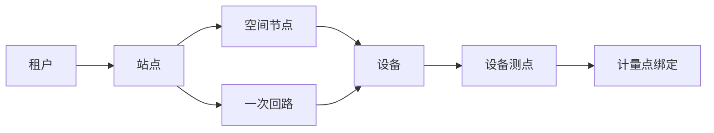

# SPEC-001：电力对象与测点编码规范

> Spec ID：POWER-SPEC-001  
> 上游需求：POWER-PRD-001 1.2.0  
> 版本：1.3.0  
> 状态：Approved / Frozen（M1 基线）  
> 冻结日期：2026-07-30  
> 架构决策：[ADR-004 历史设备编码兼容策略](../../架构决策/电力运维云平台/ADR-004-历史设备编码兼容策略.md)、[ADR-008 二维码安全解析方案](../../架构决策/电力运维云平台/ADR-008-二维码安全解析方案.md)  
> 目标里程碑：M1  
> 规范等级：基础契约，后续 Spec 不得自行定义冲突编码  
> 产品基线：[平台功能计划 1.4.0](../../架构设计/平台功能计划.md)、[项目开发宪法 1.4.0](../../开发规范/EasyAIoT项目开发宪法.md)

## 1. 目的

定义电力站点、空间、一次设备、回路、测点和计量点的统一身份及引用规则，使 DEVICE、collector、`TelemetryStore`、能源、运维、SCADA 和 APP 能够稳定关联同一业务对象。

## 2. 范围

包含：

- 租户内业务对象编码。
- 电力空间与设备层级。
- 设备、测点、计量点唯一标识。
- 编码创建、修改、停用和迁移规则。
- API、事件、时序和导入文件中的引用规则。

不包含：数据库主键生成方式、具体表结构和第三方厂家资产编号规则。

## 3. 术语

| 术语 | 定义 |
|---|---|
| `tenantId` | 租户边界标识，由认证上下文确定 |
| `siteCode` | 租户内唯一站点编码 |
| `spaceCode` | 站点内空间节点编码，如配电房、楼层、车间 |
| `circuitCode` | 站点内一次回路编码 |
| `deviceIdentification` | 现有 DEVICE 设备稳定标识 |
| `propertyCode` | 产品物模型中的属性标识 |
| `pointKey` | 设备实例测点键，由设备标识和属性标识组合引用 |
| `meteringPointCode` | 能源计量业务中的稳定计量点编码 |

## 4. 编码原则

### 4.1 字符集

- 本节规则只适用于本 Spec 新增的 `siteCode`、`spaceCode`、`circuitCode`、`meteringPointCode` 和新建 `propertyCode`，不追溯约束既有 `deviceIdentification`。
- 新增业务编码 MUST 使用 ASCII 小写字母、数字和连字符。
- MUST 以字母或数字开头和结尾。
- 单段长度 MUST 为 2～64 个字符。
- 显示名称 MAY 使用中文，显示名称不得充当跨系统唯一键。
- 编码比较 MUST 区分大小写，但写入时统一规范化为小写。

推荐正则：

```text
^[a-z0-9](?:[a-z0-9-]{0,62}[a-z0-9])?$
```

### 4.2 唯一范围

| 对象 | 唯一范围 |
|---|---|
| 站点 | `tenantId + siteCode` |
| 空间 | `tenantId + siteCode + spaceCode` |
| 回路 | `tenantId + siteCode + circuitCode` |
| 设备 | 使用现有 `deviceIdentification` 的租户内唯一约束 |
| 产品属性 | `productId + propertyCode`（仅 `iot-device` 内部持久化唯一键；跨系统规则见 §8） |
| 设备测点 | `deviceIdentification + propertyCode` |
| 计量点 | `tenantId + meteringPointCode` |

数据库内部数值 `deviceId` MUST NOT 出现在新 MQTT Topic、Kafka 业务契约或可打印二维码中作为唯一业务身份。现有 Topic 继续使用字符串 `deviceIdentification`。

## 5. 对象层级



- 空间树和一次回路树是两个不同维度，MUST NOT 强行合并为同一父子树。
- 设备 MAY 同时绑定空间和回路。
- 一个设备测点 MAY 被一个或多个业务视图引用，但同一有效期内不得被两个结算计量点重复计算，除非明确标记为对照计量。

## 6. 标准对象类型

首期 MUST 支持：

- `site`：站点。
- `distribution-room`：配电房。
- `incoming-cabinet`：进线柜。
- `feeder-cabinet`：馈线柜。
- `transformer`：变压器。
- `protection-device`：综保装置。
- `dc-screen`：直流屏。
- `capacitor-cabinet`：电容柜。
- `meter-electric`、`meter-water`、`meter-gas`：表计。
- `sensor-temperature-humidity`、`sensor-sf6`、`sensor-smoke`、`sensor-water`、`sensor-intrusion`：环境传感器。

类型使用开放枚举：平台保留标准类型，租户扩展类型使用 `x-` 前缀。

`circuit-breaker`（断路器）和 `disconnector`（隔离开关）加入标准设备类型：具有独立设备身份、遥测、告警、档案或控制服务时建为设备对象；仅用于画面表达且无独立业务身份时作为 SPEC-009 图元，不重复创建设备主数据。

## 7. 生命周期规则

- 编码创建后 MUST 不可直接编辑。
- 业务需要改码时 MUST 创建别名映射，保留旧编码查询能力和迁移记录。
- 创建或修改别名映射时 MUST 在同一事务中检查目标存在、租户一致、自引用和整条映射链；发现直接或间接循环立即拒绝，定期扫描仅用于诊断存量异常，不替代写入校验。
- 对象停用 MUST 使用状态和有效期，不得因停用删除历史引用。
- 删除只允许未被任何业务数据引用的草稿对象。
- 导入时编码冲突 MUST 在预览阶段报告，不得静默覆盖。

## 8. 跨系统引用契约

所有新业务事件 SHOULD 使用以下引用结构：

```json
{
  "tenantId": "1001",
  "siteCode": "plant-a",
  "deviceIdentification": "legacy-device-001",
  "propertyCode": "winding-temp-a",
  "occurredAt": "2026-07-30T10:30:00+08:00"
}
```

- `tenantId` MUST 来自服务端认证或可信服务身份，不得信任终端随意声明。
- 跨系统 JSON 中 `tenantId` 的规范编码为十进制字符串；后端内部 MAY 使用 `Long`。兼容期消费者 MUST 同时接受规范字符串与不超过 `Number.MAX_SAFE_INTEGER` 的旧整数，生产者 MUST 只发送字符串；下一个破坏性事件版本移除整数形式。
- 电力事件和遥测中的 `siteCode` MUST 非空。尚未绑定站点的历史设备可继续使用原有非电力功能，但在补齐站点关系前不得发布电力 collector 配置或产生电力领域事件；不得用空值绕过站点权限。
- 时间 MUST 使用带时区 ISO 8601，或在独立字段中明确 epoch 单位。
- API 返回内部 ID 时 MUST 同时返回稳定业务编码。
- `productId + propertyCode` 是 `iot-device` 内部持久化唯一键，不作为跨系统引用。设备遥测使用 `deviceIdentification + propertyCode`，由设备绑定解析产品版本；模板级跨系统引用必须使用另行发布的稳定模板/产品业务标识和 `propertyCode`，不得发送裸 `productId`。
- 跨域 deep link MUST 使用受支持的资源类型、稳定业务 ID 和可选时间上下文，不得携带访问令牌、租户授权结论或对象敏感明文；目标服务必须重新执行租户、站点和资源权限校验。

### 8.1 二维码解析（M1 冻结）

M1 采用独立短码表。二维码只携带协议版本和不可枚举随机短码，推荐载荷：

```text
easyaiot://asset/v1/{shortCode}
```

最小信息集固定为：

| 字段 | 必填 | 说明 |
|---|---|---|
| `version` | 是 | 解析协议版本，M1 为 `v1` |
| `shortCode` | 是 | 至少 128 bit 随机熵的 URL-safe 不透明短码 |

- 二维码 MUST NOT 包含 `tenantId`、内部 `deviceId`、设备凭据、站点名称或可推断资产关系的明文。
- 短码表 MUST 保存目标对象类型与主键、租户、状态、创建人、创建时间、撤销时间和最近解析审计；MAY 配置有效期。
- 解析必须先认证，再执行租户、站点和对象数据权限；无权限、已撤销和不存在统一返回不可解析，避免枚举泄漏。
- 重新生成二维码必须产生新短码并可撤销旧短码，不得复用已撤销短码。
- M1 不承诺离线解析；无网络时客户端应明确提示稍后重试。

## 9. 需求清单

| ID | 规范要求 |
|---|---|
| OBJ-001 | 系统 MUST 校验编码字符集、长度和唯一范围 |
| OBJ-002 | 系统 MUST 分离空间树和回路树 |
| OBJ-003 | 设备 MUST 可同时绑定空间和回路 |
| OBJ-004 | 编码改动 MUST 通过别名/迁移流程完成 |
| OBJ-005 | 历史数据 MUST 保持创建时的稳定对象引用 |
| OBJ-006 | 导入 MUST 提供校验预览和逐行错误 |
| OBJ-007 | 二维码 MUST 使用不可枚举的安全解析标识，不直接暴露内部 ID |
| OBJ-008 | 所有查询 MUST 执行租户和站点数据权限 |
| OBJ-009 | 二维码 MUST 使用独立短码表，支持撤销、权限校验和解析审计 |
| OBJ-010 | 跨域引用与 deep link MUST 使用稳定业务 ID，目标服务 MUST 重新鉴权 |
| OBJ-011 | 跨系统 tenantId MUST 规范编码为十进制字符串，并兼容读取安全范围内旧整数 |
| OBJ-012 | 电力事件和遥测 siteCode MUST 非空，未绑定站点的历史设备不得启用电力能力 |
| OBJ-013 | 别名创建 MUST 同步拒绝自引用和直接/间接循环 |

## 10. 验收场景

### 场景 A：唯一性

```gherkin
Given 租户 A 已存在站点编码 plant-a
When 用户在租户 A 再次创建 plant-a
Then 服务端拒绝创建并返回编码冲突
And 租户 B 可以创建自己的 plant-a
```

### 场景 B：设备双维度归属

```gherkin
Given 变压器 tr-01 位于配电房 room-01 并属于回路 line-01
When 用户查看空间树和一次回路树
Then 两棵树都能定位到同一 deviceIdentification=tr-01
And 不创建两份设备主数据
```

### 场景 C：历史设备编码兼容

```gherkin
Given 设备历史标识为 TR_旧-001 且已有遥测、Topic 和工单
When 平台启用新业务编码规则
Then 原 deviceIdentification 保持 TR_旧-001 不变
And 新增 siteCode、spaceCode、circuitCode 按新规则校验
And 历史遥测、Topic、认证和工单仍可访问
```

### 场景 D：越权

```gherkin
Given 用户仅有 site-a 数据权限
When 用户请求 site-b 的设备或测点
Then 服务端返回无权限
And 不在错误信息中泄漏 site-b 的对象信息
```

### 场景 E：二维码撤销

```gherkin
Given 设备二维码短码已签发并可正常解析
When 管理员撤销该短码并重新签发
Then 旧二维码不再返回设备信息
And 新二维码在权限校验通过后解析到同一设备
And 签发、撤销和解析均有审计记录
```

### 场景 F：跨域钻取重新鉴权

```gherkin
Given 报告包含 site-a 设备 tr-01 的稳定资源链接
And 当前用户不再拥有 site-a 数据权限
When 用户从报告打开该链接
Then 目标服务重新执行权限校验并拒绝访问
And 链接本身不包含访问令牌或租户授权结论
```

### 场景 G：租户标识兼容与站点门禁

```gherkin
Given 历史消费者仍能读取安全整数 tenantId=1001
When 新生产者发布电力事件
Then tenantId 按字符串 "1001" 发送
And 消费者将两种形式规范化为同一后端租户标识
Given 历史设备尚未绑定 siteCode
When 用户发布该设备的电力 collector 配置
Then 发布被拒绝并提示先完成站点关系迁移
```

## 11. 兼容与迁移（冻结决策）

- 现有 `deviceIdentification` 作为不透明字符串继续使用，原值原样保留；不得小写化、重编码或批量替换。
- `deviceId` 是内部数值主键，`deviceIdentification` 是字符串业务标识，两者不得混用。仓库中少数将 `deviceIdentification` 声明为 `Long` 的旧 VO 作为兼容缺陷登记，在 Technical Design 中逐项确认调用方后修正，不以数据库迁移方式强转。
- 新增业务编码只对新建数据严格校验；存量不合规值享有永久兼容豁免。
- 如确需为设备提供新的规范化编码，新增 `assetCode`/别名映射，不修改原 `deviceIdentification`。别名表必须保证租户内唯一、可审计且禁止循环映射。
- 现有中文名称继续保留为显示名称。
- 新增站点、空间、回路和计量编码时，旧设备缺失关系可通过迁移任务补齐。
- 迁移任务 MUST 可重跑，并生成成功、跳过、失败清单。

## 12. 已冻结决策与后续设计项

- 历史设备编码采用“原值保留 + 新字段严格校验 + 可选别名映射”，不做强制迁移。
- M1 一个设备同一有效期只绑定一个主一次回路；跨回路关系通过辅助关系表达，不参与主拓扑计算。
- 二维码采用独立短码表，最小载荷为 `version + shortCode`；详细 API、表结构和错误码在设备档案 Technical Design 中完成。
- 本规范仅用于 standard/full 电力能力；mini 不创建电力对象、计量点或二维码短码。standard/full 必须共用相同标识、别名和二维码解析契约，不得按档位建立第二套编码。

本 Spec 冻结后，任何改变 `deviceIdentification` 语义、大小写或 Topic 表达的提案均属于破坏性变更，必须新建 ADR 并提供双写、回滚和混合版本验证方案。
