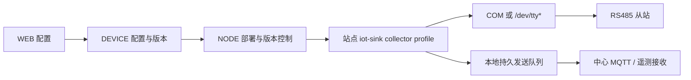

# SPEC-003：RS485/Modbus RTU 采集产品化

> Spec ID：POWER-SPEC-003  
> 上游需求：POWER-PRD-001 1.2.0  
> 依赖：POWER-SPEC-001、POWER-SPEC-002  
> 版本：1.4.0  
> 状态：Approved / Frozen（M1 基线）  
> 冻结日期：2026-07-30  
> 架构决策：[ADR-001 RTU Poller 运行位置](../../架构决策/电力运维云平台/ADR-001-RTU-Poller运行位置.md)、[ADR-007 collector 打包与 NODE 管理](../../架构决策/电力运维云平台/ADR-007-collector打包与NODE管理契约.md)  
> 目标里程碑：M1  
> 产品基线：[平台功能计划 1.4.0](../../架构设计/平台功能计划.md)、[项目开发宪法 1.4.0](../../开发规范/EasyAIoT项目开发宪法.md)

## 1. 现有基线

仓库已经具备：

- `IotModbusRtuPollingProtocol`。
- `IndustrialDeviceConfig` 中的串口、波特率、数据位、停止位、校验、发送延迟、站号、轮询周期和点位配置。
- `ModbusSerialPortLocks` 串口互斥。
- `MODBUS_RTU` 上行读取和下行写入 Demo。

因此本 Spec 的目标是把现有代码提升为可配置、可发布、可观测、可在容器/边缘部署的产品能力，而不是重写 Modbus RTU 核心。

## 2. 范围

- WEB 端串口网关和点表配置。
- DEVICE 端配置保存、校验和版本管理。
- SINK 或目标边缘运行时的任务应用。
- 串口设备映射、轮询、写入、诊断和状态上报。
- 模拟器及自动化验收。

首期不包含非 Modbus 私有串口协议编辑器。

## 3. 部署模式



M1 的唯一权威运行实现为 `iot-sink` 中现有 `IotModbusRtuPollingProtocol`。Poller 必须部署在能够直接访问物理串口的站点节点，并由 NODE 管理其 collector profile 生命周期。EDGE 不实现、不复制 Modbus RTU 协议栈；中心服务器只有在串口物理直连时才可运行 Poller。

EDGE 运行 RTU Poller 延至 M2 重新评估；M2 若确有硬件或资源收益，必须先新增 ADR，并证明不会形成协议、配置和测试双栈。该评估不是 M1 的交付依赖。

collector profile 仅面向 standard/full，按目标拓扑保留配置应用、协议轮询、本地持久队列、MQTT client、指标和诊断能力；不得为 mini 创建电力 collector 变体。

collector 的协议、配置、Topic、镜像和测试资产在 standard/full 完全共用。档位差异仅允许由 capability manifest 表达实例数、串口数、点位数、轮询频率和缓存配额；full 不得复制或派生第二套 Poller。

## 4. 配置模型

### 4.1 串口

MUST 支持：

- `serialPort`
- `baudRate`
- `dataBits`
- `stopBits`
- `parity`
- `transmitDelayMs`
- `rs485Mode`
- `pollIntervalMs`
- 运行目标节点

运行目标必须提供串口枚举能力：

- Windows 枚举 `COM*`；Linux 枚举 `/dev/ttyUSB*`、`/dev/ttyACM*` 及配置白名单内的硬件串口。
- 枚举结果 MUST 至少包含端口名、规范路径、可用/占用/无权限状态；能读取时 SHOULD 返回 USB vendorId、productId、serialNumber 和设备描述。
- 枚举只返回候选项，不得自动打开、修改权限或写入串口。
- UI MUST 允许手工输入白名单内但未被枚举发现的端口，并在发布前由目标节点验证。
- 热插拔后支持手动刷新；端口消失时保留已发布配置并显示故障，不得静默绑定到其他设备。

### 4.2 点位

MUST 支持：

- `propertyCode`
- 功能码/寄存器区。
- `address`、`quantity`、`unitId`。
- `dataType`、`byteOrder`、`wordOrder`。
- `scale`、`offset`、值域。
- 是否可写。
- 点位独立超时和采样策略（若首期不支持，继承设备级设置）。

`identifier` 仅用于兼容旧配置；新配置 MUST 使用 `propertyCode`。

`scale` 和 `offset` 的配置编码 MUST 为规范十进制字符串，服务端与 collector 使用十进制定点计算；禁止以 JSON 二进制浮点作为已发布配置事实。默认 `scale="1"`、`offset="0"`，但默认值必须在发布快照中显式固化。

## 5. 配置发布

```text
DRAFT → VALIDATED → PUBLISHED → APPLIED
          │              ├────────→ FAILED
          │              └────────→ APPLY_TIMEOUT
          └────────────→ DRAFT（修改后重新校验）
```

- 发布前 MUST 执行静态校验。
- `VALIDATED` 仅表示指定配置版本通过服务端静态校验；具有发布权限的用户确认差异且乐观锁版本仍匹配后，才能进入 `PUBLISHED`，不得因校验通过自动发布。
- 同一运行目标和串口的参数 MUST 一致。
- 同一串口、站号、寄存器范围的冲突 MUST 被识别。
- 发布校验 MUST 根据请求数、波特率、响应超时、发送间隔、重试上限和轮询周期计算最坏情况总线占用。任一串口的预计周期超过目标周期或 capability 上限时 MUST 拒绝发布并列出主要冲突请求，不得静默延长周期。
- 配置发布 MUST 生成版本和校验摘要。
- 运行端 MUST 回报接收、应用、失败原因和当前版本。
- `PUBLISHED` 后默认 60 秒内未收到运行端 APPLIED/FAILED 回报则进入 `APPLY_TIMEOUT`；运行端继续使用上一已应用版本。迟到回报仍可关联原发布单，但必须经过当前期望版本校验，禁止覆盖更新发布的状态。
- 发布失败时 MUST 保持上一可用版本运行。
- MUST 支持回滚到上一已应用版本。

## 6. 轮询与性能

- 单串口所有请求 MUST 串行化。
- SHOULD 合并连续且数据类型兼容的寄存器读取，减少总线请求。
- 合并只允许相同 `unitId`、功能码、轮询组和兼容字节/字序的连续只读区间，且每个点位的完整寄存器宽度必须落在合并范围内。INT16/UINT16 可同组；32/64 位或浮点点位必须保持起始地址和宽度完整，跨不连续地址、写区、厂家禁止边界或不兼容字/字节序时必须拆分。合并响应按各点原偏移独立解码，单点解码失败不得污染其他点。
- 单次合并默认最多读取 120 个 16 位寄存器；模板可下调，不得超过 Modbus 协议或厂家设备声明的上限。
- 轮询周期下限由系统配置控制，当前代码最小 1000 ms 可作为首期默认下限。
- 任务调度 MUST 避免一个慢从站永久阻塞其他从站。
- 每个请求 MUST 有超时，重试 MUST 有上限和退避。
- 长期失败从站进入降频探测，不得产生重试风暴。默认连续失败 3 个轮询周期后，探测间隔按正常周期的 `2x → 5x → 10x` 递增，最大 5 分钟；一次成功即恢复正常周期。阈值、倍率和上限可配置并随配置版本发布。

## 7. 上行数据

- 原始寄存器值解码后应用字节序、字序、`scale` 和 `offset`，固定语义为 `normalizedValue = decodedRaw × scale + offset`。
- `scale/offset` 只用于协议解码和单位归一，不得保存或应用 CT/PT 的 `currentRatio`、`voltageRatio` 或能源 `unitFactor`；这些业务倍率由计量点版本管理。
- 上报 MUST 使用 `propertyCode`。
- 上报 MUST 携带采集时间、接收时间和质量码。
- 单点失败 SHOULD 不影响同批其他成功点位。
- 解码异常 MUST 上报诊断，不得用 0 替代真实失败。

## 8. 下行写入

- 只有 `writable=true` 且物模型为 W/RW 的点位允许写入。
- 服务端 MUST 校验数据类型、值域和权限。
- 写入 MUST 记录命令 ID、操作者、目标、值、发送、回执和结果。
- 高风险属性或服务 MUST 经过 SPEC-007 安全遥控流程。
- 非幂等写入超时不得自动无限重试。
- 可配置写后读校验，实际值不一致时标记失败。

## 9. 容器与主机要求

- Linux Docker 部署 MUST 显式映射串口设备并记录配置示例。
- 运行前 MUST 检查串口存在、权限和占用情况。
- Windows 支持 COM 端口；Linux 支持 `/dev/ttyUSB*`、`/dev/ttyACM*` 和明确配置的硬件串口。
- 不得通过不受控的广泛设备映射取得所有主机设备权限。
- M1 支持范围固定为 NODE 管理的 Docker Compose 容器及已批准的 Windows 主机适配；Kubernetes/device plugin、USB 热插拔 operator 不在 M1 范围。未来新增编排目标必须先补 ADR，并保持同一 collector 镜像和配置契约。

## 10. 可观测性

每个串口/设备 MUST 提供：

- 当前配置版本和运行状态。
- 最近成功/失败时间。
- 请求数、成功率、超时数、CRC 错误数和平均耗时。
- 当前降频/重试状态。
- 点位最近值和质量。
- 串口占用者和冲突诊断。

## 11. 需求清单

| ID | 规范要求 |
|---|---|
| RTU-001 | 配置 MUST 在发布前校验并版本化 |
| RTU-002 | 运行端 MUST 回报应用结果和版本 |
| RTU-003 | 同一物理串口请求 MUST 串行化 |
| RTU-004 | 新点位 MUST 使用 propertyCode 绑定物模型 |
| RTU-005 | 失败值 MUST 使用质量码，不得替换为 0 |
| RTU-006 | 写入 MUST 校验 writable、权限、类型和值域 |
| RTU-007 | 发布失败 MUST 保持上一版本运行 |
| RTU-008 | 系统 MUST 提供串口级指标和诊断 |
| RTU-009 | Docker 部署 MUST 使用最小串口设备授权 |
| RTU-010 | 所有获准的运行目标 MUST 使用同一版本化配置契约；M2 EDGE 评估不得另建不兼容点表 |
| RTU-011 | 运行目标 MUST 提供只读串口枚举、可用性和权限诊断 |
| RTU-012 | 合并读取 MUST 遵守 120 寄存器默认上限及厂家覆盖策略 |
| RTU-013 | 连续失败 MUST 进入有上限、可观测且成功后可恢复的降频探测 |
| RTU-014 | 发布前 MUST 估算最坏情况总线占用，无法满足目标轮询周期时拒绝发布 |
| RTU-015 | 采集换算 MUST 使用固定 scale/offset 公式，且不得与计量倍率重复 |
| RTU-016 | VALIDATED 后 MUST 经授权确认才能发布；应用超时不得停掉上一可用版本 |
| RTU-017 | 合并读取 MUST 同时满足 unitId、功能码、轮询组、地址连续、完整宽度和字节/字序兼容 |
| RTU-018 | scale/offset MUST 以规范十进制字符串发布并显式固化默认值 |

## 12. 验收场景

### 场景 A：正常上行

```gherkin
Given COM4 上存在站号 1 的 RTU 从站
And 点位 holding register 0 绑定 temperature，scale=0.1
When 运行端应用配置并轮询到原始值 253
Then 平台收到 temperature=25.3
And 数据包含 GOOD 质量码和采集时间
```

### 场景 B：串口冲突

```gherkin
Given 两个配置使用同一串口但波特率不同
When 用户执行发布校验
Then 发布被拒绝
And 错误指出冲突的配置与参数
```

### 场景 C：配置回滚

```gherkin
Given 运行端正在使用版本 5
When 版本 6 因串口不存在应用失败
Then 运行端继续使用版本 5
And 平台显示版本 6 失败原因
And 用户可以明确执行回滚
```

### 场景 D：写入保护

```gherkin
Given 点位 running 的 writable=false
When 用户调用属性下发写入 running
Then 服务端拒绝命令
And 串口不发送写请求
And 审计记录拒绝原因
```

### 场景 E：从站超时

```gherkin
Given 同一串口有站号 1 和站号 2
And 站号 1 持续超时
When 轮询运行
Then 站号 1 的点位标记 TIMEOUT
And 站号 2 仍按策略被轮询
And 不产生无限重试
```

### 场景 F：串口枚举与热插拔

```gherkin
Given 目标节点已连接带序列号的 USB-RS485 转换器
When 用户刷新串口列表
Then 系统返回端口、可用状态和可读取的 USB 标识
When 转换器被拔出
Then 已发布配置保持不变并显示端口不存在
And 系统不自动改绑到新出现的其他端口
```

### 场景 G：总线负载超限

```gherkin
Given COM4 的点表、超时、重试和发送间隔估算最坏轮询需要 12 秒
And 配置要求每 5 秒完成一轮
When 用户执行发布校验
Then 发布被拒绝
And 返回预计轮询时长和占用最大的请求
And 系统不自动把轮询周期改为 12 秒
```

### 场景 H：采集换算不重复计量倍率

```gherkin
Given 寄存器原始值为 253 且 scale=0.1、offset=0
And 对应计量点 currentRatio=100、voltageRatio=1
When collector 上报属性
Then 遥测 normalizedValue 为 25.3
And collector 不在该值上应用 currentRatio
And 能源域按计量点有效版本计算业务值
```

### 场景 I：发布确认与应用超时

```gherkin
Given 配置版本 6 已通过静态校验且运行端正在使用版本 5
When 未经发布权限确认
Then 配置保持 VALIDATED 且运行端继续版本 5
When 授权用户发布但 60 秒未收到应用回报
Then 发布单进入 APPLY_TIMEOUT
And 运行端版本 5 不被停止或清除
```

## 13. 测试资产

- 复用 `.scripts/modbus-rtu-virtual-serial`。
- 复用 `.scripts/modbus-rtu-demo` 的上下行脚本。
- 增加多站号、超时、CRC、字节序、浮点数、配置回滚和串口冲突用例。
- CI 无虚拟串口时运行协议解码与配置校验测试；集成环境运行伪终端端到端测试。
- TD-001 评审时 MUST 记录两套测试资产的 Git commit、文件内容哈希和模拟器协议版本；基线后的资产变化必须生成差异并重新运行受影响验收，禁止只引用可漂移的目录名。

## 14. 已冻结决策与后续设计项

- M1 Poller 运行在站点 `iot-sink collector profile`，由 NODE 编排；EDGE 延至 M2 通过新 ADR 重新评估。
- M1 单个设备实例只绑定一个串口和一个 `unitId`；多串口设备拆为多个采集设备实例后在业务层关联。
- 默认单次合并读取上限为 120 个 16 位寄存器；可按设备模板下调，不得超过协议和厂家声明上限。跨功能码、非连续地址、字节/字序不兼容或厂家标记禁止合并时必须拆分请求。
- 本地断点队列和遥测确认遵循 SPEC-004，不允许 Poller 仅凭 MQTT PUBACK 删除数据。
- 安装与运行验收必须验证 mini 不部署 collector、无电力采集任务；并验证 standard 使用的同一 collector 镜像和配置可在 full 直接运行。
