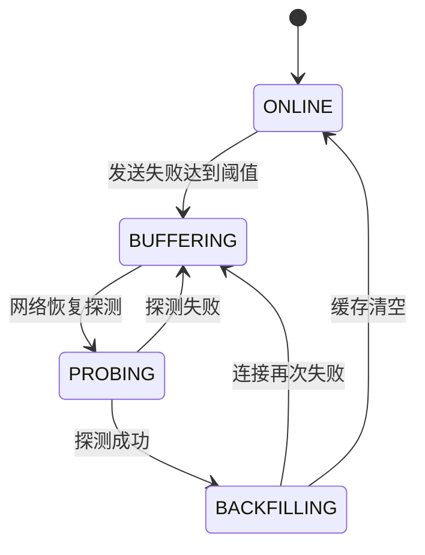

# SPEC-004：遥测质量与断点补传

> Spec ID：POWER-SPEC-004  
> 上游需求：POWER-PRD-001 1.2.0  
> 依赖：POWER-SPEC-001  
> 版本：1.4.0  
> 状态：Approved / Frozen（M1 基线）  
> 冻结日期：2026-07-30  
> 架构决策：[ADR-002 边缘持久队列](../../架构决策/电力运维云平台/ADR-002-边缘持久队列.md)、[ADR-003 遥测 ACK](../../架构决策/电力运维云平台/ADR-003-遥测ACK机制.md)、[ADR-006 分档时序存储](../../架构决策/电力运维云平台/ADR-006-mini-standard时序存储方案.md)  
> 目标里程碑：M1  
> 产品基线：[平台功能计划 1.4.0](../../架构设计/平台功能计划.md)、[项目开发宪法 1.4.0](../../开发规范/EasyAIoT项目开发宪法.md)

## 1. 目的

定义从现场采集到中心可靠 inbox、分档时序后端和业务消费端的遥测质量、幂等、排序、断网缓存、恢复补传和完整率规则，保证历史曲线、告警、抄表和报表能判断数据是否可信。

## 2. 数据信封

新遥测契约 MUST 至少包含：

```json
{
  "messageId": "01J...",
  "tenantId": "1001",
  "siteCode": "plant-a",
  "deviceIdentification": "meter-01",
  "propertyCode": "active-energy-import",
  "value": "12345.67",
  "valueEncoding": "decimal-string",
  "quality": "GOOD",
  "collectedAt": "2026-07-30T10:30:00.123+08:00",
  "sentAt": "2026-07-30T10:30:00.456+08:00",
  "sequence": 182731,
  "source": "modbus-rtu",
  "configVersion": 5
}
```

- `messageId` MUST 全局唯一，用于消息幂等。
- `tenantId` 规范编码为十进制字符串；消费者在兼容期 MUST 接受不超过 `Number.MAX_SAFE_INTEGER` 的旧整数并立即规范化，生产者 MUST 只发送字符串。
- 电力遥测 `siteCode` MUST 非空，并与中心登记的设备站点关系一致；缺失或不一致返回最终拒绝，不得退化为仅租户权限或写入未知站点。
- `collectedAt` 表示现场采集时间，`sentAt` 表示发送时间。
- `sequence` 在设备/采集任务范围单调递增，用于检测缺口和重排。
- 原始值为无效时 MAY 省略 `value`，但 MUST 上报质量与诊断。
- 交换时间 MUST 使用带偏移的 ISO 8601；中心持久化归一为 UTC，同时保留站点时区/原始偏移用于业务周期解释。不得用服务器本地时区无偏移时间作为事实时间。
- 数值解析与持久化 MUST 使用十进制定点语义；累计量、倍率换算和费用上游值使用 `valueEncoding=decimal-string` 的规范十进制字符串，不得经二进制浮点舍入后成为事实。兼容期消费者 MAY 读取旧 JSON number 并按物模型 precision 规范化，生产者对上述语义 MUST 发送字符串。

## 3. 质量码

首期 MUST 支持：

| 质量码 | 含义 | 是否参与普通业务计算 |
|---|---|---|
| `GOOD` | 正常采集 | 是 |
| `STALE` | 超过新鲜度阈值 | 默认否 |
| `TIMEOUT` | 设备请求超时 | 否 |
| `COMM_ERROR` | 通信或 CRC 错误 | 否 |
| `DECODE_ERROR` | 数据类型/字节序解码失败 | 否 |
| `OUT_OF_RANGE` | 超出物模型合法范围 | 默认否，可配置 |
| `CLOCK_SKEW` | 设备时间偏差超限 | 默认否 |
| `BACKFILLED` | 断网后补传的有效数据 | 是，但标记补传 |
| `MANUAL_CORRECTION` | 经审批的人工修正值 | 按业务规则使用 |
| `UNKNOWN` | 无法判定 | 否 |

业务计算 MUST 显式声明接受的质量码，禁止默认把所有数据当作有效。

## 4. 幂等与排序

- 同一 `messageId` 重复到达 MUST 只产生一条逻辑数据。
- 推荐存储唯一键包含设备、属性、采集时间和消息 ID；最终方案在技术设计中确定。
- 默认乱序窗口为 5 分钟，可按站点/测点策略版本调整。窗口内数据可重排和写入；窗口只决定实时视图与自动重算路径，不决定是否保存。
- 超出乱序窗口的数据仍写入对应 `TelemetryStore` 历史后端并标记迟到，不进入实时告警；未封账聚合自动重算，已封账聚合只记录影响并按重开策略处理。
- 同一采集时间存在多个不同值时 MUST 保留冲突信息，不得静默覆盖。

## 5. 边缘缓存

### 5.1 触发

在 MQTT/中心不可用、认证失败、网络断开或发送队列达到重试条件时，采集端进入缓存模式。

### 5.2 要求

- 缓存 MUST 有明确容量和磁盘上限。
- 写入 SHOULD 使用追加式持久队列并具备崩溃恢复能力。
- 数据 MUST 按租户/站点隔离，敏感配置不得写入遥测缓存。
- 缓存条目 MUST 保留原 `messageId`、采集时间、序号和质量。
- 缓存 MUST 可观测：当前条数、字节数、最老数据时间和预计可支撑时长。

### 5.3 冻结实现

- M1 在站点 `iot-sink collector profile` 内使用嵌入式 SQLite 持久队列，启用 WAL、`synchronous=FULL` 和单写多读模式。
- collector 进程内 MUST 只有一个 SQLite outbox 写入器；采集线程通过有界内存队列提交写请求，不直接竞争 WAL 写锁。队列满时按背压/关键点策略处理并产生指标，禁止启动第二写入器绕过背压。
- 采集结果必须先写本地 outbox 并提交，再进入发送流程；采集线程不得等待网络 ACK。
- 队列表至少保存 `message_id`、租户/站点/设备/测点引用、原始信封、优先级、状态、尝试次数、下次重试时间、创建时间和确认时间。
- 关键测点通过物模型属性或设备点位绑定上的 `dataPriority` 标记，枚举固定为 `SAFETY`、`ALARM`、`METERING_TOTAL`、`CONTROL_FEEDBACK`、`NORMAL_TELEMETRY`；设备级绑定 MAY 覆盖模板默认值，但必须记录配置版本和审计。
- `message_id` 必须唯一；状态机固定为 `PENDING → IN_FLIGHT → ACKED`，失败回到 `PENDING`，不可重试数据进入 `DEAD_LETTER`。
- 默认磁盘硬上限：`standard=2 GiB`、`full=4 GiB`；80% 告警、95% 启动分级保留。所有值可按站点下调或上调并记录审计。
- SQLite 仅是传输可靠性 outbox，不是业务事实库；收到可删除 ACK 后按批清理并周期 checkpoint/vacuum。

### 5.4 容量策略

- 达到预警阈值时 MUST 产生本地和中心告警（中心恢复后补报）。
- 达到硬上限时不得无限增长。
- 默认淘汰策略建议优先保留累计量、告警相关和关键测点，再处理普通高频数据；具体优先级由站点策略定义。
- 丢弃任何数据 MUST 生成数据缺口记录。

## 6. 恢复补传



- 补传 MUST 使用原采集时间和原消息 ID。
- 补传 SHOULD 限速，实时数据优先级不得被历史积压完全阻塞。
- 推荐实时与补传使用独立队列或加权调度。
- 中心确认持久化后，边缘才可删除对应缓存。
- 中途失败从最后确认位置继续，不从头重复发送。

### 6.1 ACK 契约

- MQTT 上报使用 QoS 1；PUBACK 只代表 Broker 收到，绝不代表业务持久化。
- 中心先以 `messageId` 为唯一键提交遥测可靠收件箱，再发布 `PROPERTY_DOWNSTREAM_REPORT_ACK` 应用 ACK。
- ACK 至少包含 `schemaVersion`、`messageId`、`requestId`、`status`、`code`、`persistedAt`。`status` 首期为 `ACCEPTED_DURABLE`、`DUPLICATE`、`REJECTED_RETRYABLE`、`REJECTED_FINAL`。
- `REJECTED_RETRYABLE` 仅用于中心暂时不可用、限流、事务冲突或可恢复依赖故障；`REJECTED_FINAL` 用于 schema/签名/租户或站点不匹配、设备/测点不存在、权限拒绝及不可修复值格式。具体稳定错误码在 TD-003 冻结；未知错误默认可重试且不得删除 outbox，达到重试上限后进入死信等待人工判定。
- 站点只在收到匹配 `messageId` 的 `ACCEPTED_DURABLE` 或 `DUPLICATE` 后删除 outbox；超时或可重试拒绝继续退避重发，最终拒绝转入死信并告警。
- 中心收件箱异步投影到档位对应的时序后端：standard 为 PostgreSQL 分区表，full 为 TDengine。写入失败必须按 ADR-003 重试、死信、告警和补偿。ACK 的准确语义是“中心已可靠接收且不会因进程重启丢失”，不是“所有查询视图均已更新”。

## 7. 数据完整率

### 7.1 固定周期测点公式

```text
数据完整率 = 有效采样数 / 应采集数 × 100%
```

- 统计窗口统一为左闭右开 `[start, end)`；结果保留两位小数。`应采集数=0` 时返回 `N/A`，不得返回 100%。
- `应采集数` 是采样策略锚点产生且落入统计窗口、测点有效期和启用时段交集内的计划采集时刻数量。采样周期或策略版本在窗口内变化时，必须分段计算后求和。
- 经批准且具有起止时间的停运、检修或策略暂停时段 MAY 从应采集数扣除；通信故障、进程异常和网络中断不得扣除。
- `有效采样数` 是成功占据计划采样槽且质量策略允许参与完整率的唯一逻辑样本数。同一 `messageId`、重复补传或同一槽多条数据只计一次。
- `GOOD` 默认有效；`BACKFILLED` 在统计封账前到达时有效；`MANUAL_CORRECTION` 仅在审批通过且策略允许时有效。其他质量码默认无效。
- “封账”是统计窗口结束并超过版本化迟到宽限期后，由聚合任务自动生成不可变结果版本的动作；日统计默认宽限期 24 小时，其他周期由业务 Spec 冻结。封账也可由授权人员提前执行，但必须记录原因。
- 迟到数据在封账前自动重算完整率；封账后到达时记录迟到量和受影响结果。授权人员可基于原因重开，系统生成新结果版本并保留旧版本、审批和差异，不原地覆盖。

例如，5 秒周期测点在有效运行的 30 分钟窗口中，应采集数为 360；其中 350 个唯一有效槽有数据，则完整率为 `350 / 360 × 100% = 97.22%`。

### 7.2 非固定周期测点

变化上报、事件触发和任务型冻结值不得套用固定周期公式。其 `应采集数` 分别来自已发布的事件期望策略、抄表任务或冻结计划；没有可计算期望基数时完整率返回 `N/A`。所有结果同时输出应采集、有效、无效、缺失、迟到、人工修正数量和采样策略版本。

## 8. 告警与计算行为

- 通信质量异常和真实业务越限 MUST 分开告警。
- `TIMEOUT` 不得作为数值 0 参与阈值判断。
- 补传的历史越限数据默认生成“历史事件”而非实时通知，是否通知由规则配置。
- 计费和抄表只使用已批准的质量码与冻结值。
- 聚合结果 MUST 记录数据完整率和使用的质量策略版本。

## 9. 需求清单

| ID | 规范要求 |
|---|---|
| DQ-001 | 每条遥测 MUST 具有唯一 messageId、采集时间和质量码 |
| DQ-002 | 重复消息 MUST 幂等处理 |
| DQ-003 | 无效采集 MUST NOT 以 0 代替 |
| DQ-004 | 边缘缓存 MUST 持久化且有容量上限 |
| DQ-005 | 补传 MUST 保留原时间、序号和消息 ID |
| DQ-006 | 中心确认持久化后才能删除边缘缓存 |
| DQ-007 | 实时流量 SHOULD 优先于补传流量 |
| DQ-008 | 所有聚合 MUST 输出数据完整率 |
| DQ-009 | 数据丢弃 MUST 形成缺口记录和告警 |
| DQ-010 | 质量策略变更 MUST 版本化 |
| DQ-011 | 固定周期数据完整率 MUST 按“有效采样数/应采集数×100%”计算，并保留计算明细 |
| DQ-012 | 关键测点 MUST 使用版本化 `dataPriority` 标记，影响缓存保留优先级 |
| DQ-013 | 事件时间 MUST 可无歧义归一到 UTC，并保留站点时区/原始偏移用于周期解释 |
| DQ-014 | 遥测数值 MUST 保持声明精度，累计量与计量值不得以二进制浮点结果作为事实 |
| DQ-015 | 历史查询 MUST 受测点数、时间跨度、结果条数和导出配额约束 |
| DQ-016 | tenantId MUST 规范编码为字符串且电力遥测 siteCode MUST 非空并匹配设备关系 |
| DQ-017 | SQLite outbox MUST 使用单写入器和有界提交队列 |
| DQ-018 | 乱序窗口默认 5 分钟；迟到数据仍保存并按封账状态决定重算 |
| DQ-019 | 封账 MUST 生成不可变结果版本，重开生成新版本并保留差异与审批 |
| DQ-020 | ACK 可重试/最终拒绝 MUST 按稳定错误分类，未知错误不得导致删除 outbox |

## 10. 验收场景

### 场景 A：断网补传

```gherkin
Given 边缘每 5 秒采集一个测点
When 中心网络中断 30 分钟后恢复
Then 边缘缓存 360 个预期样本
And 恢复后实时数据继续上报
And 历史数据按原采集时间补传
And 中心不存在重复逻辑样本
```

### 场景 B：进程重启

```gherkin
Given 边缘处于缓存状态且已有未确认数据
When 边缘进程异常退出并重启
Then 未确认缓存仍然存在
And 从最后确认位置继续发送
```

### 场景 C：超时不触发低值告警

```gherkin
Given 低电压规则为 voltage < 200
When 设备请求超时
Then 系统写入 TIMEOUT 质量状态
And 不将超时转换为 voltage=0
And 不创建低电压业务告警
And 可创建通信异常告警
```

### 场景 D：缓存硬上限

```gherkin
Given 缓存达到硬上限
When 新数据继续产生
Then 系统按已配置优先级执行保留策略
And 记录所有丢弃的数据范围
And 网络恢复后向中心补报数据缺口
```

### 场景 E：补传历史越限

```gherkin
Given 断网期间发生温度越限并已恢复
When 数据补传到中心
Then 系统保留历史越限事件
And 默认不向当前值班人员发送实时紧急通知
And 事件标记为补传生成
```

### 场景 F：数据完整率

```gherkin
Given 测点按 5 秒周期运行 30 分钟且期间无批准停运
And 共有 350 个唯一采样槽取得有效数据
When 系统计算该窗口数据完整率
Then 应采集数为 360
And 有效采样数为 350
And 数据完整率为 97.22%
```

### 场景 G：站点时区与精度

```gherkin
Given 站点时区为 Asia/Shanghai
And collector 上报 collectedAt=2026-07-30T23:59:59.900+08:00、value=12345.6789
When 中心持久化并按站点业务日查询
Then collectedAt 可无歧义转换为 UTC
And 该样本归属站点 2026-07-30 业务日
And 查询结果保持声明的四位小数精度
```

### 场景 H：历史查询配额

```gherkin
Given standard 默认限制为 10 个测点、31 天和 100000 条原始记录
When 用户请求 20 个测点的 90 天原始数据
Then 在线查询被拒绝并返回可执行的缩小范围、聚合或异步导出建议
And 不对数据库执行无界查询
```

### 场景 I：租户/站点契约与封账重开

```gherkin
Given 新 collector 为 tenantId="1001" 的 site-a 设备上报遥测
When siteCode 缺失或与设备登记关系不一致
Then 中心返回 REJECTED_FINAL 且不写入未知站点
Given 日完整率结果已在窗口结束 24 小时后封账
When 迟到有效数据到达并由授权人员批准重开
Then 原封账版本保持不变
And 系统生成包含新完整率、迟到量和差异的新版本
```

### 场景 J：单写背压与未知 ACK 错误

```gherkin
Given 多个采集线程同时向已满的有界提交队列写入遥测
When SQLite outbox 写入器正在提交前一批数据
Then 只有该单写入器访问 SQLite 写事务
And 系统执行配置的背压/关键点策略并产生队列水位指标
Given 中心返回未识别的 ACK 错误码
When collector 处理该 ACK
Then 对应 outbox 数据不被删除
And 数据按可重试策略处理，达到上限后进入死信等待人工判定
```

## 11. 非功能预算

- 缓存持久化不得显著阻塞采集线程。
- standard/full 的磁盘预算和关键点优先级必须可配置。
- 补传速率必须可限制，避免冲击 EMQX、SINK 和目标时序后端。
- 指标至少包括数据延迟、有效率、重复率、缺口、缓存水位和补传速率。
- 同一组可靠性、质量、幂等和 ACK 合同测试 MUST 同时作用于 standard PostgreSQL 适配器与 full TDengine 适配器；不得按档位维护两套业务语义。
- capability manifest MUST 关闭 mini 的电力收件箱、投影任务和时序查询入口，并分别声明 standard/full 的缓存、吞吐、保留期和点位配额。
- standard 在线原始查询默认最多 10 个测点、31 天和 100,000 条；full 使用同一查询契约并由 manifest 提高配额。超限必须聚合、缩小范围或异步导出。

## 12. 兼容策略

- 旧遥测未携带质量码时可在兼容层标记 `UNKNOWN` 或按可信来源临时标记 `GOOD`，策略必须配置并记录。
- 新字段添加时旧消费者应忽略未知字段。
- 契约升级需包含 `schemaVersion`；破坏性变化使用新版本 Topic 或消息类型。

## 13. 已冻结决策与实现差距

- 边缘持久队列采用 SQLite WAL，默认容量见 5.3；按容量而非承诺固定缓存时长。
- 传输采用 MQTT QoS 1，可靠删除依据应用层持久化 ACK；不以 PUBACK 或 Kafka producer ACK 代替业务 ACK。
- 现有代码已定义 `PROPERTY_DOWNSTREAM_REPORT_ACK` Topic，但 RTU 上报当前 `needReply=false`，且 `DeviceDataStorageService` 会捕获并吞掉 TDengine 异常。实现阶段必须新增可靠收件箱、幂等约束和 ACK 发布链，并改造存储结果传播；在这些改造通过验收前，不得宣称断点补传已实现。
- 关键测点优先级初始为 `SAFETY/ALARM > METERING_TOTAL > CONTROL_FEEDBACK > NORMAL_TELEMETRY`，站点策略可调整但必须版本化。
- `METERING_TOTAL` 表示计量累计量类测点的缓存保留优先级，不表示聚合后的“总计”。该编码已进入冻结契约，本基线不重命名；UI 使用“计量累计量”显示名称避免歧义。
- 固定周期数据完整率采用“有效采样数 / 应采集数 × 100%”；应采集数按采样策略、有效期、启用时段和批准停运分段计算。
- 中心投影只通过 `TelemetryStore` 契约选择后端：standard 固定 PostgreSQL 分区表，full 使用 TDengine；升级不得改变 `messageId`、样本键、质量码或历史查询语义。
