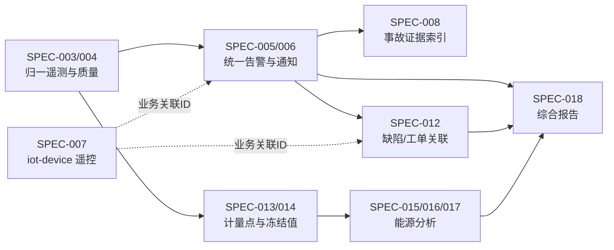

# SPEC-005～018 Feature Spec 编写约束

> 文档版本：1.2.0  
> 状态：Planning Gate（不是 Approved Feature Spec）  
> 日期：2026-08-24  
> 上游基线：[PRD 文档集 1.4.0](../../产品需求/电力运维云平台/README.md)、[平台功能计划 1.5.0](../../架构设计/平台功能计划.md)、[项目开发宪法 1.6.0](../../开发规范/EasyAIoT项目开发宪法.md)
> 用途：约束后续 Spec 的必含范围、已冻结产品规则和验收门禁；不得用本文件代替逐份 Spec 评审

## 1. 通用门禁

每份 Spec MUST：

- 只适用于 standard/full，明确 mini 的菜单、API、任务、消费者和初始化数据关闭验收。
- 使用同一代码、API、数据和事件契约；full 是 standard 的严格能力超集，只允许增加 capability、配额或扩展策略。
- 给出唯一需求 ID、状态机/业务规则、权限矩阵、错误语义、Given/When/Then 场景和非功能预算。
- 给出 standard/full capability 编码、依赖、配额和不可用原因；后端必须执行门禁。
- 明确事实来源、稳定业务 ID、精度、站点时区、有效期、版本、幂等键和审计字段。
- 覆盖权限拒绝、租户隔离、重复提交、并发冲突、依赖超时、重试/死信/补偿、升级兼容和回滚。
- 跨域只通过 API 或版本化事件协作，不共享数据库表；事件升级采用 consumer-first：先发布能同时读取旧/新契约的消费者，再让生产者同时发布旧版与新版，至少覆盖一个可独立部署、验证和回滚的稳定生产发布；确认所有消费者切换且完成对账后才能停发旧版。
- 复用 ADR-010 告警事实、ADR-011 capability manifest、ADR-006 `TelemetryStore` 和 `iot-device /device/control/**` 遥控入口，不建立平行实现。

## 2. 后续 Spec 必含约束

| Spec | 范围 | 已冻结、不得重新开放的产品规则 | 必须补齐的设计与验收 |
|---|---|---|---|
| SPEC-005 | 复合告警规则与状态机 | 四级告警；紧急告警不可 `IGNORED`；`IGNORED` 临时抑制且持续评估；`FALSE_ALARM` 不可逆；统一 `alarmId`；升级是与主生命周期正交的级别/事件；维护模式仍创建告警且不补发过期通知 | 有界 AND/OR 白名单运算符；条件数、嵌套、时间窗、执行预算；重复事件幂等；维护上下文；迁移/回滚 |
| SPEC-006 | 值班通知与告警升级 | 通知失败不阻止告警；请求持久化；只在有效窗口补发；过期转备用渠道/升级；维护模式退出只重新评估仍有效通知 | 值班表冲突、渠道适配、退避/死信、升级事件、送达与时延口径；平台提交成功率 MVP ≥99% 的分母和排除项 |
| SPEC-007 | 安全遥控与操作票 | `iot-device` 唯一责任；高风险控制双人复核、联锁、审计不可降级；默认 5 分钟、最大 15 分钟、单次执行；低风险简化仅限安全评审批准的版本化白名单 | 请求/审批/执行状态机；风险分类权限与变更审计；命令幂等；过期和条件变化失效；回执/超时；standard 依赖不足时整体关闭 |
| SPEC-008 | 事故追忆与视频证据 | 统一 `alarmId`；告警域拥有时间线/证据索引，VIDEO/iot-sink 拥有媒体事实；媒体失败不影响告警 | 追忆时间窗和异步阈值；证据哈希/保留；并发视频动作；权限、缺失和过期语义 |
| SPEC-009 | 电力一次图、站点聚合与点位绑定 | standard 只读查看/钻取/遥控申请；full 增加编辑发布/FUXA；共享同一数据 API | 草稿乐观锁、差异/另存；发布指针与回滚；WebSocket 快照+增量；候选基线为单画面最多 500 个订阅点、服务端最快每 1 秒推送一批增量，前端可合并降频渲染；必须用典型站点和目标浏览器压测确认/调整后才能冻结；稳定 deep link |
| SPEC-010 | 设备档案与二维码 | 设备主数据不复制；二维码遵循 SPEC-001/ADR-008；扫码后重新鉴权 | 档案版本、附件分类/有效期、二维码签发撤销、到期提醒、越权与枚举防护 |
| SPEC-011 | 巡检计划与移动执行 | 离线动作使用稳定幂等 ID；服务端状态不被旧离线数据覆盖；附件确认成功前不清理 | 离线信封、任务版本、冲突队列、同步协议、附件分片/续传预算、离线保留预算、到场证据可信度与降级策略；分片和重试值必须由 APP/网关限制、典型附件与弱网测试推导，不在规划门禁中臆定统一常数 |
| SPEC-012 | 缺陷与工单闭环 | 缺陷一般/严重/危急三级；告警/缺陷/工单独立状态；不得互相自动关闭 | 关联事件、阻断性工单、SLA 暂停/免责、验收分权、standard/full 状态与 capability 差异；各等级默认响应/整改/升级时限必须由产品、运维和安全负责人基于站点风险模板批准，危急等级不得无时限 |
| SPEC-013 | 能源组织与计量点 | collector 上报的 `normalizedValue = decodedRaw × scale + offset` 明确不含 CT/PT 倍率；能源域再计算 `normalizedValue × currentRatio × voltageRatio × unitFactor`；直连一次侧显式倍率 1；有效期精确到秒 | 计量拓扑防环/去重；倍率/组织关系版本；站点时区录入与 UTC 保存；换表/回绕；人工样本对账；交叉引用 SPEC-003 RTU-015 |
| SPEC-014 | 自动抄表与冻结值 | 冻结值不可覆盖；修正创建新版本；固化倍率、关系、公式和质量策略版本 | 调度幂等、补抄/补录/复核、封账/重开、迟到数据、累计量差额、任务和冻结状态机 |
| SPEC-015 | 分类分项与同比环比 | 历史统计使用当时有效关系；所有结果展示数据完整率与口径版本 | 拓扑损耗/差额、虚拟计量点、聚合重算、同比边界、外部产量数据版本和无效数据行为 |
| SPEC-016 | 最大需量与电价计算 | 默认需量周期 15 分钟；正式计算使用合同确认方案；金额采用十进制并保留舍入前值 | 固定/滑动窗口与步长、时段日历/节假日、方案有效期、币种舍入、重算和人工样本核对 |
| SPEC-017 | 电能质量分析 | 不从普通低频遥测推导谐波/THD；设备指标须带算法/采样元数据，或使用满足条件的波形 | 各指标输入 schema、最低数据条件、算法版本、可信度、缺失/无资格结果、事件与趋势预算；采样率、周期数和谐波阶次必须按采用的标准/算法及设备能力逐项冻结，不使用脱离算法来源的全局“256 点/周期”常数 |
| SPEC-018 | 综合月报 | 冻结采用不可变生成清单而非复制全量原始数据；修正生成新修订版；历史发布结果不重算 | 清单水位/摘要、幂等生成、`revisionOf`/连续修订号/diff、稳定 deep link、版式自动检查和视觉抽检 |

## 3. 跨 Spec 事实与协作

- 告警处置状态的唯一事实为 ADR-010 `alarm_record`。
- 设备控制状态的唯一事实位于 `iot-device`；其他领域只保存请求/结果引用。
- 原始遥测和质量由 SPEC-004/`TelemetryStore` 管理；能源域保存冻结值与计算结果，不复制原始时序事实。
- 设备主数据位于 `iot-device`；运维档案只通过设备 ID 扩展业务信息。
- 报告保存生成清单、结果和修订关系，不成为告警、工单或能源指标的第二事实源。

## 4. 进入评审的最低证据

每份后续 Spec 提交评审时至少附带：

1. 与 PRD 条款的一一追踪表，以及本文件对应行的关闭证据。
2. standard/full capability 差异表和 strict-superset 自动校验方案。
3. 正常、拒绝、重复、并发、超时、补偿、升级和回滚验收场景。
4. 数据量/并发/保留期假设及压测计划；无法量化时必须列出责任人和冻结截止点。
5. 影响的 API、事件、数据迁移和兼容窗口清单。

没有上述证据的文档只能保持 Draft，不得标记 Approved/Frozen 或拆分实现任务。

strict-superset 校验的最低参考实现为：CI 先用 JSON Schema 校验两份 manifest，再比较启用能力集合与共有能力语义/依赖/配额，最后以 standard/full 集成测试验证菜单、API、任务和消费者的实际启停；仅比较 JSON 或仅跑 UI 测试均不充分。
