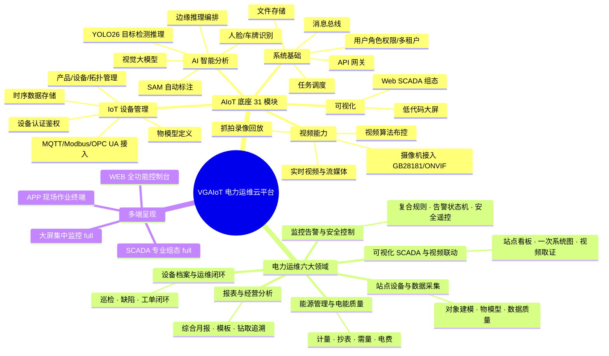
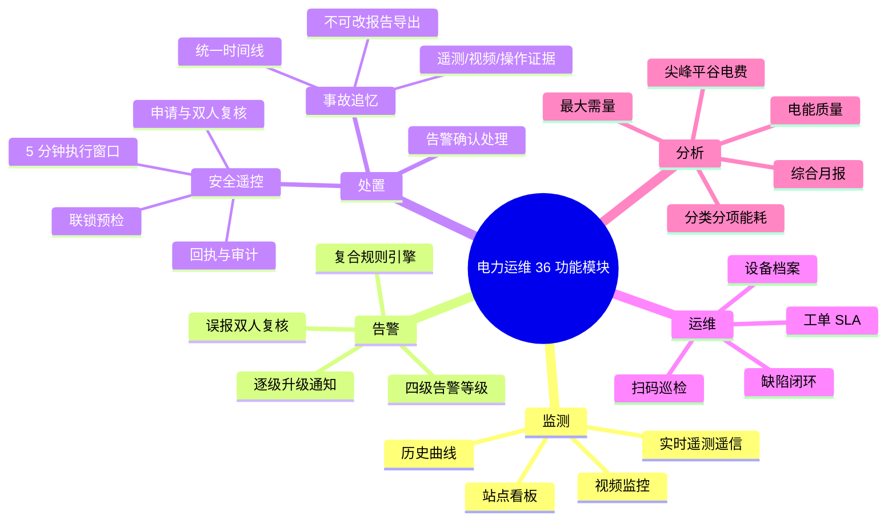
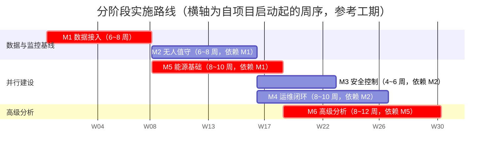
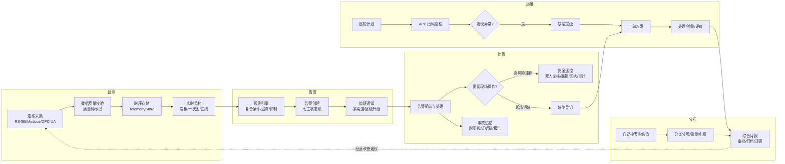
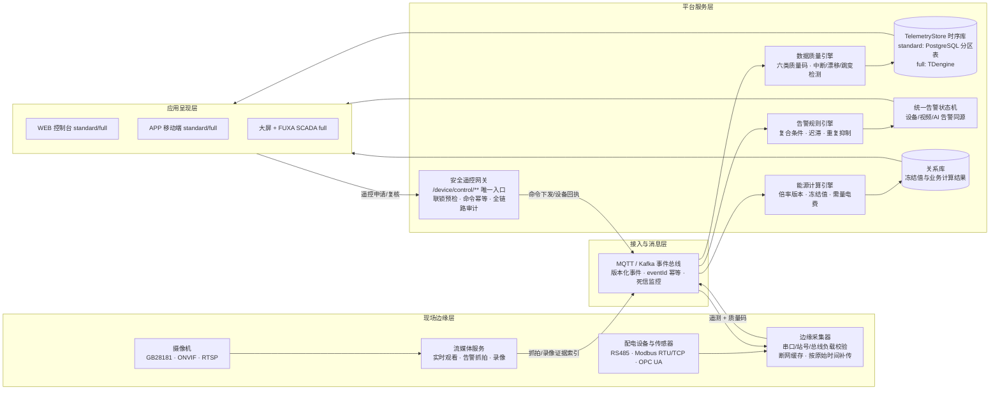
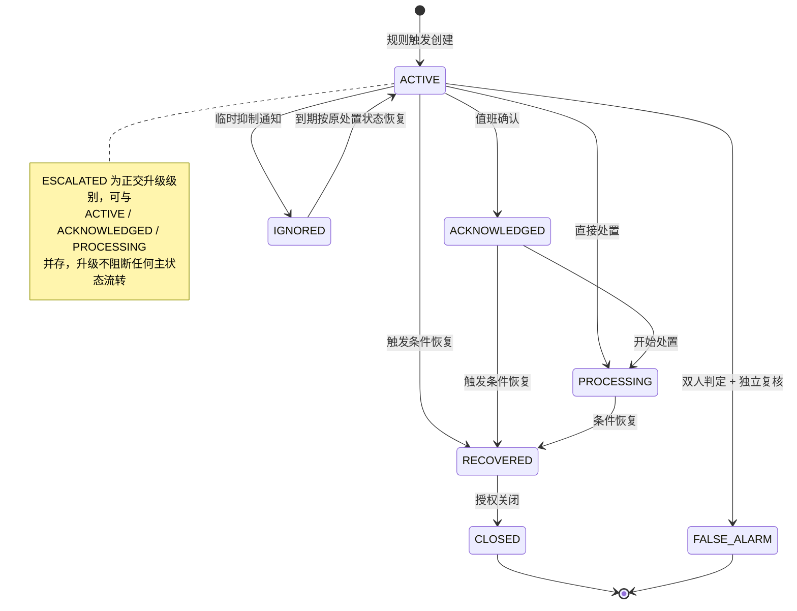
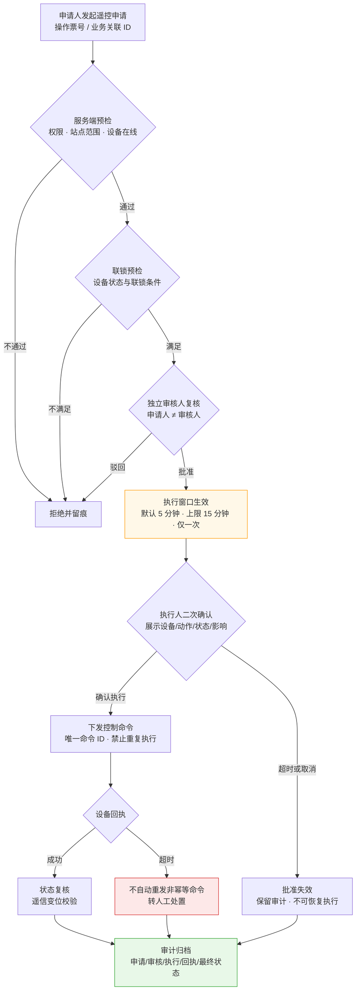
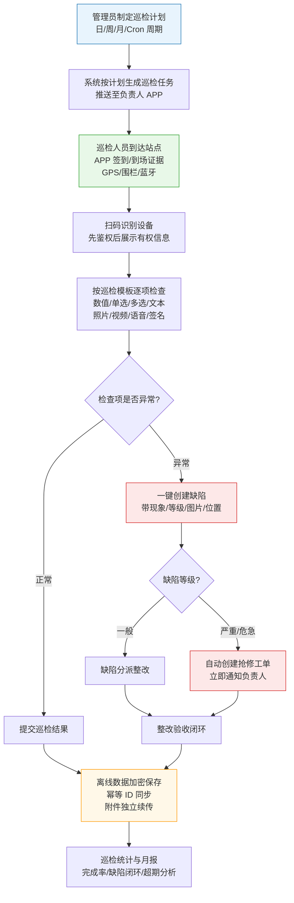

# VGAIoT 电力运维云平台 · 功能列表与汇总

## 1. 产品概览

VGAIoT 是云边端一体化智能算法应用平台，将 AI（YOLO26 目标检测、SAM 自动标注、视觉大模型、人脸/车牌识别）与 IoT 设备管理（MQTT/TCP/Modbus/OPC UA/GB28181/ONVIF）深度融合。同一套代码可部署于 4 GB 边缘盒子、AI 摄像机或全栈企业级一体机，通过安装时部署配置（`mini` / `standard` / `full`）选择硬件档位。

电力运维云平台在既有 IoT 底座上构建电力行业能力，形成「监测—告警—处置—运维—分析」闭环。平台面向高低压配电房多站点集团企业、电力运维服务商及其客户，让一个值班人员能远程掌握多个站点的设备、环境、视频、告警、运维和能源情况，并在安全控制边界内完成事件处置和经营分析。

产品范围分六大业务领域 + 平台基础能力，按 M1～M6 六个里程碑分阶段交付。电力运维仅支持 standard/full 两档（full 是 standard 的严格能力超集），mini 不在建设、交付和验收范围。

### 多端定位

平台一套业务能力，多端差异化呈现：

| 终端 | 定位 | 核心场景 | 部署档位 |
|---|---|---|---|
| **WEB**（PC 浏览器） | 全功能控制台 | 配置管理、实时监控、历史分析、告警处置、安全遥控、报告审批、系统管理 | standard / full |
| **APP**（移动端） | 现场作业终端 | 值班告警、扫码巡检、工单执行、缺陷上报、设备档案、位置签到、遥控申请 | standard / full |
| **大屏**（VISUALIZE） | 集中监控展示 | 站点看板、一次系统图编辑发布、多站点总览、能源概览、报告展示 | **full only** |
| **SCADA**（FUXA Web SCADA） | 专业组态运行 | 一次系统图组态、图元绑定运行、控制操作（走安全遥控） | **full only** |

**通知渠道**（非终端，但多端触达）：APP 推送 / 站内信 / 短信 / 电话 / 企业微信，standard / full 均支持。

> 四端共用同一后端 API、数据模型、权限点、事件契约与状态机；前端不持有业务数据库/Redis/Kafka 凭据，所有操作经服务端校验。APP 离线数据加密保存、幂等同步。

## 2. 里程碑总览

| 里程碑 | 依赖 | 参考工期 | 产品结果 | 主要交付终端 |
|---|---|---:|---|---|
| M1 数据接入 | 设备样本、现场网络、采集硬件 | 6～8 周 | 真实站点数据连续进入平台并可查看历史 | WEB |
| M2 无人值守 | M1、统一告警、通知/视频联调 | 6～8 周 | 告警、通知、视频证据和处置形成闭环 | WEB + APP + 大屏（full） |
| M3 安全控制 | M2、现场联锁条件、安全评审 | 4～6 周 | 安全遥控具备申请、复核、联锁、回执和审计 | WEB + APP + SCADA（full） |
| M4 运维闭环 | M2、APP 与档案模型 | 8～10 周 | 扫码巡检、缺陷和工单完成闭环 | APP + WEB |
| M5 能源基础 | M1、倍率/冻结值样本、人工对账基线 | 8～10 周 | 自动抄表、分类分项和基础能源报告可用 | WEB + 大屏（full） |
| M6 高级分析 | M5、电价和电能质量样本 | 8～12 周 | 需量、电费、电能质量和综合月报可用 | WEB + 大屏（full） |

---

## 3. 平台功能与业务流程图解

本章以八张图呈现平台的能力结构与关键流程：两张脑图给出平台功能全景与电力业务功能视图，一张路线图呈现分阶段交付计划，五张流程图/状态图分别刻画核心业务闭环、端边云数据链路、告警生命周期状态机、安全遥控全链路与现场巡检作业。

### 3.1 平台功能全景脑图

### 3.2 电力运维业务功能脑图

### 3.3 分阶段实施路线图

六大里程碑按依赖关系分阶段交付，关键路径为 M1 → M5 → M6（约 30 周）；M3 / M4 / M5 具备并行推进条件，可视资源与现场条件压缩总工期：

> 深色条为关键路径；各里程碑的交付物与依赖详见第 2 章里程碑总览，实际排期以合同约定为准。

### 3.4 核心业务闭环流程

平台以「监测 → 告警 → 处置 → 运维 → 分析」闭环组织全部业务能力：

### 3.5 端边云数据链路

从配电房现场到多端呈现的数据全链路：边缘侧保证采集可靠与断网补传，平台侧统一质量标记与时序存储，应用侧多端共用同一数据与权限契约：

> standard 与 full 在该链路上同构：仅时序库实现与规模配额不同，业务代码无感知；遥控命令必须经安全遥控网关，任何终端不得直连设备。

### 3.6 告警生命周期状态机

设备、视频、AI 告警统一映射到同一状态机；七主状态定义清晰、流转受控，ESCALATED 作为正交升级级别贯穿处置全程：

设计要点：恢复不删除告警记录；重复命中聚合到同一活动告警；FALSE_ALARM 为不可逆终态且不得删除原始证据；维护模式只抑制通知，不停止规则评估。

### 3.7 安全遥控全链路

针对高低压开关、刀闸、电容柜投切等高风险操作，「申请 → 预检 → 复核 → 窗口 → 二次确认 → 执行 → 回执 → 审计」每一环都有硬约束：

> 高风险操作不得豁免任一环节；仅经安全评审列入版本化白名单的低风险辅助控制可简化流程（省去操作票与双人复核），但授权、服务端校验、命令幂等、超时、回执与审计一项不省。

### 3.8 人员巡检流程

巡检是运维闭环的核心现场作业，全程 APP 支撑，支持弱网离线执行：

#### 巡检流程要点说明

| 环节 | 关键机制 |
|---|---|
| 计划生成 | 计划变更不修改已生成的历史任务；支持站点、路线、设备范围、班组、人员和完成时限 |
| 到场管控 | 到场证据方式（GPS/站点围栏/蓝牙）由站点配置；首选证据不可用时按策略降级并记录可信度等级 |
| 结果采集 | 模板定义检查项、步骤、方法、合格标准、必填证据和异常等级；支持八种结果类型 |
| 缺陷联动 | 危急缺陷默认立即通知并进入抢修评估；降级须说明原因并审计 |
| 离线可靠 | 离线动作使用客户端生成且重试不变的幂等 ID；状态已前进时不被旧数据覆盖，冲突进入人工处理并保留两侧内容 |
| 数据安全 | 离线数据加密保存，成功同步后清理本地副本；附件在业务记录确认后独立续传 |

---

## 4. 既有 AIoT 底座功能模块（31 项）

电力运维平台建设不重写底座；以下能力直接复用或在其上增强。

### 4.1 AI 智能分析能力（AI/、TASK/、RUNTIME/）

| # | 功能模块 | 功能描述 |
|---|---|---|
| 1 | AI 推理服务 | YOLO26 目标检测、ONNX 推理、实时流分析；ai_service 主推理服务 |
| 2 | SAM 自动标注 | 零样本标注流水线，视觉大模型辅助标注，显著降低标注成本 |
| 3 | LLM 视觉大模型 | vLLM + Qwen3 部署，视觉问答、图像理解 |
| 4 | 模型训练 | PyTorch 训练 worker，数据集管理、模型版本迭代 |
| 5 | 数据集管理 | AI 数据集全生命周期管理（iot-dataset 模块） |
| 6 | 人脸/车牌识别 | InsightFace + Milvus 向量检索，人脸库、车牌库管理 |
| 7 | C++ 高性能推理 | ONNX Runtime + FFmpeg + OpenCV，多线程池 + RTMP 编码 + 告警回调，用于上墙/设备端推理 |
| 8 | 边缘推理 | RUNTIME 边缘执行（实时/抓拍/轮巡推理），NODE 工作负载编排 |

### 4.2 IoT 设备管理能力（DEVICE/）

| # | 功能模块 | 功能描述 |
|---|---|---|
| 9 | 产品与设备管理 | 产品、设备、子设备、拓扑、在线状态管理 |
| 10 | 物模型管理 | 属性/事件/服务定义、单位精度枚举、版本管理 |
| 11 | 多协议接入 | MQTT、TCP、Modbus TCP/RTU、OPC UA 设备接入 |
| 12 | 设备认证鉴权 | 设备注册、认证、密钥管理 |
| 13 | 远程服务调用 | 物模型服务调用、属性下发、设备操作日志 |
| 14 | 设备健康评分 | 健康评分与预测诊断 |
| 15 | 属性阈值告警 | 阈值、等级、策略告警（电力域将增强为复合规则） |
| 16 | 节点管理 | 计算节点/媒体节点注册、心跳、工作负载编排（iot-node） |
| 17 | 时序数据存储 | TDengine 时序存储（full）/ PostgreSQL 分区表（standard），TelemetryStore 统一接口 |
| 18 | 历史运行曲线 | 设备属性历史查询与 ECharts 曲线 |

### 4.3 视频能力（VIDEO/）

| # | 功能模块 | 功能描述 |
|---|---|---|
| 19 | 摄像机管理 | RTSP/GB28181/ONVIF 摄像机接入与管理 |
| 20 | 实时视频查看 | SRS/ZLMediaKit 流媒体，观看链路与算法链路解耦 |
| 21 | 抓拍与录像回放 | 告警抓拍、录像、存储空间管理和回放 |
| 22 | 视频算法任务 | 算法布控任务管理，VIDEO 向 AI 喂帧推理 |

### 4.4 可视化能力（VISUALIZE/）

| # | 功能模块 | 功能描述 |
|---|---|---|
| 23 | 低代码大屏 | 拖拽式大屏项目、模板、数据源、发布 |
| 24 | Web SCADA | FUXA SCADA/HMI 组态运行 |

### 4.5 系统与基础能力（DEVICE/iot-*）

| # | 功能模块 | 功能描述 |
|---|---|---|
| 25 | 用户角色权限 | 用户、角色、菜单、数据权限、多租户（iot-system） |
| 26 | 文件存储 | MinIO 文件服务，图纸、手册、报告、附件（iot-file） |
| 27 | API 网关 | Spring Cloud Gateway 统一入口、认证、租户、审计（iot-gateway） |
| 28 | 任务调度 | 定时任务调度、代码生成、API 日志（iot-infra） |
| 29 | 消息总线 | MQTT、Kafka 桥接，通知模板与渠道（iot-message） |

### 4.6 移动端（APP/）

| # | 功能模块 | 功能描述 |
|---|---|---|
| 30 | APP 基础框架 | UniApp 多端（H5/微信/支付宝/iOS/Android） |
| 31 | 设备告警查看 | 设备实时状态、历史告警查看 |

---

## 5. 电力运维业务功能模块汇总（36 模块）

按领域汇总全部功能模块，每条附里程碑与部署档位；详细功能点见第 6 章各领域小节。

| # | 领域 | 功能模块 | 核心能力 | 里程碑 | 档位 |
|---|---|---|---|---|---|
| 1 | 站点设备与数据采集 | 站点与电力对象 | 企业-园区-站点-配电房-回路-设备层级建模，对象编码不可变 | M1 | standard/full |
| 2 | 站点设备与数据采集 | 电力物模型模板 | 属性/事件/服务、厂家继承标准、版本化发布、点表导入校验 | M1 | standard/full |
| 3 | 站点设备与数据采集 | 协议与边缘采集 | RS485-Modbus RTU、断网缓存补传、串口独占与总线负载校验 | M1 | standard/full |
| 4 | 站点设备与数据采集 | 数据质量 | 质量码（正常/超时/无效/越界/修正/补传）、异常检测、防误判 | M1 | standard/full |
| 5 | 站点设备与数据采集 | 实时与历史查询 | 多测点曲线、原始/分钟/小时/日粒度、统计导出、TelemetryStore 适配 | M1 | standard/full |
| 6 | 站点设备与数据采集 | 权限与审计 | 查看/配置/发布/改模型分级授权、站点隔离、操作留痕 | M1 | standard/full |
| 7 | 站点设备与数据采集 | 容量准入与部署档位 | capability 声明配额、发布前准入、配置回滚 | M1 | standard/full |
| 8 | 监控告警与安全控制 | 告警规则 | 复合条件、迟滞、重复抑制、信息/一般/重要/紧急四级、版本化 | M2 | standard/full |
| 9 | 监控告警与安全控制 | 告警生命周期 | 七主状态+ESCALATED 正交升级、恢复不删、重复聚合、误报独立复核 | M2 | standard/full |
| 10 | 监控告警与安全控制 | 通知与值班 | 值班表/班组、多渠道（APP/站内信/短信/电话/企微）、逐级升级 | M2 | standard/full |
| 11 | 监控告警与安全控制 | 事故追忆 | 统一时间线、遥测/视频/操作证据关联、不可改报告导出 | M2 | standard/full |
| 12 | 监控告警与安全控制 | 安全遥控 | 申请-联锁预检-双人复核-5分钟窗口-二次确认-回执-审计全链路；低风险白名单简化流程 | M3 | standard 可选/full 必须 |
| 13 | 可视化 SCADA 与视频联动 | 信息架构 | 集团-区域-园区-站点分层可视化 | M2 | standard/full |
| 14 | 可视化 SCADA 与视频联动 | 站点看板 | 容量/状态/环境/告警/用能/运维概览、指标可钻取 | M2 | standard/full |
| 15 | 可视化 SCADA 与视频联动 | 一次系统图 | 图元绑定遥信遥测、在线编辑/版本/预览/发布/回滚、控制走安全遥控 | M2 | standard 查看/full 编辑+FUXA |
| 16 | 可视化 SCADA 与视频联动 | 历史曲线与报表入口 | 设备/测点进入曲线、多粒度统计、质量与缺失展示 | M2 | standard/full |
| 17 | 可视化 SCADA 与视频联动 | 视频联动 | 摄像机绑定、告警触发预置位/抓拍/录像、告警详情回放 | M2 | standard 基础/full 完整证据 |
| 18 | 设备档案与运维闭环 | 设备档案 | 厂家/型号/质保、附件版本、二维码、到期提醒 | M4 | standard/full |
| 19 | 设备档案与运维闭环 | 巡检标准与计划 | 模板（检查项/步骤/标准）、日周月Cron周期、范围班组 | M4 | standard/full |
| 20 | 设备档案与运维闭环 | 移动巡检执行 | 扫码确认、多类型结果、离线执行、到场证据、一键缺陷 | M4 | standard/full |
| 21 | 设备档案与运维闭环 | 缺陷管理 | 多来源、一般/严重/危急三级、定级分派整改验收闭环 | M4 | standard/full |
| 22 | 设备档案与运维闭环 | 工单管理 | 抢修/检修/试验/保养、SLA、状态机、验收评价 | M4 | standard 简化/full 完整 |
| 23 | 设备档案与运维闭环 | 跨域关联规则 | 告警/缺陷/工单稳定 ID 关联、独立状态机、不自动联动关闭 | M4 | standard/full |
| 24 | 设备档案与运维闭环 | 人员位置与隐私 | 授权采集、限时、管理者范围限制、轨迹保留周期 | M4 | standard/full |
| 25 | 能源管理与电能质量 | 能源组织与计量 | 组织节点、计量点、总/分/虚拟表、倍率版本化 | M5 | standard/full |
| 26 | 能源管理与电能质量 | 自动抄表 | 计划抄表、补抄复核、冻结值不可覆盖、异常识别 | M5 | standard/full |
| 27 | 能源管理与电能质量 | 分类分项与对比 | 组织/区域/类型聚合、同环比、强度指标 | M5 | standard 基础/full 高级 |
| 28 | 能源管理与电能质量 | 最大需量 | 计算窗口、合同/目标需量、越限告警 | M6 | full |
| 29 | 能源管理与电能质量 | 电价与费用 | 尖峰平谷、基本电费、力调、账期重算 | M6 | full |
| 30 | 能源管理与电能质量 | 电能质量 | 电压/电流/频率/功率因数/三相不平衡/谐波、采样门槛 | M6 | full |
| 31 | 报表与经营分析 | 报告类型 | 运行/告警事故/运维SLA/能源/设备专项/多站点对标 | M5-M6 | standard 预置/full 综合 |
| 32 | 报表与经营分析 | 月度报告内容 | 概览/设备/告警/运维/能源/建议六大段 | M5-M6 | full |
| 33 | 报表与经营分析 | 报告模板 | 系统+租户自定义、章节指标选择、版本化 | M5-M6 | standard 系统/full 自定义 |
| 34 | 报表与经营分析 | 报告生成 | 手动/计划、冻结生成清单、异步任务、完整率警告 | M5-M6 | standard 手动/full 定时 |
| 35 | 报表与经营分析 | 审批归档与发送 | 草稿/审批/发布/作废、修订版、MinIO 归档、订阅发送 | M5-M6 | full |
| 36 | 报表与经营分析 | 钻取与追溯 | deep link、口径展示、修正重算、权限重校 | M5-M6 | standard/full |

---

## 6. 六大领域详细功能点

### 领域一：站点设备与数据采集（目标 M1）

#### 站点与电力对象
- 支持企业、园区、站点、配电房、线路、回路、设备层级建模
- 设备可关联上级回路、产品模板、协议网关、地理位置和摄像机
- 支持高压柜、综保、变压器、直流屏、低压柜、电容柜、电表、水表、气表及环境传感器类型
- 对象编码创建后不可直接修改，变更须保留映射关系

#### 电力物模型模板
- 模板包含属性、事件、服务、单位、精度、枚举、读写类型和采样建议
- 支持厂家模板继承标准模板并保留差异项；模板发布生成版本，已绑定设备不被未确认升级自动改变
- 模板升级与回滚：厂家模板记录所继承标准模板版本，升级生成差异由用户选择合并；租户私有模板隔离，系统标准模板只读共享
- 支持点表导入、校验、预览和错误下载

#### 协议与边缘采集
- 支持 RS485-Modbus RTU 的串口、波特率、数据位、停止位、校验位和站号配置
- 支持寄存器地址、功能码、数据类型、字节序、倍率、偏移和轮询周期配置
- 支持现有 Modbus TCP、OPC UA、MQTT 接入；配置发布到站点采集运行端返回版本和应用状态，M1 运行端为 `iot-sink collector profile`
- 站点 collector 断网时缓存数据，恢复后按原始时间补传
- 同一物理串口请求串行化；发布前校验串口独占冲突、站号冲突、轮询时长和总线负载，无法满足时拒绝发布并给出冲突点位，不得静默降低采样频率
- 寄存器 scale/offset 只负责协议解码与单位归一；CT/PT 计量倍率由计量点按有效版本应用，禁止两层重复换算

#### 数据质量
- 每条数据包含设备、测点、采集时间、接收时间、值和质量码；质量码区分正常、超时、无效、越界、人工修正和补传
- 支持数据中断、时间漂移、固定值和异常跳变检测；质量异常不被普通业务告警误判为设备真实越限

#### 实时与历史查询
- 实时页面显示值、单位、质量、更新时间和告警状态；支持多设备、多测点曲线对比
- 支持原始、分钟、小时、日粒度；支持最大、最小、平均、累计值和导出
- 查询统一依赖 TelemetryStore：standard 用 PostgreSQL 分区时序表，full 用 TDengine，业务层不感知差异
- 历史查询分页或异步导出并受 capability 配额约束；standard 原始查询默认最多 10 测点、31 天、100,000 条，超限应提高聚合粒度或提交导出任务，禁止无界查询

#### 权限与审计
- 查看、配置、发布采集任务和修改物模型分别授权；实施人员只能访问被授权站点
- 点表导入和配置发布记录操作者、差异和结果

#### 容量准入与部署档位
- 点位数、最小轮询周期、串口数、缓存字节数和历史查询上限由 capability manifest 声明，发布前做容量准入，不以「可配置」绕过硬上限
- 电力采集仅支持 standard/full；mini 不部署电力采集任务、缓存、时序或菜单/API
- standard/full 使用同一设备身份、点表、collector、MQTT 消息和查询契约；full 仅提高规模与保留能力
- 配置发布支持回滚到上一版本

### 领域二：监控告警与安全控制（目标 M2-M3）

#### 告警规则
- 支持大于、小于、区间、变化率、状态组合和多测点复合条件
- 支持持续时间、迟滞、恢复阈值、重复抑制和规则有效时段；支持信息、一般、重要、紧急四级
- 支持按设备模板下发默认规则并允许设备级覆盖；规则变更版本化，不影响既有告警历史解释
- 复合规则首期仅允许受控 AND/OR 条件组和白名单运算符，不允许任意脚本；条件数、嵌套深度、时间窗和执行预算均设硬上限并在发布前校验

#### 告警生命周期
- 告警状态机主状态：ACTIVE、ACKNOWLEDGED、PROCESSING、IGNORED、RECOVERED、FALSE_ALARM、CLOSED；`ESCALATED` 不是互斥主状态，而是可与 ACTIVE/ACKNOWLEDGED/PROCESSING 并存的版本化升级级别和追加式升级事件，升级不阻断确认、处理、恢复或关闭
- 告警恢复不自动删除告警；恢复不等同于业务关闭，PROCESSING 不允许直接人工关闭，必须先恢复进入 RECOVERED 再授权关闭
- 重复命中聚合到同一活动告警并更新次数和最后发生时间
- 维护模式下规则继续评估，告警主记录照常创建/更新并标记维护上下文，只抑制配置范围内的通知；退出后仅对仍满足触发条件且未闭合的告警按当前升级策略和通知有效窗口重新评估，不补发过期通知、不产生重复告警周期
- IGNORED 只允许临时抑制通知，须记录原处置状态、原因、操作者和截止时间；到期按 ignoredFromStatus 恢复，紧急等级告警禁止进入 IGNORED（M2 不提供配置放开）
- FALSE_ALARM 不可逆终态并要求双人判定+独立复核（判定人与复核人必须不同，服务端强制校验），不得删除原始告警和证据
- 设备、视频、AI 告警统一映射到同一告警主记录和状态机，不新增第三套告警事实表
- 告警与缺陷、工单通过稳定业务 ID 关联但保持独立状态机，不互相自动关闭

#### 通知与值班
- 支持站点值班表、班组、人员和替班；支持 APP、站内信、短信、电话、企业微信等可配置渠道
- 通知记录发送、送达、失败、重试和确认状态；关键告警未确认时按时间和角色逐级升级
- 渠道故障不阻止告警创建；通知持久化后异步发送，可重试故障按渠道退避，恢复后仅在通知有效窗口内补发，过期请求标记未送达并触发备用渠道/升级，不补发失去处置价值的陈旧通知

#### 事故追忆
- 告警详情展示统一事件时间线；关联告警前后可配置时间窗内的遥测数据
- 关联现场图片、抓拍、录像、人员确认和设备操作；支持导出不可修改的事故报告及证据校验信息
- 事故追忆窗口受 TelemetryStore 查询与证据保留配额约束，超范围采用异步生成，失败不影响原告警创建和处置

#### 安全遥控
- 适用于高低压开关、刀闸、电容柜投切、风机等高风险控制
- 流程：申请→状态与联锁预检→独立人员复核→进入有效执行窗口→执行人二次确认→下发命令→设备回执→状态复核与审计归档
- 申请人与审核人不得为同一人；服务端校验权限、站点范围、设备在线状态和联锁条件
- 批准默认有效 5 分钟、配置上限 15 分钟、只允许执行一次；目标动作/设备/联锁/操作票变化使批准失效，过期申请保留审计但不得恢复为可执行
- 页面二次确认显示设备、动作、当前状态和影响；命令具有唯一 ID 禁止重复执行，超时不得自动重发非幂等动作
- 保存申请、审核、执行、回执和最终状态全链路；现场可配置硬禁用，平台不得绕过
- iot-device 是申请、审批、联锁、命令执行、回执和审计的唯一责任模块；其他模块只能通过 /device/control/** 发起带业务关联 ID 的请求
- 低风险控制边界：高风险操作不得豁免操作票、独立复核、联锁、二次确认、回执和审计；仅经安全评审列入版本化白名单的低风险辅助控制可简化流程，且仍不得省略授权、服务端校验、命令幂等、超时、回执和完整审计；站点普通管理员不得临时改变风险分类

#### 权限与非功能
- 告警查看、确认、处理、关闭、忽略、误报判定/复核、规则维护、维护模式、值班表维护分别授权；遥控申请/执行用 device:control:switch，独立审批用 device:control:approve
- 告警创建 P95 ≤ 5 秒（随采样周期校准）；消费者幂等，支持积压和死信监控；遥控审计日志不得由普通业务用户删除
- standard/full 能力矩阵：power.alarm.core（共用实现）、power.alarm.advanced（仅 full：复合规则、抑制、维护模式、跨站策略）、power.control.safe（可选启用即完整门禁）、power.control.advanced（仅 full：集中审批、跨站操作票治理）；事故证据 standard 基础 / full 完整冻结
- standard 若未满足完整遥控依赖，必须整体关闭遥控 capability，不得提供低安全版本

### 领域三：可视化 SCADA 与视频联动（目标 M2）

#### 信息架构
- 分层可视化：集团总览→区域/园区→站点看板→（一次系统图、设备监控、环境监控、告警中心、视频监控、能源概览、运维概览）

#### 站点看板
- 展示站点容量、电压等级、运行状态、在线设备、关键负荷和活动告警
- 展示温湿度、SF6、烟雾、水浸和入侵状态；展示当日/当月用能、最大需量和用能趋势；展示待巡检、未关闭缺陷和超期工单
- 指标点击进入来源页面，禁止只展示不可追溯数字

#### 一次系统图
- 提供母线、进线、馈线、开关、刀闸、变压器、电容器和计量表图元；图元可绑定遥信、遥测、告警和控制服务
- 颜色和动画表达状态时同时提供文字或图标，避免只依赖颜色
- 支持在线编辑、版本保存、预览、发布和回滚；发布版本与草稿隔离，编辑错误不影响生产展示
- 草稿采用版本号和乐观锁防静默覆盖；并发修改时提示差异并要求合并或另存；发布/回滚只改变生产指针，不删除其他草稿和历史版本
- 控制操作必须跳转或调用安全遥控流程，不允许图元直接绕过审批

#### 历史曲线与报表入口
- 一次图和看板可从设备或测点进入历史曲线；支持时间范围、粒度、多测点、统计值和导出
- 页面展示数据质量和缺失区间

#### 视频联动
- 摄像机可绑定站点、区域、设备和预置位；告警发生时触发预置位、抓拍或指定时长录像；告警详情直接播放对应时间段录像
- 视频不可用时保留告警并展示失败原因
- 联动配置按站点、告警规则和摄像机授权；并发数、预置位占用、录像时长受 capability 配额；同一告警多个视频动作分别记录结果，失败不回滚或阻止告警创建
- 告警域与可视化域共用同一 alarmId 和证据引用，不复制事故记录；事故追忆拥有时间线和证据索引，VIDEO/iot-sink 保存并提供媒体证据

#### 非功能与部署档位
- 实时画面优先 WebSocket 增量订阅；standard 单画面默认最多 500 个实时点、最快 1 秒刷新；断线重连先获取版本化快照再续订增量，禁止逐图元轮询
- 多屏展示不得绕过登录和临时访问授权；视频凭据不得暴露在页面源码或持久 URL
- mini 不提供电力看板、SCADA 或电力视频联动
- standard 提供 WEB 内置站点总览、基础一次图（查看、缩放、设备/测点详情钻取、安全遥控申请入口）、实时视频和基础告警抓拍关联；不提供画面编辑、发布、脚本或 FUXA 运行时
- full 在同一数据/API 契约上增加 VISUALIZE 大屏编辑发布、FUXA Web SCADA、预置位联动和事故录像证据
- 所有看板、一次图和视频钻取使用稳定资源 deep link，目标页面重新校验权限

### 领域四：设备档案与运维闭环（目标 M4）

#### 设备档案
- 档案关联现有设备 ID，不重复建设设备主数据；包含厂家、型号、序列号、投运日期、质保期、供应商和联系人
- 附件支持图纸、说明书、试验报告、合格证、维保记录分类，并支持版本、上传人、有效期和权限
- 质保到期、试验到期和维护到期支持提醒；设备二维码可打印、吊销和重新生成；扫码后先鉴权再展示有权信息

#### 巡检标准与计划
- 巡检模板包含设备类型、检查项、步骤、方法、合格标准、必填证据和异常等级
- 计划支持日、周、月、Cron 或一次性周期；支持站点、路线、设备范围、班组、人员和完成时限；计划变更不修改已生成的历史任务

#### 移动巡检执行
- 支持扫码确认设备；支持数值、单选、多选、文本、照片、视频、语音和签名结果
- 支持弱网离线执行和联网同步；可要求 GPS、站点围栏或蓝牙等到场证据，方式由站点配置；异常检查项可一键创建缺陷
- 离线动作使用客户端生成且重试不变的幂等 ID；服务端按任务版本校验并返回逐项结果，状态已前进时不被旧数据覆盖，冲突进入人工处理并保留两侧内容；附件在业务记录确认后独立续传，未确认成功前不得清理本地副本

#### 缺陷管理
- 缺陷来源包括巡检、告警、人工上报和工单发现；包含设备、现象、等级、风险、图片、发现人和发生时间
- 支持确认、定级、分派、整改、验收、驳回和关闭；重大缺陷可自动创建抢修工单并通知负责人；关闭后保留全过程和关联工单
- 缺陷等级固定为一般、严重、危急；站点策略为各等级配置响应、整改、验收和升级时限；危急缺陷默认立即通知并进入抢修评估，降级须说明原因并审计

#### 工单管理
- 类型包括抢修、检修、试验、保养和其他；支持草稿、审批、派单、接单、到场、处理中、暂停、转派、待验收、完成和取消
- 支持 SLA、优先级、预计时间和超期升级；记录人员、工时、材料、步骤、结果、证据和安全措施
- 验收不通过可退回处理，所有往返留痕；完成后支持客户或主管评价；工单历史采用追加式记录，不覆盖原动作

#### 跨域关联规则
- 告警、缺陷和工单通过稳定 ID 建立可追溯关联，各自保持独立状态机和责任人
- 告警恢复或关闭不自动关闭缺陷/工单；工单完成不自动关闭告警；缺陷只有在所有阻断性关联工单完成或经批准取消后才可关闭；关闭缺陷不改写原巡检结果

#### 人员位置与隐私
- 定位必须由用户明确授权，只在工作任务和配置时段采集；用户可查看当前采集状态
- 管理者只能查看有组织权限人员的任务相关位置；历史轨迹按配置周期自动删除；不授权定位时按业务策略限制签到能力，不得隐蔽采集
- 首选到场证据不可用时按站点策略降级到备用证据或人工签到，记录失败原因、使用方式和可信度等级；高风险任务是否允许降级由策略预先确定，执行人员不得临时绕过

#### 核心闭环与档位
- 巡检计划→巡检任务→APP 执行→发现异常→缺陷→工单→处理→验收→关闭与评价→统计与月报
- 档案查看、维护、巡检配置/执行、缺陷定级、工单派发和验收分别授权；工程师不得验收自己负责的高风险工单，除非配置明确允许且审计记录原因；附件下载使用临时授权地址
- APP 离线数据加密保存，成功同步后清理；大附件支持压缩和失败重传
- standard：设备档案/二维码/基础巡检/缺陷/简化工单（无暂停、转派、独立验收、评价、备件、绩效）；full：standard 全部 + 完整工单 SLA、暂停/转派/独立验收、评价、备件、绩效、跨站档案治理、完整离线作业、轨迹、签名、多媒体证据
- mini 不部署 iot-maintenance 电力能力、移动端电力入口或相关任务；定位、审计、权限和离线数据安全要求不得因 standard 档位降低

### 领域五：能源管理与电能质量（目标 M5-M6）

#### 能源组织与计量
- 支持企业、园区、站点、楼栋、楼层、车间、产线、回路等组织节点；计量点绑定设备测点，定义能源类型、倍率、方向、用途和结算周期
- 支持总表、分表和虚拟计量点；计量拓扑校验循环关系和重复计量；组织和计量关系按有效期管理，历史统计使用当时有效关系
- 计量点保存 currentRatio、voltageRatio、unitFactor、表计输出侧标记和公式版本；寄存器 scale/offset 先生成归一值，再按 normalizedValue × currentRatio × voltageRatio × unitFactor 计算业务值；已输出一次侧值的直连表计显式使用倍率 1，禁止空值或重复乘算
- 倍率与组织关系变更创建带 effectiveFrom 的新版本，经确认生效，不覆盖历史；生效时刻精确到秒，站点时区录入、UTC 保存；冻结读数固化所用倍率和关系版本

#### 自动抄表
- 按计划生成抄表任务并读取指定时刻或周期值；支持失败重试、补抄、人工补录和复核
- 周期冻结值一经确认不可直接覆盖，修正必须产生新版本和原因
- 识别倒走、突变、长时间不变、缺失和倍率变化；支持电、水、气不同的累计值和单位
- 抄表计划复用平台调度、幂等、重试和可观测能力，但由能源域拥有抄表任务、读数和冻结状态，不与巡检任务共用业务记录或状态机

#### 分类分项与对比
- 按组织、区域、能源类型、回路、设备和时间聚合；支持日、周、月、年及自定义周期
- 支持同比、环比、基线和目标偏差；支持单位面积、单位产量等强度指标，产量等外部数据通过接口或导入提供
- 所有结果可查看计算口径和数据完整率

#### 最大需量
- 支持配置需量计算窗口和滑动方式；记录最大需量值、发生时间和对应时段；支持合同需量、目标需量和越限告警
- 缺失数据时不得静默生成完整结果，必须标记可信度
- 默认需量周期 15 分钟；固定/滑动窗口、步长和账单规则由版本化方案配置；正式费用分析使用合同/供电方确认方案，不以平台默认值替代

#### 电价与费用
- 支持电价方案、尖峰平谷时段、节假日日历和方案有效期；计算各时段电量和电费
- 支持基本电费、需量费用和功率因数调整项的可配置模型；费用结果可按账期重算并保留价格方案版本
- 系统费用用于分析，不默认替代供电企业正式账单

#### 电能质量
- 支持电压、电流、频率、功率因数、三相不平衡和谐波/THD 指标；支持实时值、趋势、统计值和越限事件
- 指标计算口径、采样要求和有效数据率可配置并可追溯；不满足采样条件时显示「不具备计算条件」
- 平台不得从普通低频遥测推导谐波/THD；首期只接收设备已计算且带算法/采样元数据的指标，或使用满足算法最低采样条件的波形数据

#### 非功能与部署档位
- 原始遥测由 TelemetryStore 读取（standard PostgreSQL 分区表 / full TDengine）；业务冻结值和计算结果统一保存在关系库
- 聚合任务幂等，可按账期重算；算法、规则和价格方案均版本化；大范围报表异步任务生成，禁止阻塞 HTTP
- standard：计量点、自动抄表、补抄、冻结值、基础台账、基础分类分项和用量统计；full：standard 全部 + 最大需量、尖峰平谷、电费分析、电能质量、同比环比、目标偏差、强度指标、更大规模与集中治理
- mini 不部署 iot-energy 电力能力、聚合任务或相关菜单/API；两档的数据完整率、版本追溯、租户隔离和审计要求相同
- 非目标：首期不处理电力市场交易和售电结算、不承诺替代法定计量系统、不自动调整生产设备

### 领域六：报表与经营分析（目标 M5-M6）

#### 报告类型
- 站点运行日报、周报和月报；告警与事故分析报告；巡检、缺陷、工单和 SLA 报告；能耗、需量、电费和电能质量报告；多站点能效排行和运维质量对标；设备专项分析报告
- 事故分析报告至少包含事件时间线、告警状态变化、通知/确认、处置动作、关联遥测完整率和媒体证据索引；设备专项报告至少包含统计范围、运行/离线、关键测点趋势、告警、检修记录、健康结论及数据不足声明

#### 月度报告内容
- 概览：站点与容量、数据完整率、运行结论；设备运行：在线率、负荷与温度、健康评分
- 告警安全：等级分布、响应关闭、重大事故；运维：巡检完成率、缺陷闭环、工单 SLA
- 能源：分类分项、同比环比、最大需量、尖峰平谷费用、电能质量；建议：风险清单、下月计划

#### 报告模板
- 支持系统模板和租户自定义模板；模板选择章节、指标、图表、排序和说明文本
- 指标引用统一口径，不允许模板自行编写不可审计 SQL；模板保存版本，历史报告使用原模板版本

#### 报告生成
- 支持手动和按计划生成；大报告采用异步任务，显示进度和失败原因
- 生成时冻结统计范围、数据版本、计算口径和模板版本；「冻结」采用不可变生成清单（查询范围、站点时区、源数据水位/冻结值版本、指标口径版本、模板版本、输入摘要），同一幂等键只生成一个草稿；源数据修正后创建新修订版，历史已发布结果不重算
- 数据完整率不足时显示警告，不静默输出确定性结论

#### 审批、归档与发送
- 支持草稿、待审批、已批准、已发布、已作废状态；审批人可退回并填写意见
- 已发布报告不可直接覆盖，只能创建修订版；修订版通过 revisionOf 关联首次发布版本并使用连续修订号，记录修订原因、受影响章节/指标和前后差异摘要，原版保持可查并标记被替代
- 报告及附件归档到 MinIO 并记录校验信息；支持按角色、客户和订阅策略发送通知或下载入口

#### 钻取与追溯
- 报告指标可回到对应明细页面或数据查询条件；展示统计周期、时区、单位、数据完整率和口径版本
- 修正原始业务数据后可重算并生成新修订版
- 钻取使用稳定资源 deep link 和冻结查询上下文，目标页面重新执行权限校验；目标功能未启用、数据过保留期或无权限时钻取明确返回原因且不泄露数据

#### 非功能与部署档位
- 报告任务支持失败重试，同一请求不产生重复发布版本；文件下载使用临时授权；报告生成资源限流，避免影响实时监控和告警
- PDF/Excel 版式经过自动结构检查和视觉抽检；自动门禁检查文件可打开、页数/工作表、必需章节、字体嵌入、表格截断、图表占位、页码、空白异常和数据摘要一致性；发布模板首次上线和重大版式变更 100% 视觉抽检
- standard：预置运行/告警/用量报表、手工触发与导出、系统预置模板；full：standard 全部 + 综合月报、SLA、电费、电能质量、多站点经营分析、定时生成、审批归档、订阅发送、租户自定义模板与品牌化报告
- mini 不部署电力报告模板、生成任务或入口；综合报告首期作为能源与运维域组合应用，不单独复制业务事实或建设通用 BI 服务
- 非目标：不建设通用 BI 自助建模平台、不允许用户执行任意数据库查询、报告建议不自动触发高风险设备控制

---

## 7. 平台基础能力（跨领域，14 能力域）

| # | 能力域 | 核心能力 |
|---|---|---|
| 1 | 部署档位与单一实现 | standard/full 同代码主线；mini 关闭电力能力；Capabilities(standard) ⊂ Capabilities(full) 由自动化测试证明 |
| 2 | Capability Manifest | 统一能力清单（编码/启用/配额/依赖/不可用原因），后端前端安装器许可证同源 |
| 3 | 租户与权限 | 复用 iot-system；新增电力权限点（energy:* / maintenance:* / device:control:*）；遥控申请/执行与审核权限分离 |
| 4 | 统一遥控入口 | iot-device 唯一责任模块，/device/control/**，controlRequestId 全链路幂等 |
| 5 | TelemetryStore 时序存储 | standard PostgreSQL 分区表 / full TDengine；业务层无感；冻结值入关系库 |
| 6 | 事件总线 Kafka | 7 类版本化事件；eventId/tenantId/业务关联 ID；消费者幂等；破坏性升级走双发对账 |
| 7 | 统一调度与任务 | 抄表/报告/告警复用调度、幂等、重试、可观测；各域独立任务定义与状态，不共享业务状态表 |
| 8 | 文件存储 | 图纸/手册/报告/照片/附件入 MinIO；APP 离线数据加密、幂等同步后清理 |
| 9 | 时间与时区 | UTC 毫秒保存+来源时区；站点 IANA 时区统计；左闭右开 [start,end)；冻结精确到秒；ISO 8601 交换并保留夏令时原始偏移 |
| 10 | 可观测性 | 采集率/数据延迟/告警延迟/通知送达率/工单 SLA/队列积压；日志携带站点设备标识 |
| 11 | 数据质量治理 | 无效/跳变/断点/漂移/倍率/修正留痕；告警 P95 ≤5s；断点续传/死信/补偿；十进制定点结算语义 |
| 12 | 隐私合规 | 人员定位授权/限时/限用途；原始轨迹默认 90 天删除或匿名化；导出/延长单独授权 |
| 13 | APP 移动端框架 | 「运维」一级入口（capability 驱动）；扫码/巡检/工单/缺陷/档案/告警/签到/消息 |
| 14 | 业务控制面模块划分 | iot-system / iot-device / iot-energy / iot-maintenance / iot-visualize / iot-message / iot-file；跨服务只通过 API/事件关联 |

### 各终端能力清单

#### WEB（PC 浏览器，standard / full）
- **配置管理**：站点/配电房/设备树、物模型模板、点表导入、采集协议、告警规则、巡检计划、计量点、电价方案、报告模板
- **实时监控**：站点看板、一次系统图查看（standard）/ 编辑发布（full）、设备实时状态、历史曲线
- **告警处置**：告警列表、确认、处理、事故追忆、证据回放、维护模式
- **安全遥控**：申请、审核（双人）、联锁预检、执行、回执、审计查询
- **运维管理**：设备档案、二维码管理、巡检统计、缺陷定级、工单派单/验收
- **能源分析**：分类分项、同环比、需量、电费、电能质量（full）
- **报告**：手动/计划生成、审批、查阅、钻取追溯、订阅发送（full）
- **系统管理**：租户、角色、权限、capability、值班表、渠道配置

#### APP（移动端，standard / full）
> 一级业务入口「运维」（capability 驱动，mini / 无权限不创建空白入口）
- **扫一扫**：扫码进入设备详情（鉴权后展示有权信息）
- **我的巡检**：扫码确认、数值/单选/多选/文本/照片/视频/语音/签名、离线执行、到场证据、异常一键缺陷
- **我的工单**：接单、转派（full）、暂停（full）、处理、提交、验收
- **缺陷上报**：现象/等级/图片/发现人
- **设备档案**：扫码查看档案、附件、质保/试验到期提醒
- **告警处置**：告警查看、确认、处理、遥控申请
- **位置签到**：定位授权、签到、轨迹上传（仅工作任务/配置时段）
- **消息中心**：告警/工单/缺陷通知
- **离线能力**：弱网离线作业、幂等 ID 同步、附件独立续传、加密保存

#### 大屏（VISUALIZE，full only）
- 集团/区域/园区多站点总览与排行
- 站点看板（容量/电压等级/状态/在线设备/关键负荷/活动告警/环境/用能/运维概览）
- 一次系统图大屏编辑、发布、版本管理
- 能源概览（当日/当月用能、最大需量、趋势）
- 报告展示、事故证据集中呈现
- 多屏展示不绕过登录与临时访问授权

#### SCADA（FUXA Web SCADA，full only）
- 一次系统图专业组态与运行时；图元绑定遥信/遥测/告警/控制服务
- 颜色与动画状态表达（同时提供文字/图标）
- 控制操作必须跳转或调用安全遥控流程；现场可配置硬禁用，平台不得绕过

---

## 8. 多端支持矩阵

### 领域 × 终端

| 业务领域 | WEB | APP | 大屏 | SCADA |
|---|:---:|:---:|:---:|:---:|
| 站点设备与数据采集 | ✓ 配置/查询全功能 | ✓ 设备查看/实时/历史 | ✗ | ✗ |
| 监控告警与安全控制 | ✓ 规则/告警/追忆/遥控全链路 | ✓ 告警查看/确认/处置/申请 | ✓ 告警总览/事故证据 | ○ 控制集成（走安全遥控） |
| 可视化 SCADA 与视频联动 | ✓ 看板/一次图查看/视频 | ✓ 视频查看/告警抓拍 | ✓ 看板/一次图编辑/能源概览 | ✓ FUXA 组态运行/控制 |
| 设备档案与运维闭环 | ✓ 档案/计划/统计/派单 | ✓ 扫码/巡检/工单/缺陷/签到 | ✗ | ✗ |
| 能源管理与电能质量 | ✓ 计量/抄表/分析/费用 | ✓ 能源概览查看 | ✓ 能源看板/排行 | ✗ |
| 报表与经营分析 | ✓ 生成/审批/查阅 | ✓ 报告查阅/通知接收 | ✓ 报告展示 | ✗ |

### 部署档位 × 终端

| 终端 / 能力 | mini | standard | full |
|---|:---:|:---:|:---:|
| WEB 电力监控/告警/运维/能源/报告 | ✗ | ✓ 基础 | ✓ 全功能 |
| APP 运维入口 | ✗ | ✓ 基础巡检/工单 | ✓ 完整 SLA/轨迹/评价 |
| 大屏 VISUALIZE 编辑发布 | ✗ | ✗ | ✓ |
| SCADA FUXA 组态 | ✗ | ✗ | ✓ |
| 视频联动 | ✗ | 基础抓拍/回放 | 完整事故证据 + 预置位联动 |
| 安全遥控 | ✗ | 可选（启用即完整门禁） | 完整门禁 + 集中治理 |
| 多站点经营分析 | ✗ | ✗ | ✓ |

### 部署档位能力矩阵

| 能力 | mini | standard | full |
|---|---|---|---|
| 边缘采集、缓存、补传 | 不支持 | 必须 | 必须 |
| 实时监控与告警 | 不支持 | 必须 | 必须 |
| 视频联动 | 不支持 | 基础 | 完整事故证据 |
| 站点看板与一次图 | 不支持 | WEB 基础查看 | 大屏编辑 + FUXA SCADA |
| 安全遥控 | 不支持 | 可选；启用即执行完整安全门禁 | 完整安全门禁 + 集中治理 |
| 运维闭环 | 不支持 | 基础巡检、缺陷、工单 | 完整 SLA、轨迹、评价和绩效 |
| 能源聚合与报告 | 不支持 | 抄表、冻结、基础统计和预置报表 | standard 全部 + 高级能源与经营报表 |
| 高级电费与电能质量 | 不支持 | 不提供 | 必须 |
| 多站点经营分析 | 不支持 | 不提供 | 必须 |

> 三个档位复用同一代码主线；mini 通过 capability manifest 关闭全部电力能力，full 仅启用 standard 之上的高级模块和配额，不重复开发共享功能。档位能力编码、依赖、配额和不可用原因统一纳入 capability manifest 管理；服务端必须执行能力门禁，菜单隐藏只负责交互，不构成授权。

---

## 9. MVP 范围

### MVP 必须包含
- 单站点配电房设备树
- 高压柜/变压器/低压柜/环境监测产品模板
- RS485/Modbus RTU 采集链路
- 实时状态/历史曲线/阈值告警
- 值班通知/告警确认关闭
- 一次系统图与站点看板
- 视频实时查看/告警抓拍回放
- 安全远程控制申请审核执行回执
- 设备档案与二维码
- 简化版巡检任务和缺陷上报

### MVP 暂不包含
- 复杂电价结算和力调电费
- 高级谐波诊断算法
- 完整备品备件库存
- 多级外包商结算
- AI 自动生成运维决策

> MVP 最低部署档位为 standard，不以 mini 作为开发/演示/验收环境。

---

## 10. 非目标（首期不建设）

- 电力交易、售电结算或电网调度主站
- 替代继电保护装置的保护逻辑
- 完整 ERP、财务会计或仓储系统
- 无安全联锁的自动高压操作
- 基于未经验证 AI 结论的自动分合闸
- 通用 BI 自助建模平台
- 用户执行任意数据库查询

---

## 11. 数量统计

| 维度 | 数量 |
|---|---|
| 既有 AIoT 底座功能模块 | 31 |
| 电力业务领域 | 6 |
| 电力业务功能模块 | 36 |
| 平台基础能力域 | 14 |
| 里程碑 | 6（M1～M6） |
| 部署档位 | 3（mini 关闭 / standard / full 严格超集） |
| Kafka 事件类型 | 7 |
