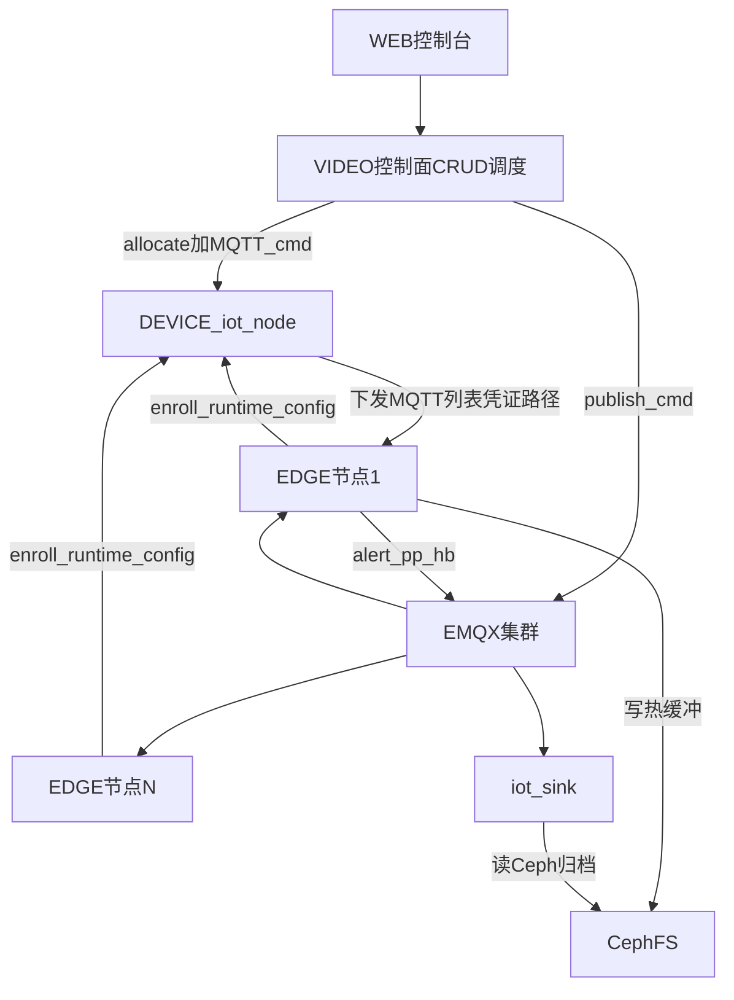

# EDGE 模块设计文档

> 版本：v1.0  
> 定位：根目录第八核心模块——无界面边缘算法运行时  
> 对齐：`VIDEO/docs/ALGORITHM_TASK_EMQX_DELIVERY_DESIGN.md`

---

## 1. 目标

将 VIDEO 算法任务的 **边缘执行面** 抽为独立 `EDGE/` 模块：

1. **无 WEB、无本地业务库**：纯 CLI / systemd  
2. **全链路 MQTT**：收 `mqtt/iot-algo-task-cmd`，发 ack/heartbeat/alert/postprocess  
3. **不存储**：告警图等只写 Ceph；不上传 MinIO  
4. **无限集群**：任意数量 EDGE 节点挂同一 EMQX；控制面调度选节点  
5. **单配置**：用户只配置 `EDGE_NODE_URL`；MQTT 地址、凭证、路径等全部由 NODE 动态分配  

VIDEO 保留：任务 CRUD、调度策略、列表/日志等控制面 HTTP。

---

## 2. 与七大模块关系



| 模块 | EDGE 交互 |
|------|-----------|
| DEVICE/iot-node | enroll + runtime-config 唯一配置源 |
| EMQX（mqtt 角色节点） | 运行时总线 |
| VIDEO | 创建任务、选节点策略；不在 EDGE 跑 Flask |
| NODE（原 Agent） | EDGE 可并存；EDGE 偏算法 MQTT 执行面，NODE Agent 偏通用 workload HTTP |
| iot-sink | 消费告警/后处理，读 Ceph 上传 MinIO |

---

## 3. 接入流程（只配 NODE 地址）

```text
edgectl config set-node http://cp:48080
edgectl enroll          # POST /admin-api/node/edge/enroll
edgectl pull-config     # POST /admin-api/node/edge/runtime-config（enroll 内已含）
edgectl run             # MQTT 常驻
```

`enroll` 成功后本地 `EDGE/state/edge.state.json`（或合并进 `edge.env`）保存 `nodeId`/`agentToken`；之后重启只需仍指向同一 `EDGE_NODE_URL` 即可 `pull-config` + `run`。

---

## 4. 控制面 API

### 4.1 `POST /admin-api/node/edge/enroll`

自动创建或复用 compute 节点，返回凭证 + 首包 runtime-config。

请求：

```json
{
  "hostname": "edge-box-01",
  "fingerprint": "sha256:...",
  "host": "10.0.0.51",
  "joinToken": "可选",
  "capabilities": {
    "algorithm_realtime": true,
    "algorithm_snap": true,
    "algorithm_patrol": true
  },
  "nodeRole": "compute",
  "maxTaskCount": 1
}
```

响应：`nodeId`, `agentToken`, `runtimeConfig`（同下）。

### 4.2 `POST /admin-api/node/edge/runtime-config`

鉴权：`nodeId` + `agentToken`。动态聚合：

| 字段 | 来源 |
|------|------|
| `mqttBrokerUrls` | 在线 `mqtt` 角色节点 host + `tags.mqtt_tcp_port`（有序） |
| `mqttAlgoTenant` | 配置默认 `default` |
| `mqttUsername` / `password` / `clientId` | 按节点签发 `algo-edge-{nodeId}` |
| `mediaHostDataRoot` / `alertImagesDir` / `mediaSnapDir` | 集群路径约定 |
| `controlPlaneUrl` | 规范化 NODE agent 前缀 |
| `algoTopics` | 与 Kafka 对齐的 `mqtt/iot-*` 列表 |

---

## 5. 运行时行为

1. 连接 `mqttBrokerUrls`（**有序、每次探测从头开始**，见总线设计 §5.3）  
2. 订阅 `mqtt/iot-algo-task-cmd`，仅处理 `payload.targetNodeId == 本节点`  
3. **命令下发**：现场/运维执行 `python -m edge task start|stop|restart`（默认 MQTT publish；`--local` 本机直拉）——**不**经 WEB「算法任务」Tab  
4. `start`：拉起 `runtime` 内对应 `run_deploy`（env 已注入 MQTT/Ceph/`EDGE_SRS_*`，无 MinIO 同步上传）  
5. 发布 heartbeat / ack / status；告警图写 Ceph 路径后 publish  
6. **不**直连 Kafka、**不**提供 HTTP 管理面；`python -m edge stop` 结束本机 `edge run`  

---

## 6. 与 VIDEO 解耦边界

| 留在 VIDEO（控制面） | EDGE 自有（边缘执行面） |
|----------------------|-------------------------|
| Flask `/video/algorithm` CRUD、调度策略 | `EDGE/runtime/services/*/run_deploy.py` |
| 日志/流查询 HTTP、任务表展示字段 | CLI / MQTT / `set-srs` / workload 拉起 |
| **不含** `EDGE_SRS_*` 等边缘推流逻辑 | overlays 维护 `EDGE_SRS_HOST` 推流解析 |

- 边缘进程 **只** 执行 `EDGE/runtime` 内入口；`cmd.deploy.workDir` 若指向 VIDEO 路径将被忽略。
- 可选种子：`EDGE/scripts/sync_runtime_from_video.sh` 从 VIDEO 拷贝后 **自动打 overlays**，不修改 VIDEO 源码。
- 日常维护以 `EDGE/runtime` + `EDGE/runtime/overlays` 为准。
- **与 WEB「算法任务」Tab / VIDEO 算法任务表字段级隔离**：`algorithm_task` 与 VIDEO `alert` 不含 `edge_node_*`；边缘维度仅存在于 iot-node `edge_node`、EDGE runtime 与 iot-sink 告警。
- 告警：若边缘侧开启 `ALGO_BUS_TRANSPORT=mqtt`，发 `mqtt/iot-alert-notification` → **iot-sink**（非 VIDEO 告警表）。

---

## 7. 安全

- 生产设置 `easyaiot.edge.join-token`，EDGE 配置同名 token  
- `allow-open-enroll` 仅用于隔离实验网  
- MQTT ACL：`algo-edge-*` 仅本节点相关 publish/subscribe  

---

## 8. 验收

- [ ] 只配 `EDGE_NODE_URL` 可完成 enroll + 拿到非空 `mqttBrokerUrls`  
- [ ] `edgectl run` 收到指定本节点的 start cmd 能拉起进程  
- [ ] 告警图落 Ceph，本机无 MinIO 上传代码路径  
- [ ] 停掉首选 MQTT broker 后按序切换且下一轮仍从列表头探测  
